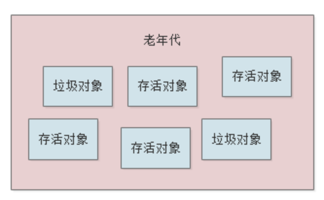
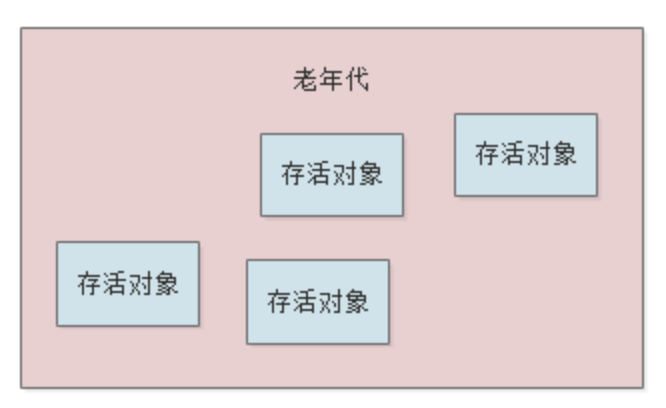
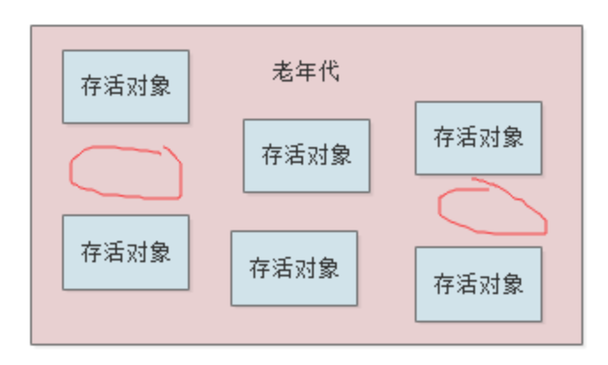
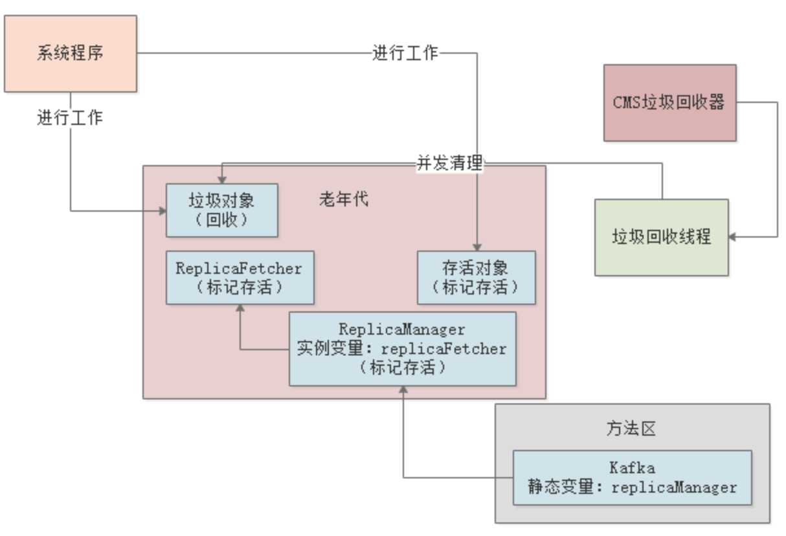

# JVM老年代垃圾回收器工作时内部又干了些啥？

## 1. 前文回顾

大家心里最希望的，就是对象都分配在新生代的Eden区，然后每次垃圾回收之后，存活对象都进入Survivor区，然后下一次垃圾回收后的存活对象都进入另外一个Survivor区。

这样几乎很少很少的对象进入到老年代里去，也就几乎不太会触发老年代的垃圾回收了。

但是理想很丰满，现实很骨干。真实情况是，线上系统很可能就会因为各种各样的情况，导致很多对象进入老年代，然后甚至频繁触发老年代的Full GC。

## 2. CMS垃圾回收器的基本原理

一般老年代我们选择的垃圾回收器是CMS，采用的是标记清理算法。其实就是非常简单，就是先用之前文章里讲过的标记方法标记处哪些对象是垃圾对象，然后就把这些垃圾对象清理掉。

上面图里是一个老年代内存区域的对象分布情况。

现在假设：

- 因为老年代内存空间小于历次Minor GC后升入老年代对象的平均大小，判断Minor GC有风险，可能就会提前触发 Full GC 回收老年代的垃圾对象；
- 或者是一次 Minor GC 后的对象太多了，都要升入老年代，发现空间不足，触发了一次老年代的Full GC。

总之，就是要进行 Full GC 了，此时所谓的标记-清理算法，其实就是我们之前给大家讲过的一个算法，先通过追踪GC Roots的方法，看看各个对象是否被GC Roots给引用了，如果是的话，那就是存活对象，否则，就是垃圾对象。

先将垃圾对象标出来，然后一次性把垃圾对象都回收掉，如下图：

这种方法的最大问题，就是会造成很多内存碎片。

大家看下图的红圈处就是所谓的内存碎片，这种碎片不大不小的，可能放不下任何一个对象，那么这个内存就被浪费了：

这就是 CMS 采取的"标记-清理"算法。

## 3. 如果Stop the World然后垃圾回收会如何？

现在大家思考一个问题，假如要先"Stop the World"，然后再采用"标记-清理"算法去回收垃圾，那么会有什么问题？

之前文章也说过了，如果停止一切工作线程，然后慢慢的去执行"标记-清理"算法，会导致系统卡死时间过长，很多响应无法处理。

所以CMS 垃圾回收器采取的是 **垃圾回收线程**和**系统工作线程** 尽量同时执行的模式来处理的。

## 4. CMS如何实现系统过一边工作的同时进行垃圾回收？

CMS在执行一次垃圾回收的过程一共分为4个阶段：

1. 初始标识
   这个阶段虽然说要造成"Stop the World"暂停一切工作线程，但是其实影响不大，因为他的速度很快，仅仅标记GC Roots直接引用的那些对象罢了。
2. 并发标记；
   这个阶段就是对老年代所有对象进行GC Roots 追踪，其实是最耗时的。他要追踪所有对象是否从根源上被GC Roots 引用了，但是这个最耗时的阶段，是跟系统程序并发运行的，所以其实这个阶段不会对系统运行造成影响的。
3. 重新标记；
   重新标记在第二阶段里新创建的一些对象，还有一些已有对象可能失去引用变成垃圾的情况。这个重新标记的阶段，速度时很快的，他其实是就是在对第二阶段中被**系统程序运行变动过的少数对象进行标记**，所以运行速度很快。
   接着重新恢复系统的运行，进入第四阶段。
4. 并发清理。

​       这个阶段就是让系统程序随意运行，然后他来清理掉之前标记为垃圾的对象即可。

​       这个阶段其实是很耗时的，因为需要进行对象的清理，但是他也是跟系统程序并发运行的，所以其实也不影响系统程序的运行。

​      

## 5. 对CMS的垃圾回收机制进行性能分析

其实大家看完CMS的垃圾回收机制之后，就会发现，他已经尽可能的进行性能优化了。

因为最耗时的，其实就是对老年代进行相关的GC Roots追踪，标记出来到底哪些可以回收，然后就是垃圾对象从内存里清理掉，这是最耗时的。

但是他的第二阶段和第四阶段，都是和系统程序并发执行的，所以基本这两个最耗时的阶段对性能影响不大。

只有第一个阶段和第三个阶段是需要"Stop the World"的，但是这两个阶段都是简单的标记而已，速度非常的快，所以基本上对系统运行响应不大。

