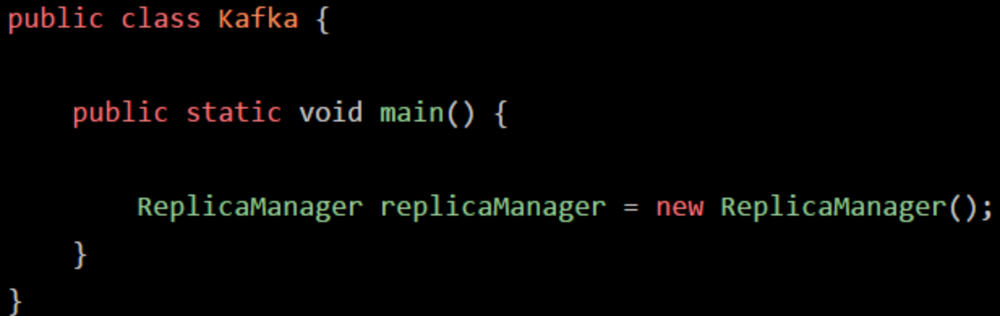
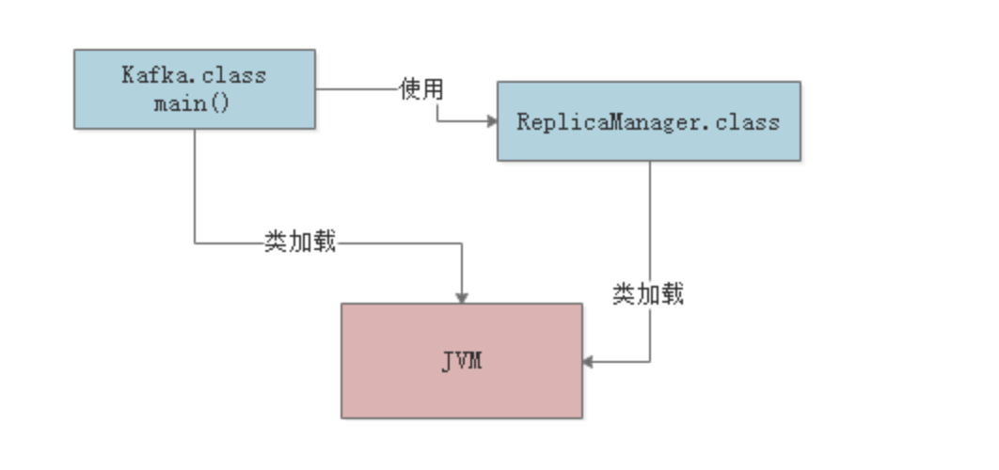

## JVM在什么情况下会加载一个类

一个类从加载到使用，一般会经历下面的这个过程：

**加载->验证->准备->解析->初始化->使用->卸载**

所以首先要搞明白的第一个问题，就是JVM在执行我们写好的代码的过程中，一般在什么情况下会去加载一个类呢？

也就是说，啥时候会从".class"字节码文件中加载这个类到JVM内存里来。

其实答案很简单，就是在**你的代码中用到这个类的时候**。

举个简单的例子，比如下面你有一个类（Kafka.class），里面有一个"main()"方法做为入口。

那么一旦你的JVM进程启动之后，一定会先把你的这个类（Kafka.class）加载到内存里，然后从"main()"方法的入口代码开始执行。

接着，假如上面的代码中，出现了如下的这么一行代码：

这时大家可能想了，你的代码中明显需要使用"ReplicaManager"这个类去实例化一个对象，此时必须得把"ReplicaManager.class"字节码文件中的这个类加载到内存里来啊！是不是？

所以这个时候就会触发JVM通过类加载器，从"ReplicaManager.class"字节码文件中加载对应的类到内存里来使用，这样代码才能跑起来。

我们来看下面的图：

上面就是给大家举的一个例子，相信非常的通俗易懂。

简单概括一下：首先你的代码中包含"mian()"方法的主类，一定会在JVM进程启动之后被加载到内存，开始执行"main()"方法中的代码，接着遇到你使用了别的类，比如"ReplicaManager"，此时就会从对应的".class"字节码文件加载对应的类到内存里来。

