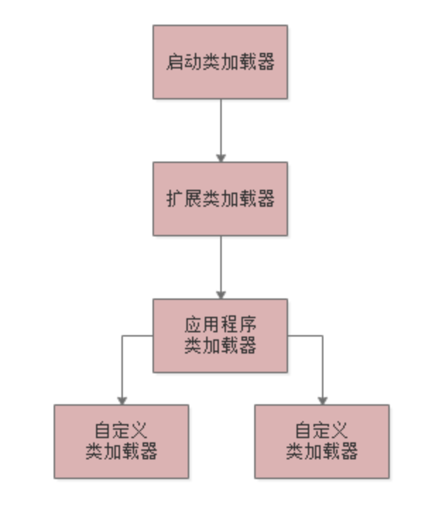
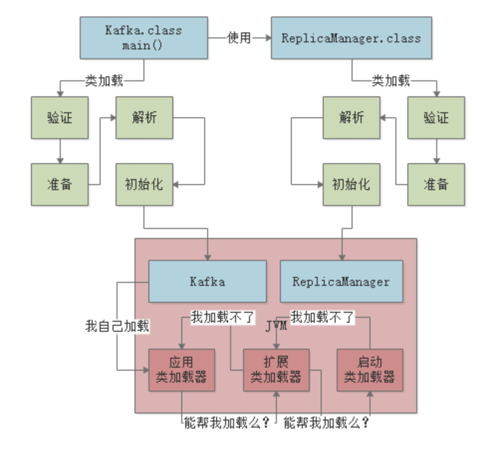

# JVM类加载机制

## 一. JVM在什么情况下会加载一个类

一个类从加载到使用，一般会经历下面的这个过程：

**加载->验证->准备->解析->初始化->使用->卸载**

所以首先要搞明白的第一个问题，就是JVM在执行我们写好的代码的过程中，一般在什么情况下会去加载一个类呢？

也就是说，啥时候会从".class"字节码文件中加载这个类到JVM内存里来。

其实答案很简单，就是在**你的代码中用到这个类的时候**。

举个简单的例子，比如下面你有一个类（Kafka.class），里面有一个"main()"方法做为入口。

那么一旦你的JVM进程启动之后，一定会先把你的这个类（Kafka.class）加载到内存里，然后从"main()"方法的入口代码开始执行。

接着，假如上面的代码中，出现了如下的这么一行代码：

这时大家可能想了，你的代码中明显需要使用"ReplicaManager"这个类去实例化一个对象，此时必须得把"ReplicaManager.class"字节码文件中的这个类加载到内存里来啊！是不是？

所以这个时候就会触发JVM通过类加载器，从"ReplicaManager.class"字节码文件中加载对应的类到内存里来使用，这样代码才能跑起来。

我们来看下面的图：

上面就是给大家举的一个例子，相信非常的通俗易懂。

简单概括一下：首先你的代码中包含"mian()"方法的主类，一定会在JVM进程启动之后被加载到内存，开始执行"main()"方法中的代码，接着遇到你使用了别的类，比如"ReplicaManager"，此时就会从对应的".class"字节码文件加载对应的类到内存里来。

## 二. 从实用角度出发，来看看验证、准备和初始化的过程

对于初学者来说，是一个非常重要的需要捋清楚的概念。

接下来就来简单的带着大家，从实用的角度出发，过一下另外三个概念：验证、准备、初始化。

其实对于这三个概念，没太大的必要去深究里面的细节。对于大部分同学而言，只要脑子里有下面的几个概念就可以了。

### 验证阶段

简单来说，这一步就是根据Java虚拟机的规范，来校验你加载进来的".class"文件中的内容，是否符合指定的规范。

这个相信很好理解，假如说，你的".class"文件被 人篡改了，里面的字节码压根儿不符合规范，那么JVM是没法执行这个字节码的！

所以把".class"加载到内存里之后，必须先验证一下，校验他必须符合JVM规范，后续才能交给JVM来运行。

下面一张图，展示了这个过程：

### 准备阶段

这个阶段其实也很好理解，咱们都知道，我们写好的那些类，其实都有一些类变量。比如下面的这个"ReplicaManager"类：

假如你有这么一个"ReplicaManager"类，他的"ReplicaManager.class"文件内容刚刚被加载到内存之后，会进行验证，确认这个字节码文件的内容是正确的。

接着就会进行准备工作。

这个准备工作其实就是给这个"ReplicaManager"类分配一定的内存空间。

然后给他里面的类变量（也就是static修饰的变量）分配内存空间，来一个默认的初始值。

比如上面的示例里，就会给"flushInterval"这个变量分配内存空间，给一个"0"这个初始值。

整个过程，如下图所示：

### 解析阶段

这个阶段干的事儿，实际上就是把**符号引用替换为直接引用**的过程，其实这个部分的内容很复杂，涉及到JVM的底层。

但是注意，同学们，就我本意而言，希望第一周的文章，绝对是浅显易懂的，循序渐进，要保证每个同学都能绝对看懂。

所以针对这个阶段，现在不打算过深的解读，因为从实用角度而言，对很多同学在工作实践JVM技术其实也用不到，所以这里大家就暂时知道有这么一个阶段就可以了。

同样，我还是给大家画图展示一下：

### 上面三个阶段的小结

其实这三个阶段里，最核心的大家务必关注的，就是"准备阶段"

因为这个阶段是给加载进来的类分配好了内存空间，类变量也分配好了内存空间，并且给了默认初始值，这个概念，大家心里一定要有。

### 核心阶段：初始化

之前说过，在准备阶段时，就会把我们的"ReplicaManager"类给分配好内存空间，另外他的一个变量"flushInterval"也会给一个默认的初始值"0"，那么接下来，在初始化阶段，就会正式执行我们的**类初始化的代码**了。

那么，**什么是类初始化的代码呢？**我们来看下面这段代码：

大家可以看到，对于"flushInterval"这个类变量，我们是打算通过Configuration.getInt("replica.flush.interval")这段代码来获取一个值，并且赋值给他的。

#### 准备阶段会执行这个赋值逻辑吗？

但是在**准备阶段会执行这个赋值逻辑吗？**

NO！在准备阶段，仅仅是给"flushInterval"类变量开辟一个内存空间，然后给个初始值"0"罢了。

那么这段赋值的代码什么时候执行的呢？答案是在**"初始化"**阶段来执行。

在这个阶段会执行类的初始化代码，比如上面的Configuration.getInt("replica.flush.interval")代码就会在这里执行，完成一个配置项的读取，然后赋值给这个类变量"flushInterval"。

类似下面的代码语义，可以理解为类初始化的时候，调用"loadReplicaFromDish"方法从磁盘中加载数据副本，并且放在静态变量"replicas"中：

那么搞明白了类的初始化是什么，就得来看看类的初始化的规则了。

#### 什么时候会初始化一个类？

一般来说有以下一些时机：

- 比如"new ReplicaManager()"来实例化类的对象 ，此时就会触发类的加载到初始化的全过程，把这个类准备好，然后再实例化一个对象出来；
- 或者是包含"main()"方法的主类，必须是立马初始化的；
- 此外，还有一个非常重要的规则，就是如果初始化一个类的时候，发现他的父类还没初始化，那么必须先初始化他的父类。
  比如下面的代码：
  

​       如果你要"new ReplicaManager()" 初始化这个类的实例，那么会加载这个类，然后初始化这个类。

​       但是初始化这个类之前，发现AbstractDataManager做为父类还没加载和初始化，那么必须先加载这个类，并且初始化这个父类。

​        这个规则，大家必须得牢记，再来一张图，借助图片来进行理解：

## 三. 类加载器

现在相信大家都搞明白了整个类加载从触发时机到初始化的过程了，接着给大家说一下类加载器的概念。

因为实现上述过程，那必须是依靠类加载器来实现的。

那么，Java有哪些类加载器呢？简单来说有下面几种。

### 启动类加载器

Bootstrap ClassLoader，他主要是负责加载我们在机器上安装的Java目录下的核心类。

在你的Java安装目录下，就有一个**lib**目录，大家可以自己去找找看，这里就有Java最核心的一些类库，支撑你的Java系统的运行。

所以一旦你的JVM启动，那么首先就会依托类加载器，去加载你的Java安装目录下的**lib**目录中的核心类库。

### 拓展类加载器

Extension ClassLoader，这个类加载器其实也是类似的，就是你的Java安装目录下，有一个**lib\ext**目录。这里面有一些类，就是需要使用这个类加载器来加载的，支撑你的系统的运行。

那么你的JVM一旦启动，是不是也得从Java安装目录下，加载这个**lib\ext**目录中的类？

### 应用程序类加载器

Application ClassLoader，这个类加载器就负责去加载"ClassPath"环境变量所指定路径中的类。

其实你大致就理解为去加载你写好的Java代码吧，这个类加载器就负责加载你写好的那些类到内存里。

### 自定义类加载器

除了上面几种之外，还可以自定义类加载器，去根据自己的需求加载你的类。

## 四. 双亲委派机制

JVM的类加载器是有亲子层级结构的，就是说启动类加载器是最上层的，扩展类在第二层，第三层是应用程序类加载，最后一层是自定义类加载器。

大家看下图：

然后，基于这个亲子层次结构，就有一个**双亲委派的机制**。

**什么意思呢？**

就是假如你的应用程序类加载器需要加载一个类，他首先会委派给自己的父类加载器去加载，最终传导到顶层的类加载器去加载。

但是如果父类加载器在自己负责的范围内，没找到这个类，那么就会下推加载权利给自己的子类加载器。

比如，你的JVM现在需要加载"ReplicaManager"类：

1. 此时应用程序类加载器会问问自己的爸爸，也就是拓展类加载器，你能加载到这个类吗？
2. 然后拓展类加载器直接问自己的爸爸，启动类加载器，你能加载到这个类吗？
3. 启动类加载器心想，我在Java安装目录下没有找到这个类啊，自己找去！
4. 然后，就下推加载权利给扩展类加载器这个儿子，结果扩展类加载器找了半天，也没找到自己负责的目录中有这个类。这时他很生气，说：明明就是你应用程序类加载器自己负责的，你自己找去。
5. 然后，应用程序类加载器在自己负责的范围内，比如就是你写好的那个系统打包成的jar包吧，一下子发现，就在这里！然后就自己把这个类加载到内存里去了。

这就是所谓的双亲委派模型：先找父亲去加载，不行的话再有儿子来加载。

这样的话，可以避免多层级的加载器结构重复加载某些类。

最后给大家来一张图，感受一下类加载器的双亲委派模型。

