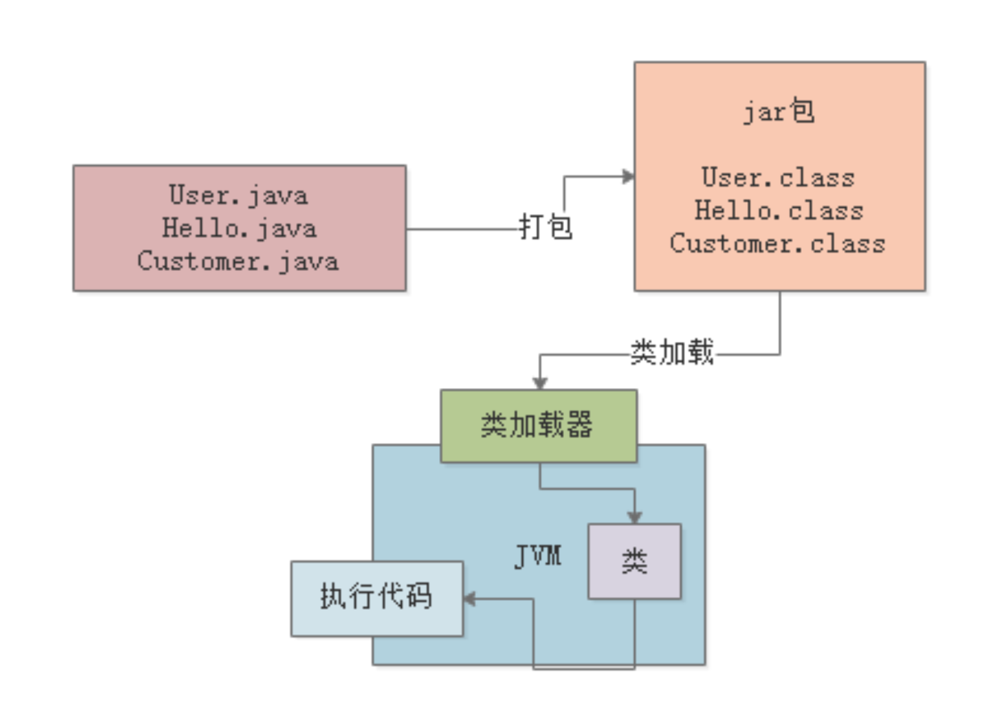

## 编译

也就是说在我们写好的".java"代码打包过程中，一般就会把代码编译成".class"后缀的字节码文件，比如："User.class","Hello.class","Customer.class"。

然后这个".class"后缀的字节码文件，才是可以被运行起来的。

接着我们可能要思考下一个问题：

对于这些编译好的".class"字节码，是怎么让他们运行起来的呢？

这个时候就需要使用诸如"java -jar"之类的命令来运行好我们写的代码了。

此时一旦你采用"java"命令，实际上此时就会启用一个JVM进程。

这个JVM就会来负责运行这些".class"字节码文件，也就是相当于负责运行我们写好的系统。

所以平时我们写好的某个系统在一台机器上部署的时候，你一旦启动这个系统，其实就是启动了一个JVM，由它来负责运行这台机器上运行的这个系统。

## 类加载器

接下来，JVM要运行这些".class"字节码文件中的代码，那是不是首先得把这些".class"文件中包含的各种类给加载进来？

类加载器把编译好的那些".class"字节码文件给加载到JVM中，然后供后续代码运行来使用。

## 字节码执行引擎

接着，最后一步，JVM就会基于自己的**字节码执行引擎**，来执行加载到内存里的我们写好的那些类了。

比如：你的代码中有一个"main()"方法，那么JVM就会从这个"main()"方法开始执行里面的代码。

他需要哪个类的时候，就会使用类加载器来加载对应的类，反正对应的类就在".class"文件中。

## 流程图

大家看看最后下面的图：

