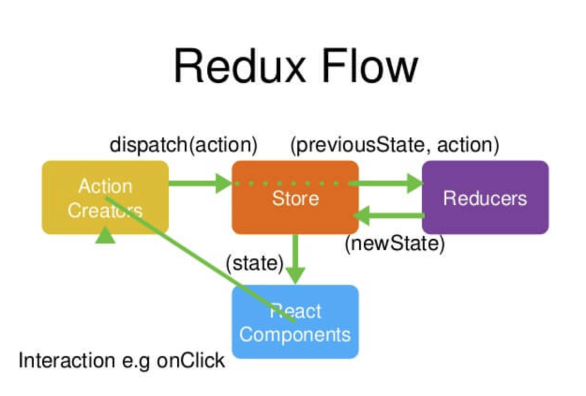

# React知识点复习笔录

## 一. 设计思想

1. Web应用是一个状态机，视图与状态是一一对应的。
2. 所有的状态，都保存在一个对象里。

## 二. 基本概念和API

### 1. Store

- 就是保存数据的地方；

- Redux提供createStore函数，用来生成Store。

  ```javascript
  import { createStore } from 'redux';
  const store = createStore(fn);
  ```

### 2. State

- Store对象包含所有数据。如果想要得到某个时点的数据，就需要对Store生成快照。这种时点的数据集合，就叫做State。

- 当前时刻的State，可以通过 store.getState()拿到。

  ```javascript
  import { createStore } from 'redux';
  const store = createStore(fn);
  
  const state = store.getState();
  ```

### 3.Action

- State的变化，会导致View的变化，但是用户接触不到State，只能接触到View。**所以State的变化必须是View导致的**。

- **Action就是View发出的通知，表示State应该要发生变化了**。

- Action是一个对象，其中的type是必须的，表示Action的名称。其它属性可以自由设置，例如：

  ```javascript
  const action = {
    type: 'ADD_TODO',
    payload: 'Learn Redux'
  };
  ```

  上面代码中，Action的名称是ADD_TODO，它携带的信息是字符串：Learn Redux。

- 可以这样理解：

  - **Action描述当前发生的事情；**
  - **改变State的唯一办法，就是使用Action，它会运送数据到Store**。

### 4.store.dispatch()

- store.dispatch()是View发出Action的唯一方法。

  ```javascript
  import { createStore } from 'redux';
  const store = createStore(fn);
  
  store.dispatch({
    type: 'ADD_TODO',
    payload: 'Learn Redux'
  });
  ```

  上面代码中，store.dispatch()接收一个Action对象做为参数，将它发送出去。

### 5.Reducer

- Store收到Action以后，必须给出一个新的State，这样View才会发出变化。

- 这种State的计算过程就叫做Reducer。

- Reducer是一个函数，它接受Action和当前State做为参数，返回一个新的State。

  ```javascript
  const reducer = function (state, action) {
    // ...
    return new_state;
  };
  ```

  来看一个实际的例子：

  ```javascript
  const defaultState = 0;
  const reducer = (state = defaultState, action) => {
    switch (action.type) {
      case 'ADD':
        return state + action.payload;
      default: 
        return state;
    }
  };
  
  const state = reducer(1, {
    type: 'ADD',
    payload: 2
  });
  ```

  - 上面的代码中：reducer收到名为ADD的Action以后，就返回一个新的State，做为加法的计算结果。

  - 实际应用中，Reducer函数不用像上面这样手动调用，store.dispatch方法会触发Reducer的自动执行。

  - 为此，Store需要知道有哪些Reducer函数，做法就是在生产Store的时候，将Reducer做为参数传给createStore方法。

    ```javascript
    import { createStore } from 'redux';
    const store = createStore(reducer);
    ```

    - 上面代码中，createStore接受Reducer做为参数，生成一个新的Store；
    - 以后**每当store.dispatch发送过来一个新的Action，就会自动调用Reducer，得到新的State**。

### 6.store.subscribe()

- Store允许使用store.subscribe()方法设置监听函数，一旦State发生变化，就自动执行这个函数。

  ```javascript
  import { createStore } from 'redux';
  const store = createStore(reducer);
  store.subscribe(listener);
  ```

  显然，只需把View的更新函数（对于React项目，就是组件的render方法或setState方法）放入listener，就会实现View的自动渲染。

## 三. 工作流程




1. 首先，用户发出Action：

   ```javascript
   store.dispatch(action);
   ```

2. 然后，Store 自动调用 Reducer，并且传入两个参数：当前 State 和收到的 Action。 Reducer 会返回新的 State：

   ```javascript
   let nextState = todoApp(previousState, action);
   ```

3. State 一旦有变化，Store 就会调用监听函数：

   ```javascript
   // 设置监听函数
   store.subscribe(listener);
   ```

4. `listener`可以通过`store.getState()`得到当前状态。如果使用的是 React，这时可以触发重新渲染 View：

   ```javascript
   function listerner() {
     let newState = store.getState();
     component.setState(newState);   
   }
   ```

   

## 四. 实例

看一个完整的实例：

```javascript
// 定义一个组件
const Counter = ({ value, onIncrement, onDecrement }) => (
  <div>
  <h1>{value}</h1>
  <button onClick={onIncrement}>+</button>
  <button onClick={onDecrement}>-</button>
  </div>
);

// 定义reducer
const reducer = (state = 0, action) => {
  switch (action.type) {
    case 'INCREMENT': return state + 1;
    case 'DECREMENT': return state - 1;
    default: return state;
  }
};

// 创建store
const store = createStore(reducer);

// 定义显示View的方法
const render = () => {
  ReactDOM.render(
    <Counter
      value={store.getState()}
      onIncrement={() => store.dispatch({type: 'INCREMENT'})}
      onDecrement={() => store.dispatch({type: 'DECREMENT'})}
    />,
    document.getElementById('root')
  );
};

// 显示View
render();

// 设置监听，一旦state发生变化，View就会自动更新
store.subscribe(render);
```

## 五. 备注

摘自：

1. 阮一峰：http://www.ruanyifeng.com/blog/2016/09/redux_tutorial_part_one_basic_usages.html