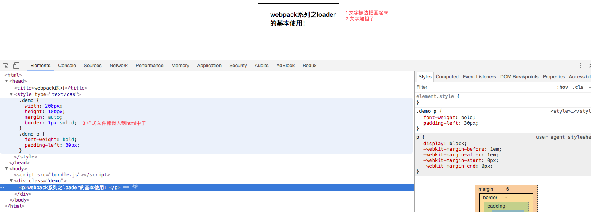

## webpack系列之loader及简单的使用

### 一. loader有什么用

> 上一篇介绍了webpack系列之基本概念和使用，本篇主要介绍一下 loader。
>
> webpack 本身只能打包 Javascript 文件，对于其他资源例如  css ，图片，或者其他的语法集比如 jsx ，是没有办法加载的。 这就需要对应的 loader 将资源转化，加载进来。

**比如**
你的工程中，样式文件都使用了 less 语法，是不能被浏览器识别的，这时候我们就需要使用对应的 loader，来把less 语法转换成浏览器可以识别的 css 语法。

例如一个简单的 less 文件：

**转换前：**

```less
.demo {
    width: 200px;
    height: 100px;
    margin: auto;
    border: 1px solid;
    p {
        font-weight:bold;
        padding-left: 30px;
    }
}
```

**转换后：**

```css
.demo {
    width: 200px;
    height: 100px;
    margin: auto;
    border: 1px solid;
}

.demo p {
    font-weight: bold;
    padding-left: 30px;
}
```

后面的案例也是拿这个 less 文件来做演示的。

### 二. loader是什么

先来看一下官方对 loader 的一个解释：

> A loader is a node module exporting a function

翻译过来： loader 就是一个 export 出来的 function 。

------

既然是 node module，所以如果你自己要自定义一个 loader，完全可以这么写：

```javascript
module.exports = function (source) {
   // todo
}
```

**解释**

- 其中 source 参数是这个 loader  要处理的源文件的字符串
- 返回经过**"翻译"**后的 webpack 能够处理的有效模块

如果你所写的 loader 需要依赖其他模块的话，那么同样以  module 的写法，将依赖放在文件的顶部引进来即可：

```javascript
var fs = require("fs")
module.exports = function (source) {
   // todo
}
```

如果你希望将处理后的结果（不止一个）返回给下一个 loader ，那么就需要调用 webpack 所提供的 API。

由于本篇我们只讲 loader 的基本使用，故这里不再深入讲解，有兴趣的可以 [点击 ](https://webpack.js.org/api/loaders/)这里学习。

### 三. 使用loader
在看了前面的介绍后，接下来给大家介绍一下怎么使用 loader 。

#### 使用loader的方式
有三种使用方式，如下：

- [配置](https://doc.webpack-china.org/concepts/loaders/#configuration)**（推荐）**：在 webpack.config.js 文件中指定 loader。
- [内联](https://doc.webpack-china.org/concepts/loaders/#inline)：在每个 import 语句中显式指定 loader。
- [CLI](https://doc.webpack-china.org/concepts/loaders/#cli)：在 shell 命令中指定它们。

------

**以上三种方式，我们在开发过程中推荐使用第一种方式：**

比如你想使用 webpack 来打包样式文件，则可以在 webpack.config.js 里添加如下代码：

```javascript
module: {
       rules: [
           {
               test: /\.css$/,  // 正则匹配所有.css后缀的样式文件
               use: ['style-loader', 'css-loader'] // 使用这两个loader来加载样式文件
           }
       ]
   } 
```

module.rules 允许你在 webpack 配置中指定多个 loader。 这是展示 loader 的一种简明方式，并且有助于使代码变得简洁。

**上述rules的作用：**
webpack 在打包过程中，凡是遇到后缀为 css 的文件，就会使用 style-loader 和 css-loader 去加载这个文件。

### 四.案例

在对 loader 有了一个大概的认识后，来做一个小案例，需求如下：

> 将上一篇（ webpack 系列之基本概念和使用）的 demo 输出文字居中并用黑框圈起来。

#### 目录结构

代码目录结构如下：

```bash
├── node_modules
├── app
│ ├── bundle.js
│ └── index.html
├── package-lock.json
├── package.json
├── src
│ ├── index.js
│ └── main.less
└── webpack.config.js
```

#### 1. 安装loader

我们必须使用 loader 告诉 webpack  加载 less 文件，为此，需要首先安装相对应的 loader：

```bash
npm install --save-dev less
npm install --save-dev less-loader
npm install --save-dev css-loader
npm install --save-dev style-loader
```

这些 loader 的作用如下：

- 安装 less-loader 后可以在 js 中使用 require 的方式来加载 less 文件了；
- 安装 css-loader 后可以在 js 中加载 css 文件；
- 安装 style-loader 的目的是为了让加载的 css 作为 style 标签内容插入到 html 中。

#### 2. 配置loader

**webpack.config.js代码如下：**

```javascript
module.exports = {
    devtool: 'eval-source-map',
    entry:  __dirname + "/src/index.js",  //入口文件
    output: {
        path: __dirname + "/app",  //打包后的文件存放的地方
        filename: "bundle.js" //打包后输出文件的文件名
    },
    module: {
        rules: [
            {
                test: /\.less$/,
                use: ['style-loader','css-loader', 'less-loader']
            }
        ]
    }
}
```

#### 3.新建样式文件

main.less 代码如下：

```less
.demo {
    width: 200px;
    height: 100px;
    margin: auto;
    border: 1px solid;
    p {
        font-weight:bold;
        padding-left: 30px;
    }
}
```

#### 4. 修改入口文件

在入口文件 index.js 里引入我们的样式文件:

```less
require ('./main.less');
var element = document.createElement('div');
element.className = 'demo';
var p = document.createElement('p');
p.innerText = 'webpack系列之loader的基本使用！';
element.appendChild(p);
document.body.appendChild(element);
```

#### 5.打包

在项目根目录（webpack-demo）下执行打包命令：

```bash
➜ webpack-demo webpack
```

打包成功，会输出如下：

```bash
Hash: 1bb51c6a348686a223db
Version: webpack 3.10.0
Time: 1077ms
    Asset     Size  Chunks             Chunk Names
bundle.js  53.8 kB       0  [emitted]  main
   [0] ./src/index.js 273 bytes {0} [built]
   [2] ./src/main.less 1.19 kB {0} [built]
   [2] ./node_modules/css-loader!./node_modules/less-loader/dist/cjs.js!./src/main.less 304 bytes {0} [built]
```

#### 6. 查看结果

在浏览器里刷新 index.html：
你会发现**输出的文字被一个黑框给圈了起来，并且加粗显示**，这就表明我们的样式文件已经生效了，而且从截图当中也可以看见样式文件也插入到了html中:



------


### 五.常用loader

#### 1. 样式

1. [css-loader](https://www.npmjs.com/package/css-loader) : 解析 css 文件中代码
2. [style-loader](https://www.npmjs.com/package/style-loader) : 将 css 模块作为样式导出到 DOM 中
3. [less-loader](https://www.npmjs.com/package/less-loader) : 加载和转义 less 文件
4. [sass-loader](https://www.npmjs.com/package/sass-loader) : 加载和转义 sass/scss 文件

#### 2.脚本转换编译

1. [script-loader](https://www.npmjs.com/package/script-loader) : 在全局上下文中执行一次 javascript 文件，不需要解析
2. [babel-loader](https://www.npmjs.com/package/babel-loader) : 加载 ES6 代码后使用 Babel 转义为 ES5 后浏览器才能解析

#### 3. Files文件

1. [url-loader](https://www.npmjs.com/package/url-loader) : 多数用于加载图片资源,超过文件大小显示则返回 data URL
2. [raw-loader](https://www.npmjs.com/package/raw-loader) : 加载文件原始内容 (utf-8 格式)

#### 4. 加载框架

1. [vue-loader](https://www.npmjs.com/package/vue-loader) : 加载和转义 vue 组件
2. [react-hot-loader](https://www.npmjs.com/package/react-hot-loader) : 动态刷新和转义 react 组件中修改的部分

### 六. 总结

本篇向大家介绍了 loader 有什么用，什么是 loader，以及怎么使用 loader 这些基础知识，如果有兴趣想了解得更深入一些，可以看看[怎么编写一个loader](https://doc.webpack-china.org/contribute/writing-a-loader)。
下一篇会给大家介绍：**[webpack系列之Plugin及简单的使用](https://segmentfault.com/a/1190000014562068)**