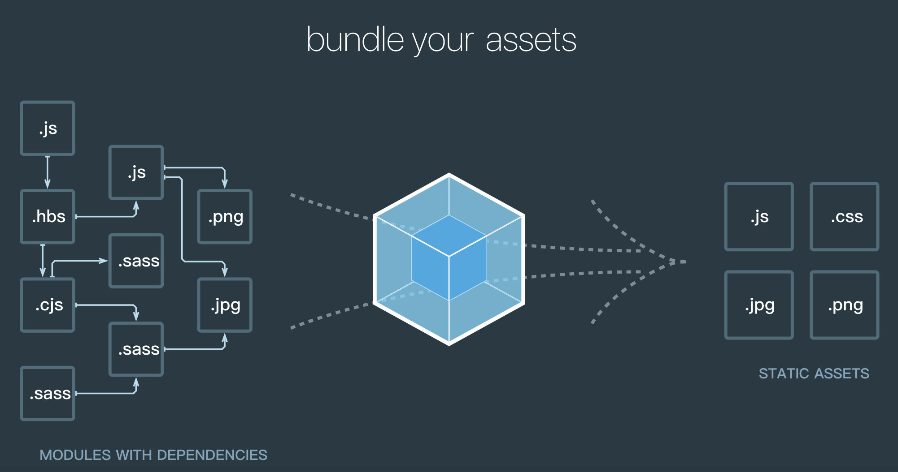
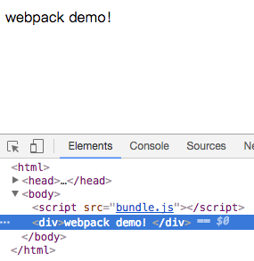

# webpack系列之基本概念和使用

##  前言

> 最近在做 vue 项目，自然而然就接触到了 webpack 这个打包工具，借此把一些总结分享出来。 webpack 知识点比较多，打算做为一个系列分篇讲解，今天先分享第一篇：webpack 系列之基本概念和使用。

## 一. 什么是webpack

​	**webpack** 可以看做是模块打包工具：它将各种静态资源（比如：JavaScript  文件，图片文件，样式文件等）视为模块，它能够对这些模块进行解析优化和转换等操作，最后将它们打包在一起，打包后的文件可用于在浏览器中使用。

下面看一个图能够很清晰的展现这个打包流程：



## 二. 为什么使用webpack

先举一个大家都很熟悉的例子：

> 一台计算机内部需要很多很多根线来连接单元器件，假如每条线不按规则摆放，将要占用极大的空间，且不好管理。幸好人们发明了集成电路，才有了现代计算机的板卡。


大家看，通过这个板卡，所有的元器件，电线都按规则摆放，规整有序，很大的节省了空间，而且也很方便管理。 **你可以这样理解：**

1. 把 webpack 看做是这个板卡；
2. 项目中的各种各样的 JavaScript 程序和依赖包可以看成是计算机内部需要的很多根线和单元器件；
3. **webpack 通过 loader 将这些 JavaScript 程序和依赖包都转换成 JavaScript 模块，就好比我们将单元器件和线按照一定的规则摆放，放在固定的位置方便管理**；
4. 这样通过 webpack 我们就把一个项目中的复杂程序细化为了各种具有依赖关系的模块，从而使我们的项目管理起来更加方便。

### webpack优势

webpack 能替代部分 grunt/gulp 的工作，比如打包、压缩混淆、图片转 base64等，而且还具有以下几点优势：

- webpack 是以 commonJS 的形式来书写脚本的，但对 AMD/CMD 的支持也很全面，方便旧项目进行代码迁移
- 能被模块化的不仅仅是 JS 了；
- 扩展性强，具有强大的插件（Plugin）接口，使用起来比较灵活，特别是支持热插拔的功能很实用；
- 可以将代码切割成不同的块（chunk），每个块包含一个或多个模块，块可以按需被异步加载，降低了初始化时间。

## 三. 基本概念

在正式讲解怎么使用 webpack 之前，你需要先理解四个核心概念：

- 入口（entry）
- 输出（output）
- loader
- 插件(plugins)

本篇做为一个开门篇，先讲解前两个核心概念：入口（entry）和输出（output）。

### 3.1 入口(entry)

- 入口起点（entry point）指示 webpack 应该使用哪个模块做为入口文件，来作为构建其内部依赖图的开始；
- 进去入口起点后，webpack 会找出有哪些模块和库是入口起点（直接和间接）依赖的；
- 每个依赖项随即被处理，最后输出到称之为 bundles 的文件中。

### 3.2 出口(output)

- output 属性告诉 webpack 在哪里输出它所创建的 bundles，以及如何命名这些文件；

- 这些都可以在webpack的配置文件中指定，后面的案例会给大家介绍怎么去配置。

## 四.案例

在讲了 webpack 是什么，为什么使用 webpack，以及两个核心概念后，我们来做一个小案例来真实感受一下。

### 4.1 基本安装

我们创建一个目录，初始化 npm，并且在本地使用 npm 安装 webpack：

```bash
mkdir webpack-demo && cd webpack-demo
npm init
npm install --save-dev webpack
```

### 4.2 目录结构

```bash
├── node_modules
├── dist
│   └── index.html
├── package-lock.json
├── package.json
└── src
    └── index.js
```

### 4.3 修改入口文件

打开 src\index.js，添加如下代码：

```javascript
var element = document.createElement('div');
element.innerHTML = 'webpack demo！';
document.body.appendChild(element);
```

### 4.4 执行打包命令

```bash
➜  webpack-demo webpack src/index.js dist/bundle.js
Hash: 2432d7e2ecc1d3cb0c5b
Version: webpack 3.10.0
Time: 63ms
    Asset     Size  Chunks             Chunk Names
bundle.js  2.65 kB       0  [emitted]  main
   [0] ./src/index.js 179 bytes {0} [built]
```

打开 dist 目录，你会发现打包后的文件 bundle.js 已经生成。

### 4.5 引入bundle.js

打开 dist\index.html 添加如下代码：

```javascript
<html>
  <head>
    <title>webpack练习</title>
  </head>
  <body>
    <script src="bundle.js"></script>
  </body>
</html>
```

### 4.6 效果

直接浏览器打开 index.html：



### 4.7 使用配置文件

可能大家看到打包命令后会有疑问：

> 这个打包命令有点长，这样岂不是很容易出错?

的确，webpack 有许多比较高级的功能都可以通过命令行模式去实现，但是这样很不方便，且容易出错，更好的办法就是定义个配置文件，我们可以把所有的与打包相关的信息放在里面。 这比在终端（terminal）中输入大量命令要高效的多。

**那该怎么做呢？**

我们新建一个 webpack 配置文件：webpack.config.js：

```javascript
module.exports = {
    devtool: 'eval-source-map',
    entry:  __dirname + "/src/index.js",  //入口文件
    output: {
        path: __dirname + "/dist",  //打包后的文件存放的地方
        filename: "bundle.js" //打包后输出文件的文件名
    }
}
```

命令行执行只需要：webpack 即可实现打包：

```javascript
➜  webpack-demo webpack
Hash: 37ae154d97c486e04d87
Version: webpack 3.10.0
Time: 73ms
    Asset    Size  Chunks             Chunk Names
bundle.js  3.4 kB       0  [emitted]  main
   [0] ./src/index.js 179 bytes {0} [built]
```

这条命令会自动引用 webpack.config.js 文件中的配置选项进行打包，再次访问 index.html，会发现第一种打包方式后输出同样的结果，但是简化了命令，也降低了因命令行过长而导致的错误。

**注意：**

> webpack.config.js 是webpack 默认的配置文件名，如果我们的配置文件不叫这个名字时，我们需要借助一个 `--config` 参数来实现打包（--config 参数来指定去找哪个配置文件）：

```bash
webpack --config `webpack.filename.js`
```

## 五.总结

- 第一篇先讲解一下 webpack 的基本概念，以及通过一个小案例让大家感受一下 webpack 的简单使用；

- 下一篇会深入一些，讲解 webpack 中的另一个重要概念：**Loader**。