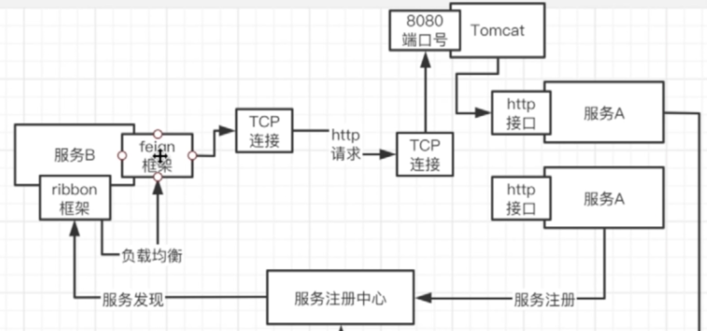
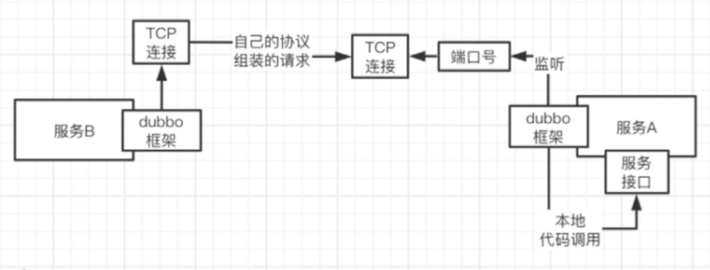

##  为什么使用Dubbo

Dubbo 一篇文章就够了：从入门到实战

https://segmentfault.com/a/1190000019896723

在互联网的发展过程中，在以前，我们只需要一个服务器，将程序全部打包好就可以。但是，随着流量的增大，常规的垂直应用架构就无法应付，所以，架构就发生了演变。

1. 单一应用架构；
2. 应用和数据库单独部署；
3. 应用和数据库集群部署；
4. 数据库压力变大，读写分离；
5. 使用缓存技术，加快速度；
6. 数据库分库分表；
7. 应用分为不同的类型拆分。

### 为什么微服务的系统必须通过RPC框架进行通信

#### 注册中心

它知道你每个服务部署的地址，监听的端口号是多少

服务注册中心必须与服务保持心跳。如果某个服务down机或者下线或者新增实例，服务注册中心就能感知到。

有了注册中心后，为什么服务于服务之间进行通信的时候，必须使用rpc框架进行通信？

如果不用rpc框架，通常是走http请求，发起方需要构造请求头，请求体，需要使用http组件，发起http请求，然后接收到http响应后，仍然需要获取响应头，响应体，这整个过程有点繁琐。

使用rpc框架的好处：

1. 不用去构造http请求对象了；

2. 一个服务调用另外一个服务，就跟调用本地的一个方法一样。

