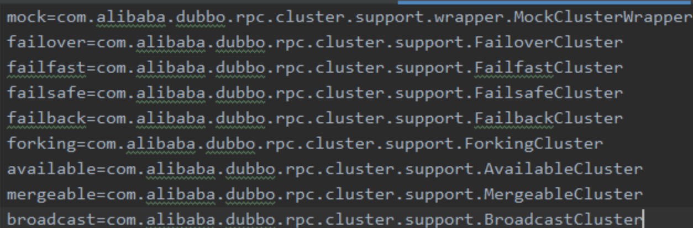

##  为什么使用Dubbo

Dubbo 一篇文章就够了：从入门到实战

https://segmentfault.com/a/1190000019896723

`关于 Dubbo的相关面试题`：

https://www.cnblogs.com/h-c-g/p/11209756.html

https://zhuanlan.zhihu.com/p/264935586

在互联网的发展过程中，在以前，我们只需要一个服务器，将程序全部打包好就可以。但是，随着流量的增大，常规的垂直应用架构就无法应付，所以，架构就发生了演变。

1. 单一应用架构；
2. 应用和数据库单独部署；
3. 应用和数据库集群部署；
4. 数据库压力变大，读写分离；
5. 使用缓存技术，加快速度；
6. 数据库分库分表；
7. 应用分为不同的类型拆分。

### 为什么微服务的系统必须通过RPC框架进行通信

#### 注册中心

它知道你每个服务部署的地址，监听的端口号是多少

服务注册中心必须与服务保持心跳。如果某个服务down机或者下线或者新增实例，服务注册中心就能感知到。

有了注册中心后，为什么服务于服务之间进行通信的时候，必须使用rpc框架进行通信？

如果不用rpc框架，通常是走http请求，发起方需要构造请求头，请求体，需要使用http组件，发起http请求，然后接收到http响应后，仍然需要获取响应头，响应体，这整个过程有点繁琐。

使用rpc框架的好处：

1. 不用去构造http请求对象了；

2. 一个服务调用另外一个服务，就跟调用本地的一个方法一样。

### dubbo在什么时候调用了netty

阿里分布式框架Dubbo的RPC框架使用Dubbo协议进行节点通信，Dubbo协议默认使用Netty做为基础通信组件，用于实现各节点之间的内部通信。

1. dubbo的ServiceBean implement ApplicationListener；
2. 在spring容器启动的时候，调用了ServiceBean的onApplicationEvent方法，在这里创建了NettyBean。
3. 启动后就可以通过netty来监听端口号并接收消息；
4. 接收到消息后再调用相应的DubboHandler，解析消息；
5. 最终找到需要的Service，再通过反射来invoker。

------------------------------------------------------------------

### 关于Dubbo的SPI机制

#### 先了解JAVA的SPI机制

demo可以看：/Users/lyf/Workspace/www/blog-demo/test-demo/src/main/java/com/fullstackboy/spi/Test.java

#### 想一下 Java SPI 哪里不好

相信大家一眼就能看出来，Java SPI在查找扩展实现类的时候遍历SPI的配置文件，并且将实现类全部实例化。假设一个实现类实例化过程比较消耗资源且耗时，但是你的代码里边又用不上它，这就产生了资源的浪费。

所以说Java SPI无法做到按需加载实现类。

#### Dubbo SPI

因此Dubbo就自己实现了一个SPI，让我们想一下按需加载的话首先你得给个名字，**通过名字去文件里面找对应的实现类全限定名**，然后加载实例化即可。

Dubbo 就是这样设计的，配置文件里边存放的是键值对，截一个 Cluster 的配置：

 

#### Dubbo SPI简单示例

可以看这篇文章：https://blog.csdn.net/qq_35190492/article/details/108256452

