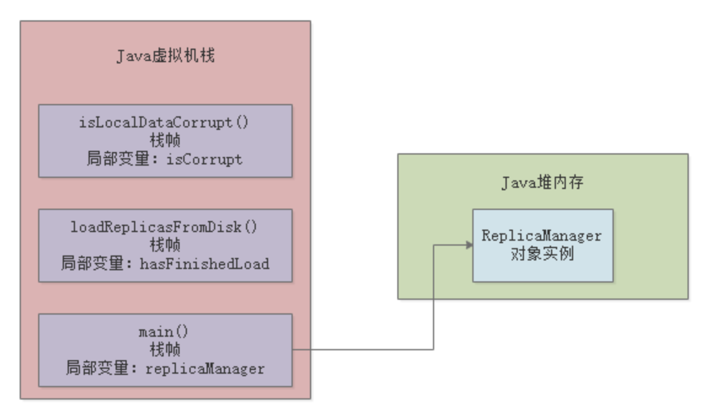
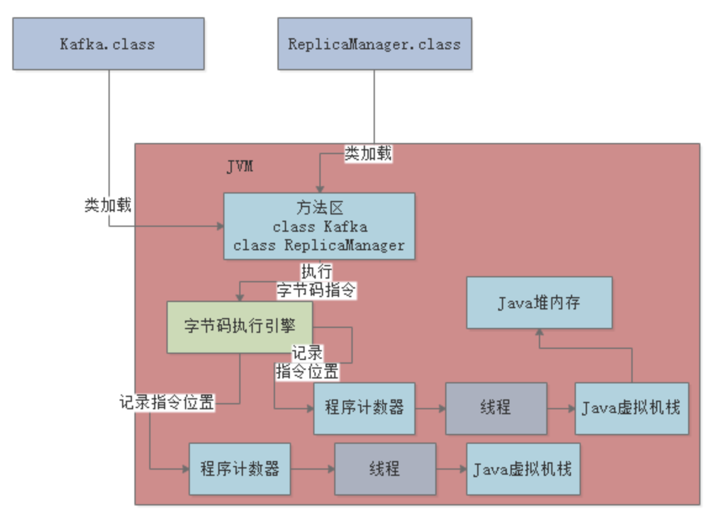

# JVM中有哪些内存区域，分别是用来干嘛的？

## 到底什么是JVM的内存区域划分？

其实这个问题非常简单，JVM在运行我们写好的代码时，他是必须使用多块内存空间的，不同的内存空间用来存放不同的数据，然后配合我们写的代码流程，才能让我们的系统运行起来。

举个最简单的例子，比如咱们现在知道了JVM会加载类到内存里来供后续运行，那么我问问大家，这些类加载到内存以后，放到哪儿去了呢？想过这个问题没？

所以JVM里就必须有一块内存区域，用来存放我们写的那些类。

接下里，我们就依次看看JVM中有哪些内存区域。

## 存放类的方法区

这个方法区是在JDK1.8以前的版本里，代表JVM中的一块区域。

主要是从".class"文件里加载进来的类，还会有一些类似常量池的东西放在这个区域里。

但是JDK1.8以后，这块区域的名字改了，叫做"Metaspace"，可以认为是"元数据空间"这样的意思。当然这里主要还是存放我们自己写的各种类相关的信息。

举个例子，还是跟我们之前说的那样，假如我们有一个"Kafka.class"类和"ReplicaManager.class"类，类似下面的代码：

这两个类加载到JVM后，就会放在这个方法区中，大家看下图：

## 执行代码指令用的程序计数器

即假设我们的代码是如下所示：

之前给大家讲过，实际上面那段代码首先会存在于".java"后缀的文件里，这个文件就是java源代码文件。

但是这个文件是面相我们程序员的，计算机是看不懂你写的这段代码的。

所此时就得通过编译器，把".java"后缀的源代码文件编译为".class"后缀的字节码文件。

这个".class"后缀的字节码文件里存的就是你写出来的代码编译好的字节码了。

字节码才是计算机可以理解的一种语言，而不是我们写出来的那一堆代码。

字节码看起来大概是下面这样的，跟上面的代码无关，就是一个示例而已，给大家感受一下。

这段字节码就是让大家知道".java"翻译成".class"是大概什么样子的。

比如："0:aload_0"这样的，就是字节码指令，他对应了一条一套的机器指令，计算机只有读到这种机器指令，才知道具体应该要干什么。

比如，字节码指令可以能会让计算机从内存里读取某个数据，或者把某个数据写入到内存里去，都有可能，各种各样的指令就会指示计算机去干各种各样的事情。

所以现在大家首先明白一点：**我们写好的Java代码会被翻译成字节码，对应各种字节码指令**。

现在Java代码通过JVM跑起来的第一件事情就明确了，首先Java代码被编译成字节码指令，然后字节码指令会被一条一条执行，这样才能实现我们写好的代码执行的效果。

所以当JVM加载类信息到内存之后，实际就会使用自己的**字节码执行引擎**，去执行我们写的代码编译出来的代码指令，如下图：

那么在执行字节码指令的时候，JVM里就需要 一个特殊的内存区域了，那就是**"程序计数器"**。

这个程序计数器就是用来**记录当前执行的字节码指定的位置的**，也就是记录目前执行到了哪一条字节码指令。

我们通过一张图来说明：

大家都知道JVM是支持多个线程的，所以其实你写好的代码可能会开启多个线程并发执行不同的代码，所以就会有多个线程来并发执行不同的代码指令。

因此，每个线程都会有自己的一个程序计算器，专门记录当前这个线程目前执行到了哪一条字节码指令了。

下图更加清晰的展示出了他们自己的关系。

## Java虚拟机栈

Java代码在执行的时候，一定是线程来执行某个方法中的代码

哪怕是下面的代码，也会有一个main线程来执行main()方法里的代码。

在main线程执行main()方法的代码指令的时候，就会通过main线程对应的程序计数器记录自己执行的指令位置。

但是在方法里，我们经常会定义一些方法内的局部变量。

比如在上面的main()方法里，其实就有一个"replicaManager"局部变量，他引用一个ReplicaManager实例对象的，关于这个对象我们先别去管他，先来看方法和局部变量。

因此，JVM必须有一块区域是来保存每个方法内的**局部变量**等数据的，这个区域就是**Java虚拟机栈**。

每个线程都有自己的Java虚拟机栈，比如这里的main线程就会有自己的一个Java虚拟机栈，用来存放自己执行那些方法的局部变量。

### 栈帧

如果线程执行了一个方法，就会对这个方法调用创建对应的一个**栈帧**。

栈帧里有这个方法的局部变量表、操作数栈、动态链接、方法出口等东西，这里大家先不用全部都理解，我们先关注局部变量。

整个过程，如下图所示：

接着，如果isLocalDataCorrupt方法执行完毕了，就会把isLocalDataCorrupt方法对应的栈帧从Java虚拟机里给出栈。

然后如果loadReplicasFromDisk方法也执行完毕了，就会把loadReplicasFromDisk方法也从虚拟机里出栈。

上述就是JVM中"Java虚拟机栈"这个组件的作用：调用执行任何方法时，都会给方法创建栈帧然后入栈。

在栈帧里存放了这个方法对应的变量之类的数据，包括这个方法执行时的其他相关信息，方法执行完毕之后就出栈。

咱们再来看一个图，了解一下每个线程在执行代码时，除了**程序计数器**以外，还搭配了一**个Java虚拟机栈**内存区域来存放每个方法中的局部变量表。

## Java堆内存

Java堆内存就是存放我们在代码中创建的各种对象的。比如下面的代码：

上面的"new ReplicaManager()"这个代码就是创建了一个ReplicaManager类的实例。类似ReplicaManager这样的对实例，就会存放在堆内存里。

因为我们在main方法里创建了ReplicaManager对象，那么在线程执行main方法的时候，就会在main方法对应的栈帧内的局部变量表里，让一个引用类型的"replicaManager"局部变量来存放ReplicaManager对象的地址。

相当于你可以认为局部变量表里的replicaManager指向了Java堆内存里的ReplicaManager对象。

还是给大家来一张图，更加清晰一些：

## 核心内存区域的全流程串讲

其实我们把上面的那个图和下面的这个总的大图一起穿起来看看，还有配合整体的代码，我们来捋一下整体的流程，大家就会觉得很清晰：

主要流程：

1. 首先，你的JVM进程会启动，就会加载你的Kafka类到内存里；
2. 然后有一个main线程，开始执行你Kafka中的main()方法：
   - main线程是关联了一个**程序计数器**的，那么他执行到哪一行指令，就会记录在这里。
3. main线程在执行main()方法的时候，会在main线程关联的**Java虚拟机栈**里，压入一个main()方法的栈帧；
4. 接着会发现需要创建一个ReplicaManager类的实例对象，此时会将ReplicaManager类加载到内存里来；
5. 然后会创建一个ReplicaManager类的对象实例分配在**堆内存**里，
   并且在main()方法的栈帧里的局部变量表里引入一个"replicaManager"变量，让他引用ReplicaManager对象在堆内存中的地址。
6. main线程开始执行ReplicaManager对象中的方法，会一次把自己执行到的方法对应的栈帧压入到自己的Java虚拟机栈。
   执行完方法之后再把方法对应的栈帧从Java虚拟机栈里出栈。