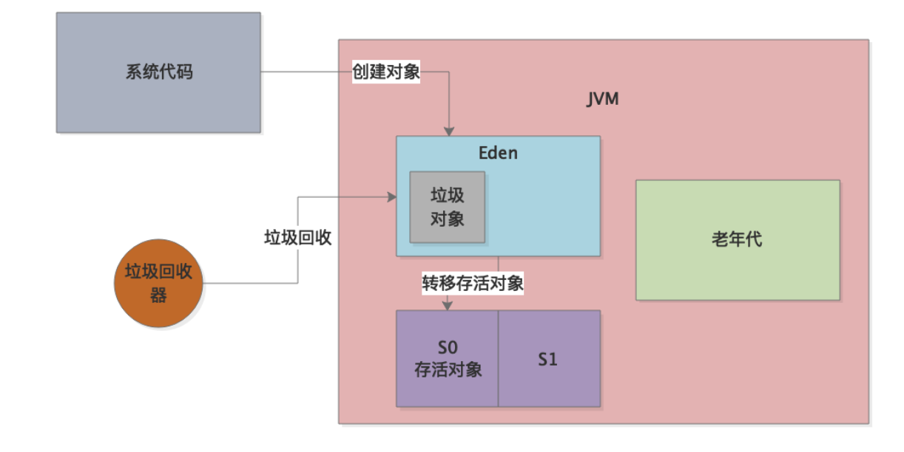

### 1、阶段性复习

最近3天都会有一个阶段性的复习，因为我们已经把完整的JVM运行原理、GC原理、GC优化原理，还有线上发生GC问题的各种优化案例，都给大家完整的分析完了。所以到这里务必停一停脚步，整理一下学习过的知识脉络，让大家进行一点复习。反复的复习，才能让大家真正吃透和消化掉这些知识。

### 2、JVM和GC的运行原理，你都能搞懂了吗？

对于JVM的学习，首先大家必要搞清楚一点，JVM是如何运行起来的？

代码打包-> jar包/war包->执行 java -jar命令，启动服务-》启动一个JVM进程。

这个JVM就会来负责运行这些".class"字节码文件，也就是相当于负责运行我们的系统。

#### 类加载器

采用类加载器把编译好的那些".class"字节码文件加载到JVM中，然后供后续代码运行来使用。

#### 字节码执行引擎

JVM会基于自己的字节码执行引擎，来执行加载到内存里我们写好的那些类了。

#### JVM的内存区域划分

JVM的内存区域划分，最核心的就是这么几块了：年轻代、老年代、Metaspace（也就是以前的永久代）。

其中年轻代又分成了Eden和2个Survivor，默认比例是 8:1:1。

我们写好的系统会不停的运行，运行的时候就会不停的在年轻代的Eden区域中创建各种对象。

而且创建对象一般是在各种方法里执行的，一旦方法执行完毕，方法局部变量引用的那些对象就会成为Eden区里的垃圾对象，就是可以被回收的状态，大家务必要清楚这个过程。

接着，随着Eden区不断的创建对象，就会逐步的塞满，当然这个时候塞满Eden区的对象里大多数都是垃圾对象。一旦Eden区塞满之后，就会触发一次Young GC。

Yong GC会采用复制算法，从GC Roots（方法的局部变量、类的静态变量）开始追踪，标记出来存活的对象。

然后把存放对象都放入第一个Survivor区域中，也就是S0区域，如下图所示：

接着垃圾回收器会直接回收掉Eden区里剩余的垃圾对象，在整个垃圾回收的过程中会进入Stop the World状态，也就是暂停系统工作线程，系统代码全部停止运行，不允许创建新的对象。

只有这样，才能让垃圾回收器专心工作，找出来存活对象，回收掉垃圾对象。

一旦垃圾回收全部完毕之后，存放对象都进入了Survivor区域，然后Eden区域都清空了，那么Yong GC执行完毕，此时系统恢复工作，继续在Eden区创建对象。

下次如果Eden区满了，就会再次触发Yong GC，把Eden区和S0区里的存活对象转移到S1区里去，然后直接清空掉Eden区和S0区中的垃圾对象。

负责Yong GC的垃圾回收器有很多种，但是常用的就是ParNew垃圾回收器，他运行的时候是基于多线程并发执行垃圾回收的。

这就是最基本的JVM和GC的运行原理。

### 3、对象什么时候进入老年代

实际JVM运行过程中，有很多意外的情况发生的，会导致对象进入老年代区域中，如下所述几种情况，反复给大家总结过，务必要记得很清晰：

1. 一个对象在年轻代里躲过15次垃圾回收，年龄太大了，寿终正寝，进入老年代；
2. 对象太大了，超过了一定的阈值，直接进入老年代，不走年轻代；
3. 一次Yong GC过后，存活的对象太多了，导致Survivor区域放不下了，这批对象会进入老年代；
4. 可能几次Yong GC过后，Survivor区域中的对象占用了超过50%的内存，此时会判断年龄1+年龄2+年龄N的对象的总和超过了Survivor区域的50%，此时年龄N以上的对象直接进入老年代，这是动态年龄判定规则。

上面4个条件就是最常见的对象进入老年代的情况，那种长期存活的躲过15次Yong GC的对象毕竟是少数的，大对象一般在特殊情况下会有，对于那种加载大量数据长时间处理以及高并发的场景，是很容易导致Yong GC过后存活对象过多的。

### 4、老年代的GC是如何触发的

