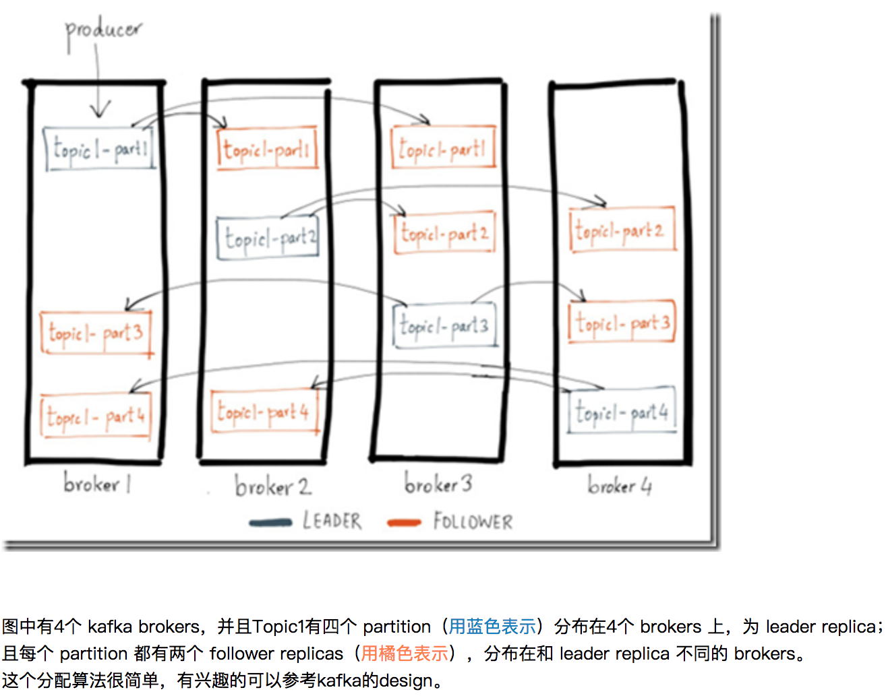

## Kafka简介

分布式消息中间件

### Broker

Kafka集群中的一台或多台服务器统称为broker。

我们目前有10个节点。

### group

- group能够自动地帮你分配要订阅的分区在不同的consumer实例上；

- 同时它还支持fail-over。这样当有consumer实例挂掉的话，group能够重新分配消费负载到剩余存活的consumer实例上。

### Replica机制

### 数据是否会丢失

#### 从producer的角度，发的数据是否会丢失？

除了要打开replica机制，还取决于 producer的request.required.ack设置：

- ack=0，发就发了，不需要ack，无论成功与否；
- ack=1，当leader replica写成功后就返回，其他的replica都是通过fetcher去异步更新的，当然这样会有数据丢失的风险，如果lead的数据还没有来得及同步，lead就挂了，那么会丢失数据；
- acks=-1，要等待所有的replicas都成功后，才能返回；这种纯同步写的延迟比较高。

所以一般情况下，ack设成1，在极端情况下，是有可能丢数据的。

如果可以接受较长的写延迟，可以选择将ack设为-1。

#### 从consumer的角度，是否会读取到不一致的数据？