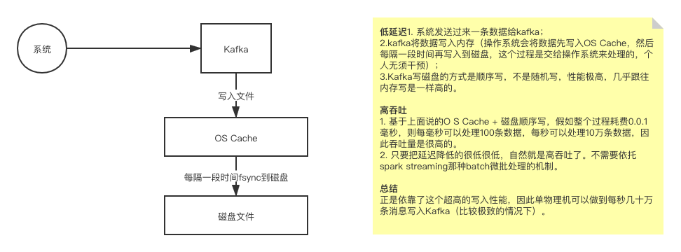

### kafka这个实战课程大纲

平时我们很有可能是自己用到Kafka的。

比如实时计算。storm -> spark streaming -> flink

是一个数据处理的通道，这里无论你用什么技术来做实时计算，大都是先从kafka里消费出数据，处理，接着再把数据写会kafka里。

**每秒钟会涌入多少数据，需要支撑多大的吞吐量，包括每天有多少数据需要落地在磁盘来存储，集群需要存储多大的数据量。**

kafka这个实战课程分为哪几个环节的步骤去讲：

1. 先明白kafka的工作原理；
2. 生产环境怎么部署；
3. 集群的日常管理；
4. 怎么来用；
5. 生产环境会遇到的问题；
6. 接下来就可以玩各种数据的采集了。用户行为日志怎么来采集，怎么埋点，离线导入hdfs，实时导入kafka；
7. 数据库业务数据怎么采集；
8. 爬虫，基于java自研一套分布式爬虫系统，分布式是个关键点，N多个爬虫系统协作起来分布式抓取数据，离线导入hdfs，实时导入kafka。

数据采集这个大的项目就做完了。

### 什么是吞吐量和延迟

#### 吞吐量

比如kafka每毫秒可以处理1条数据，每秒可以处理1000条数据，这个单位时间内可以处理多少条数据，就叫做吞吐量。

算吞吐量的时候还有另外一个单位，比如1000条数据，每条数据10kb，1000条数据相当于10mb的数据，吞吐量相当于是每秒处理10mb的数据。

#### 延迟

写数据请求发送给kafka一直到它处理成功，假如是1毫秒，这个就说明性能很高，延迟是1毫秒。

### Kafka高吞吐低延迟是怎么做到的

.png)

.png).png)

.png)

### Kafka的底层数据结构：日志文件与offset

可以认为写到kafka里的数据，一条一条的数据都是写到日志文件里。每条数据都有offset，代表了这条数据在日志文件里是第几条。

消费的时候也有一个offset的概念，意思是说某个消费者在这个日志文件里当前消费到了第几条消息。

### Kafka是如何通过设计消息格式节约磁盘空间占用开销的

crc32， magic，attribute，时间戳，key长度，key，value长度，value

Kafka是直接通过NIO的ByteBuffer以二进制的方式来保存消息的。

### 如何实现TB量级的数据再Kafka集群中分布式存储

每个Kafka应用进程 叫 Broker，多个Broker 就组成一个集群。

每个机器上都有partiton，是topic的一个数据分片，在底层就是一个日志文件，写数据的时候就可以把数据均匀的写到不同机器的不同partition上，这样的话，就可以通过多台机器来存储一个topic对应的大量数据。

### 如何基于多副本冗余机制保证Kafka宕机时还具备高可用性

多副本冗余机制，在partiiton里会选举出来一个leader，一个follower。

### 如何保证写入Kafaka的数据不丢失呢？

如果写入的数据还没来得及向副本里同步的时候，所在的机器就宕机了。

然后副本被选举为leader；

然后这时来一个消费者消费数据，就消费不到之前写入的数据了。

怎么解决？引入ISR机制。in sync replica，就是跟leader partition保持同步的follower partition的数量。

只有处于ISR列表中的follower的才可以在leader宕机之后被选举为行的leader，因为这个ISR列表里代表他的数据跟leader是同步的。

Kafka会自动维护这个ISR列表，代表有哪个follower的数据跟leader是同步的。起码ISR列表里有一个，这时写数据才会写成功。如果ISR列表里连一个follower也没有，这时就不允许写。

这样的话，只要你写成功了一条数据，就保证数据不会丢了。

### Kafka集群处理请求的时候如何实现负载均衡的效果

整个Kafka的架构原理：

- Kafka的数据是分布式存储的，通过partition来把一个topic里的数据进行分布式存储；
- 写数据的时候，不停的把请求发送给各个Kafka Broker里的leader partition；
- 然后写完数据后就把leader partition数据同步给其它机器上的follower partition，做一个热备；
- 同时还自动维护一个ISR列表，会记录哪些follower partition与leader partition保持着同步。

#### 各个Kafka Broker如何实现负载均衡

Kafka会自动的把各个leader partition均匀的分布在各个Broker所在的机器上。

请求leader partition的时候，是均匀的发送请求给各个Broker。

### 基于Zookeeper实现Kafka无状态可伸缩的架构设计思路

将Kafka Broker相关的元数据信息，比如包含了哪些partition，哪些topic等，存入到Zookeeper集群。

### Partition的几个核心offset

#### LEO

每次leader接收到一条消息，都会更新自己的LEO，也就是log end offset。

接着各个follower会从leader请求同步数据。

offset = 0  ~~~ offset = 4 =》 LEO = 5，代表了最后一条数据后面的offset，也就是下一次将要写入数据的offset。

### 磁盘上的日志文件是按照什么策略定期清理腾出空间的？

大家可以想，不可能说每天涌入的数据都一直留在磁盘上，本质Kafka是一个流式数据的中间件，不需要跟离线存储系统一样保存全量的大数据，所以Kafka是会定期清理掉数据的，这里有几个清理策略。

Kafka默认保留最近7天的数据，每天都会把7天以前的数据给清理掉，包括.log，.index和.timeindex 这几个文件。log.retention.hours参数，可以设置数据要保留几天。

只要你的数据保留在Kafka里，就可以通过offset的指定，随时可以从kafka 搂出来几天之前的数据，进行数据回放。

比如下游的消费者消费了数据之后，数据丢失了，你需要从Kafka里搂出来3天前的数据，重新来回放处理一遍。

### Kafka是如何自定义TCP之上的通信协议以及使用长连接通信的？

Kafka的通信主要发生在 生产端和broker之间，broker和消费端之间，broker和broker之间，这些通信都是基于TCP协议进行连接和传输数据。

然后基于TCP之上的通信协议，是Kafka自定义的，是属于网络层里面的应用层的。

**所谓自定义的协议，说白了就是定义好互相之间发送请求和响应的数据格式，大家都按照这个格式来发送和响应数据。**

### Broker是如何基于Reactor模式进行多路复用请求处理的？

每个broker上都有一个 acceptor 线程和 很多个 processor 线程。可以用 num.network.threads 参数设置 processor 线程的数量，默认是3，client 跟一个broker 之间只会创建一个 socket 长连接，会复用。

### 如何对Kafka集群进行整体控制？Controller是个什么东西？

不知道大家有没有思考过一个问题，就是Kafka集群中某个broker宕机之后，是谁负责感知到他的宕机？ 

加一个Broker时是谁负责把集群里的数据进行负载均衡的迁移？创建topic时leader，follower怎么分配这些?

需要有一个总控组件来对集群进行整体的控制，这就是Controller。

所有的Broker会进行选举，然后某一个Broker会做为Controller的角色。

### 如何基于Zookeeper实现Controller的选举以及故障转移

在Kakfa集群启动的时候，会自动选举一台broker出来承担controller的责任，然后负责管理集群。

这个过程就是说每个broker都会尝试在zookeeper上创建一个/controller临时节点。

但是zookeeper会保证只有一个Broker会创建临节点成功，这个创建成功的broker就会选举为Controller。

一旦controller所在broker宕机了，这个临时节点就会消失，集群里的其它broker会一直监听这个临时节点，发现临时节点消失了，就再次争抢去创建临时节点，保证有一台新的broker会成为controller角色。