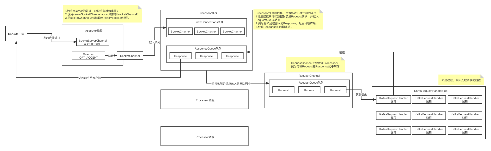

### 写磁盘文件

#### 稀疏索引

Broker 端参数` log.index.interval.bytes` 值，默认4KB，即4KB的消息建一条索引。

往指定的磁盘目录下面写文件，类似这种格式，topic名称-分区序号目录（比如：order-0目录）下面会有这样的文件：

****.log

****.index

每次在****.log里写入了 4096字节的数据，就会同时在****.index中创建一个稀疏索引，类似这样：

****.index：

offset = 23345 物理位置 380

offset = 23670 物理位置 421

offset = 24137 物理位置 495

****.log：

asdadasda offset=23765 ...

也就是说在****.index中，每隔一段时间会将数据的逻辑索引与物流位置进行对应。

假设要查找的是offset=23689的这条数据：

1. 就会通过二分查找，先定位到这条数据在offset = 23345和offset = 23670之间，那么就会定位到物理位置为380；
2. 直接去.log文件中定位到物理位置为380这里往后扫，可能扫几条数据后就找到了offset=23765这条数据。

#### 基于mmap机制实现的索引文件内存映射以及内存写入

MappedByteBuffer如何将.index文件映射到内存里，这样向磁盘写文件其实是在向内存写文件，这样效率就会很高了。

#### FileChannel优先写入OS Cache

以后基于NIO写磁盘文件时，需要写一个while循环，要不停的调用write方法，直到把ByteBuffer中的数据全部写完为止。

基于FileChannel从ByteBuffer中读取数据，然后写入OS Cache（操作系统管理的内存），然后每隔一段时间，将OS Cache中的数据写入磁盘。

#### 深入分析写入日志磁盘文件的每一条日志是什么格式

1 byte 等于8个 bit，也就是1个字节等于8个比特位。

1个字节是8位，int占4个字节32位，long占8个字节64位。

8位是什么意思呢？比如说3，可以转化为8位的二进制数字：0000 0011。

#### Kafka Broker网络通信模型

##### Reactor模式

IO多路复用，由一个线程来监听多路连接，同步等待一个或多个IO事件的到来，然后把事件交给对应的Handler线程来处理，这就叫Reactor模式。

基本上，只要底层的高性能网络通信就离不开Reactor模式。像Netty、Redis都是使用Reactor模式。

网络通信模型的发展如下：

单线程=》多线程=》线程池=》Reactor模型

##### Kafka所采用的的Reactor模型

##### Kafka网络通信模型总结

1. Broker中有一个Acceptor（mainReactor）监听新连接的到来，与新连接建立之后，轮询选择一个Processor（subReactor）管理这个连接；
2. 而Processor或监听其管理的连接，当事件到达之后，读取数据封装成Request，并将Request放入共享请求队列中；
3. 然后IO线程池不断的从该队列中取出请求，执行真正的处理。处理完之后将响应发送给Processor对应的响应队列中去，然后由Processor将Response返回给客户端。

##### 生产者-消费者模式

每个listener只有一个Acceptor线程，因为它只是作为新建连接再分发，没有过多的逻辑，很轻量，一个足矣。

Processor线程在Kafka中称之为网络线程，默认的网络线程有3个，对应的参数是num.network.threads。可以根据实际业务动态增减。

还有个IO线程池，即KafkaRequestHandlerPool，执行真正的处理，对应的参数是：num.io.threads，默认是8个。IO线程处理完之后，将Response放入对应的Processor，由Processor将响应返回给客户端。

可以看到网络线程和IO线程之间利用经典的生产者-消费者模式，不论是用于处理Request的请求队列，还是IO处理完返回的Response。

这样的好处是什么？生产者和消费者之间解耦了，可以对生产者和消费者做独立的变更或扩展，并且可以平衡两者的处理能力，例如消费不过来了，就多加一些IO线程。

如果你看过其它中间件源码，你会发现生产者-消费者模式真的是太常见了。 	

写的比较好的一篇文章：https://www.jianshu.com/p/04bae18f6b9b

##### 为什么向****.index文件写和向****.log文件写使用不同的技术呢？

答：因为.index文件主要存储稀疏索引，内容比较小，可以加载到内存里，直接基于ByteBuffer写即可。

超过1万条就强制刷到磁盘里。

每隔4096个字节会写入稀疏索引，使用MappedByteBuffer（基于内存实现的）顺序写；

#### 为什么能实现高并发呢？

其实还是因为基于Reactor的这个网络通信模型。

大量的连接过来，轮询给Processor，然后Processor再快速的把请求放入队列中去；

后台的线程池里有多个线程会取出这些请求，然后再往本地磁盘写，直接写内存，顺序写，速度是很快的，1秒钟处理几千个请求的上万条数据都是没问题的。

这套机制保障了可以扛住高并发。

#### 副本机制

每隔分区都有多个副本，其中一个leader负责读写请求，还有其他的follower是负责同步数据，做一个热备份。在其它机器上的broker会负责从leader来拉取数据同步到follower中。

主要几个知识点：

1. 从leader拉取数据的过程，以及写入follower本地磁盘文件；
2. LEO的更新，随着数据不停的拉取，HW的更新；
3. ISR列表的更新，如何监控各个副本的同步进度，维护ISR；
4. acks=0时，如何等待多个副本同步成功后再返回响应回去。

元数据更新的机制，会保证每个Broker自己知道自己负责的分区，leader/follower。

#### 拉取数据的FetchRequest是如何构建出来的

一次fetch请求过去，至少要拉取minByte的数据，1字节。

如果连1个字节的数据都没有，则此时需要等待一段时间，最多可以等待500毫秒。

如果连500毫秒之后还是没有新的数据到达这个leader，此时就会返回。