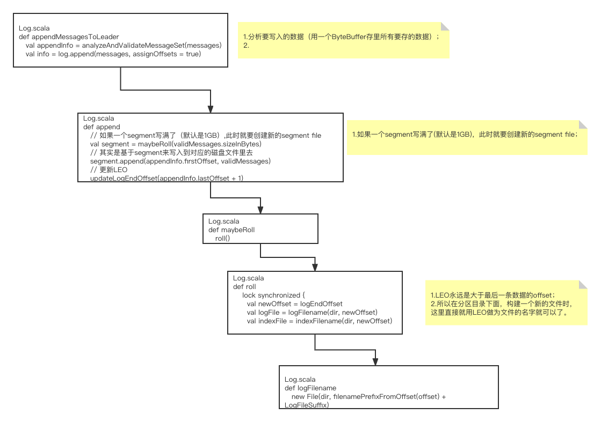
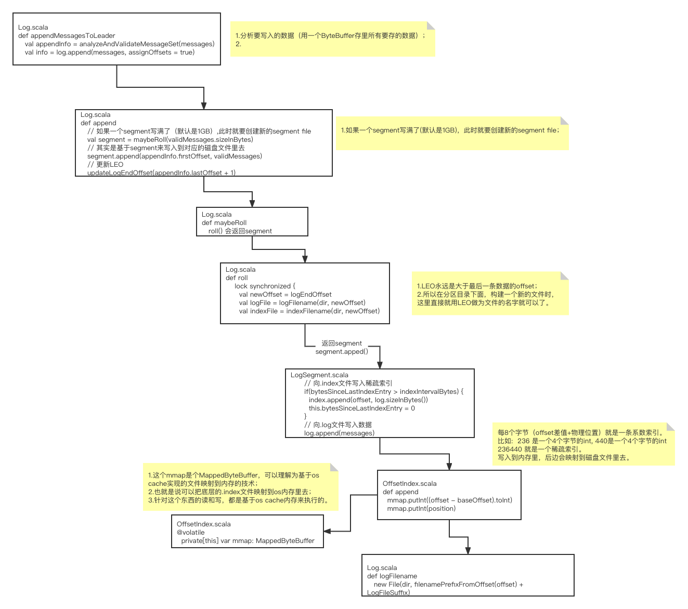

### 写磁盘文件

#### 对应分区目录下的segment磁盘文件是如何构建的




#### 稀疏索引



Broker 端参数` log.index.interval.bytes` 值，默认4KB，即4KB的消息建一条索引。

往指定的磁盘目录下面写文件，类似这种格式，topic名称-分区序号目录（比如：order-0目录）下面会有这样的文件：

****.log

****.index

每次在****.log里写入了 4096字节的数据，就会同时在****.index中创建一个稀疏索引，类似这样：

****.index：

offset = 23345 物理位置 380

offset = 23670 物理位置 421

offset = 24137 物理位置 495

****.log：

asdadasda offset=23765 ...


也就是说在****.index中，每隔一段时间会将数据的逻辑索引与物流位置进行对应。

假设要查找的是offset=23689的这条数据：

1. 就会通过二分查找，先定位到这条数据在offset = 23345和offset = 23670之间，那么就会定位到物理位置为380；
2. 直接去.log文件中定位到物理位置为380这里往后扫，可能扫几条数据后就找到了offset=23765这条数据。

#### 基于mmap机制实现的索引文件内存映射以及内存写入

MappedByteBuffer如何将.index文件映射到内存里，这样向磁盘写文件其实是在向内存写文件，这样效率就会很高了。

#### FileChannel优先写入OS Cache

以后基于NIO写磁盘文件时，需要写一个while循环，要不停的调用write方法，直到把ByteBuffer中的数据全部写完为止。

基于FileChannel从ByteBuffer中读取数据，然后写入OS Cache（操作系统管理的内存），然后每隔一段时间，将OS Cache中的数据写入磁盘。

#### 深入分析写入日志磁盘文件的每一条日志是什么格式

1 byte 等于8个 bit，也就是1个字节等于8个比特位。

1个字节是8位，int占4个字节32位，long占8个字节64位。

8位是什么意思呢？比如说3，可以转化为8位的二进制数字：0000 0011。

##### 为什么向****.index文件写和向****.log文件写使用不同的技术呢？

答：因为.index文件主要存储稀疏索引，内容比较小，可以加载到内存里，直接基于ByteBuffer写即可。

超过1万条就强制刷到磁盘里。

每隔4096个字节会写入稀疏索引，使用MappedByteBuffer（基于内存实现的）顺序写；

#### 为什么能实现高并发呢？

其实还是因为基于Reactor的这个网络通信模型。

大量的连接过来，轮询给Processor，然后Processor再快速的把请求放入队列中去；

后台的线程池里有多个线程会取出这些请求，然后再往本地磁盘写，直接写内存，顺序写，速度是很快的，1秒钟处理几千个请求的上万条数据都是没问题的。

这套机制保障了可以扛住高并发。

#### 副本机制

每隔分区都有多个副本，其中一个leader负责读写请求，还有其他的follower是负责同步数据，做一个热备份。在其它机器上的broker会负责从leader来拉取数据同步到follower中。

主要几个知识点：

1. 从leader拉取数据的过程，以及写入follower本地磁盘文件；
2. LEO的更新，随着数据不停的拉取，HW的更新；
3. ISR列表的更新，如何监控各个副本的同步进度，维护ISR；
4. acks=0时，如何等待多个副本同步成功后再返回响应回去。

元数据更新的机制，会保证每个Broker自己知道自己负责的分区，leader/follower。

#### 拉取数据的FetchRequest是如何构建出来的

一次fetch请求过去，至少要拉取minByte的数据，1字节。

如果连1个字节的数据都没有，则此时需要等待一段时间，最多可以等待500毫秒。

如果连500毫秒之后还是没有新的数据到达这个leader，此时就会返回。

### 用于将消息写入磁盘文件的ReplicaManager是什么

每个leader写入了一条消息，leader partition的LEO会推进一位；

但是必须等到所有的follower都同步了这条消息，partition的HW才能整体推进一位。

消费者只能读取到HW高水位以下的消息。

isr列表，保存了leader和 跟上leader数据同步，没有落后太多数据的follower。

### 如何已固定的速率将os cache的数据flush到磁盘？

Log.scala：

```scala
def unflushedMessages() = this.logEndOffset - this.recoveryPoint
```

假设现在已经flush到磁盘上去的数据，offset=23800，recoverPoint=23801，代表已经flush到磁盘

还存在于os cache中的数据：offset=23900，LEO=23901，这中间就差了100多条数据。

### 主要的几个方面

目录组织机制、磁盘文件组织机制、数据文件 +索引文件、数据格式、定时刷新OS Cache、基于NIO/BIO写磁盘的细节。

#### 创建topic的时候是如何将分区副本均匀分配给Broker的？

