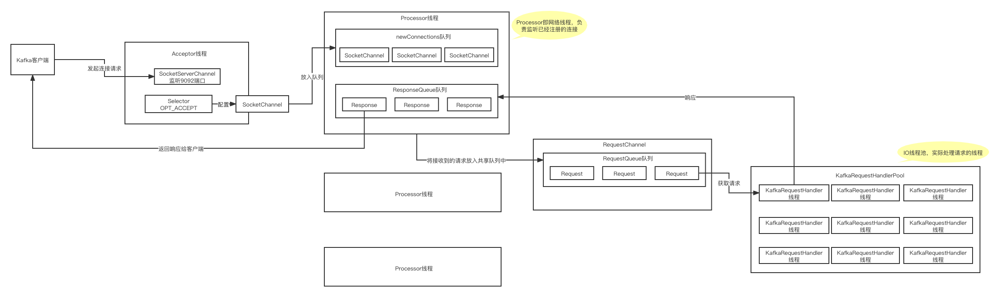
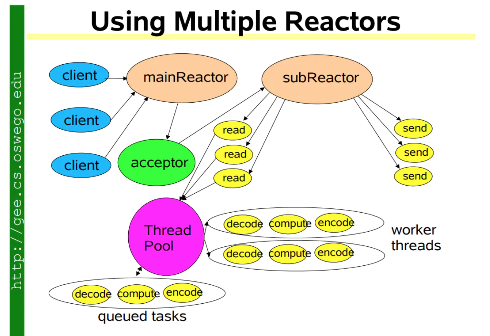

### 写磁盘文件

#### 稀疏索引

Broker 端参数` log.index.interval.bytes` 值，默认4KB，即4KB的消息建一条索引。

往指定的磁盘目录下面写文件，类似这种格式，topic名称-分区序号目录（比如：order-0目录）下面会有这样的文件：

****.log

****.index

每次在****.log里写入了 4096字节的数据，就会同时在****.index中创建一个稀疏索引，类似这样：

****.index：

offset = 23345 物理位置 380

offset = 23670 物理位置 421

offset = 24137 物理位置 495

****.log：

asdadasda offset=23765 ...

也就是说在****.index中，每隔一段时间会将数据的逻辑索引与物流位置进行对应。

假设要查找的是offset=23689的这条数据：

1. 就会通过二分查找，先定位到这条数据在offset = 23345和offset = 23670之间，那么就会定位到物理位置为380；
2. 直接去.log文件中定位到物理位置为380这里往后扫，可能扫几条数据后就找到了offset=23765这条数据。

#### 基于mmap机制实现的索引文件内存映射以及内存写入

MappedByteBuffer如何将.index文件映射到内存里，这样向磁盘写文件其实是在向内存写文件，这样效率就会很高了。

#### FileChannel优先写入OS Cache

以后基于NIO写磁盘文件时，需要写一个while循环，要不停的调用write方法，直到把ByteBuffer中的数据全部写完为止。

基于FileChannel从ByteBuffer中读取数据，然后写入OS Cache（操作系统管理的内存），然后每隔一段时间，将OS Cache中的数据写入磁盘。

#### 深入分析写入日志磁盘文件的每一条日志是什么格式

1 byte 等于8个 bit，也就是1个字节等于8个比特位。

1个字节是8位，int占4个字节32位，long占8个字节64位。

8位是什么意思呢？比如说3，可以转化为8位的二进制数字：0000 0011。

#### Kafka Broker网络通信模型

##### Reactor模式

IO多路复用，由一个线程来监听多路连接，同步等待一个或多个IO事件的到来，然后把事件交给对应的Handler线程来处理，这就叫Reactor模式。

基本上，只要底层的高性能网络通信就离不开Reactor模式。像Netty、Redis都是使用Reactor模式。

网络通信模型的发展如下：

单线程=》多线程=》线程池=》Reactor模型

##### Kafka所采用的的Reactor模型

##### Kafka网络通信模型总结

1. Broker中有一个Acceptor（mainReactor）监听新连接的到来，与新连接建立之后，轮询选择一个Processor（subReactor）管理这个连接；
2. 

##### 为什么向****.index文件写和向****.log文件写使用不同的技术呢？

答：因为.index文件主要存储稀疏索引，内容比较小，可以加载到内存里，直接基于ByteBuffer写即可。

超过1万条就强制刷到磁盘里。

#### 为什么能实现高并发呢？

其实还是因为基于Reactor的这个网络通信模型。

大量的连接过来，轮询给Processor，然后Processor再快速的把请求放入队列中去；

后台的线程池里有多个线程会取出这些请求，然后再往本地磁盘写，直接写内存，顺序写，速度是很快的，1秒钟处理几千个请求的上万条数据都是没问题的。

这套机制保障了可以扛住高并发。

