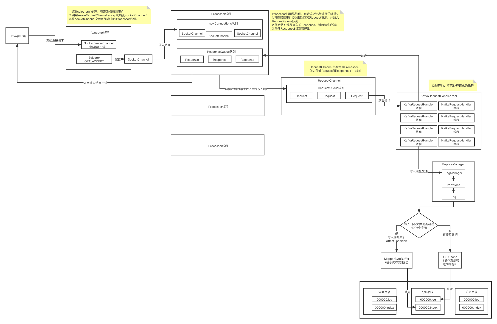
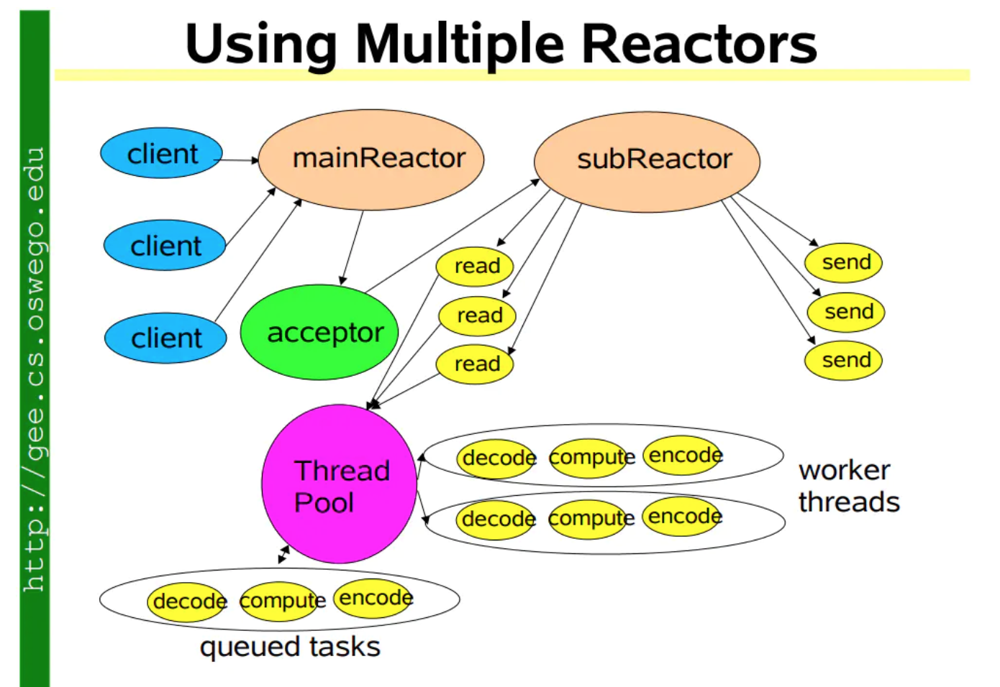

## KafkaProducer初始化的时候会涉及到哪些核心的组件

### RecordAccumulator：将消息打包成batch

RecordAccumulator消息累加器，kafka发送消息时，并不是直接将消息从客户端通过网络发送给服务端，而是将消息存储在客户端的消息累加器中，当队列满了或者发送时间已到的时候才会去发送。

尽可能将消息打包成batch，减少对broker发送请求的次数。

如果这些请求是要发送到同一个分区，同一个分区对应同一个broker，则将这些请求打包成一个一个的batch。

一个broker上的多个分区对应的多个batch会被打包成一个request。

batch过小，会导致会频繁发送request；

batch过大，会在内存里缓存过多batch，浪费内存资源。

batch.size 默认16K。

默认情况下，如果仅仅是考虑batch机制的话，那么必须要等到足够多的消息打包成一个batch，才能通过request发送到broker上去。

但是有一个问题，如果你发送了一条消息，但是很久都没有达到一个batch大小，所以说要设置一个linger.ms，如果在指定时间范围内，都没凑出来一个batch，那么就必须立即把这个消息发送出去。

#### 拉取元数据的网络通信大概过程

先看NetworkClinet类。 进行网络IO异步请求和响应，不是线程安全的。构造MetadataRequest

Sender是一个Runnable。

负责从缓冲区里获取消息，发送给broker。

Sender的run方法里，对应的NetworkClient里面有一个poll方法，poll方法里有一个MetadataUpdater组件去拉取元数据，拉取到元数据后，会更新元数据到MetaData里，然后用notifyAll方法唤醒主线程。

真正发送请求是调的NetworkClient组件的doSend()方法=>Selector组件（是Kafka中定义的专门用来处理网络通信的组件）。

首先确保该topic的元数据是可以使用的。

如果之前从来没有加载过topic的元数据，就会在这一步同步阻塞来等待可以去连接到broker上去拉取元数据过来，缓存到客户端。

maxBlockTimeMs参数，决定了你调用send()方法的时候，最多会被阻塞多长时间。


### Partitioner组件将消息路由到分区里

#### 不指定分区key将消息负载均衡分到到各分区

取模（取余），用一个counter递增，然后对分区数进行取模。

#### 指定分区key将消息负载均衡分到到各分区

会通过封装的一个工具类murmur2，实现一个算法。将一个字节数组转换为一个int类型的hash值，因此，只要分区key是一样的，比如说是同样的订单id，此时就一定会生成相同的hash值，那么用hash值对分区数量进行取模，就可以保证路由到的分区也是相同的。

### 1.将消息写入内存缓冲的运行流程值得学习的地方


#### 1.如何基于CopyOnWriteMap实现线程安全的分区队列构建


### 不断申请内存空间的情况下导致可用内存耗尽了怎么办

如果申请不到新的内存空间，就会阻塞；

如果有batch底层对应的空间腾出来，就会唤醒阻塞的线程，再次申请一个新的ByteBuffer来构造一个Batch；

如果等一段时间还是没有可用的内存空间，就会报timeout超时。


### 总结： RecordAccumulator 这个组件的内存缓存机制

主要是  RecordAccumulator 这个组件的内存缓存机制，一个分区的消息才能缓冲到一个Deque对应的batch里去：

1. 不断往里面写消息，像每个分区写消息时多线程并发；
2. 从BufferPool里拿ByteBuffer出来复用，然后拿ByteBuffer去构建 batch，后面其它线程都往batch里去写；
3. 写满一个batch，就会再拿一个ByteBuffer再去构建一个batch，然后往里边写；
4. 各个分区都是这个流程；
5. 如果batch占的ByteBuffer的内存空间超过了可用的内存空间，其它线程就会卡在这里，阻塞；
6. 如果有空间腾出来，就会唤醒阻塞的线程，再次申请一个新的ByteBuffer来构建一个batch，然后线程可以继续往里写消息了，否则，就会抛出超时的错误。

基于缓冲池，复用内存，避免不断的申请内存、垃圾回收。


#### Kafka生产端唯一的一个IO线程到底在干什么？

就是Kafka生产端的一个IO线程，里面封装了 sender 逻辑 =》 NetworkClient 发送网络请求。

每个Broker上有多个partition，把同一个broker上的leader partition聚合分组打包为batch，然后把这些leader partition所对应的batch，放在一个ClientRequest里一次性发送给broker。

然后通过NetWorkClient走底层的网络通信，把每个broker的clientRequest给发送过去。

NetWorkClient的poll方法是负责进行网络IO通信操作的一个核心方法，负责发送数据出去和读取响应。


元数据加载的请求是如何通过网络通信发送出去的？

元数据加载的响应是如何来处理的？

#### 通过哪个核心组件与Broker建立连接？

NetworkClient类的 initiateConnect()方法：

```java
/**
 * Initiate a connection to the given node
 */
private void initiateConnect(Node node, long now) {
    String nodeConnectionId = node.idString();
    try {
        log.debug("Initiating connection to node {} at {}:{}.", node.id(), node.host(), node.port());
        this.connectionStates.connecting(nodeConnectionId, now);
        // 底层建立socket连接
        // 发送缓冲区大小(128KB)，接收缓冲区大小(32KB)。
        selector.connect(nodeConnectionId,
                         new InetSocketAddress(node.host(), node.port()),
                         this.socketSendBuffer,
                         this.socketReceiveBuffer);
    } catch (IOException e) {
        /* attempt failed, we'll try again after the backoff */
        connectionStates.disconnected(nodeConnectionId, now);
        /* maybe the problem is our metadata, update it */
        metadataUpdater.requestUpdate();
        log.debug("Error connecting to node {} at {}:{}:", node.id(), node.host(), node.port(), e);
    }
}
```

在工业级的网络通信开发里面，socketSendBuffer和socketReceiveBuffer 这连个核心参数都是必须设置的。

Selector的组件进行连接，之前学习NIO的课程就知道：

1. NIO建立连接其实就是在底层初始化一个SocketChannel发起一个连接的请求；
2. 就会把SocketChannel注册到Selector上面；
3. Selector会监听这个SocketChannel连接的事件；
4. 如果Broker返回的响应说可以建立连接，Selector就会告诉你，你就可以通过一个API的调用，完成底层的网络连接，TCP三层握手。

Selector类：

```java
A nioSelector interface for doing non-blocking multi-connection network I/O.
```

针对多个Broker的网络连接，执行非阻塞的IO操作。=》 可以复习前面的NIO课程。

#### Selector类的connect()方法

本地用两个 KafkaProducer 服务试一下 多个jvm进程时的 并发问题。

#### 针对每个目标Broker构建一个很多Batch组成的Request

发送出去的请求，需要按照Kafka的二进制协议来定制数据的格式。

需要包含对应的请求头，api key，api version，acks，request timeout，接着才是请求体，里面包含了对应的多个batch数据，最后，再把数据给转化为二进制的字节数组。

ClientRequest里面就是封装了按照二进制协议格式的数据，发送到broker上去，有很多个topic，每个topic有很多个partition，每个partition对应一个batch的数据，

要发送请求的时候，会把这个请求暂存到KafkaChannel里去，同时让Selector监听他的OPT_WRITE事件，增加一种OPT_WRITE事件，同时保留了OPT_READ事件，此时Selector会同时监听这个连接的OPT_WRITE和OPT_READ事件。

发送完了请求之后，就会把OPT_WRITE事件取消监听，只保留关注OPT_READ事件。

发现对这个broker可以再次执行OPT_WRITE事件，然后再次调用SocketChannel的write方法，把ByteBuffer里剩余的数据继续往Broker去写。	

上述这个过程会重复多次，直到把这个请求对应的数据发送完毕。

#### 看看Kafka生产端的NIO编程是如何进行粘包类问题的处理的？

粘包也就是说收到了多余的数据。

怎么解决？

每个响应中间插入一个特殊的分隔符。比如在响应消息前面插入4个字节（integer类型）代表响应消息本身的数据大小的数字。

比如：

消息1 是350个字节，消息2是 212个字节。则发送过来的数据可能是这样：

350 消息1 212消息2。

分为三个阶段：

1. 先读取前四个字节，转换为一个int，获取到消息的大小；
2. 根据大小申请内存buffer；
3. 最后读取指定大小的数据到申请好的buffer。

由此，就完成了一整条数据的正式读取。

#### 看看Kafka生产端的NIO编程是如何进行拆包类问题的处理的？

拆包，也就是说收到的数据不是一条完整的数据。那么该如何组成一条完整的数据呢？

假如有这样的多条消息：

199 消息 256消息 369消息

##### 情况一

**在读取消息的时候，4个字节的size都没读完，比如就只能读到19。**

position = 0，limit = 4

现在读取一个字节，position=1；读取二个字节，position = 2，此时remaining 是2，还剩下2个字节是可以读的。	

如果说一个请求对应的ByteBuffer中的二进制字节数据一次write没有全部发送完毕，此时remainging > 0，就不会取消对OT_WRITE事件的监听。

下次请求调用poll方法，会再次运行到这里来：

Selector类的pollSelectionKeys()方法：

```java
while(networkReceive = channel.read() != null)
    addToStagedReceives(channel, networkReceive);
```


KafkaChannel类：

```java
public NetworkReceive read() throws IOException {
    NetworkReceive result = null;

    if (receive == null) {
        receive = new NetworkReceive(maxReceiveSize, id);
    }

    receive(receive);
    if (receive.complete()) {
        receive.payload().rewind();
        result = receive;
        receive = null;
    }
    return result;
}
```

由于上一次没有读完消息，因此**NetworkReceive**还是停留在那里，可以继续读取：

```java
private long receive(NetworkReceive receive) throws IOException {
    return receive.readFrom(transportLayer);
}
```

因为剩余还有2个字节，所以这次最多就只能读取2个字节到里面去，这样，4个字节的size就凑满了，此时就说明size数字是可以读取出来了。解决了size的拆包问题。

##### 情况二

**比如199个字节的消息只读取到了 172个字节，这种拆包问题怎么处理？**

下一次继续循环，执行到代码NetworkReceive类的readFromReadableChannel()方法：

```java
if (buffer != null) {
    int bytesRead = channel.read(buffer);
    if (bytesRead < 0)
        throw new EOFException();
    read += bytesRead;
}
```

buffer不为null，剩余还有27个字节，则就读取27个字节。就把剩余的数据给读出来了。


只要size或buffer没读完，**NetworkReceive**就一直放在Channel里，并且保持对OP_READ事件的监听。

```java
public NetworkReceive read() throws IOException {
    NetworkReceive result = null;

    if (receive == null) {
        receive = new NetworkReceive(maxReceiveSize, id);
    }

    receive(receive);
    // 通过判断size或buffer都没有remaining了来判断是否读完了
    if (receive.complete()) {
        receive.payload().rewind();
        result = receive;
        // 然后就将receive置为null了
        receive = null;
    }
    return result;
}
```

NetworkReceive为null了，下次就可以读取一条新的数据了。

---


##### Selector类的addToCompletedReceives()方法

每次循环只拿出一个客户端的一个请求放到completedReceives里去。

KSelector对于某个客户端，StagedReceives里可能有多个请求，但是completedReceives里只有一个请求。而且这个请求已经被放到RequestQueue里去了，取消了OP_WRITE事件关注，而且对于这个客户端后面不会再读取新的请求出来了。

下一次循环，只有关注了OP_WRITE事件，才会把StagedReceives里的请求放到completedReceives里去。

所以，同一时间，一个客户端只可能有一个Request在这个RequestQueue里，必须得等到这个请求处理完毕后，重新关注OP_WRITE，才能处理这个客户端的下一个请求。

#### Kafka Broker网络通信模型



##### Reactor模式

IO多路复用，由一个线程来监听多路连接，同步等待一个或多个IO事件的到来，然后把事件交给对应的Handler线程来处理，这就叫Reactor模式。

基本上，只要底层的高性能网络通信就离不开Reactor模式。像Netty、Redis都是使用Reactor模式。

网络通信模型的发展如下：

单线程=》多线程=》线程池=》Reactor模型

##### Kafka所采用的的Reactor模型



##### Kafka网络通信模型总结

1. Broker中有一个Acceptor（mainReactor）监听新连接的到来，与新连接建立之后，轮询选择一个Processor（subReactor）管理这个连接；
2. 而Processor或监听其管理的连接，当事件到达之后，读取数据封装成Request，并将Request放入共享请求队列中；
3. 然后IO线程池不断的从该队列中取出请求，执行真正的处理。处理完之后将响应发送给Processor对应的响应队列中去，然后由Processor将Response返回给客户端。

##### 生产者-消费者模式

每个listener只有一个Acceptor线程，因为它只是作为新建连接再分发，没有过多的逻辑，很轻量，一个足矣。

Processor线程在Kafka中称之为网络线程，默认的网络线程有3个，对应的参数是num.network.threads。可以根据实际业务动态增减。

还有个IO线程池，即KafkaRequestHandlerPool，执行真正的处理，对应的参数是：num.io.threads，默认是8个。IO线程处理完之后，将Response放入对应的Processor，由Processor将响应返回给客户端。

可以看到网络线程和IO线程之间利用经典的生产者-消费者模式，不论是用于处理Request的请求队列，还是IO处理完返回的Response。

这样的好处是什么？生产者和消费者之间解耦了，可以对生产者和消费者做独立的变更或扩展，并且可以平衡两者的处理能力，例如消费不过来了，就多加一些IO线程。

如果你看过其它中间件源码，你会发现生产者-消费者模式真的是太常见了。 	

写的比较好的一篇文章：https://www.jianshu.com/p/04bae18f6b9b

