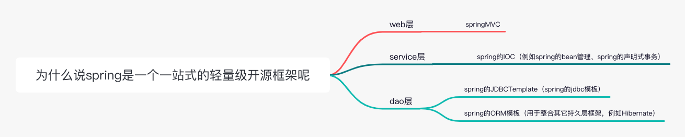

### 什么是spring

https://liayun.blog.csdn.net/article/details/69663685

- spring是一个开源框架，它是为了解决企业应用开发的复杂性而创建的。

- 框架的主要优势之一就是分层架构，分层架构允许使用者选择使用哪一个组件，同时为j2ee应用程序开发提供继承的框架。

- spring的核心是控制反转（IOC）和面向切面（AOP）。简单来说，spring是一个分层的JavaSE/EE full-stack（一站式）轻量级开源框架。

为什么说spring是一个一站式的轻量级开源框架呢？EE开发可分成三次结构，针对JavaEE的三层结构，每一场spring都提供了不同的解决技术：

