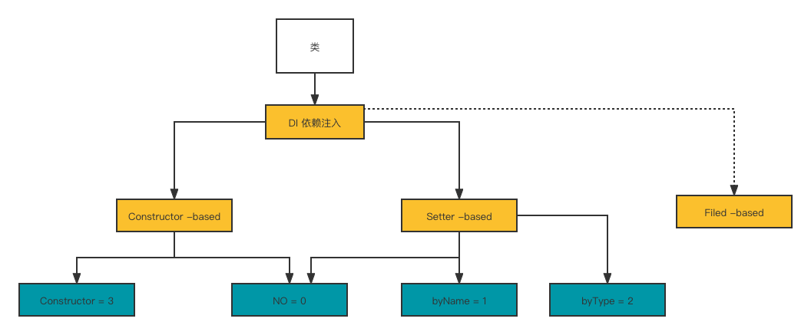

### Spring内部类实例化

#### spring实例化bean

1、拿到这个类的构造方法；

2、然后通过newInstance 反射将类实例化出来。

#### spring的4种注入模型




备注：

- 默认的注入模型是 0；
- 比如把注入模型改为3，则会通过查找构造方法区完成注入。

#### @Order注解现象分析

> spring 类的加载顺序可以理解为包含两个方面：

1、 扫描到spring容器时的顺序；

2、从spring容器里对类进行实例化

`在spring中，可以干扰spring bean的实例化顺序，但是扫描顺序无法干扰。`

#### @Lookup

#### @DependsOn

#### Supplier如何在spring中使用

#### 动态代理

#### 把一个第三方对象注入spring

有以下几种方式：

1. 注解 （@Service,.....）=》不行；
2. <bean id="n"></bean> =》不行；
3. 注解 @Bean =》 可以；
4. factoryBean =》可以；
5. spring api =》可以；
6. 动态像容器注册beandefinition =》不可以


**把一个类注入spring，跟把一个对象注入spring 是不一样的。**

spring的确可以把一个类实例化，然后放入到容器当中，但是这样不是把对象交给spring管理。

`有什么区别呢？`

比如mybatis

```java
Tmapper mapper = (Tmapper) MysqlSession.getMapper(Tmapper.class);
```

- `这个代理对象，一定要是mybatis产生，因为只有他自己知道要干什么事情。`

- 你想如果是spring产生，即使spring可以帮你生成这个mapper代理对象，但代理对象里边的逻辑，要干嘛的spring是不知道的，不可能帮你执行代理对象里的方法去完成数据库查询。

#### ImportBeanDefinitionRegistrar动态注册bean

> 先了解

mybatis 低版本中对spring做的一个扩展：

- 就是借助ImportBeanDefinitionRegistrar类的registerBeanDefinitions方法的回调，

完成了扫描，beanDefinitions的替换，然后spring就可以实例化我们想要的bean。

