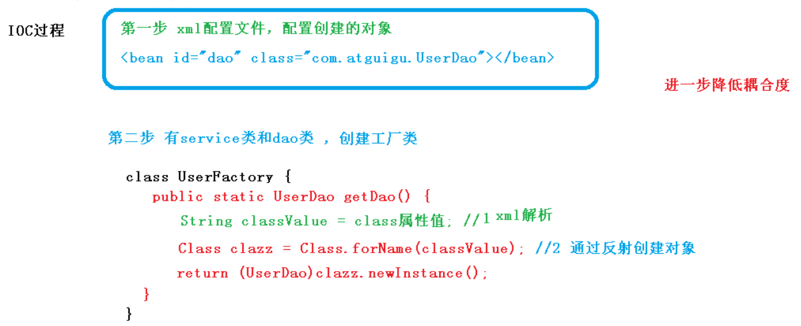
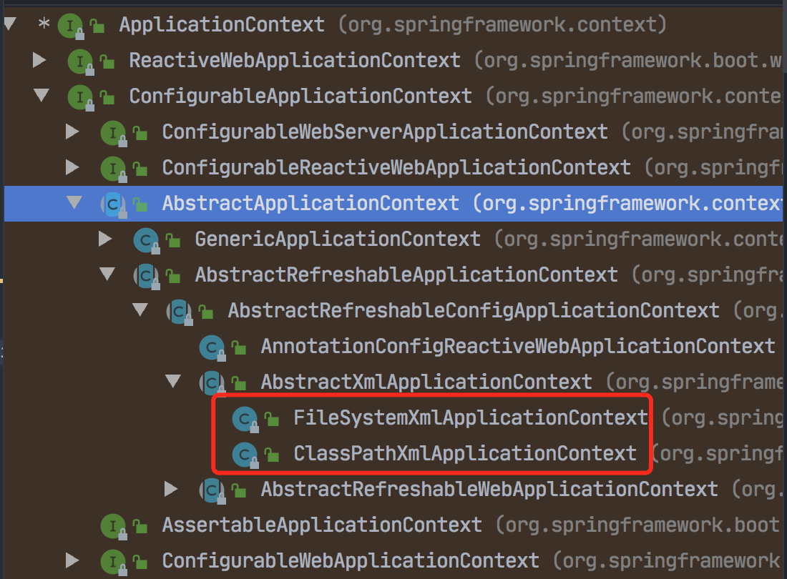
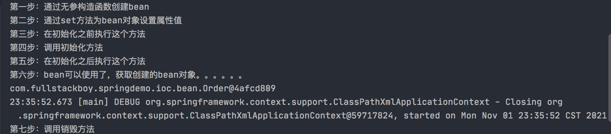
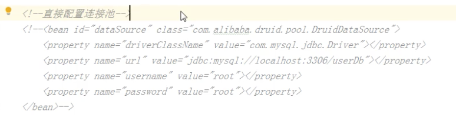
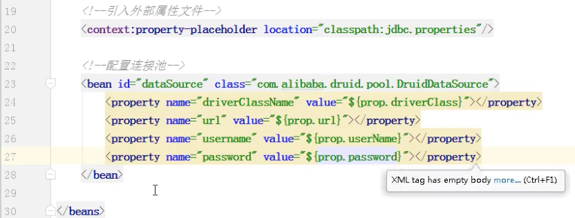

课程使用Spring版本：

spring 5.2.6稳定版本。下载地址：https://repo.spring.io/ui/native/release/org/springframework/spring

### IOC容器

#### ioc底层原理：ioc过程

主要用到这三点技术：xml解析、工厂模式、反射。

反射，就是得到类的字节码文件，然后可以操作类中的所有内容。

xml解析、工厂模式加上 反射 可以把耦合降低到最低。

#### 

- 将对象创建和对象之间的调用全都交给Spring进行管理，通过这个IOC过程，可以进一步降低耦合度，这就是IOC底层的原理；

- IOC思想基于IOC容器完成，IOC容器本质上或者说最底层就是这个对象工厂，而这个过程是怎么实现的呢，就是上面说的这个过程。

#### **ioc底层原理：Spring提供IOC容器实现的两种方式**：（两个接口）

- BeanFactory：IOC容器基本实现，是Spring容器内部使用的接口，一般不提供开发人员使用。
- ApplicationContext：BeanFactory的子接口，提供更强大的功能，一般由开发人员使用。

这两个接口的功能都是类似的，**都能实现加载配置文件，通过工厂模式，来实现创建对象**。

ApplicationContext的两个主要实现类：



#### IOC操作bean管理（基于xml方式）

这个术语是什么意思？

可以概括为两方面：

1. Spring创建对象；

   ```xml
   <bean id="user" class="com.fullstackboy.springdemo.ioc.User"></bean>
   ```

   创建对象的时候，默认会执行类的无参构造方法。

2. Spring注入属性

- DI：依赖注入（就是注入属性），需要在创建对象的基础上才能完成。Spring中支持的两种方是set注入和有参构造方法进行属性注入。

这两种方式的demo见 blog-demo工程里的 springdemo.ioc。

#### IOC操作bean管理（FactoryBean）

Spring有两种类型的bean：一种是普通的bean（我们自己创建的bean）；另一种是spring内置的bean（FactoryBean）。

- 普通bean 在配置文件中定义的bean类型就是返回类型；
- 工厂bean在配置文件中定义的bean类型可以喝返回类型不一样。

#### IOC操作bean管理（bean作用域）

在Spring里面，默认情况下，创建的bean是单例对象。


可以通过加 scope="prototype" 来讲bean设置为多实例对象。

```xml
<bean id="myfactorybean" class="com.fullstackboy.springdemo.ioc.factorybean.MyBean" scope="prototype"></bean>
```

##### singleton和prototype区别

1. singleton是单实例，protot是多实例；
2. 设置scope值是singleton时，加载spring配置文件时就会创建单实例对象；
3. 设置scope值是prototype时，不是在加载spring配置文件时创建多实例对象，而是在调用getBean()方法时才会创建。

#### IOC操作bean管理（bean生命周期）

1. 比如通过构造器（无参构造方法）或工厂bean的方式创建bean；
2. 为bean的属性设置值和对其它bean的引用（调用set方法）;
3. 把bean实例传递bean后置处理器的方法postProcessBeforeInitialization()；
4. 调用bean的初始化的方法（需要进行配置初始化的方法）；
5. 把bean实例传递bean后置处理器的方法postProcessAfterInitialization()；
6. bean就可以使用了；
7. 当容器关闭时，调用bean的销毁的方法（需要进行配置销毁的方法）



demo代码详细见：com.fullstackboy.springdemo.ioc的Test1#testBeanPeriod()测试。

课程：https://www.bilibili.com/video/BV1Vf4y127N5?p=18&spm_id_from=pageDriver

#### IOC操作bean管理（自动装配）

##### 什么是自动装配

根据指定装配规则（属性名称或属性类型），Spring自动将匹配的属性进行注入。

```java
public class Employee {
    private String name;

    private Department dept;
}
```

##### 手动装配

```xml
<bean id="employee" class="com.fullstackboy.springdemo.ioc.bean.Employee">
    <property name="dept" ref="department"></property>
</bean>

<bean id="department" class="com.fullstackboy.springdemo.ioc.bean.Department"></bean>
```

##### 自动装配

```xml
<!-- 实现自动装配，通过autowire的byName或byType属性-->
<bean id="employee" class="com.fullstackboy.springdemo.ioc.bean.Employee" autowire="byName">
    </bean>
<bean id="dept" class="com.fullstackboy.springdemo.ioc.bean.Department"></bean>
```

实际开发中，基于xml方式来实现自动装配 是比较少的，比较经常的做法还是使用 注解的方式。

##### 直接配置



**把外部properties属性文件引入到spring配置文件中**

在xml里引入context名称空间

https://www.bilibili.com/video/BV1Vf4y127N5?p=19&spm_id_from=pageDriver



#### IOC操作bean（基于注解方式）

Spring针对Bean管理中创建对象提供注解。

1. @Component；
2. @Service；
3. @Controller；
4. @Repository

上面这四个注解的作用都是一样的，都可以用来创建bean对象。

xml中引入context名称空间：

```xml
<?xml version="1.0" encoding="UTF-8"?>
<beans xmlns="http://www.springframework.org/schema/beans"
       xmlns:xsi="http://www.w3.org/2001/XMLSchema-instance"
       xmlns:context="http://www.springframework.org/schema/context"
       xsi:schemaLocation=
               "http://www.springframework.org/schema/beans http://www.springframework.org/schema/beans/spring-beans.xsd
                http://www.springframework.org/schema/context http://www.springframework.org/schema/context/spring-context.xsd">

    <context:component-scan base-package="com.fullstackboy.springdemo.ioc"></context:component-scan>

</beans>
```

使用@Component注解：

```java
@Component
public class DeptService {
    public void add() {
        System.out.println("service add......");
    }
}
```

进行测试：

```java
@Test
public void testBean2() {
    ClassPathXmlApplicationContext context = new ClassPathXmlApplicationContext("bean5.xml");
    DeptService deptService = context.getBean("deptService", DeptService.class);

    System.out.println(deptService);
}
```

##### 开启组件扫描细节配置

```xml
<context:component-scan base-package="com.atguigu" use-default-
filters="false">
 <context:include-filter type="annotation"
expression="org.springframework.stereotype.Controller"/>
</context:component-scan>
```

这样设置的意思是，不使用默认的filter，只扫描使用注解的Controller。

#### 基于注解方式使用属性注入

##### @Autowired、@Repository

@Autowired 根据类型（比如UserDAO类型的bean）进行自动装配，但如果有多个接口实现类对象，比如基于UserDAO接口的实现类有多个，比如：UserDAOImpl1，UserDAOImpl2，UserDAOImpl3 时，在UserSerivce里使用UserDAO时，使用@Autowired就不能知道要找哪一个了。

这时可以用@Autowired和@Repository(value="UserDAOImpl2")配合使用，按名称去找。

UserDAOImpl.java：

```
@Repository(value="UserDAOImpl1")
public class UserDAOImpl implements UserDAO {
   // ......
}
```


UserService.java：

```java
@Autowired   
@Qualifier("UserDAOImpl1")  
public UserDAO userDAO;   
```

备注：@Qualifier 必须和 @Autowired  配合一块使用。

##### @Resource

UserService.java：

```java
// @Resource   
@Resource("name=userDAOImpl1")  
public UserDAO userDAO;   
```

备注：@Resource 即可以根据类型注入，又可以根据名称注入。

注意：

- @Resource 是java扩展包里的（javax.annotation.Resource），而@Autowired 和 @Qualifier 是Spring自带的；
- 因此，Spring官方建议我们用@Autowired 和 @Qualifier，不建议用@Resource。但是功能是可以做到的。

##### @Value

上面的三种注解都是注入对象，这个注解是注入普通类型属性，比如类的一个成员变量：

```java
@Value("张三")
private String name;
```

来替代在xml中使用property属性配置和类中使用set方法。

#### 6、完全注解开发

##### 1、创建配置类，替代xml配置文件

```java
@Configuration  //做为配置类，替代xml文件
@ComponentScan(basePackages={"com.atguigu"}) // 配置要扫描的包
public class SpringConfig {

}
```

需要修改加载配置类的代码为：

```java
//加载配置类
// ClassPathXmlApplicationContext context = new ClassPathXmlApplicationContext("bean5.xml");
ApplicationContext context = new AnnotationConfigApplicationContext(SpringConfig.class);
// 剩下代码不变
DeptService deptService = context.getBean("deptService", DeptService.class);
System.out.println(deptService);

```

