@@ -1005,11 +1005,8 @@ AbstractAutowireCapableBeanFactory#initializeBean：

         4.AbstractAutowireCapableBeanFactory#initializeBean
    
      ```java
 // 执行 BeanPostProcessor Before 处理
 Object wrappedBean = applyBeanPostProcessorsBeforeInitialization(bean, beanName);

 @Override
```java
  @Override
 public Object applyBeanPostProcessorsBeforeInitialization(Object existingBean, String beanName) throws BeansException {
        Object result = existingBean;
        // 从beanPostProcessors这个list里取BeanPostProcessor
@ -1020,231 +1017,5 @@ AbstractAutowireCapableBeanFactory#initializeBean：
        }
        return result;
    }
```

      5.ApplicationContextAwareProcessor

```java
@Override
    public Object postProcessBeforeInitialization(Object bean, String beanName) throws BeansException {
        if (bean instanceof ApplicationContextAware){
            ((ApplicationContextAware) bean).setApplicationContext(applicationContext);
        }
        return bean;
    }
```

会设置ApplicationContext，这里的applicationContext就是在：

```java
// 添加 ApplicationContextAwareProcessor，让继承自 ApplicationContextAware 的 Bean 对象都能感知所属的 ApplicationContext
// new ApplicationContextAwareProcessor(this) 就是个 BeanPostProcessor
// 然后它的 applicationContext 变量就被赋值为 ClassPathXmlApplicationContext =》 下边给ApplicationContextAware类型的bean setApplicationContext的时候会使用到。
beanFactory.addBeanPostProcessor(new ApplicationContextAwareProcessor(this));
```

这里设置的ClassPathXmlApplicationContext：

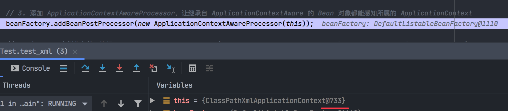


然后它的 applicationContext 变量就被赋值为 ClassPathXmlApplicationContext （ 下边给`ApplicationContextAware`类型的bean setApplicationContext的时候会使用到。）

```java
// 执行 BeanPostProcessor Before 处理
Object wrappedBean = applyBeanPostProcessorsBeforeInitialization(bean, beanName);

@Override
    public Object applyBeanPostProcessorsBeforeInitialization(Object existingBean, String beanName) throws BeansException {
        Object result = existingBean;
        for (BeanPostProcessor processor : getBeanPostProcessors()) {
            Object current = processor.postProcessBeforeInitialization(result, beanName);
            if (null == current) return result;
            result = current;
        }
        return result;
    }
```


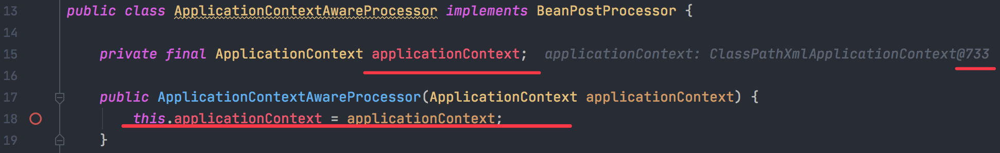

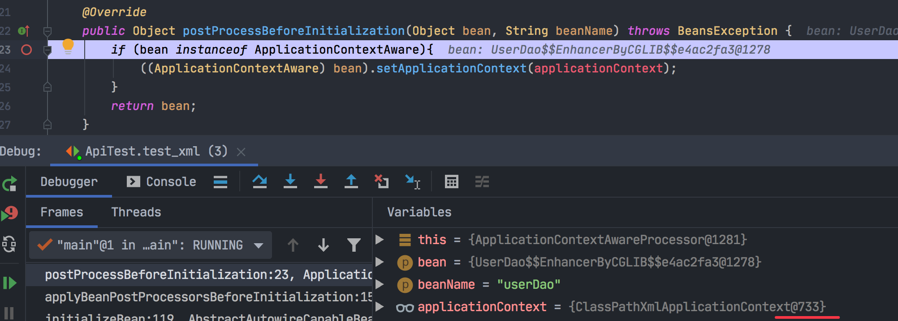

#### RunTime.getRunTime().addShutdownHook用法

这个方法的意思就是在jvm中增加一个关闭的钩子。

- 当jvm关闭的时候，会执行系统中已经设置的所有通过addShutdownHook添加的钩子，当系统执行完这些钩子后，jvm才会关闭。
- 所以这些钩子可以在jvm关闭的时候进行内存清理、对象销毁等操作。

```java
/**
 * 测试 Runtime.getRuntime().addShutdownHook 钩子函数
 *
 * @author Liuyongfei
 * @date 2022/1/31 18:29
 */
public class RunTimeTest {

    public static void main(String[] args) {
        Thread threada = new Thread(() -> {
            System.out.println("thread a ....");
        },"a");

        Thread threadb = new Thread(() -> {
            System.out.println("thread b ....");
        },"b");

        Thread threadShutdown = new Thread(() -> {
            System.out.println("shutdown thread ....");
        },"c");

        Runtime.getRuntime().addShutdownHook(threadShutdown);

        threada.start();
        threadb.start();
    }
}
```

```bash
thread a ....
thread b ....
shutdown thread ....
```

结论：

无论是先打印 thread a,，还是thread b，shutdown thread 都是最后打印的（因为这个线程是在jvm执行关闭前才会执行）

#### 销毁

#### 注册实现了DisposableBean接口的 Bean 对象

在 AbstractAutowireCapableBeanFactory#createBean的时候，有一步：

```java
// 注册实现了 DisposableBean 接口的 Bean 对象
registerDisposableBeanIfNecessary(beanName, bean, beanDefinition);

protected void registerDisposableBeanIfNecessary(String beanName, Object bean, BeanDefinition beanDefinition) {
        if (bean instanceof DisposableBean || StrUtil.isNotEmpty(beanDefinition.getDestroyMethodName())) {
            registerDisposableBean(beanName, new DisposableBeanAdapter(bean, beanName, beanDefinition));
        }
    }
```

这里会判断如果是 DisposableBean，并且beanDefinition有destory-method，则将该 bean 添加到 disposableBeans里去（HashMap）。

#### 使用关闭钩子Runtime.getRuntime().addShutdownHook

```java
 // 1.初始化 BeanFactory
ClassPathXmlApplicationContext applicationContext = new ClassPathXmlApplicationContext("classpath:spring.xml");
applicationContext.registerShutdownHook();
```

AbstractApplicationContext类：

```java
@Override
public void registerShutdownHook() {
    Runtime.getRuntime().addShutdownHook(new Thread(this::close));
}

@Override
public void close() {
    getBeanFactory().destroySingletons();
}
```

destroySingletons()方法会循环disposableBeans，执行DisposableBeanAdapter#destroy方法：

```java
@Override
    public void destroy() throws Exception {
        // 1. 实现接口 DisposableBean
        if (bean instanceof DisposableBean) {
            ((DisposableBean) bean).destroy();
        }

        // 2. 注解配置 destroy-method {判断是为了避免二次执行销毁}
        if (StrUtil.isNotEmpty(destroyMethodName) && !(bean instanceof DisposableBean && "destroy".equals(this.destroyMethodName))) {
            Method destroyMethod = bean.getClass().getMethod(destroyMethodName);
            if (null == destroyMethod) {
                throw new BeansException("Couldn't find a destroy method named '" + destroyMethodName + "' on bean with name '" + beanName + "'");
            }
            destroyMethod.invoke(bean);
        }
        
    }
```

UserService：

```java
public class UserService implements InitializingBean, DisposableBean {

    private String uId;
    private String company;
    private String location;
    private UserDao userDao;

    @Override
    public void destroy() throws Exception {
        System.out.println("执行：UserService.destroy");
    }
    ......
```


执行small-spring-step-07的ApiTest#test_xml()方法：

```java
执行：init-method
执行：UserService.afterPropertiesSet
测试结果2：小傅哥,腾讯,深圳
执行：UserService.destroy
执行：destroy-method
```

会在jvm关闭之前输出：

```bash
执行：UserService.destroy
执行：destroy-method
```

#### 到目前为止Bean对象的生命周期

目前为止，关于Spring框架的实现中，某些功能点已经越来趋向于完整，尤其是 Bean 对象的生命周期，已经有了很多的体现。整体总结如下图：

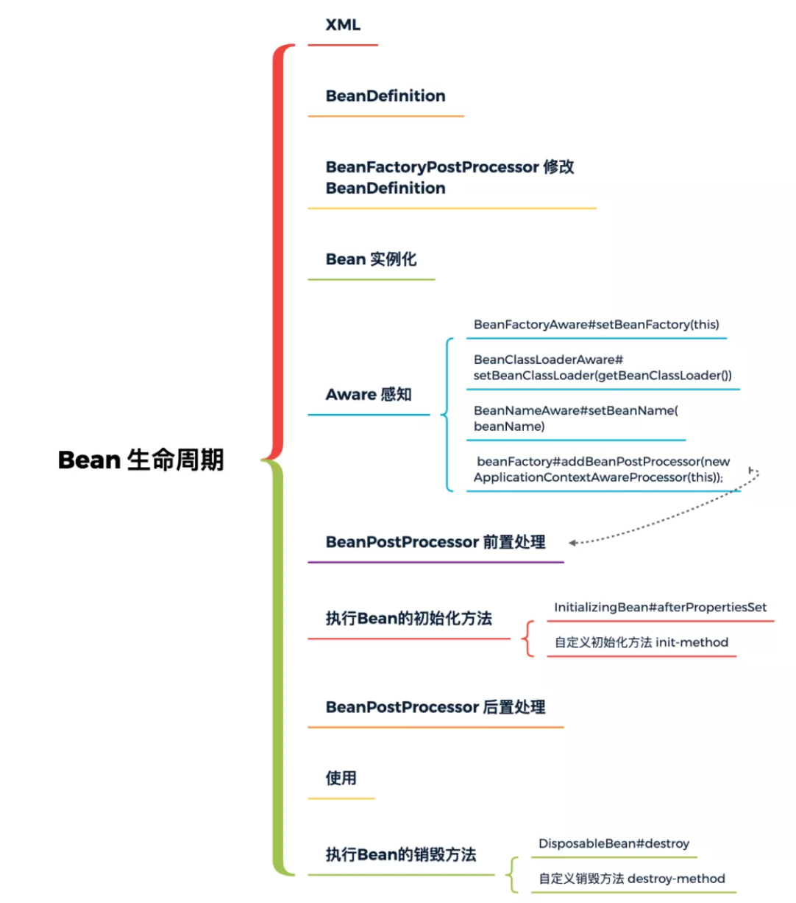

### [九、横刀跃马，关于Bean对象作用域以及FactoryBean的实现和使用](https://github.com/fuzhengwei/small-spring/commit/8f9bdfbf87b881f7575ac96b445505009cedae8a)

#### 目标

> 1、在集合Spring框架下，我们使用的Mybatis框架中，它的核心作用是可以满足用户不需要实现Dao接口类，就可以通过xml或注解配置的方式完成对数据库执行CRUD操作。
>
> 2、那么在实现这样的ORM框架中，是怎么把一个数据库操作的bean对象交给Spring管理的呢？
>
> 3、因为我们在使用Spring、Mybatis框架的时候都可以知道，并没有手动的去创建任何操作数据库的Bean对象，有的仅仅是一个接口定义，而这个接口定义竟然可以被注入到其他需要使用Dao的属性中去了。

**那么这一过程最核心待解决的问题，就是需要完成把复杂且以代理方式动态变化的对象，注册到Spring容器中。**

而为了满足这样的一个扩展组件开发的需求，就需要我们在现有手写的Spring框架中，添加这一能力。

原来的链条是：

AbstractBeanFactory =》DefaultSingletonBeanRegistry，

现在是：

AbstractBeanFactory =》 FactoryBeanRegistrySupport（主要是处理关于FactoryBean注册的支撑操作） =》DefaultSingletonBeanRegistry

**FactoryBeanRegistrySupport**类主要处理的就是关于FactoryBean 此类对象的注册操作。

#### 单元测试代理对象

```java
@Test
public void test_factory_bean() {
    // 1.初始化 BeanFactory
    ClassPathXmlApplicationContext applicationContext = new ClassPathXmlApplicationContext("classpath:spring.xml");
    applicationContext.registerShutdownHook();
    // 2. 调用代理方法
    UserService userService = applicationContext.getBean("userService", UserService.class);
    System.out.println("测试结果：" + userService.queryUserInfo());
}
```

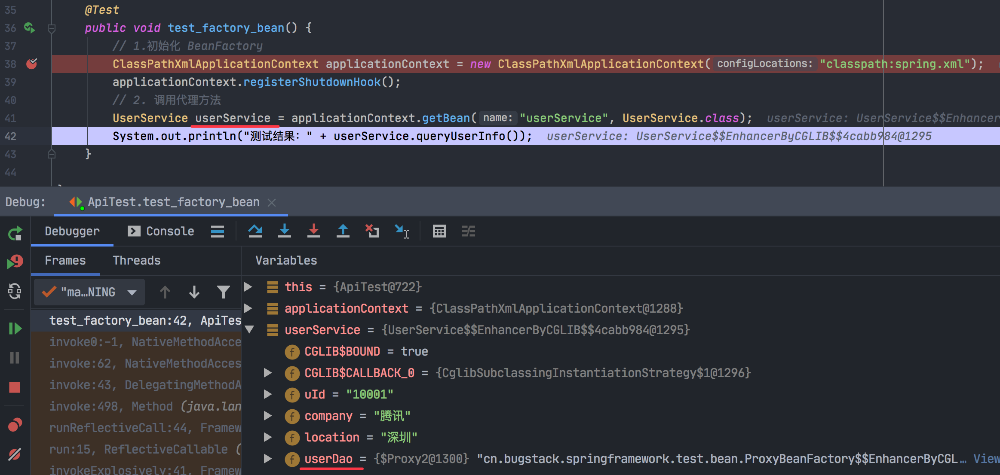

也就是说通过getBean方法拿到的userService，它的userDao属性就已经是ProxyBeanFactory代理对象了。

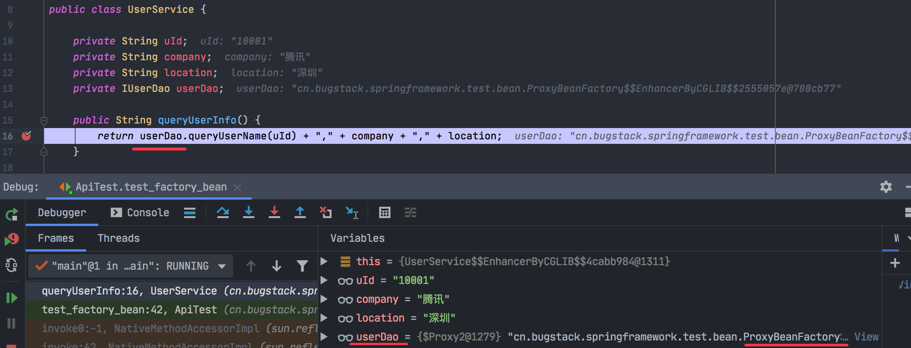

可以看到，这里的userDao 就是 ProxyBeanFactory，在执行queryUserName()方法时，就会执行代理对象的功能。=》`为什么就会执行ProxyBeanFactory的getObject方法呢？`

1、spring.xml：

```xml
<bean id="userService" class="cn.bugstack.springframework.test.bean.UserService" scope="prototype">
        <property name="uId" value="10001"/>
        <property name="company" value="腾讯"/>
        <property name="location" value="深圳"/>
        <property name="userDao" ref="proxyUserDao"/>
</bean>

<bean id="proxyUserDao" class="cn.bugstack.springframework.test.bean.ProxyBeanFactory"/>
```

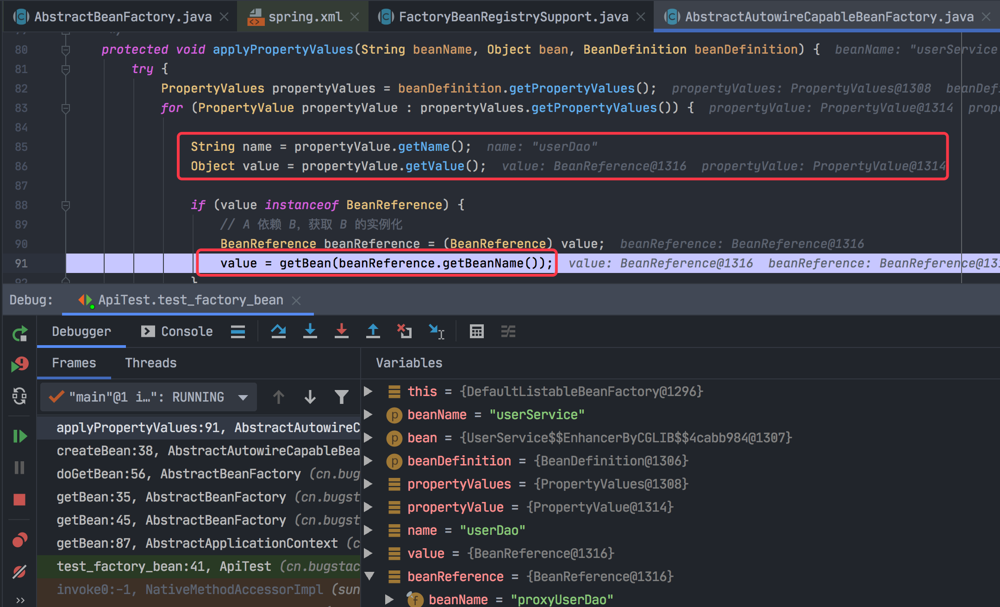

2、执行：

AbstractBeanFactory.getBean#  =》doGetBean# =》getObjectForBeanInstance# =》 getObjectFromFactoryBean# =》doGetObjectFromFactoryBean#：

```java
protected <T> T doGetBean(final String name, final Object[] args) {
        // name = proxyUserDao，已经在实例化 xml文件应用上下文的时候创建过了
        Object sharedInstance = getSingleton(name); 
        if (sharedInstance != null) {
            // 如果是 FactoryBean，则需要调用 FactoryBean#getObject
            return (T) getObjectForBeanInstance(sharedInstance, name);
        }
  ......
```


所以会执行 getObjectForBeanInstance方法。

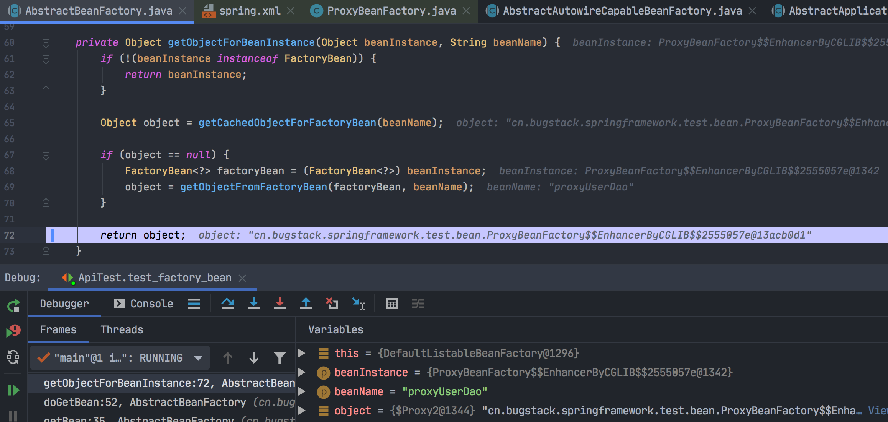

3、由于在xml文件应用上下文创建的时候，"proxyUserDao"这个bean已经放到了 factoryBeanObjectCache 这个Map里去，所以这里object不为空，会直接返回object。

3.1

```java
// 1.初始化 BeanFactory
ClassPathXmlApplicationContext applicationContext = new ClassPathXmlApplicationContext("classpath:spring.xml");
```

时，会执行AbstractBeanFactory#doGetBean：

3.2 当 name = "proxyUserDao"时：

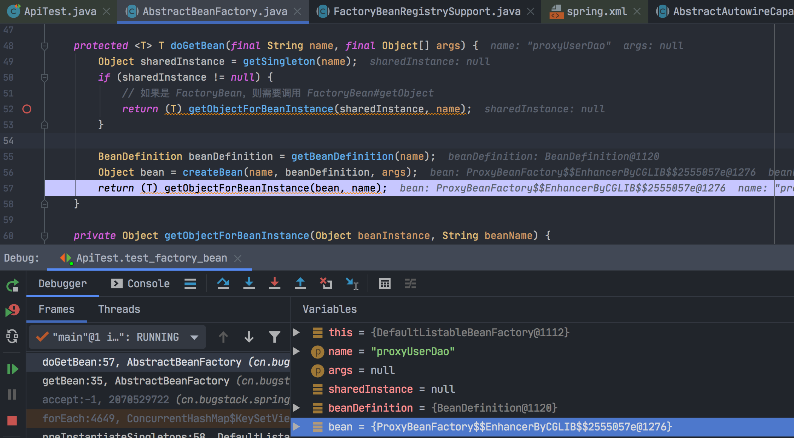

3.3 AbstractBeanFactory#getObjectForBeanInstance：

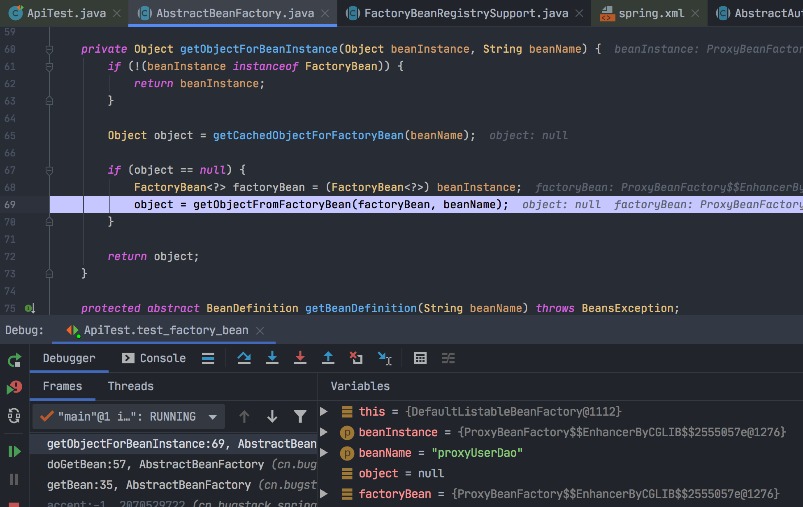

3.4 调用getObject方法

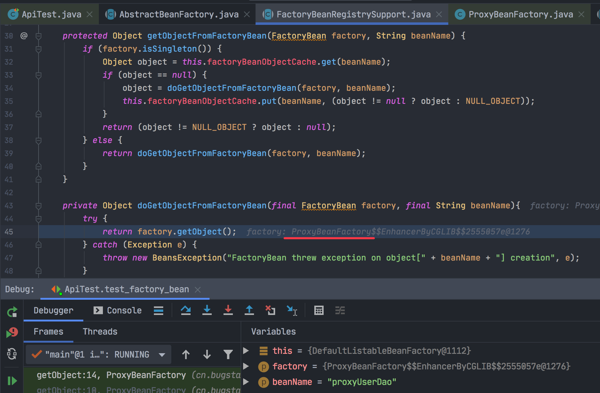

3.5 ProxyBeanFactory.getObject#：

```java
public class ProxyBeanFactory implements FactoryBean<IUserDao> {

    @Override
    public IUserDao getObject() throws Exception {
        InvocationHandler handler = (proxy, method, args) -> {

            // 添加排除方法
            if ("toString".equals(method.getName())) return this.toString();
            
            Map<String, String> hashMap = new HashMap<>();
            hashMap.put("10001", "小傅哥");
            hashMap.put("10002", "八杯水");
            hashMap.put("10003", "阿毛");
            
            return "你被代理了 " + method.getName() + "：" + hashMap.get(args[0].toString());
        };
        return (IUserDao) Proxy.newProxyInstance(Thread.currentThread().getContextClassLoader(), new Class[]{IUserDao.class}, handler);
    }
   ......
}
```

#### 总结

也就是说这里 通过 ProxyBeanFactory 对象调用它的getObject方法生成 UserDao 的动态代理类，做为userService 这个bean的userDao属性值；

当单元测试类里执行：

```java
public String queryUserInfo() {
    return userDao.queryUserName(uId) + "," + company + "," + location;
}
```

时，会直接取执行"代理对象处理器"，即getObject里的这段hander代码逻辑（**为了理解的更形象，可以看blog-demo/dynamicproxy的单元测试类Test#testJdkDynamicProxy方法**）：

1. method.getName()  =》 "queryUserName";
2. args[0] = 10001;
3. hashMap.get(args[0].toString()) = "小傅哥";
4. 因此 handler返回的字符串是：你被代理了 queryUserName：小傅哥;
5. 因此queryUserInfo方法返回的结果是：你被代理了 queryUserName：小傅哥,腾讯,深圳。

----------

**充电**：第6步"提前实例化单例Bean"对象是什么意思？

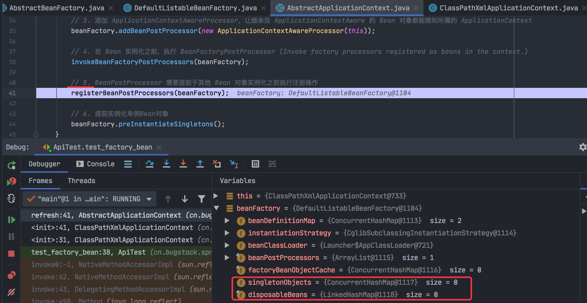

执行完第6步骤：

```java
// 6. 提前实例化单例Bean对象
beanFactory.preInstantiateSingletons();
```

后：

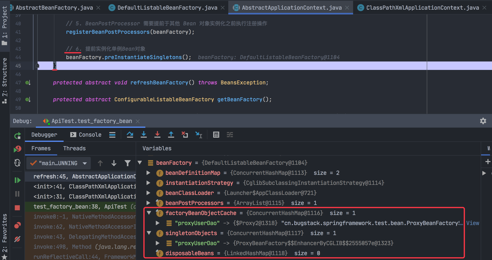

可见：

1. 会将配置文件里定义的单例Bean对象实例化后，放入HashMap中去；
2. 且proxyUserDao这个bean 就是代理对象 ProxyBeanFactory。


##### 梳理 userService的userDao属性是怎么变为ProxyBeanFactory的主要流程

```java
// 1.初始化 BeanFactory
ClassPathXmlApplicationContext applicationContext = new ClassPathXmlApplicationContext("classpath:spring.xml");
```


1、Bean属性填充：AbstractAutowireCapableBeanFactory#applyPropertyValues

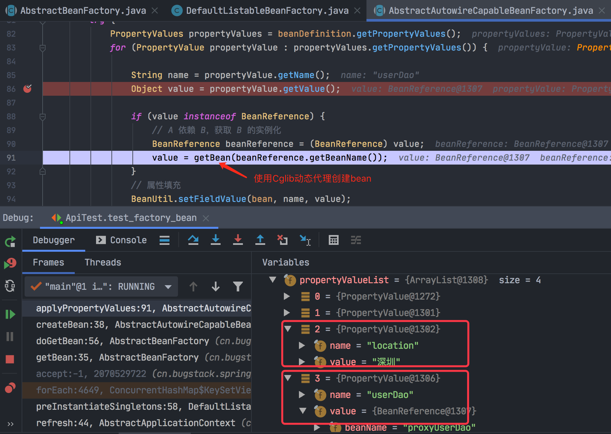

2、

```java
protected <T> T doGetBean(final String name, final Object[] args) {
    Object sharedInstance = getSingleton(name);
    if (sharedInstance != null) {
        // 如果是 FactoryBean，则需要调用 FactoryBean#getObject
        return (T) getObjectForBeanInstance(sharedInstance, name);
    }

    BeanDefinition beanDefinition = getBeanDefinition(name);
    Object bean = createBean(name, beanDefinition, args);
    return (T) getObjectForBeanInstance(bean, name);
}
```

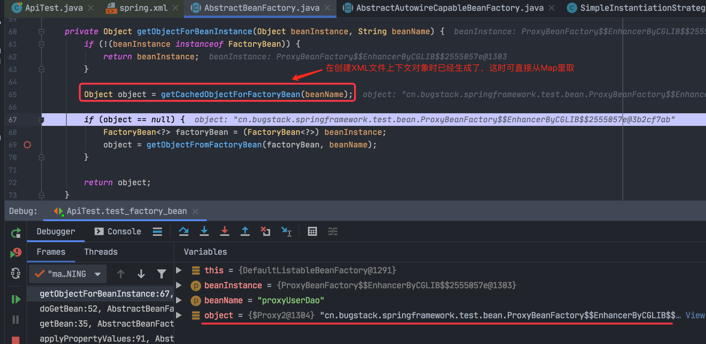

3、然后执行属性填充：

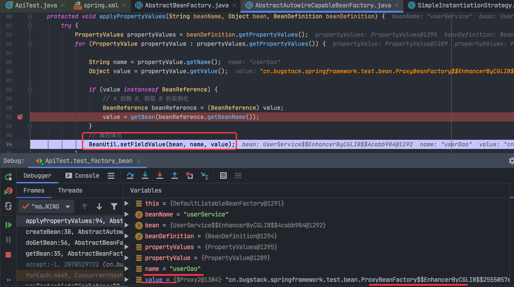

后，则 userService 的userDao 属性就变为了：

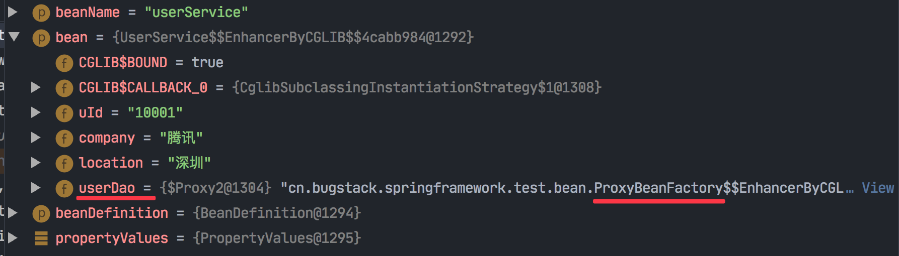

执行前是这个样子的：

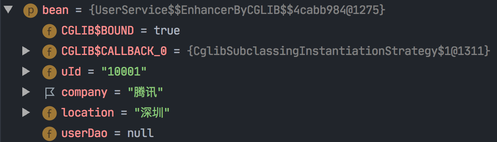

初始化 BeanFactory完后，上下文大概是这样：

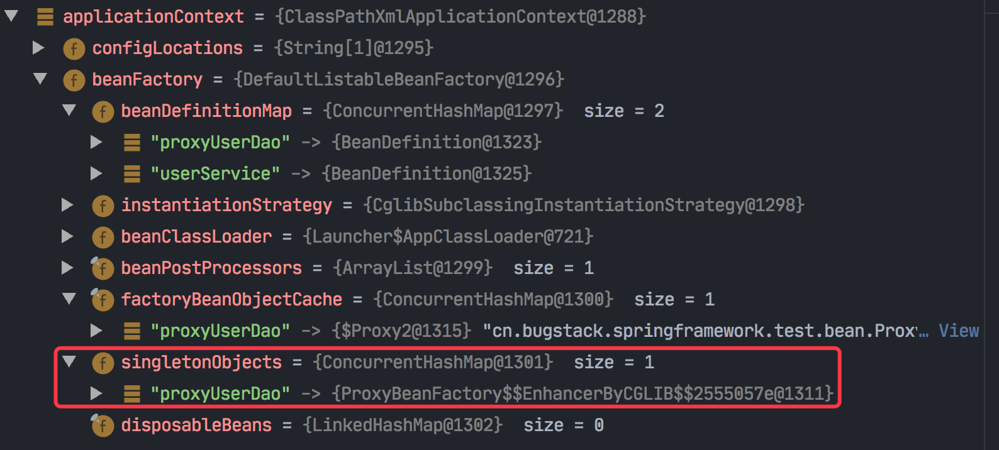

2、调用代理方法：

```java
// 2. 调用代理方法
UserService userService = applicationContext.getBean("userService", UserService.class);
System.out.println("测试结果：" + userService.queryUserInfo());
```

applicationContext.getBean =》..... =》 AbstractBeanFactory#doGetBean

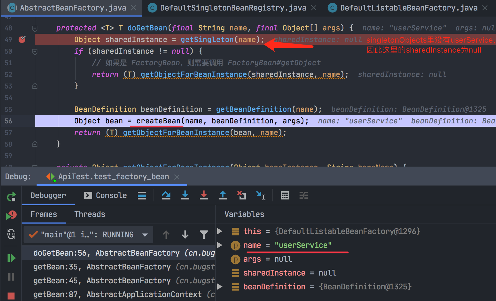

1. 由于userService在配置文件里声明为prototype类型，因此singletonObjects里没有"userService"；

2. 所以会继续走 createBean方法，利用动态代理来创建对象；

3. AbstractAutowireCapableBeanFactory#createBean 会调用applyPropertyValues()方法给bean填充属性；

4. 最后的结果就是：

   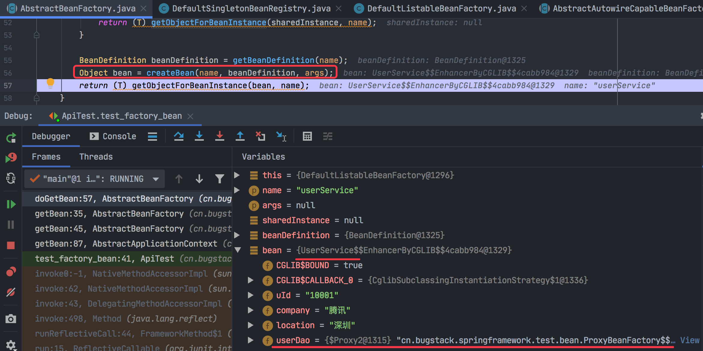

​        userService的userDao属性已经是 ProxyBeanFactory代理对象。

5. 至此，就梳理完了`通过代理对象调用代理方法`的主要流程。

