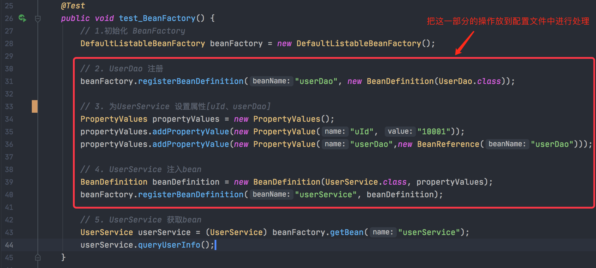
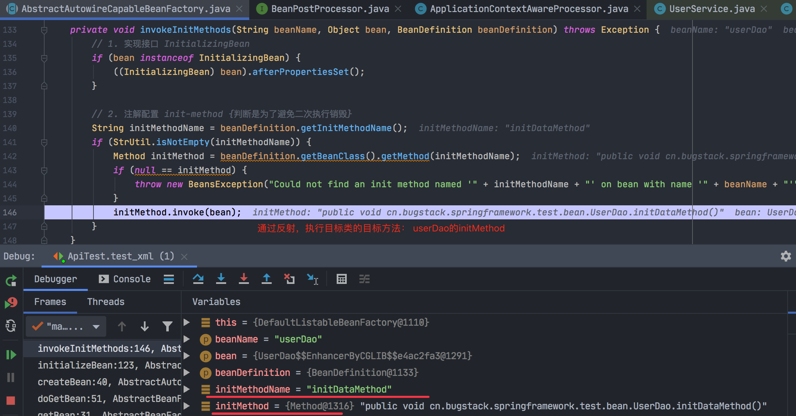
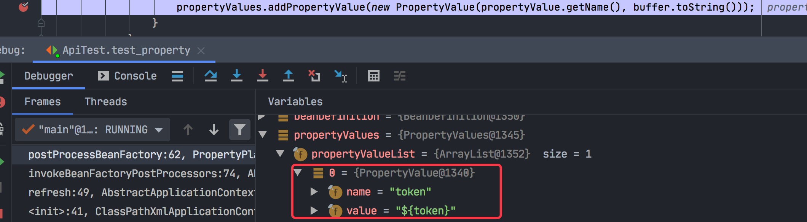

### 目录总结

#### 容器篇：IOC

第01章 - 第11章

#### 代理篇：AOP

第 12 章 - 第 16 章

#### 高级篇：Design


### 第1章：开篇介绍

#### 学习目标


在手写的过程中，会剔除Spring源码中繁杂的内容，摘取整体框架中的核心逻辑，简化代码实现过程，保留核心功能。例如：IOC、AOP、Bean生命周期、上下文、作用域、资源处理等内容实现。

其中：

### [第2章：小试牛刀，实现一个简单的Bean容器](https://github.com/fuzhengwei/small-spring/commit/bd1898fb5e6b9bf05bf1b11b2861d4973f27df97)

一个简单的Spring Bean容器实现，还需要Bean的定义、注册、获取三个基本步骤。

- 定义

  BeanDefinition（中文翻译就是Bean定义）。

  - 什么叫做Bean定义呢？类比对一个人的定义，就是一个人的名字、身高、体重、国籍、身份证号等，这些属性就可以描述一个具体的人。

- 注册

  这个过程就相当于我们把数据存放到HashMap中，只不过现在HashMap存放的是定义了的BeanDefinition对象。

- 获取
  最后就是获取对象，Bean的名字就是key，Spring容器初始化好 Bean 以后，就可以直接获取了。

接下来，我们可以按照这个设计，做一个简单的Spring Bean容器代码实现。详细代码见：/Users/lyf/Workspace/www/small-spring/small-spring-step-01。

### [第3章：初显身手，运用设计模式，实现 Bean 的定义、注册、获取](https://github.com/fuzhengwei/small-spring/commit/b1a0536c71bc29ff828136de0eaca8e4997cd582)

#### 目标

- 这一次我们将 Bean 的创建交给容器，而不是我们在调用的时候传递一个实例化好的 Bean 对象；
  - 首先非常重要的一点是，在 Bean 注册的时候只注册一个类信息，而不会把实例化信息注册到 Spring容器中 。=》这里指的是上一章的单元测试中，Bean 的实例化操作是放在初始化调用阶段传递给 BeanDefinition 构造函数的。(new UserService())
  
    ```java
    // 2.注入bean
    BeanDefinition beanDefinition = new BeanDefinition(new UserService());
    beanFactory.registerBeanDefinition("userService", beanDefinition);
    ```
  
  - 那么就需要修改 BeanDefinition 中的属性 Object 为 Class；
  
  - 接下来需要做的就是在获取 Bean 对象时需要处理 Bean 对象的实例化操作以及判断当前单例对象是否在容器中已经缓存起来了。
- 另外还需要考虑单例对象，在对象的二次获取时是可以从内存中获取的。

Spring Bean容器类关系图：


总结：

1、定义一个BeanFactory 这样一个 Bean工厂，提供Bean的获取方法（getBean），具体的实现由抽象类**AbstractBeanFactory**实现；=》 `模板模式` 的设计方式。

2、**AbstractBeanFactory**同时也继承了DefaultSingletonBeanRegistry（它实现了SingletonBeanRegistry接口，获取单例的方法）。现在**AbstractBeanFactory**就是一个非常完整且强大的抽象类了，也能非常好的体现出它对模板模式的抽象定义。

3、AbstractAutowireCapableBeanFactory继承**AbstractBeanFactory**，实现createBean方法：

- 利用newInstance（反射）创建bean实例；
- 调用addSingleton()方法将bean实例添加到单例对象的缓存中去。

4、**DefaultListableBeanFactory** 是核心实现类：

- 实现了注册bean的方法 - 接口类中定义的方法；
- 实现了获取bean的方法 - 抽象类中定义的方法。

### [第4章：崭露头角，基于Cglib实现含构造函数的类实例化策略](https://github.com/fuzhengwei/small-spring/commit/d54cebf1e3bcca7434082e6f5c437e348a330e9b)

#### 目标

解决上一章中埋下的坑，那是什么坑呢？**其实就是一个 Bean 对象在含有带参数的构造函数时进行实例化的坑。**

发生这一现象的主要原因就是因为 

`beanDefinition.getBeanClass.newInstance();`

实例化方式并没有考虑构造函数的入参。	

#### 设计

填平这个坑的技术设计主要考虑两部分：

- 一个是串流程从哪合理的把构造函数的入参信息传递到实例化操作里；=》在 BeanFactory 里添加 ：

  ```java
  Object getBean(String name, Object ... args)
  ```

  接口，这样可以在获取 Bean 参数时，把构造函数的参数传递进去了。

- 另一个是怎么去实例化含有构造函数的对象。=》用什么方式来创建含有构造函数的 Bean 对象呢？这里有两种方式可以选择：

  - 一个是基于 Java 本身自带的方法，DeclaredConstructor；
  - 另一个是使用 Cglib 来动态创建 Bean 对象。

#### 实现

##### 新增getBean接口

```java
Object getBean(String name, Object... args) throws BeansException;
```

##### 定义实例化策略接口

```java
public interface InstantiationStrategy {
Object instantiate(BeanDefinition beanDefinition, String beanName, Constructor
ctor, Object[] args) throws BeansException;
}
```

##### JDK实例化

```java
public class SimpleInstantiationStrategy implements InstantiationStrategy {

    @Override
    public Object instantiate(BeanDefinition beanDefinition, String beanName, Constructor ctor, Object[] args) throws BeansException {
        Class clazz = beanDefinition.getBeanClass();
        try {
            if (null != ctor) {
                return clazz.getDeclaredConstructor(ctor.getParameterTypes()).newInstance(args);
            } else {
                return clazz.getDeclaredConstructor().newInstance();
            }
        } catch (NoSuchMethodException | InstantiationException | IllegalAccessException | InvocationTargetException e) {
            throw new BeansException("Failed to instantiate [" + clazz.getName() + "]", e);
        }
    }

}
```

##### Cglib实例化

```java
public class CglibSubclassingInstantiationStrategy implements InstantiationStrategy {

    @Override
    public Object instantiate(BeanDefinition beanDefinition, String beanName, Constructor ctor, Object[] args) throws BeansException {
        Enhancer enhancer = new Enhancer();
        enhancer.setSuperclass(beanDefinition.getBeanClass());
        enhancer.setCallback(new NoOp() {
            @Override
            public int hashCode() {
                return super.hashCode();
            }
        });
        if (null == ctor) return enhancer.create();
        return enhancer.create(ctor.getParameterTypes(), args);
    }

}
```

##### 创建策略调用

```java
public abstract class AbstractAutowireCapableBeanFactory extends AbstractBeanFactory {
  private InstantiationStrategy instantiationStrategy = new CglibSubclassingInstantiationStrategy();
  @Override
    protected Object createBean(String beanName, BeanDefinition beanDefinition, Object[] args) throws BeansException {
        Object bean = null;
        try {
            bean = createBeanInstance(beanDefinition, beanName, args);
        } catch (Exception e) {
            throw new BeansException("Instantiation of bean failed", e);
        }

        addSingleton(beanName, bean);
        return bean;
    }

    protected Object createBeanInstance(BeanDefinition beanDefinition, String beanName, Object[] args) {
        Constructor constructorToUse = null;
        Class<?> beanClass = beanDefinition.getBeanClass();
        Constructor<?>[] declaredConstructors = beanClass.getDeclaredConstructors();
        for (Constructor ctor : declaredConstructors) {
            if (null != args && ctor.getParameterTypes().length == args.length) {
                constructorToUse = ctor;
                break;
            }
        }
        // constructorToUse就是那个有参的构造函数=》public cn.bugstack.springframework.test.bean.UserService(java.lang.String)
        return getInstantiationStrategy().instantiate(beanDefinition, beanName, constructorToUse, args);
    }
```

该方法最后会执行 

```java
/**
 * 验证有参构造函数的类实例化
 *
 * @author Liuyongfei
 * @date 2022/1/17 22:54
 */
public class Api2Test {
    @Test
    public void testConstruct() throws Exception {
        // 1、得到 Class对象
        Class<UserService> beanClass = UserService.class;
        // 2、获取该对象的所有的构造函数
        Constructor<?>[] declaredConstructors = beanClass.getDeclaredConstructors();
        // 3、获取第二个构造函数
        Constructor<?> constructor = declaredConstructors[1];
        UserService userService2 = (UserService) constructor.newInstance("张三");
        System.out.println(userService2);
        // 或者下面这种
        // 3、获取第二个构造函数
        Constructor<UserService> declaredConstructor = beanClass.getDeclaredConstructor(constructor.getParameterTypes());
        UserService userService = declaredConstructor.newInstance("小傅哥");
        System.out.println(userService);
    }
}
```


### [第5章：一鸣惊人，为Bean对象注入属性和依赖Bean的功能实现](https://github.com/fuzhengwei/small-spring/commit/0c0e36107d3ca1fafe70b33ab3ad5b5622b1352a)

<u>注入属性和依赖对象</u>

#### 目标

前几章完成了什么？

实现一个容器、Bean的定义、注册Bean、实例化Bean，按照是否包含构造函数实现不同的实例化策略。

那么，在创建对象的时候，我们还缺少什么？
`其实还缺少一个关于类中是否有属性的问题，如果类中包含属性，那么在实例化的时候就需要把属性信息填充上，这样才是一个完整的对象创建。`

#### 新增PropertyValue和PropertyValues两个类

这两个类的作用就是创建出一个用于传递类中属性信息的类，因为属性可能有很多，所以还需要定义一个集合包装一下。

#### BeanReference类

填充属性信息还包括了 Bean的对象类型，也就是需要再定义一个BeanReference，里面其实就是一个简单的Bean名称，在具体的实例化操作时进行递归创建和填充。

=> 填充属性信息不只是 int、Long、String，还包括没有实例化的对象属性（BeanReference），在具体的实例化操作时进行递归创建和填充。

```java
/**
 * 测试-为Bean对象注入属性和依赖Bean的功能实现
 *
 * @author Liuyongfei
 * @date 2022/1/18 10:49
 */
public class Api2Test {
    @Test
    public void test() {
        // 1、初始化 BeanFactory
        DefaultListableBeanFactory beanFactory = new DefaultListableBeanFactory();
        // 2、UserDao注册
        beanFactory.registerBeanDefinition("userDao", new BeanDefinition(UserDao.class));
        // 3、为UserService设置属性值[uId、userDao]
        PropertyValues propertyValues = new PropertyValues();
        propertyValues.addPropertyValue(new PropertyValue("uId", "10001"));
        propertyValues.addPropertyValue(new PropertyValue("userDao", new BeanReference("userDao")));
        // 4、注册UserService
        BeanDefinition beanDefinition = new BeanDefinition(UserService.class, propertyValues);
        beanFactory.registerBeanDefinition("userService", beanDefinition);
        // 5、UserService获取bean
        UserService userService = (UserService) beanFactory.getBean("userService");
        userService.queryUserInfo();
    }
}
```

这一章节比较关键的地方是：

AbstractAutowireCapableBeanFactory#applyPropertyValues：

```java
/**
 * Bean 属性填充
 */
protected void applyPropertyValues(String beanName, Object bean, BeanDefinition beanDefinition) {
    try {
        PropertyValues propertyValues = beanDefinition.getPropertyValues();
        for (PropertyValue propertyValue : propertyValues.getPropertyValues()) {

            String name = propertyValue.getName();
            Object value = propertyValue.getValue();

            if (value instanceof BeanReference) {
                // A 依赖 B，获取 B 的实例化
                BeanReference beanReference = (BeanReference) value;
                value = getBean(beanReference.getBeanName());
            }
            // 属性填充
            BeanUtil.setFieldValue(bean, name, value);
        }
    } catch (Exception e) {
        throw new BeansException("Error setting property values：" + beanName);
    }
}
```

备注:

`如果 value 是  Object ，则要继续调 getBean方法，其实就是递归创建 Bean 和填充属性。`

### [第6章：气吞山河，设计与实现资源加载器，从Spring.xml解析和注册Bean对象](https://github.com/fuzhengwei/small-spring/commit/e740d5fd9ae50c5be884452c28eeccb5c8311750)

<u>资源加载器解析文件注册对象</u> 

#### 目标

在完成 Spring 的框架雏形后，现在我们可以通过单元测试进行手动操作 Bean 对象的定义、注册和属性填充，以及最终获取对象调用方法。

但这里会有一个问题，就是如果使用这个框架，是不太可能让用户通过手动的方式去创建的，而是最好的通过配置文件的方式去简化创建过程。需完成如下操作：



- `我们需要将上面的2、3、4 步骤的操作放在配置文件中进行处理，通过Spring配置文件的方式将Bean对象实例化`；

- `接下来我们就需要在现有的Spring框架中，添加能解决Spring配置的读取、解析、注册Bean的操作`；
- 依照本章节的需求，我们需要在现有的 Spring 框架雏形中添加一个资源解析器，也就是能够读取classpath、本地文件、云文件的配置内容；
- 这些配置内容就像使用Spring时配置的 Spring.xml 一样，里面会包含Bean对象的描述信息和属性信息。
- 在读取配置文件信息后，接下来就是对配置文件中的 Bean 描述信息解析后进行注册操作，把Bean 对象注册到Spring容器中。


主要核心步骤：

##### 三种资源加载器

在 Resource 的资源加载器实现中包括了：ClassPath、系统文件、云配置文件，分别是：ClassPathResource、FileSystemResource、UrlResource。

XmlBeanDefinitionReader类：

```
@Override
    public void loadBeanDefinitions(String location) throws BeansException {
        ResourceLoader resourceLoader = getResourceLoader();
        Resource resource = resourceLoader.getResource(location);
        loadBeanDefinitions(resource);
    }
```


1、使用当前线程所运行的类加载器：Thread.currentThread().getContextClassLoader()


2、将xml文件和程序之间铺设管道，获取io流：

```java
@Override
    public InputStream getInputStream() throws IOException {
        InputStream is = classLoader.getResourceAsStream(path);
        if (is == null) {
            throw new FileNotFoundException(
                    this.path + " cannot be opened because it does not exist");
        }
        return is;
    }
```

3、开始读取xml文件里的元素

借助hutool jar包里的XmlUtil.readXML方法:

```xml
 protected void doLoadBeanDefinitions(InputStream inputStream) throws ClassNotFoundException {
        Document doc = XmlUtil.readXML(inputStream);
        Element root = doc.getDocumentElement();
        NodeList childNodes = root.getChildNodes();
......

}
```

从该方法中，可以得到某个定义的bean的name和BeanDefinition（相关属性值，比如：value，ref......）

4、注册BeanDefinition

```java
getRegistry().registerBeanDefinition(beanName, beanDefinition);
```

5、DefaultListableBeanFactory类中：

```java
private Map<String, BeanDefinition> beanDefinitionMap = new HashMap<>();
@Override
public void registerBeanDefinition(String beanName, BeanDefinition beanDefinition) {
  beanDefinitionMap.put(beanName, beanDefinition);
}
```

可以发现，会将BeanDefinition放入一个Map当中。

最终第3步骤循环多次读取xml文件完毕后，beanFactory里的beanDefinitionMap为：


6、获取bean对象并调用方法

```java
// 3. 获取Bean对象调用方法
UserService userService = beanFactory.getBean("userService", UserService.class);
String result = userService.queryUserInfo();
```

调用getBean方法，

```java
@Override
public <T> T getBean(String name, Class<T> requiredType) throws BeansException {
    return (T) getBean(name);
}
@Override
public Object getBean(String name) throws BeansException {
  return doGetBean(name, null);
}
protected <T> T doGetBean(final String name, final Object[] args) {
  Object bean = getSingleton(name);
  if (bean != null) {
    return (T) bean;
  }
  BeanDefinition beanDefinition = getBeanDefinition(name);
  return (T) createBean(name, beanDefinition, args);
}
```

7、创建bean，AbstractAutowireCapableBeanFactory类：

```java
@Override
protected Object createBean(String beanName, BeanDefinition beanDefinition, Object[] args) throws BeansException {
  Object bean = null;
  try {
    bean = createBeanInstance(beanDefinition, beanName, args);
    // 给 Bean 填充属性 =》如果有类中包含属性那么在实例化的时候就需要把属性信息填充上，这样才是 一个完整的对象创建。
    applyPropertyValues(beanName, bean, beanDefinition);
  } catch (Exception e) {
    throw new BeansException("Instantiation of bean failed", e);
  }
  addSingleton(beanName, bean);
  return bean;
}
protected Object createBeanInstance(BeanDefinition beanDefinition, String beanName, Object[] args) {
  Constructor constructorToUse = null;
  Class<?> beanClass = beanDefinition.getBeanClass();
  // 获取该Class所有的构造函数
  Constructor<?>[] declaredConstructors = beanClass.getDeclaredConstructors();
  for (Constructor ctor : declaredConstructors) {
    if (null != args && ctor.getParameterTypes().length == args.length) {
      constructorToUse = ctor;
      break;
    }
  }
  return getInstantiationStrategy().instantiate(beanDefinition, beanName, constructorToUse, args);
}
```

8、使用Cglib 来动态创建 Bean 对象：

```java
public class CglibSubclassingInstantiationStrategy implements InstantiationStrategy {
    @Override
    public Object instantiate(BeanDefinition beanDefinition, String beanName, Constructor ctor, Object[] args) throws BeansException {
        Enhancer enhancer = new Enhancer();
        enhancer.setSuperclass(beanDefinition.getBeanClass());
        enhancer.setCallback(new NoOp() {
            @Override
            public int hashCode() {
                return super.hashCode();
            }
        });
        if (null == ctor) return enhancer.create();
        return enhancer.create(ctor.getParameterTypes(), args);
    }
}
```

Cglib是一个强大的、高性能的字节码生成库，它用于在运行时扩展Java类和实现接口；

利用ASM开源包，将代理对象的class文件加载进来，通过修改其字节码生成子类来处理；

本质上它是通过动态的生成一个子类去覆盖所要代理的类（非final修改的类和方法）。

#### 充电

动态代理机制：https://zhuanlan.zhihu.com/p/126503023

代码见：blog-demo/test-demo/dynamicproxy。

包括静态代理、JDK动态代理、Cglib动态代理。

`动态代理类与静态代理类最主要的不同是：代理类的字节码不是在程序运行前生成的，而是在程序运行时在虚拟机中生成的。`

##### JDK动态代理

将动态代理生成的字节码文件保存在本地：

-Dsun.misc.ProxyGenerator.saveGeneratedFiles=true


会在项目的根目录下对应的包中生成：


可以看见：

- 代理类继承了Proxy类，主要是为了传递InvocationHandler；

- 该代理类实现了Animal接口，这也是为什么代理类可以直接强转成接口的原因。

##### CGLIB动态代理

CGLIB动态代理的实现机制是生成目标类的子类，通过调用目标类（父类）的方法实现，在调用父类方法时在代理中增强。


可以看见：

- 代理类继承了Cat类。

注意：CGLIB动态代理不能代理final修饰的类和方法。

##### 总结

通过反编译生成的JDK代理类和CGLIB 代理类，我们可以看到两种不同机制的实现：

- JDK动态代理是通过实现目标类的接口，然后将目标类在构造动态代理类时做为参数传入，使代理对象持有目标对象，再通过代理对象的InvocationHandler实现动态代理的操作；
- CGLIB动态代理是通过配置目标类信息，然后利用ASM字节码框架进行生成目标类的子类。当调用代理方法时，通过拦截器的方式实现代理的操作。
- 总的来说，JDK动态代理利用接口实现代理，CGLIB动态代理利用继承的方式实现代理。

### [第7章：所向披靡，实现应用上下文，自动识别、资源加载、扩展机制](https://github.com/fuzhengwei/small-spring/commit/7d1152443a2a226211e318376bfaee7762df2a96)

<u>应用上下文</u>

#### 目标

在对容器中 Bean 的实例化添加扩展机制的同时，还需要把目前关于 Spring.xml 初始化和加载策略进行优化，因为我们不太可能让面向 Spring 本身开发的 DefaultListableBeanFactory 服务，直接给予用户使用，修改点如下：


`我们希望开发的 Spring 上下文操作类，把相应的 XML加载、注册、实例化以及新增的修改和扩展都融合进去，让 Spring 可以自动扫描到我们新增的服务，便于用户使用。`

#### 设计


满足于对 Bean 对象扩展的两个接口，其实也是 Spring 框架中非常具有重量级的两个接口：`BeanFactoryPostProcessor 和 BeanPostProcessor`，也几乎是大家在使用 Spring 框架外新增开发自己组建需求的两个必备接口。

- `BeanFactoryPostProcessor`是由 Spring 框架组建提供的容器扩展机制，允许在 Bean 对象注册后但未实例化之前，对 Bean 的定义信息 BeanDefinition 执行修改操作；
- `BeanPostProcessor` 也是 Spring 提供的扩展机制，不过 BeanPostProcessor 是在 Bean 对象实例化之后修改 Bean 对象，也可以替换 Bean 对象。 这部分与后面要实现的 AOP 切面有密切的联系。


#### 新增了两个重要接口：

- BeanFactoryPostProcessor

- BeanPostProcessor

以后再做一些关于Spring中间件的开发时，如果需要用到Bean对象的获取以及修改一些属性信息，那么就可以使用这两个接口了。

同时 BeanPostProcessor 也是实现 AOP 切面技术的关键所在。

#### 关于应用上下文的实现：XML文件应用上下文

同时还添加了关于应用上下文的实现，ApplicationContext 接口的定义是继承 BeanFactory 外新增加功能的接口，它可以满足于自动识别、资源加载、容器事件、监听器等功能。

主要的几步（可以看本章的单元测试"不使用应用上下文"）：

1. 初始化 BeanFactory；
2. 读取配置文件&注册Bean；
3. BeanDefinition 加载完成和 Bean `实例化`完成之前，修改 BeanDefinition 的属性值；
4. Bean `实例化`之后（执行 Bean 的初始化方法 invokeInitMethods 方法时），修改 Bean 属性信息；
5. 获取 Bean 对象调用方法。

**个人理解**

<u>上下文，个人理解就是封装了我做业务所需要的一些参数，然后暴露一些简单的api方法，让调用者不用关心其内部实现。</u>

#### XML文件应用上下文的具体实现

ClassPathXmlApplicationContext的具体实现，详细看**AbstractApplicationContext#refresh**：

总共干了几件事儿：

##### 1、创建 BeanFactory，并加载BeanDefinition

refreshBeanFactory() =》 创建 BeanFactory（使用DefaultListableBeanFactory），并加载 BeanDefinition（通过XmlBeanDefinitionReader#loadBeanDefinitions从xml中读取配置）：

```java
@Override
protected void loadBeanDefinitions(DefaultListableBeanFactory beanFactory) {
    // 这里new XmlBeanDefinitionReader()的第一个参数是DefaultListableBeanFactory beanFactory
    XmlBeanDefinitionReader beanDefinitionReader = new XmlBeanDefinitionReader(beanFactory, this);
    String[] configLocations = getConfigLocations();
    if (null != configLocations){
        beanDefinitionReader.loadBeanDefinitions(configLocations);
    }
}
```

注意：

`由于这里实例化XmlBeanDefinitionReader时，第一个参数是DefaultListableBeanFactory，因此AbstractBeanDefinitionReader的registry成员变量就是DefaultListableBeanFactory beanFactory`

**因此执行**：

XmlBeanDefinitionReader#doLoadBeanDefinitions 时：

```java
// 注册 BeanDefinition
getRegistry().registerBeanDefinition(beanName, beanDefinition);
```

会将从xml配置文件中读取的bean注册到`DefaultListableBeanFactory的beanDefinitionMap`里去：

```java
private Map<String, BeanDefinition> beanDefinitionMap = new ConcurrentHashMap<>();
```

因此，执行完上面的loadBeanDefinitions()方法后，beanFactory就已经更新为包含了所有bean的beanFactory，如下图：


##### 2、获取 BeanFactory

getBeanFactory()，获取第1步生成的BeanFactory。

配置文件大概如下内容：

```xml
<?xml version="1.0" encoding="UTF-8"?>
<beans>

    <bean id="userDao" class="cn.bugstack.springframework.test.bean.UserDao" init-method="initDataMethod" destroy-method="destroyDataMethod"/>

    <bean id="userService" class="cn.bugstack.springframework.test.bean.UserService">
        <property name="uId" value="10001"/>
        <property name="company" value="腾讯"/>
        <property name="location" value="深圳"/>
        <property name="userDao" ref="userDao"/>
    </bean>

    <bean class="cn.bugstack.springframework.test.common.My2BeanPostProcessor"/>
    <bean class="cn.bugstack.springframework.test.common.My2BeanFactoryPostProcessor"/>
</beans>
```


##### 3、修改bean的属性

1. 在Bean实例化之前，执行 BeanFactoryPostProcessor；

   - 通过beanFactory.getBeansOfType(BeanFactoryPostProcessor.class)获取到属于BeanFactoryPostProcessor类型的所有bean；

   - 遍历这些bean，并执行beanFactoryPostProcessor.postProcessBeanFactory(beanFactory);

   - postProcessBeanFactory的代码为：

     ```java
     @Override
         public void postProcessBeanFactory(ConfigurableListableBeanFactory beanFactory) throws BeansException {
     
             BeanDefinition beanDefinition = beanFactory.getBeanDefinition("userService");
             PropertyValues propertyValues = beanDefinition.getPropertyValues();
     
             propertyValues.addPropertyValue(new PropertyValue("company", "改为：字节跳动"));
         }
     ```

     去修改bean的属性。

##### 4、注册BeanPostProcessor 

需要提前于其他 Bean 对象实例化之前执行注册操作；=》registerBeanPostProcessors(beanFactory);

- registerBeanPostProcessors的代码为：

  ```java
  private void registerBeanPostProcessors(ConfigurableListableBeanFactory beanFactory) {
          Map<String, BeanPostProcessor> beanPostProcessorMap = beanFactory.getBeansOfType(BeanPostProcessor.class);
          for (BeanPostProcessor beanPostProcessor : beanPostProcessorMap.values()) {
              beanFactory.addBeanPostProcessor(beanPostProcessor);
          }
      }
  ```

  执行注册操作。

##### 5、提前实例化单例Bean对象

 beanFactory.preInstantiateSingletons();

```java
@Override
public void preInstantiateSingletons() throws BeansException {
	beanDefinitionMap.keySet().forEach(this::getBean);
}
```

可以看到，这里对beanDefinitionMap进行循环调用getBean方法：


创建Bean对象的主要流程

AbstractBeanFactory#getBean =》 

```java
protected <T> T doGetBean(final String name, final Object[] args) {
        Object bean = getSingleton(name);
        if (bean != null) {
            return (T) bean;
        }
        BeanDefinition beanDefinition = getBeanDefinition(name);
        return (T) createBean(name, beanDefinition, args);
    }
```

AbstractAutowireCapableBeanFactory：

```java
@Override
    protected Object createBean(String beanName, BeanDefinition beanDefinition, Object[] args) throws BeansException {
        Object bean = null;
        try {
            // 使用CGLIB动态代理创建bean
            bean = createBeanInstance(beanDefinition, beanName, args);
            // 给 Bean 填充属性
            applyPropertyValues(beanName, bean, beanDefinition);
            // 执行 Bean 的初始化方法和 BeanPostProcessor 的前置和后置处理方法
            bean = initializeBean(beanName, bean, beanDefinition);
        } catch (Exception e) {
            throw new BeansException("Instantiation of bean failed", e);
        }
        addSingleton(beanName, bean);
        return bean;
    }
```


AbstractAutowireCapableBeanFactory#applyBeanPostProcessorsBeforeInitialization：

```java
@Override
public Object applyBeanPostProcessorsBeforeInitialization(Object existingBean, String beanName) throws BeansException {
    Object result = existingBean;
    for (BeanPostProcessor processor : getBeanPostProcessors()) {
        // 会执行自定义的BeanPostProcessors的postProcessBeforeInitialization方法
        Object current = processor.postProcessBeforeInitialization(result, beanName);
        if (null == current) return result;
        result = current;
    }
    return result;
}
```


MyBeanPostProcessor：

```java
public class MyBeanPostProcessor implements BeanPostProcessor {
    @Override
    public Object postProcessBeforeInitialization(Object bean, String beanName) throws BeansException {
        if ("userService".equals(beanName)) {
            UserService userService = (UserService) bean;
            userService.setLocation("改为：北京");
        }
        return bean;
    }
    @Override
    public Object postProcessAfterInitialization(Object bean, String beanName) throws BeansException {
        return bean;
    }
}
```

从而去修改Bean的属性。

至此，一个XML文件应用上下文创建完成。

##### 充电：Spring的BeanFactoryPostProcessor和BeanPostProcessor

这两个接口，都是Spring初始化bean时对外暴露的扩展点。两个接口的名称看起来相似，但作用及使用场景却不同。

###### BeanFactoryPostProcessor

- 实现BeanFactoryPostProcessor接口，可以在spring的bean创建之前，修改bean的定义属性；
- BeanFactoryPostProcessor是在spring容器加载了bean的定义文件之后，在bean实例化之前执行的。接口方法的入参是 ConfigurableListableBeanFactory，使用该参数，可以获取到相关bean的定义信息。例子：见上文。

###### BeanPostProcessor

- 可以在spring容器实例化bean之后，在执行bean的初始化方法前后，添加一些自己的处理逻辑。

- 这里说的初始化方法，指的是下面两种：
  - bean实现了initializingBean接口，对应的方法为 afterPropertiesSet；
  - 在bean定义的时候，通过init-method设置的方法。

- 注意：BeanPostProcessor是在spring容器加载了bean的定义文件并且实例化bean之后执行的。BeanPostProcessor的执行顺序是在BeanFactoryPostProcessor之后。

### [第8章：龙行有风，向虚拟机注册钩子，实现Bean对象的初始化和销毁方法](https://github.com/fuzhengwei/small-spring/commit/4b454a911107dd32b3abeec83023974f40d08864)

<u>初始化和销毁方法</u> 

#### 目标

当我们的类创建的 Bean 对象交给 Spring 容器管理以后，这个类对象就可以被赋予更多的使用能力。就像我们在上一章节中已经给类对象添加了修改注册 Bean 定义未实例化前的属性信息修改和实例化过程中的前置和后置处理，这些额外能力的实现，都可以让我们对现有工程中的类对象做相应的扩展处理。

那么除此之外我们还希望可以在 Bean 初始化过程，执行一些操作。比如，帮我们做一些数据的加载执行，例如：在 Web 程序关闭时执行链接断开、内存销毁等操作。

如果说没有Spring，我们也可以通过构造函数、静态方法以及手动调用的方式实现，但这样的方式终究不如把诸如此类的操作都交给 Spring 容器来管理更加合适。 因此你会看到 spring.xml 中有如下操作：


`需要满足用户可以在 xml 中配置初始化和销毁的方法，也可以通过实现类的方式处理，比如我们在使用 Spring 时用到的 InitializingBean、DisposableBean 两个接口。`

只不过一个是接口方法的直接调用，另外一个是在配置文件中读取到方法反射调用。

在 spring.xml 配置中添加 init-method、destory-method 两个注解，在配置文件加载的过程中，把注解配置一并定义到 BeanDefinition 的属性当中。这样在 initializeBean 初始化操作的工程中，就可以`通过反射的方式来调用配置在 Bean 定义属性当中的方法信息了。`

另外如果是接口实现的方式，那么直接可以通过 Bean 对象调用对应接口定义的方法即可，`((InitializingBean).bean).afterPropertiesSet()`，两种方式达到的效果是一样的。

`这里还有一段适配器的使用，因为反射调用和接口直接调用，是两种方式，所以需要使用适配器进行包装。`


#### 注册

```java
// 1.初始化 BeanFactory
ClassPathXmlApplicationContext applicationContext = new ClassPathXmlApplicationContext("classpath:spring.xml");
```

##### 第一步

创建XML文件应用上下文：AbstractApplicationContext#refresh中的第5步：提前实例化单例Bean对象。

##### 第二步

AbstractBeanFactory#getBean  =》AbstractBeanFactory#doGetBean =》 AbstractAutowireCapableBeanFactory#createBean：

```java
 @Override
    protected Object createBean(String beanName, BeanDefinition beanDefinition, Object[] args) throws BeansException {
        Object bean = null;
        try {
            bean = createBeanInstance(beanDefinition, beanName, args);
            // 给 Bean 填充属性
            applyPropertyValues(beanName, bean, beanDefinition);
            // 执行 Bean 的初始化方法和 BeanPostProcessor 的前置和后置处理方法
            bean = initializeBean(beanName, bean, beanDefinition);
        } catch (Exception e) {
            throw new BeansException("Instantiation of bean failed", e);
        }
        // 注册实现了 DisposableBean 接口的 Bean 对象
        registerDisposableBeanIfNecessary(beanName, bean, beanDefinition);
        addSingleton(beanName, bean);
        return bean;
    }
```

##### 第三步

```java
private Object initializeBean(String beanName, Object bean, BeanDefinition beanDefinition) {
        // 1. 执行 BeanPostProcessor Before 处理
        Object wrappedBean = applyBeanPostProcessorsBeforeInitialization(bean, beanName);
        // 执行 Bean 对象的初始化方法
        try {
            invokeInitMethods(beanName, wrappedBean, beanDefinition);
        } catch (Exception e) {
            throw new BeansException("Invocation of init method of bean[" + beanName + "] failed", e);
        }
        // 2. 执行 BeanPostProcessor After 处理
        wrappedBean = applyBeanPostProcessorsAfterInitialization(wrappedBean, beanName);
        return wrappedBean;
    }
```

##### 第四步

```java
private void invokeInitMethods(String beanName, Object bean, BeanDefinition beanDefinition) throws Exception {
        // 1. 实现接口 InitializingBean
        // 判断该bean是否实现了InitializingBean接口
        if (bean instanceof InitializingBean) {
             // 直接调用afterPropertiesSet()方法
            ((InitializingBean) bean).afterPropertiesSet();
        }
        // 2. 注解配置 init-method {判断是为了避免二次执行销毁}
        String initMethodName = beanDefinition.getInitMethodName();
        // 判断是否配置了init-method方法
        if (StrUtil.isNotEmpty(initMethodName)) {
            Method initMethod = beanDefinition.getBeanClass().getMethod(initMethodName);
            if (null == initMethod) {
                throw new BeansException("Could not find an init method named '" + initMethodName + "' on bean with name '" + beanName + "'");
            }
          	// 关键的一步
            initMethod.invoke(bean);
        }
    }
```

1》实现接口 InitializingBean

((InitializingBean) bean).afterPropertiesSet()会执行bean的afterPropertiesSet方法：

```java
@Override
public void afterPropertiesSet() throws Exception {
  System.out.println("执行：UserService.afterPropertiesSet");
}
```


##### 第五步

initMethod.invoke(bean);

就会去执行userDao#initDataMethod：

```java
public void initDataMethod(){
        System.out.println("执行：init-method");
        hashMap.put("10001", "小傅哥");
        hashMap.put("10002", "八杯水");
        hashMap.put("10003", "阿毛");
    }
```


```java
applicationContext.registerShutdownHook();
```

#### 销毁

```java
applicationContext.registerShutdownHook();
```

##### 第一步：

```java
@Override
    public void registerShutdownHook() {
        Runtime.getRuntime().addShutdownHook(new Thread(this::close));
    }
```

##### 第二步：

```java
@Override
    public void close() {
        getBeanFactory().destroySingletons();
    }
```

##### 第三步：

DefaultSingletonBeanRegistry#destroySingletons：

```java
public void destroySingletons() {
        Set<String> keySet = this.disposableBeans.keySet();
        Object[] disposableBeanNames = keySet.toArray();
        
        for (int i = disposableBeanNames.length - 1; i >= 0; i--) {
            Object beanName = disposableBeanNames[i];
            DisposableBean disposableBean = disposableBeans.remove(beanName);
            try {
                disposableBean.destroy();
            } catch (Exception e) {
                throw new BeansException("Destroy method on bean with name '" + beanName + "' threw an exception", e);
            }
        }
    }
```

##### 第四步：

DisposableBeanAdapter#destroy：

```java
@Override
    public void destroy() throws Exception {
        // 1. 实现接口 DisposableBean
        if (bean instanceof DisposableBean) {
            ((DisposableBean) bean).destroy();
        }
        // 2. 注解配置 destroy-method {判断是为了避免二次执行销毁}
        if (StrUtil.isNotEmpty(destroyMethodName) && !(bean instanceof DisposableBean && "destroy".equals(this.destroyMethodName))) {
            Method destroyMethod = bean.getClass().getMethod(destroyMethodName);
            if (null == destroyMethod) {
                throw new BeansException("Couldn't find a destroy method named '" + destroyMethodName + "' on bean with name '" + beanName + "'");
            }
            // 关键的一步
            destroyMethod.invoke(bean);
        }
        
    }
```


##### 第五步：

destroyMethod.invoke(bean) 会执行 UserDao#destroyDataMethod：

```java
public void destroyDataMethod(){
    System.out.println("执行：destroy-method");
    hashMap.clear();
}
```

##### 执行结果：

```bash
执行：init-method
执行：UserService.afterPropertiesSet
测试结果：小傅哥,腾讯,深圳
执行：UserService.destroy
执行：destroy-method
```

#### 充电

##### spring中InitializingBean接口使用理解

- InitializingBean接口为bean提供了初始化的方式，它只包括afterPropertiesSet方法；

- 凡是继承该接口的类，在初始化bean的时候会自动执行afterPropertiesSet方法。

##### 问题

实现InitializingBean接口，与在配置文件中指定init-method方法有什么不同？

1、配置文件

```xml
<bean id="testInitializingBean" class="com.TestInitializingBean" init-method="testInit"></bean>
```

在配置文件中加入init-method="testInit"。

2、TestInitializingBean：

```java
import org.springframework.beans.factory.InitializingBean;
public class TestInitializingBean implements InitializingBean{
    @Override
    public void afterPropertiesSet() throws Exception {
        System.out.println("ceshi InitializingBean");        
    }
    public void testInit(){
        System.out.println("ceshi init-method");        
    }
}
```

3、Main程序：

```java
public class Main {
    public static void main(String[] args){
        ApplicationContext context = new FileSystemXmlApplicationContext("/src/main/java/com/beans.xml");
    }
}
```

4、运行结果：

```bash
ceshi InitializingBean
ceshi init-method
```

这说明：

- 在spring初始化bean的时候，如果bean实现了InitializingBean接口，会自动调用afterPropertiesSet方法;
- 先调用afterPropertiesSet方法，然后在调用init-method中指定的方法。

##### 总结

spring为bean提供了两种初始化bean的方式，实现InitializingBean接口，实现afterPropertiesSet方法；或者在配置文件中通过init-method指定，两种方式可以同时使用。

### [第9章：虎行有雨，定义标记类型Aware接口，实现感知容器对象](https://github.com/fuzhengwei/small-spring/commit/74704fef6884167be6cfadf5bcf41e5961068896)

<u>Aware 感知容器对象</u> 

#### 目标

本章节希望`在Spring容器中提供一种能感知容器操作的接口，如果谁实现了这样的一个接口，就可以获取接口入参中的各种能力。`

#### 设计

如果说我希望拿到 Spring 框架中一些提供的资源，那么：

- 首先需要考虑以一个什么方式去获取；
- 之后你定义出来的获取方式，在 Spring 框架中该怎么去承接？

实现了这两项内容，就可以扩展出你需要的一些属于 Spring 框架本身的能力了。

**定义接口 Aware，在 Spring框架中它是一种感知标记性接口，具体的子类定义和实现能感知容器中的相关对象。也就是通过这个桥梁，向具体的实现类中提供容器服务。**

继承 Aware 的接口包括：BeanFactroyAware、BeanClassLoaderAware、BeanNameAware 和 ApplicationContextAware，当然在 Spring 源码中还有一些其 他关于注解的，不过目前我们还是用不到。

所以，在 AbstractApplicationContext 的具体实现中会用 到向 beanFactory 添加 BeanPostProcessor 内容的 ApplicationContextAwareProcessor 操作，最后由 AbstractAutowireCapableBeanFactory 创建 createBean 时处理相应的调用操作。 

1、AbstractAutowireCapableBeanFactory#initializeBean方法中新增：

```java
// invokeAwareMethods
if (bean instanceof Aware) {
  if (bean instanceof BeanFactoryAware) {
    ((BeanFactoryAware) bean).setBeanFactory(this);
  }
  if (bean instanceof BeanClassLoaderAware){
    ((BeanClassLoaderAware) bean).setBeanClassLoader(getBeanClassLoader());
  }
  if (bean instanceof BeanNameAware) {
    ((BeanNameAware) bean).setBeanName(beanName);
  }
}
```

2、AbstractApplicationContext#refresh方法中添加 ApplicationContextAwareProcessor

让继承自 ApplicationContextAware 的 Bean 对象都能感知所属的 ApplicationContext：

```java
// 注意：这里的 this 就是 ClassPathXmlApplicationContext
beanFactory.addBeanPostProcessor(new ApplicationContextAwareProcessor(this));
```

解释：

- **这里的 this 就是 ClassPathXmlApplicationContext**

- ApplicationContextAwareProcessor 又实现了BeanPostProcessor接口；

- addBeanPostProcessor()方法将当前的这个BeanPostProcessor添加到List当中去：

  ```java
  private final List<BeanPostProcessor> beanPostProcessors = new ArrayList<BeanPostProcessor>();
  ```


执行结果：

```bash
执行：init-method 
ClassLoader：sun.misc.Launcher$AppClassLoader@18b4aac2
Bean Name is：userService
测试结果：小傅哥,腾讯,深圳
ApplicationContextAware：cn.bugstack.springframework.context.support.ClassPathXmlApplicationContext@143640d5
BeanFactoryAware：cn.bugstack.springframework.beans.factory.support.DefaultListableBeanFactory@6295d394
执行：destroy-method
```

其中执行结果对应代码：

第一行对应：   =》AbstractAutowireCapableBeanFactory#initializeBean -》invokeInitMethods()，执行目标类的initDataMethod方法；

**循环创建 bean，**
**第一次是 beanName: "userDao" ，由于 UserDao 不是 Aware，所以不走 Aware 的代码判断逻辑，而是会执行：**

**invokeInitMethods(beanName, wrappedBean, beanDefinition)：**



执行目标类的目标方法：


第二行对应：   =》AbstractAutowireCapableBeanFactory#initializeBean -》((BeanClassLoaderAware) bean).setBeanClassLoader(getBeanClassLoader());

beanName 是 "userService"，在执行 AbstractAutowireCapableBeanFactory#createBean =》 applyPropertyValues：

```java
/**
     * Bean 属性填充
     */
    protected void applyPropertyValues(String beanName, Object bean, BeanDefinition beanDefinition) {
        try {
            PropertyValues propertyValues = beanDefinition.getPropertyValues();
            for (PropertyValue propertyValue : propertyValues.getPropertyValues()) {
								
                String name = propertyValue.getName();
                Object value = propertyValue.getValue();
								// ******由于 userService的属性 userDao 属于 BeanReference，
                if (value instanceof BeanReference) {
                    // A 依赖 B，获取 B 的实例化
                    BeanReference beanReference = (BeanReference) value;
                    // ******因此，这里会再次调用getBean方法(这个地方也就是 Bean 循环依赖)
                    value = getBean(beanReference.getBeanName());
                }
                // 属性填充
                BeanUtil.setFieldValue(bean, name, value);
            }
        } catch (Exception e) {
            throw new BeansException("Error setting property values：" + beanName);
        }
    }
```

接着看 AbstractBeanFactory#getBean 方法：

```java
@Override
public Object getBean(String name) throws BeansException {
  return doGetBean(name, null);
}
protected <T> T doGetBean(final String name, final Object[] args) {
  // ******getSingleton方法会从 singletonObjects 这个 HashMap 里取
  // ****** 由于在第一次循环的时候， beanName是"userDao"时，创建完 bean 就把该 bean 放在singletonObjects里了。
  // ****** 因此，这里直接就能从 HashMap 里获取到 bean了。
  Object bean = getSingleton(name);
  if (bean != null) {
    return (T) bean;  // 直接返回 bean
  }

  BeanDefinition beanDefinition = getBeanDefinition(name);
  return (T) createBean(name, beanDefinition, args);
}
```

属性填充完后，回到上层，接着执行 Bean 的初始化方法和 BeanPostProcessor 的前置和后置处理方法：

AbstractAutowireCapableBeanFactory：

```java
 // 执行 Bean 的初始化方法和 BeanPostProcessor 的前置和后置处理方法
 bean = initializeBean(beanName, bean, beanDefinition);
 
 
 // invokeAwareMethods
if (bean instanceof Aware) {
  if (bean instanceof BeanFactoryAware) {
    ((BeanFactoryAware) bean).setBeanFactory(this);
  }
  if (bean instanceof BeanClassLoaderAware){
    // 执行 setBeanClassLoader 方法
    ((BeanClassLoaderAware) bean).setBeanClassLoader(getBeanClassLoader());
  }
  if (bean instanceof BeanNameAware) {
    ((BeanNameAware) bean).setBeanName(beanName);
  }
}
```

由于 UserService 实现了 BeanNameAware、BeanClassLoaderAware、ApplicationContextAware、BeanFactoryAware，因此会执行这里的关于 Aware 判断逻辑。

其中：

在执行 setBeanClassLoader 方法时，其实就是直接执行 UserService #setBeanClassLoader 方法：

```java
@Override
public void setBeanClassLoader(ClassLoader classLoader) {
  System.out.println("ClassLoader：" + classLoader);
}
```

因此会输出：

```bash
ClassLoader：sun.misc.Launcher$AppClassLoader@18b4aac2
```

在执行 setBean 方法时，其实就是直接执行 UserService #setBeanName 方法：

```java
@Override
public void setBeanName(String name) {
  System.out.println("Bean Name is：" + name);
}
```

因此会输出：

```java
Bean Name is：userService
```

接着执行：

```java
// 1. 执行 BeanPostProcessor Before 处理
Object wrappedBean = applyBeanPostProcessorsBeforeInitialization(bean, beanName);
```

AbstractAutowireCapableBeanFactory：

```java
@Override
public Object applyBeanPostProcessorsBeforeInitialization(Object existingBean, String beanName) throws BeansException {
  Object result = existingBean;
  for (BeanPostProcessor processor : getBeanPostProcessors()) {
    // 会直接执行 ApplicationContextAwareProcessor#postProcessBeforeInitialization
    Object current = processor.postProcessBeforeInitialization(result, beanName);
    if (null == current) return result;
    result = current;
  }
  return result;
}
```

ApplicationContextAwareProcessor#postProcessBeforeInitialization：

```java
@Override
public Object postProcessBeforeInitialization(Object bean, String beanName) throws BeansException {
    if (bean instanceof ApplicationContextAware){
        // 会给 userService的 applicationContext 属性赋值(也就是 ClassPathXmlApplicationContext)   ===》思考：ApplicationContextAwareProcessor里的applicationContext 是什么时候赋值为 ClassPathXmlApplicationContext？
        ((ApplicationContextAware) bean).setApplicationContext(applicationContext);
    }
    return bean;
}
```

截至到此，执行完 这行代码：

```java
// 1.初始化 BeanFactory
ClassPathXmlApplicationContext applicationContext = new ClassPathXmlApplicationContext("classpath:spring.xml");
```

输出为：

```bash
执行：init-method
ClassLoader：sun.misc.Launcher$AppClassLoader@18b4aac2
Bean Name is：userService

```

##### 总结

从测试结果可以看到，本章节新增加的 感知接口对应的具体实现（BeanNameAware、BeanClassLoaderAware、ApplicationContextAware、BeanFactoryAware），已经可以如期输出结果了。

`在 UserService里实现了setBeanName、setBeanClassLoader、setApplicationContext、setBeanFactory 方法。在初始化Bean（initializeBean方法）里添加 Aware的判断逻辑`

##### 疑问解答：什么时候赋值为 ClassPathXmlApplicationContext

这里的applicationContext就是在：

```java
// 添加 ApplicationContextAwareProcessor，让继承自 ApplicationContextAware 的 Bean 对象都能感知所属的 ApplicationContext
// new ApplicationContextAwareProcessor(this) 就是个 BeanPostProcessor
// 然后它的 applicationContext 变量就被赋值为 ClassPathXmlApplicationContext =》 下边给ApplicationContextAware类型的bean setApplicationContext的时候会使用到。
beanFactory.addBeanPostProcessor(new ApplicationContextAwareProcessor(this));
```

这里设置的ClassPathXmlApplicationContext：


然后它的 applicationContext 变量就被赋值为 ClassPathXmlApplicationContext （ 下边给`ApplicationContextAware`类型的bean setApplicationContext的时候会使用到。）

```java
// 执行 BeanPostProcessor Before 处理
Object wrappedBean = applyBeanPostProcessorsBeforeInitialization(bean, beanName);
@Override
    public Object applyBeanPostProcessorsBeforeInitialization(Object existingBean, String beanName) throws BeansException {
        Object result = existingBean;
        for (BeanPostProcessor processor : getBeanPostProcessors()) {
            Object current = processor.postProcessBeforeInitialization(result, beanName);
            if (null == current) return result;
            result = current;
        }
        return result;
    }
```


#### RunTime.getRunTime().addShutdownHook用法

这个方法的意思就是在jvm中增加一个关闭的钩子。

- 当jvm关闭的时候，会执行系统中已经设置的所有通过addShutdownHook添加的钩子，当系统执行完这些钩子后，jvm才会关闭。
- 所以这些钩子可以在jvm关闭的时候进行内存清理、对象销毁等操作。

```java
/**
 * 测试 Runtime.getRuntime().addShutdownHook 钩子函数
 *
 * @author Liuyongfei
 * @date 2022/1/31 18:29
 */
public class RunTimeTest {
    public static void main(String[] args) {
        Thread threada = new Thread(() -> {
            System.out.println("thread a ....");
        },"a");
        Thread threadb = new Thread(() -> {
            System.out.println("thread b ....");
        },"b");
        Thread threadShutdown = new Thread(() -> {
            System.out.println("shutdown thread ....");
        },"c");
        Runtime.getRuntime().addShutdownHook(threadShutdown);
        threada.start();
        threadb.start();
    }
}
```

```bash
thread a ....
thread b ....
shutdown thread ....
```

结论：

无论是先打印 thread a,，还是thread b，shutdown thread 都是最后打印的（因为这个线程是在jvm执行关闭前才会执行）

#### 销毁

#### 注册实现了DisposableBean接口的 Bean 对象

在 AbstractAutowireCapableBeanFactory#createBean的时候，有一步：

```java
// 注册实现了 DisposableBean 接口的 Bean 对象
registerDisposableBeanIfNecessary(beanName, bean, beanDefinition);
protected void registerDisposableBeanIfNecessary(String beanName, Object bean, BeanDefinition beanDefinition) {
        if (bean instanceof DisposableBean || StrUtil.isNotEmpty(beanDefinition.getDestroyMethodName())) {
            registerDisposableBean(beanName, new DisposableBeanAdapter(bean, beanName, beanDefinition));
        }
    }
```

这里会判断如果是 DisposableBean，并且beanDefinition有destory-method，则将该 bean 添加到 disposableBeans里去（HashMap）。

#### 使用关闭钩子Runtime.getRuntime().addShutdownHook

```java
 // 1.初始化 BeanFactory
ClassPathXmlApplicationContext applicationContext = new ClassPathXmlApplicationContext("classpath:spring.xml");
applicationContext.registerShutdownHook();
```

AbstractApplicationContext类：

```java
@Override
public void registerShutdownHook() {
    Runtime.getRuntime().addShutdownHook(new Thread(this::close));
}
@Override
public void close() {
    getBeanFactory().destroySingletons();
}
```

destroySingletons()方法会循环disposableBeans，执行DisposableBeanAdapter#destroy方法：

```java
@Override
    public void destroy() throws Exception {
        // 1. 实现接口 DisposableBean
        if (bean instanceof DisposableBean) {
            ((DisposableBean) bean).destroy();
        }
        // 2. 注解配置 destroy-method {判断是为了避免二次执行销毁}
        if (StrUtil.isNotEmpty(destroyMethodName) && !(bean instanceof DisposableBean && "destroy".equals(this.destroyMethodName))) {
            Method destroyMethod = bean.getClass().getMethod(destroyMethodName);
            if (null == destroyMethod) {
                throw new BeansException("Couldn't find a destroy method named '" + destroyMethodName + "' on bean with name '" + beanName + "'");
            }
            destroyMethod.invoke(bean);
        }
        
    }
```

UserService：

```java
public class UserService implements InitializingBean, DisposableBean {
    private String uId;
    private String company;
    private String location;
    private UserDao userDao;
    @Override
    public void destroy() throws Exception {
        System.out.println("执行：UserService.destroy");
    }
    ......
```
执行small-spring-step-07的ApiTest#test_xml()方法：
```java
执行：init-method
执行：UserService.afterPropertiesSet
测试结果2：小傅哥,腾讯,深圳
执行：UserService.destroy
执行：destroy-method
```
会在jvm关闭之前输出：
```bash
执行：UserService.destroy
执行：destroy-method
```
#### 到目前为止Bean对象的生命周期
目前为止，关于Spring框架的实现中，某些功能点已经越来趋向于完整，尤其是 Bean 对象的生命周期，已经有了很多的体现。整体总结如下图：

### [第10章：横刀跃马，关于Bean对象作用域以及FactoryBean的实现和使用](https://github.com/fuzhengwei/small-spring/commit/8f9bdfbf87b881f7575ac96b445505009cedae8a)
#### 目标
> 1、在集合Spring框架下，我们使用的Mybatis框架中，它的核心作用是可以满足用户不需要实现Dao接口类，就可以通过xml或注解配置的方式完成对数据库执行CRUD操作。
>
> 2、那么在实现这样的ORM框架中，是怎么把一个数据库操作的bean对象交给Spring管理的呢？
>
> 3、因为我们在使用Spring、Mybatis框架的时候都可以知道，并没有手动的去创建任何操作数据库的Bean对象，有的仅仅是一个接口定义，而这个接口定义竟然可以被注入到其他需要使用Dao的属性中去了。
> **那么这一过程最核心待解决的问题，就是需要完成把复杂且以代理方式动态变化的对象，注册到Spring容器中。**
> 而为了满足这样的一个扩展组件开发的需求，就需要我们在现有手写的Spring框架中，添加这一能力。
> 原来的链条是：
> AbstractBeanFactory =》DefaultSingletonBeanRegistry，
> 现在是：
> AbstractBeanFactory =》 FactoryBeanRegistrySupport（主要是处理关于FactoryBean注册的支撑操作） =》DefaultSingletonBeanRegistry
> **FactoryBeanRegistrySupport**类主要处理的就是关于FactoryBean 此类对象的注册操作。

**与上一章的不同之处是：**

1. 这个章节我们删掉了 UserDao，定义了一个 IUserDao 接口，之所以这样做是为了通过 FactoryBean 做一个自定义对象的代理操作。

2. 将 UserService的 userDao 属性由 

   ```java
   private UserDao userDao
   ```

​       改为了:

```java
   private IUserDao userDao
```
`后面我们会给这个属性注入代理对象。`

#### 单元测试代理对象

```java
@Test
public void test_factory_bean() {
    // 1.初始化 BeanFactory
    ClassPathXmlApplicationContext applicationContext = new ClassPathXmlApplicationContext("classpath:spring.xml");
    applicationContext.registerShutdownHook();
    // 2. 调用代理方法
    UserService userService = applicationContext.getBean("userService", UserService.class);
    System.out.println("测试结果：" + userService.queryUserInfo());
}

```


也就是说通过getBean方法拿到的userService，它的userDao属性就已经是ProxyBeanFactory代理对象了。


可以看到，这里的userDao 就是 ProxyBeanFactory，在执行queryUserName()方法时，就会执行代理对象的功能。=》`为什么就会执行ProxyBeanFactory的getObject方法呢？`

1、spring.xml：

```xml
<bean id="userService" class="cn.bugstack.springframework.test.bean.UserService" scope="prototype">
        <property name="uId" value="10001"/>
        <property name="company" value="腾讯"/>
        <property name="location" value="深圳"/>
        <property name="userDao" ref="proxyUserDao"/>
</bean>

<bean id="proxyUserDao" class="cn.bugstack.springframework.test.bean.ProxyBeanFactory"/>

```


2、执行：

AbstractBeanFactory.getBean#  =》doGetBean# =》getObjectForBeanInstance# =》 getObjectFromFactoryBean# =》doGetObjectFromFactoryBean#：

```java
protected <T> T doGetBean(final String name, final Object[] args) {
        // name = proxyUserDao，已经在实例化 xml文件应用上下文的时候创建过了
        Object sharedInstance = getSingleton(name); 
        if (sharedInstance != null) {
            // 如果是 FactoryBean，则需要调用 FactoryBean#getObject
            return (T) getObjectForBeanInstance(sharedInstance, name);
        }
  ......

```


所以会执行 getObjectForBeanInstance方法。


3、由于在xml文件应用上下文创建的时候，"proxyUserDao"这个bean已经放到了 factoryBeanObjectCache 这个Map里去，所以这里object不为空，会直接返回object。

3.1

```java
// 1.初始化 BeanFactory
ClassPathXmlApplicationContext applicationContext = new ClassPathXmlApplicationContext("classpath:spring.xml");

```

时，会执行AbstractBeanFactory#doGetBean：

3.2 当 name = "proxyUserDao"时：


3.3 AbstractBeanFactory#getObjectForBeanInstance：


3.4 调用getObject方法


3.5 ProxyBeanFactory.getObject#：

```java
public class ProxyBeanFactory implements FactoryBean<IUserDao> {

    @Override
    public IUserDao getObject() throws Exception {
        InvocationHandler handler = (proxy, method, args) -> {

            // 添加排除方法
            if ("toString".equals(method.getName())) return this.toString();
            
            Map<String, String> hashMap = new HashMap<>();
            hashMap.put("10001", "小傅哥");
            hashMap.put("10002", "八杯水");
            hashMap.put("10003", "阿毛");
            
            return "你被代理了 " + method.getName() + "：" + hashMap.get(args[0].toString());
        };
        return (IUserDao) Proxy.newProxyInstance(Thread.currentThread().getContextClassLoader(), new Class[]{IUserDao.class}, handler);
    }
   ......
}

```

#### 总结

也就是说这里 通过 ProxyBeanFactory 对象调用它的getObject方法生成 UserDao 的动态代理类，做为userService 这个bean的userDao属性值；

当单元测试类里执行：

```java
public String queryUserInfo() {
    return userDao.queryUserName(uId) + "," + company + "," + location;
}

```

时，会直接取执行"代理对象处理器"，即getObject里的这段hander代码逻辑（**为了理解的更形象，可以看blog-demo/dynamicproxy的单元测试类Test#testJdkDynamicProxy方法**）：

1. method.getName()  =》 "queryUserName";
2. args[0] = 10001;
3. hashMap.get(args[0].toString()) = "小傅哥";
4. 因此 handler返回的字符串是：你被代理了 queryUserName：小傅哥;
5. 因此queryUserInfo方法返回的结果是：你被代理了 queryUserName：小傅哥,腾讯,深圳。

----------

**充电**：第6步"提前实例化单例Bean"对象是什么意思？


执行完第6步骤：

```java
// 6. 提前实例化单例Bean对象
beanFactory.preInstantiateSingletons();

```

后：


可见：

1. 会将配置文件里定义的单例Bean对象实例化后，放入HashMap中去；
2. 且proxyUserDao这个bean 就是代理对象 ProxyBeanFactory。


##### 梳理 userService的userDao属性是怎么变为ProxyBeanFactory的主要流程

```java
// 1.初始化 BeanFactory
ClassPathXmlApplicationContext applicationContext = new ClassPathXmlApplicationContext("classpath:spring.xml");

```


1、Bean属性填充：AbstractAutowireCapableBeanFactory#applyPropertyValues


2、

```java
protected <T> T doGetBean(final String name, final Object[] args) {
    Object sharedInstance = getSingleton(name);
    if (sharedInstance != null) {
        // 如果是 FactoryBean，则需要调用 FactoryBean#getObject
        return (T) getObjectForBeanInstance(sharedInstance, name);
    }

    BeanDefinition beanDefinition = getBeanDefinition(name);
    Object bean = createBean(name, beanDefinition, args);
    return (T) getObjectForBeanInstance(bean, name);
}

```


3、然后执行属性填充：


后，则 userService 的userDao 属性就变为了：


执行前是这个样子的：


初始化 BeanFactory完后，上下文大概是这样：


2、调用代理方法：

```java
// 2. 调用代理方法
UserService userService = applicationContext.getBean("userService", UserService.class);
System.out.println("测试结果：" + userService.queryUserInfo());

```

applicationContext.getBean =》..... =》 AbstractBeanFactory#doGetBean


1. 由于userService在配置文件里声明为prototype类型，因此singletonObjects里没有"userService"；

2. 所以会继续走 createBean方法，利用动态代理来创建对象；

3. AbstractAutowireCapableBeanFactory#createBean 会调用applyPropertyValues()方法给bean填充属性；

4. 最后的结果就是：

   

        userService的userDao属性已经是 ProxyBeanFactory代理对象。

5. 至此，就梳理完了`通过代理对象调用代理方法`的主要流程。

整个实现过程包括了两部分：

- 一个是解决是单例还是原型对象，单例模式和原型模式的区别就在于是否放到内存中，如果是原型模式那么就不会放到内存当中，每次获取都重新创建对象；
- 另外一个处理 **FactoryBean 类型对象创建过程中**关于**获取具体调用对象的 getObject 操作**。

像这里的目标实现就是**对外提供**一个可以**从 FactoryBean 的 getObject 方法中获取对象的功能**即可。这样，所有实现此接口的抽象类，就可以扩充自己的对象功能了。

MyBatis就是实现了一个 MapperFactoryBean 类，在 getObject 方法中提供 SqlSession 来执行 CRUD 方法的操作。

### [第11章：更上层楼，基于观察者实现，容器事件和事件监听器](https://github.com/fuzhengwei/small-spring/commit/4f9059e4e6891366a18ef1eb90ee0fe670adfeb3)

#### 降低耦合

解耦场景在互联网开发的设计中使用的也是非常频繁，如：这里需要一个注册完成事件推送消息、用户下单我会发送一个MQ等等，都是依靠事件订阅和发布以及MQ消息这样的组件，来处理系统之间的调用解耦，最终通过解耦的方式来提升整体系统架构的负载能力。

其实解耦思路可以理解为设计模式中**观察者模式**的具体使用效果：

- 在观察者模式中，当对象间存在一对多关系时，则使用观察者模式；
- 它是一种定义对象间的一种一对多的依赖关系；
- 当一个对象的状态发生改变时，所有依赖于它的对象都得到通知并自动更新。

#### 目标

在Spring中有一个 Event 事件功能，它可以提供事件的定义、发布以及监听事件来完成一些自定义的动作。

那么在本章节，**我们要以观察者模式的方式，设计和实现 Spring Event 的容器事件和事件监听器功能，最终可以让我们在现有的 Spring框架中可以定义、监听和发布自己的事件信息**。

#### 方案

- 在整个实现过程中，仍需要在面向用户的应用上下文 AbstractApplicationContext 中添加事件相关内容，包括：初始化**事件发布者**、注册事件监听器、发布容器刷新完成事件。
- 使用观察者模式定义`事件类、监听类、发布类`，同时还需要完成一个广播器的功能，接收到事件推送时进行分析**处理符合监听者感兴趣的事件**，也就是使用 isAssignableFrom 进行判断。

#### 实现

- ApplicationContext 继承 ApplicationEventPublisher，并在实现类中提供事件监听器功能；
- ApplicationEventMultiPublisher接口，是注册监听器和发布事件的广播器，提供添加、移除和发布事件方法。
- 发布容器关闭事件，这个仍需要扩展到 AbstractApplicationContext#close方法中，由注册到虚拟机的钩子实现。

在AbstractApplicationContext#refresh中，主要新增了 初始化事件发布者、注册事件监听器、发布容器刷新完成事件，三个方法用于处理事件操作。

```java
// 6. 初始化事件发布者
initApplicationEventMulticaster();

// 7. 注册事件监听器
registerListeners();

// 9. 发布容器刷新完成事件
finishRefresh();
```


其中xml配置文件内容如下：

```xml
<?xml version="1.0" encoding="UTF-8"?>
<beans>

    <bean class="cn.bugstack.springframework.test.event.ContextRefreshedEventListener"/>

    <bean class="cn.bugstack.springframework.test.event.CustomEventListener"/>

    <bean class="cn.bugstack.springframework.test.event.ContextClosedEventListener"/>

</beans>
```


AbstractApplicationContext#refresh：

1、

```java
 // 6. 初始化事件发布者
 initApplicationEventMulticaster();
```

作用：


将applicationEventMulticaster放入singletonObjects Map中去。

其中 SimpleApplicationEventMulticaster 是事件广播器， 继承了AbstractApplicationEventMulticaster，包含添加监听、删除监听、以及一个广播事件的方法 multicastEvent。

2、

```java
// 7. 注册事件监听器
registerListeners();

/**
 * 注册事件监听器
 */
private void registerListeners() {
  Collection<ApplicationListener> applicationListeners =  getBeansOfType(ApplicationListener.class).values();
  for (ApplicationListener listener : applicationListeners) {
    applicationEventMulticaster.addApplicationListener(listener);
  }
}
```

总结：

- getBeansOfType(ApplicationListener.class)会取出BeanFactory里所有继承`ApplicationListener`的bean。

DefaultListableBeanFactory#getBeansOfType：

```java
@Override
public <T> Map<String, T> getBeansOfType(Class<T> type) throws BeansException {
  Map<String, T> result = new HashMap<>();
  beanDefinitionMap.forEach((beanName, beanDefinition) -> {
  Class beanClass = beanDefinition.getBeanClass();
    if (type.isAssignableFrom(beanClass)) {
    result.put(beanName, (T) getBean(beanName));
    }
  });
  return result;
}
```

debug结果如下：


总结：

-  beanDefinitionMap里放的是所有在xml文件中配置的bean；
- 从这些bean里取出属于ApplicationListener 子类的bean；
- 备注：isAssignableFrom是用来判断子类和父类关系的。

**回到开头的的registerListeners方法**

注册applicationListeners：

```java
for (ApplicationListener listener : applicationListeners) {
  applicationEventMulticaster.addApplicationListener(listener);
}
```

ApplicationEventMulticaster：事件广播器，定义了添加监听、删除监听、广播事件 这三个方法。

AbstractApplicationEventMulticaster：

```java
public abstract class AbstractApplicationEventMulticaster implements ApplicationEventMulticaster, BeanFactoryAware {

    public final Set<ApplicationListener<ApplicationEvent>> applicationListeners = new LinkedHashSet<>();

    private BeanFactory beanFactory;

    @Override
    public void addApplicationListener(ApplicationListener<?> listener) {
        applicationListeners.add((ApplicationListener<ApplicationEvent>) listener);
    }
```

会将这些Listeners放入一个名字叫"applicationListeners"的Set集合里。

#### 发布容器刷新完成事件的主要流程

```java
// 9. 发布容器刷新完成事件
finishRefresh();

private void finishRefresh() {
  publishEvent(new ContextRefreshedEvent(this));
}

@Override
public void publishEvent(ApplicationEvent event) {
  applicationEventMulticaster.multicastEvent(event);
}
```

SimpleApplicationEventMulticaster#multicastEvent：

```java
@Override
public void multicastEvent(final ApplicationEvent event) {
  for (final ApplicationListener listener : getApplicationListeners(event)) {
    listener.onApplicationEvent(event);
  }
}
```


AbstractApplicationEventMulticaster#getApplicationListeners：

```java
protected Collection<ApplicationListener> getApplicationListeners(ApplicationEvent event) {
  LinkedList<ApplicationListener> allListeners = new LinkedList<ApplicationListener>();
  for (ApplicationListener<ApplicationEvent> listener : applicationListeners) {
    if (supportsEvent(listener, event)) allListeners.add(listener);
  }
  return allListeners;
}
```

- event：是ContextRefreshedEvent（`当ApplicationContext被初始化或刷新时引发的事件`）


debug结果：


```java
/**
 * 监听器是否对该事件感兴趣
 */
protected boolean supportsEvent(ApplicationListener<ApplicationEvent> applicationListener, ApplicationEvent event) {
  Class<? extends ApplicationListener> listenerClass = applicationListener.getClass();

  // 按照 CglibSubclassingInstantiationStrategy、SimpleInstantiationStrategy 不同的实例化类型，需要判断后获取目标 class
  Class<?> targetClass = ClassUtils.isCglibProxyClass(listenerClass) ? listenerClass.getSuperclass() : listenerClass;
  Type genericInterface = targetClass.getGenericInterfaces()[0];

  Type actualTypeArgument = ((ParameterizedType) genericInterface).getActualTypeArguments()[0];
  String className = actualTypeArgument.getTypeName();
  Class<?> eventClassName;
  try {
    eventClassName = Class.forName(className);
  } catch (ClassNotFoundException e) {
    throw new BeansException("wrong event class name: " + className);
  }
  // 判定此 eventClassName 对象所表示的类或接口与指定的 event.getClass() 参数所表示的类或接口是否相同，或是否是其超类或超接口。
  // isAssignableFrom是用来判断子类和父类的关系的，或者接口的实现类和接口的关系的，默认所有的类的终极父类都是Object。如果A.isAssignableFrom(B)结果是true，证明B可以转换成为A,也就是A可以由B转换而来。
  return eventClassName.isAssignableFrom(event.getClass());
}
```

因此这里会循环3次：

第一次：


第二次：


第三次：


第三次的时候：

```java
eventClassName.isAssignableFrom(event.getClass())
```

会返回true。

回到getApplicationListeners方法：

```java
protected Collection<ApplicationListener> getApplicationListeners(ApplicationEvent event) {
        LinkedList<ApplicationListener> allListeners = new LinkedList<ApplicationListener>();
        for (ApplicationListener<ApplicationEvent> listener : applicationListeners) {
            if (supportsEvent(listener, event)) allListeners.add(listener);
        }
        return allListeners;
    }
```

suppertsEvent返回true，则执行：

```java
allListeners.add(listener)
```


回到SimpleApplicationEventMulticaster#multicastEvent：

```java
@Override
public void multicastEvent(final ApplicationEvent event) {
  for (final ApplicationListener listener : getApplicationListeners(event)) {
    listener.onApplicationEvent(event);
  }
}
```

则会执行ContextRefreshedEventListener#onApplicationEvent方法：

```java
public class ContextRefreshedEventListener implements ApplicationListener<ContextRefreshedEvent> {

    @Override
    public void onApplicationEvent(ContextRefreshedEvent event) {
        System.out.println("刷新事件：" + this.getClass().getName());
    }

}
```

至此，`发布容器刷新完成事件` 完成：


#### 发布自定义事件

1.定义一个CustomEvent类；

2.

```java
applicationContext.publishEvent(new CustomEvent(applicationContext, 1019129009086763L, "成功了！"));
```

3.重复上面同样的步骤

4.SimpleApplicationEventMulticaster#multicastEvent

```java
@Override
    public void multicastEvent(final ApplicationEvent event) {
        for (final ApplicationListener listener : getApplicationListeners(event)) {
            listener.onApplicationEvent(event);
        }
    }
```


则

```java
listener.onApplicationEvent(event);
```

会执行CustomEventListener#onApplicationEvent方法：

```java
public class CustomEventListener implements ApplicationListener<CustomEvent> {

    @Override
    public void onApplicationEvent(CustomEvent event) {
        System.out.println("收到：" + event.getSource() + "消息;时间：" + new Date());
        System.out.println("消息：" + event.getId() + ":" + event.getMessage());
    }
}
```

输出结果：


#### 发布容器关闭事件

扩展到AbstractApplicationContext#close方法，由注册到虚拟机的钩子实现。

```java
@Test
public void test_event() {

  ......
    applicationContext.registerShutdownHook();
}
```

AbstractApplicationContext#close：

```java
@Override
public void registerShutdownHook() {
    Runtime.getRuntime().addShutdownHook(new Thread(this::close));
}

@Override
public void close() {
    // 发布容器关闭事件
    publishEvent(new ContextClosedEvent(this));

    // 执行销毁单例bean的销毁方法
    getBeanFactory().destroySingletons();
}
```

重复前面的步骤。

最后输出结果：


##### 总结

```java
ApplicationContextEvent

CustomEvent extends ApplicationContextEvent
ContextClosedEvent extends ApplicationContextEvent
ContextRefreshEvent  extends ApplicationContextEvent


public interface ApplicationListener<E extends ApplicationContextEvent> extends EventListener {
  
}

CustomEventListener implements ApplicationListener<CustomEvent> {
}

ContextRefreshEventListener implements ApplicationListener<ContextRefreshEvent> {
  
}
```

1、发布自定义事件

```java
 applicationContext.publishEvent(new CustomEvent(applicationContext, 1019129009086763L, "成功了！"));
```

2、publishEvent

```java
applicationEventMulticaster.multicastEvent(event);
```

3、multicastEvent

```java
public void multicastEvent(final ApplicationEvent event) {
  for (final ApplicationListener listener : getApplicationListeners(event)) {
    listener.onApplicationEvent(event);
  }
}
```

3.1 getApplicationListeners(event) 会从所有的Listeners里匹配到当前事件的listener，这里面有一个很重要的 supportsEvent 方法。

3.2 listener.onApplicationEvent(event); 会直接执行对应的事件监听器里的onApplicationEvent方法。

4、这样自定义事件就注册成功了。


### [第12章：炉火纯青，基于JDK和Cglib动态代理，实现AOP核心功能](https://github.com/fuzhengwei/small-spring/commit/a6a2c3d9ef2608630e78d3ee024f1237c0421b26)

#### 目标

本章节我们要从IOC，转入到AOP功能的开发。

AOP在Spring框架中是一个非常重要的内容。使用AOP可以对业务逻辑的各个部分进行隔离，从而使各模块间的业务逻辑耦合度降低，提高代码的可复用性，同时也能提高代码的开发效率。

关于AOP的核心技术实现主要是动态代理的使用，就像你可以给一个接口的实现类，使用代理的方式来替换这个实现类，使用代理类来处理你需要的逻辑。

代理类的实现，大家基本都见过：

```java
@Test
public void test_proxy_class() {
IUserService userService = (IUserService) Proxy.newProxyInstance(Thread.current Thread().getContextClassLoader(), new Class[]{IUserService.class}, (proxy, method, args) -> "你被代理了!");
    String result = userService.queryUserInfo();
System.out.println("测试结果:" + result); }
```

接下来要考虑的是：

- 怎么给方法做代理；
- 另外怎么去代理所有符合某些规则的所有类中的方法呢。如果可以代理掉所有类中的方法，就可以做一个方法拦截器，给所有被代理的方法添加上一些自定义处理，比如打印日志、记录耗时、监控异常等。


那么我们就需要先来实现一个可以代理方法的 Proxy，其实**代理方法主要是使用到 方法拦截器类处理方法的调用 MethodInterceptor#invoke，而不是直接使 用 invoke 方法中的入参 Method method 进行 method.invoke(targetObj, args) 这块是整个使用时的差异**。 

#### 拆解案例

1、代理对象；

2、方法匹配；

3、方法拦截器；

4、反射调用

##### AdivsedSupport

包装切面通知信息。包含被代理的目标对象、方法拦截器、方法匹配器（检查目标方法是否符合通知条件）。

```java
public class AdvisedSupport {

    // 被代理的目标对象
    private TargetSource targetSource;
    // 方法拦截器
    private MethodInterceptor methodInterceptor;
    // 方法匹配器(检查目标方法是否符合通知条件)
    private MethodMatcher methodMatcher;

    public TargetSource getTargetSource() {
        return targetSource;
    }
    ......
```


方便在 Proxy 实现类进行使用。比如下面的Jdk动态代理：

```java
......
IUserService proxy_jdk = (IUserService) new JdkDynamicAopProxy(advisedSupport).getProxy();
```

JdkDynamicAopProxy#getProxy：

```java
public class JdkDynamicAopProxy implements AopProxy, InvocationHandler {

    private final AdvisedSupport advised;

    public JdkDynamicAopProxy(AdvisedSupport advised) {
        this.advised = advised;
    }

    @Override
    public Object getProxy() {
        return Proxy.newProxyInstance(Thread.currentThread().getContextClassLoader(), advised.getTargetSource().getTargetClass(), this);
    }
   ......
```

注意这里：

1. newProxyInstance的第三个参数是一个InvocationHandler对象，表示的是当动态代理对象调用方法的时候会关联到哪一个InvocationHandler对象上，这里参数传的是this，则表明InvocationHandler是当前类JdkDynamicAopProxy；

2. InvocationHandler接口是proxy代理实例的调用处理程序实现的一个接口，每一个proxy代理实例都有一个关联的调用处理程序；

3. 在代理实例调用方法时，方法调用会被编码分配到调用处理程序的JdkDynamicAopProxy#invoke方法：

   ```java
   @Override
   public Object invoke(Object proxy, Method method, Object[] args) throws Throwable {
       if (advised.getMethodMatcher().matches(method, advised.getTargetSource().getTarget().getClass())) {
           MethodInterceptor methodInterceptor = advised.getMethodInterceptor();
           return methodInterceptor.invoke(new ReflectiveMethodInvocation(advised.getTargetSource().getTarget(), method, args));
       }
       return method.invoke(advised.getTargetSource().getTarget(), args);
   }
   ```

4. methodInterceptor.invoke和method.invoke区别

又比如Cglib动态代理：

```java
// 代理对象(Cglib2AopProxy)
IUserService proxy_cglib = (IUserService) new Cglib2AopProxy(advisedSupport).getProxy();
```

Cglib2AopProxy#getproxy：

```java
public class Cglib2AopProxy implements AopProxy {

    private final AdvisedSupport advised;

    public Cglib2AopProxy(AdvisedSupport advised) {
        this.advised = advised;
    }

    @Override
    public Object getProxy() {
        Enhancer enhancer = new Enhancer();
        // advised.getTargetSource().getTarget() => UserService
        enhancer.setSuperclass(advised.getTargetSource().getTarget().getClass());

        // advised.getTargetSource().getTargetClass() =》是一个数组 [ 0 => IUserService]
        enhancer.setInterfaces(advised.getTargetSource().getTargetClass());

        enhancer.setCallback(new DynamicAdvisedInterceptor(advised));
        return enhancer.create();
    }
    ......
```


-------

方法匹配：

找到表达式范围内匹配的目标类和方法：

```java
methodMatcher.matches(method,targetObj.getClass())
```

包装切面通知信息

包含：被代理的目标对象、方法拦截器、方法匹配器。

#### 单元测试-动态代理：

```java
// 目标对象
IUserService userService = new UserService();
// 组装代理信息
AdvisedSupport advisedSupport = new AdvisedSupport();
advisedSupport.setTargetSource(new TargetSource(userService));
advisedSupport.setMethodInterceptor(new UserServiceInterceptor());
advisedSupport.setMethodMatcher(new AspectJExpressionPointcut("execution(* cn.bugstack.springframework.test.bean.IUserService.*(..))"));
```

代理对象-JDK动态代理：

```java
// 代理对象(JdkDynamicAopProxy)
IUserService proxy_jdk = (IUserService) new JdkDynamicAopProxy(advisedSupport).getProxy();
// 测试调用
System.out.println("测试结果：" + proxy_jdk.queryUserInfo());
```

JdkDynamicAopProxy#getProxy：

```java
@Override
public Object getProxy() {
    return Proxy.newProxyInstance(Thread.currentThread().getContextClassLoader(), advised.getTargetSource().getTargetClass(), this);
}
```

输出结果：

```bash
监控 - Begin By AOP
方法名称：public abstract java.lang.String cn.bugstack.springframework.test.bean.IUserService.queryUserInfo()
方法耗时：88ms
监控 - End

测试结果：小傅哥，100001，深圳
```

代理对象-CGLIB动态代理：

```java
// 代理对象(Cglib2AopProxy)
IUserService proxy_cglib = (IUserService) new Cglib2AopProxy(advisedSupport).getProxy();
// 测试调用
System.out.println("测试结果：" + proxy_cglib.register("花花"));
```

Cglib2AopProxy#getProxy：

```java
@Override
public Object getProxy() {
  Enhancer enhancer = new Enhancer();
  // advised.getTargetSource().getTarget() => UserService
  enhancer.setSuperclass(advised.getTargetSource().getTarget().getClass());

  // advised.getTargetSource().getTargetClass() =》是一个数组 [ 0 => IUserService]
  enhancer.setInterfaces(advised.getTargetSource().getTargetClass());

  enhancer.setCallback(new DynamicAdvisedInterceptor(advised));
  return enhancer.create();
}
```


输出结果：

```java
监控 - Begin By AOP
方法名称：public java.lang.String cn.bugstack.springframework.test.bean.UserService.register(java.lang.String)
方法耗时：122ms
监控 - End

测试结果：注册用户：花花 success！
```

### [第13章：行云流水，把AOP动态代理，融入到Bean的生命周期](https://github.com/fuzhengwei/small-spring/commit/108b3d2ae9b1785d163e6112023da84f6623deaf)

#### 目标

我们需要在本章完成AOP核心功能与Spring框架的整合，最终能通过在Spring的配置方式完成切面的操作。

#### 实现

##### 定义Advice拦截器

*MethodBeforeAdvice*。在Spring框架中，Advice都是通过方法拦截器 MethodInterceptor 实现的。

##### 定义Advisor访问者

*AspectJExpressionPointcut* =》切点表达式

*AspectJExpressionPointcutAdvisor。* =》`可以用于任何 AspectJ 切入点表达式的 Spring AOP Advisor`。

- Advisor 承担了 Pointcut（切面） 和 Advice（具体的拦截方法） 的组合。

- Pointcut用于获取JoinPoint，而Advice决定于JoinPoint执行什么操作。

- 实现了PointcutAdvisor接口，把切面pointcut、拦截方法advice和具体的拦截表达式expression 包装在一起。这样就可以在xml配置文件中定义一个 pintcutAdvisor 切面拦截器了。

  

##### 方法拦截器

*MethodBeforeAdviceInterceptor*。实现MethodInterceptor接口。#invoke方法

##### 代理工厂

*ProxyFactory*。其实这个代理工厂主要解决的就是关于 JDK 和 Cglib 两种代理的选择问题：

```java
private AopProxy createAopProxy() {
  if (advisedSupport.isProxyTargetClass()) {
    return new Cglib2AopProxy(advisedSupport);
  }
  return new JdkDynamicAopProxy(advisedSupport);
}
```

##### 融入bean生命周期的自动代理创建者

*DefaultAdvisorAutoProxyCreator*。主要核心实现：postProcessBeforeInstantiation方法。

怎么融入bean生命周期的呢？

AbstractAutowireCapableBeanFactory#createBean方法里，添加了这行代码：

```java
// 判断是否返回代理 Bean 对象
bean = resolveBeforeInstantiation(beanName, beanDefinition);
if (null != bean) {
  return bean;
}
```

会调用DefaultAdvisorAutoProxyCreator的postProcessBeforeInstantiation方法。下边（单元测试）里会详细介绍。

1. beanFactory.getBeansOfType 获取AspectJExpressionPointcutAdvisor；
2. 获取了advisors，就可以遍历AspectJExpressionPointcutAdvisor，填充对应的属性信息，包括：目标对象（TargetSource）、方法拦截器（MethodInterceptor）、方法匹配器（MethodMatcher），之后返回代理对象接口；
3. 那么现在调用方法获取到的这个 Bean 对象就是一个已经被切面注入的对象了，当调用方法的时候，则会被按需拦截，处理用户需要的信息。

#### 单元测试

xml配置文件：

```java
<?xml version="1.0" encoding="UTF-8"?>
<beans>

    <bean id="userService" class="cn.bugstack.springframework.test.bean.UserService"/>

    <bean class="cn.bugstack.springframework.aop.framework.autoproxy.DefaultAdvisorAutoProxyCreator"/>

    <bean id="beforeAdvice" class="cn.bugstack.springframework.test.bean.UserServiceBeforeAdvice"/>

    <bean id="methodInterceptor" class="cn.bugstack.springframework.aop.framework.adapter.MethodBeforeAdviceInterceptor">
        <property name="advice" ref="beforeAdvice"/>
    </bean>

    <bean id="pointcutAdvisor" class="cn.bugstack.springframework.aop.aspectj.AspectJExpressionPointcutAdvisor">
        <property name="expression" value="execution(* cn.bugstack.springframework.test.bean.IUserService.*(..))"/>
        <property name="advice" ref="methodInterceptor"/>
    </bean>

</beans>
```

createBean会循环创建bean，第一个beanName是"userService"。

单元测试

```java
@Test
public void test_aop() {
  ClassPathXmlApplicationContext applicationContext = new ClassPathXmlApplicationContext("classpath:spring.xml");
 IUserService userService = applicationContext.getBean("userService", IUserService.class);
 System.out.println("测试结果：" + userService.queryUserInfo());
}

和
  
@Test
public void test_proxyFactory() {
  advisedSupport.setProxyTargetClass(false); // false/true，JDK动态代理、CGlib动态代理
  IUserService proxy = (IUserService) new ProxyFactory(advisedSupport).getProxy();

  System.out.println("测试结果：" + proxy.queryUserInfo());
}  
```

在创建XML文件应用上下文时，会调AbstractAutowireCapableBeanFactory#createBean：

新增了一个：

```java
// 判断是否返回代理 Bean 对象
bean = resolveBeforeInstantiation(beanName, beanDefinition);
if (null != bean) {
    return bean;
}
```

1.

```java
protected Object resolveBeforeInstantiation(String beanName, BeanDefinition beanDefinition) {
  Object bean = applyBeanPostProcessorsBeforeInstantiation(beanDefinition.getBeanClass(), beanName);
  if (null != bean) {
    bean = applyBeanPostProcessorsAfterInitialization(bean, beanName);
  }
    return bean;
  }
```

2.

```java
protected Object applyBeanPostProcessorsBeforeInstantiation(Class<?> beanClass, String beanName) {
  for (BeanPostProcessor beanPostProcessor : getBeanPostProcessors()) {
    if (beanPostProcessor instanceof InstantiationAwareBeanPostProcessor) {
      Object result = ((InstantiationAwareBeanPostProcessor) beanPostProcessor).postProcessBeforeInstantiation(beanClass, beanName);
      if (null != result) return result;
    }
  }
  return null;
}
```

备注：

- getBeanPostProcessors()的结果是：


- 

```java
public class DefaultAdvisorAutoProxyCreator implements InstantiationAwareBeanPostProcessor, BeanFactoryAware {
  ......
```

3.

所以这段代码执行postProcessBeforeInstantiation方法其实就是执行DefaultAdvisorAutoProxyCreator#postProcessBeforeInstantiation：

```java
@Override
    public Object postProcessBeforeInstantiation(Class<?> beanClass, String beanName) throws BeansException {

        if (isInfrastructureClass(beanClass)) return null;

        Collection<AspectJExpressionPointcutAdvisor> advisors = beanFactory.getBeansOfType(AspectJExpressionPointcutAdvisor.class).values();

        for (AspectJExpressionPointcutAdvisor advisor : advisors) {
            ClassFilter classFilter = advisor.getPointcut().getClassFilter();
            if (!classFilter.matches(beanClass)) continue;

            AdvisedSupport advisedSupport = new AdvisedSupport();

            TargetSource targetSource = null;
            try {
                targetSource = new TargetSource(beanClass.getDeclaredConstructor().newInstance());
            } catch (Exception e) {
                e.printStackTrace();
            }
            advisedSupport.setTargetSource(targetSource);
            advisedSupport.setMethodInterceptor((MethodInterceptor) advisor.getAdvice());
            advisedSupport.setMethodMatcher(advisor.getPointcut().getMethodMatcher());
            advisedSupport.setProxyTargetClass(false);

            return new ProxyFactory(advisedSupport).getProxy();

        }

        return null;
    }
```

备注：

这里假如 **beanClass为UserService，beanname="userService"**。

- beanFactory.getBeansOfType(AspectJExpressionPointcutAdvisor.class) 会获取所有的AspectJExpressPointcutAdvisor；

- 遍历这些Advisors：

  - 获取classFilter，当advisor是AspectJExpressionPointcutAdvisor.class时，则classFilter就是AspectJExpressionPointcut；

  - 获取被代理的目标对象targetSource：

  - ```java
    targetSource = new TargetSource(beanClass.getDeclaredConstructor().newInstance());
    ```

    - 这行代码是通过反射创建对象。

    - getDeclaredConstructor()先获取构造器；

    - 然后再调用其newInstance()方法创建对象；

    - 这种适用于无参构造方法。

    - 注意这两种形式的区别：

      1、这种是beanClass，点Navigate，则直接就定位了该类上去了。

      

    ​       2、`而上面的beanClass.getDeclaredConstructor().newInstance()这种形式则是创建了一个对象。这个对象就是要代理的目标对象。`

  - 使用AdivsedSupport包装切面通知信息：

    ```java
    AdvisedSupport advisedSupport = new AdvisedSupport();
    // 设置要代理的目标对象
    advisedSupport.setTargetSource(targetSource);
    // 设置方法拦截器
    advisedSupport.setMethodInterceptor((MethodInterceptor) advisor.getAdvice());
    // 方法匹配器(检查目标方法是否符合通知条件)
    advisedSupport.setMethodMatcher(advisor.getPointcut().getMethodMatcher());
    advisedSupport.setProxyTargetClass(false);
    
    ```

    备注：

    - 设置方法拦截器其实是在xml配置文件里设置的：
      

    - AdvisedSupport#proxyTargetClass：
      默认是false。

    - ProxyFactory：

      ```java
      private AopProxy createAopProxy() {
        if (advisedSupport.isProxyTargetClass()) {
          return new Cglib2AopProxy(advisedSupport);
        }
      
        return new JdkDynamicAopProxy(advisedSupport);
      }
      ```

    - 因为上面设置proxyTargetClass为false，所以会使用JdkDynamicAopProxy，调用getProxy方法：

      ```java
      @Override
      public Object getProxy() {
        return Proxy.newProxyInstance(Thread.currentThread().getContextClassLoader(), advised.getTargetSource().getTargetClass(), this);
          }
      ```

      a：（单元测试：test_proxyFactory）
      
      这里的最后一个参数InvocationHandler是this，则说明是当前类，则代理类在调用被代理对象的方法时就会执行JdkDynamicAopProxy的invoke方法：
      
      
      
      
      
      b：（单元测试：test_proxyFactory）
      
      ```java
      public class UserServiceInterceptor implements MethodInterceptor {
      
          @Override
          public Object invoke(MethodInvocation invocation) throws Throwable {
              long start = System.currentTimeMillis();
              try {
                  // 执行ReflectiveMethodInvocation的proceed方法
                  return invocation.proceed();
              } finally {
                  System.out.println("监控 - Begin By AOP");
                  System.out.println("方法名称：" + invocation.getMethod());
                  System.out.println("方法耗时：" + (System.currentTimeMillis() - start) + "ms");
                  System.out.println("监控 - End\r\n");
              }
          }
      ```
      
      c：（单元测试：test_proxyFactory）
      
      ReflectiveMethodInvocation#proceed：
      
      ```java
      @Override
      public Object proceed() throws Throwable {
        // method为：public abstract java.lang.String cn.bugstack.springframework.test.bean.IUserService.queryUserInfo()
        return method.invoke(target, arguments);
      }
      ```
      
      这里就到比较底层了，最后执行被代理对象的方法：
      
      
      
      

4、返回代理对象

```java
return new ProxyFactory(advisedSupport).getProxy();
```

`那么调用方获取到的这个Bean对象，就是一个已经被切面注入的对象了。`

`当调用方法的时候，则会被按需拦截，处理用户需要的信息。`

备注：

- ProxyFactory#getProxy方法：

  ```java
  public Object getProxy() {
      return createAopProxy().getProxy();
  }
  ```

- 如果是Cglib2AopProxy，则调用：Cglib2AopProxy#getProxy：

  ```java
  @Override
  public Object getProxy() {
    Enhancer enhancer = new Enhancer();
    enhancer.setSuperclass(advised.getTargetSource().getTarget().getClass());
    enhancer.setInterfaces(advised.getTargetSource().getTargetClass());
    enhancer.setCallback(new DynamicAdvisedInterceptor(advised));
    return enhancer.create();
  }
  ```

  其中，setCallback传入的参数是 new DynamicAdvisedInterceptor(advised)。
  
  DynamicAdvisedInterceptor类是一个内部类：
  
  ```java
  private static class DynamicAdvisedInterceptor implements MethodInterceptor {
  
      private final AdvisedSupport advised;
  
      public DynamicAdvisedInterceptor(AdvisedSupport advised) {
          this.advised = advised;
      }
  
      @Override
      public Object intercept(Object o, Method method, Object[] objects, MethodProxy methodProxy) throws Throwable {
          CglibMethodInvocation methodInvocation = new CglibMethodInvocation(advised.getTargetSource().getTarget(), method, objects, methodProxy);
          if (advised.getMethodMatcher().matches(method, advised.getTargetSource().getTarget().getClass())) {
              return advised.getMethodInterceptor().invoke(methodInvocation);
          }
          return methodInvocation.proceed();
      }
  }
  
  private static class CglibMethodInvocation extends ReflectiveMethodInvocation {
  
      private final MethodProxy methodProxy;
  
      public CglibMethodInvocation(Object target, Method method, Object[] arguments, MethodProxy methodProxy) {
          super(target, method, arguments);
          this.methodProxy = methodProxy;
      }
  
      @Override
      public Object proceed() throws Throwable {
          return this.methodProxy.invoke(this.target, this.arguments);
      }
  
  }
  ```


### [第14章：笑傲江湖，通过注解配置和包自动扫描的方式完成Bean对象的注册](https://github.com/fuzhengwei/small-spring/commit/4fe15be3f0e7c4047745af5fab2ce70eebb0bb6d)

#### 目标

其实到本章节我们已经把关于IOC和AOP全部核心内容都已经实现完成了，只不过在使用上还有点像早期的Spring版本，需要一个个在Spring.xml中进行配置。

这与实际的目前使用的Spring框架还是有蛮大的差别。

我们仍需要填充一些自动功能，包括包的扫描注册、注解配置的使用、占位符属性的填充等。

`实现通过自定义注册和配置扫路径的情况下，完成Bean对象的注册。`

为了让整个 Bean 对象的注册都是自动扫描的，那么需要的基本元素包括：

1. 扫描路径入口；
2. XML解析扫描信息；
3. 给需要扫描的Bean对象做注解标记；
4. 扫描Class对象摘取Bean注册的基本信息，组装注册信息，注册成Bean对象。
5. 除此之外，再顺带解决一个配置中占位符属性的知识点。比如可以通过${token}给Bean对象注入进去属性信息，那么这个操作需要用到BeanFactoryPostProcessor。因为它可以处理 `在所有的BeanDefinition 加载完成之后，实例化Bean对象之前，提供修改BeanDefinition属性的机制`。

#### 方案

结合bean的生命周期，包扫描只不过是扫描特定注解的类，提取类的相关信息组装成 BeanDefinition 注册到容器中。

在XmlBeanDefinitionReader中解析<context:component-scan />标签，扫描类组装 BeanDefinition 然后注册到容器中的操作在 ClassPathBeanDefinitionScanner#doScan中实现。

##### 处理占位符配置

*PropertyPlaceholderConfigurer*。

- 依赖于 BeanFactoryPostProcessor 在Bean生命周期中的属性，可以在 `Bean 对象实例化之前`，改变属性信息。

- 所以这里实现 BeanFactoryPostProcessor 接口，完成对配置文件的加载以及摘取占位符中的在属性文件里的配置。

- 这样就可以把提取到的配置信息放置到属性配置中了。

##### 定义拦截注解

两个接口，分别是  Scope，Component。

##### 处理对象扫描装配

*ClassPathScanningCandidateComponentProvider*。

它提供了一个 可以通过配置路径（比如：basePackage=cn.bugstack.springframework.test.bean），就可以解析出 class 信息的工具方法 findCandidateComponents：

```java
public Set<BeanDefinition> findCandidateComponents(String basePackage) {
  Set<BeanDefinition> candidates = new LinkedHashSet<>();
  // 使用 hutool jar包提供的  ClassUtil.scanPackageByAnnotation 方法 获取Class
  Set<Class<?>> classes = ClassUtil.scanPackageByAnnotation(basePackage, Component.class);
  for (Class<?> clazz : classes) {
    candidates.add(new BeanDefinition(clazz));
  }
  return candidates;
}
```

通过这个方法就可以扫描到所有 @Component 注解的 Bean 对象了。

ClassPathBeanDefinitionScanner 是继承自 ClassPathScanningCandidateComponentProvider 的具体扫描包处理的类。

ClassPathBeanDefinitionScanner#doScan：

- 通过指定的包路径，获取扫描的类信息；

- 遍历这些类，获取 Bean 的作用域和类名，如果没有配置类名，则基本都是把首字母缩写做为默认的类名：
  ClassPathBeanDefinitionScanner#determineBeanName：

  ```java
  private String determineBeanName(BeanDefinition beanDefinition) {
    Class<?> beanClass = beanDefinition.getBeanClass();
    Component component = beanClass.getAnnotation(Component.class);
    String value = component.value();
    if (StrUtil.isEmpty(value)) {
      value = StrUtil.lowerFirst(beanClass.getSimpleName());
    }
    return value;
  }
  ```

#### 解析XML中调用扫描

*XmlBeanDefinitionReader* 。主要作用就是在加载配置文件后，处理新增的自定义配置属性 component-scan，解析后调用 scanPackage 方法 =》ClassPathBeanDefinitionScanner#doScan。

注意：为了可以方便的加载和解析 xml，XmlBeanDefinitionReader  已经全部替换为 **dom4j** 的方式进行解析处理。

```java
protected void doLoadBeanDefinitions(InputStream inputStream) throws ClassNotFoundException, DocumentException {
        SAXReader reader = new SAXReader();
        Document document = reader.read(inputStream);
        Element root = document.getRootElement();

        // 解析 context:component-scan 标签，扫描包中的类并提取相关信息，用于组装 BeanDefinition
        Element componentScan = root.element("component-scan");
        if (null != componentScan) {
            String scanPath = componentScan.attributeValue("base-package");
            if (StrUtil.isEmpty(scanPath)) {
                throw new BeansException("The value of base-package attribute can not be empty or null");
            }
            scanPackage(scanPath);
        }

        List<Element> beanList = root.elements("bean");
        for (Element bean : beanList) {

            String id = bean.attributeValue("id");
            String name = bean.attributeValue("name");
            String className = bean.attributeValue("class");
            String initMethod = bean.attributeValue("init-method");
            String destroyMethodName = bean.attributeValue("destroy-method");
            String beanScope = bean.attributeValue("scope");

            // 获取 Class，方便获取类中的名称
            Class<?> clazz = Class.forName(className);
            // 优先级 id > name
            String beanName = StrUtil.isNotEmpty(id) ? id : name;
            if (StrUtil.isEmpty(beanName)) {
                beanName = StrUtil.lowerFirst(clazz.getSimpleName());
            }

            // 定义Bean
            BeanDefinition beanDefinition = new BeanDefinition(clazz);
            beanDefinition.setInitMethodName(initMethod);
            beanDefinition.setDestroyMethodName(destroyMethodName);

            if (StrUtil.isNotEmpty(beanScope)) {
                beanDefinition.setScope(beanScope);
            }

            List<Element> propertyList = bean.elements("property");
            // 读取属性并填充
            for (Element property : propertyList) {
                // 解析标签：property
                String attrName = property.attributeValue("name");
                String attrValue = property.attributeValue("value");
                String attrRef = property.attributeValue("ref");
                // 获取属性值：引入对象、值对象
                Object value = StrUtil.isNotEmpty(attrRef) ? new BeanReference(attrRef) : attrValue;
                // 创建属性信息
                PropertyValue propertyValue = new PropertyValue(attrName, value);
                beanDefinition.getPropertyValues().addPropertyValue(propertyValue);
            }
            if (getRegistry().containsBeanDefinition(beanName)) {
                throw new BeansException("Duplicate beanName[" + beanName + "] is not allowed");
            }
            // 注册 BeanDefinition
            getRegistry().registerBeanDefinition(beanName, beanDefinition);
        }
    }

    private void scanPackage(String scanPath) {
        String[] basePackages = StrUtil.splitToArray(scanPath, ',');
        ClassPathBeanDefinitionScanner scanner = new ClassPathBeanDefinitionScanner(getRegistry());
        scanner.doScan(basePackages);
    }
```

#### 测试

##### 1、事先准备

定义一个 UserService：

```java
@Component("userService")
public class UserService implements IUserService {
  private String token;
  ......
}    
```

添加了自定义注解 @Component("userService") 和一个属性信息 String token 来测试占位符属性。

2、属性配置文件：

2.1 token.properties：

```properties
token=RejDlI78hu223Opo983Ds
```

2.2 spring-property.xml配置文件：

```xml
 <bean class="cn.bugstack.springframework.beans.factory.PropertyPlaceholderConfigurer">
   <property name="location" value="classpath:token.properties"/>
</bean>

<bean id="userService" class="cn.bugstack.springframework.test.bean.UserService">
  <property name="token" value="${token}"/>
</bean>
```

加载 classpath:token.properties 设置占位符属性值 ${token} 。

2.3 spring-scan.xml配置文件：

```xml
<context:component-scan base-package="cn.bugstack.springframework.test.bean"/>
```

添加 component-scan 属性，设置包扫描根路径 。

##### 单元测试-占位符

```java
@Test
public void test_property() {
	ClassPathXmlApplication applicationContext = new ClassPathXmlApplication("classpath:spring-property.xml");
}
```

AbstractApplicationContext#refresh方法的第4步：

```java
// 4. 在 Bean 实例化之前，执行 BeanFactoryPostProcessor
invokeBeanFactoryPostProcessors();
```

###### 单元测试-创建应用上下文

a：


b:

会去执行 PropertyPlaceholderConfigurer#postProcessBeanFactory：

`非常关键的一个方法。`

```java
@Override
    public void postProcessBeanFactory(ConfigurableListableBeanFactory beanFactory) throws BeansException {
        // 加载属性文件
        try {
            DefaultResourceLoader resourceLoader = new DefaultResourceLoader();
            // location => "classpath:token.properties"
            Resource resource = resourceLoader.getResource(location);
            Properties properties = new Properties();
            properties.load(resource.getInputStream());

            String[] beanDefinitionNames = beanFactory.getBeanDefinitionNames();
            for (String beanName : beanDefinitionNames) {
                BeanDefinition beanDefinition = beanFactory.getBeanDefinition(beanName);

                PropertyValues propertyValues = beanDefinition.getPropertyValues();
                for (PropertyValue propertyValue : propertyValues.getPropertyValues()) {
                    Object value = propertyValue.getValue();
                    if (!(value instanceof String)) continue;
                    String strVal = (String) value;
                    StringBuilder buffer = new StringBuilder(strVal);
                    int startIdx = strVal.indexOf(DEFAULT_PLACEHOLDER_PREFIX);
                    int stopIdx = strVal.indexOf(DEFAULT_PLACEHOLDER_SUFFIX);
                    if (startIdx != -1 && stopIdx != -1 && startIdx < stopIdx) {
                        // propKey => "token"
                        String propKey = strVal.substring(startIdx + 2, stopIdx);
                        String propVal = properties.getProperty(propKey);
                        buffer.replace(startIdx, stopIdx + 1, propVal);
                        propertyValues.addPropertyValue(new PropertyValue(propertyValue.getName(), buffer.toString()));
                    }
                }
            }
        } catch (IOException e) {
            throw new BeansException("Could not load properties", e);
        }
    }
```

这里通过实现postProcessorBeanFactory接口，完成对配置文件的加载以及摘取占位符中的在属性文件里的配置。

这样就可以把提取到的配置信息放置到属性配置中了：

```java
buffer.replace(startIdx, stopIdx + 1, propVal);
                        propertyValues.addPropertyValue(new PropertyValue(propertyValue.getName(), buffer.toString()));
```

c：


执行addPropertyValue之前的propertyValues：



执行addPropertyValue之后的propertyValues：


beanFactory里该beanDefinition的propertyValues也是两个：


然后，在执行第8步：

```java
// 8. 提前实例化单例Bean对象
beanFactory.preInstantiateSingletons();
```

```java
@Override
public void preInstantiateSingletons() throws BeansException {
    beanDefinitionMap.keySet().forEach(this::getBean);
}
```

getBean -》doGetBean -》createBean，给 Bean 填充属性：

```java
// 给 Bean 填充属性
applyPropertyValues(beanName, bean, beanDefinition);
```

第一次循环之前：


第一次循环后：


第二次循环后：


然后执行：

```java
 // 判断 SCOPE_SINGLETON、SCOPE_PROTOTYPE
 if (beanDefinition.isSingleton()) {
 	registerSingleton(beanName, bean);
 }
```

将该 Bean 注册到 singletonObjects 这个 map 里。

###### 单元测试-获取Bean

```java
IUserService userService = applicationContext.getBean("userService", IUserService.class);
```

然后调用AbstractFactory#createBean方法：

```java
protected <T> T doGetBean(final String name, final Object[] args) {
        Object sharedInstance = getSingleton(name);
        if (sharedInstance != null) {
            // 如果是 FactoryBean，则需要调用 FactoryBean#getObject
            return (T) getObjectForBeanInstance(sharedInstance, name);
        }
```

则会执行：

```java
(T) getObjectForBeanInstance(sharedInstance, name)
```


###### 单元测试-打印Bean

```java
System.out.println("测试结果：" + userService);
```

则会执行UserService的 toString 方法：

```java
@Override
public String toString() {
    return "UserService#token = { " + token + " }";
}
```

于是输出结果为：

```java
测试结果：UserService#token = { RejDlI78hu223Opo983Ds }
```


##### 单元测试-包扫描

```java
/**
  * 单元测试-包扫描
  */
@Test
public void test_scan() {
  ClassPathXmlApplicationContext applicationContext = new ClassPathXmlApplicationContext("classpath:spring-scan.xml");
  IUserService userService = applicationContext.getBean("userService", IUserService.class);
  System.out.println("测试结果：" + userService.queryUserInfo());
}
```

调用链：

```bash
AbstractApplicationContext#refresh->
AbstractRefreshableApplicationContext#refreshBeanFactory->
AbstractXmlApplicationContext#loadBeanDefinitions->
XmlBeanDefinitionReader#loadBeanDefinitions->
XmlBeanDefinitionReader#doLoadBeanDefinitions->
XmlBeanDefinitionReader#scanPackage(String scanPath)->
ClassPathBeanDefinitionScanner#doScan(String... basePackages)->
ClassPathScanningCandidateComponentProvider#findCandidateComponents
```

其中，后边这几步是比较核心的：

解析 context:base-scan 标签，扫描包中的类，并提取相关信息，用于组装 BeanDefinition：

XmlBeanDefinitionReader#doLoadBeanDefinitions：

```java
protected void doLoadBeanDefinitions(InputStream inputStream) throws ClassNotFoundException, DocumentException {
        SAXReader reader = new SAXReader();
        Document document = reader.read(inputStream);
        Element root = document.getRootElement();

        // 解析 context:component-scan 标签，扫描包中的类并提取相关信息，用于组装 BeanDefinition
        Element componentScan = root.element("component-scan");
        if (null != componentScan) {
            // 拿到scan-path(扫描路径)
            String scanPath = componentScan.attributeValue("base-package");
            if (StrUtil.isEmpty(scanPath)) {
                throw new BeansException("The value of base-package attribute can not be empty or null");
            }
            scanPackage(scanPath);
        }
        List<Element> beanList = root.elements("bean");
        for (Element bean : beanList) {

            String id = bean.attributeValue("id");
            ......
```

​	

​	b:

```java
public class ClassPathScanningCandidateComponentProvider {

    /**
     * 通过配置路径 "basePackage=cn.bugstack.springframework.test.bean" 解析出classes 信息的工具方法
     * 通过这个方法可以扫描到所有 @Component 注解的 Bean 对象了。
     * @param basePackage
     * @return
     */
    public Set<BeanDefinition> findCandidateComponents(String basePackage) {
        Set<BeanDefinition> candidates = new LinkedHashSet<>();
        // ClassUtil.scanPackageByAnnotation 是使用的开源的hutool-all jar包提供的工具方法
        // 这里扫描到的就是 UserService，因为它加了 @Component 注解。
        Set<Class<?>> classes = ClassUtil.scanPackageByAnnotation(basePackage, Component.class);
        for (Class<?> clazz : classes) {
            candidates.add(new BeanDefinition(clazz));
        }
        return candidates;
    }

}
```

单元测试执行结果：

```bash
测试结果：小傅哥，100001，深圳
```

`通过这个测试结果可以看出来，现在使用包扫描 +注解的方式就可以让 Class 注册完成 Bean 对象了。`


### [第15章：万人之敌，通过注解给属性注入配置和Bean对象](https://github.com/fuzhengwei/small-spring/commit/d46012f1fc57718b91f9639bc58a8c4416005f82)

#### 目标

在上一章节我们解决了 `需要手动配置 Bean 对象到 spring.xml 文件中，改为可以自动扫描带有注解@Component的对象 完成自动装配和注册到 Spring 容器`的操作。

`那么在自动扫描包注册 Bean 对象之后，就需要把原来在配置文件中通过 property name="token" 配置属性和 Bean的操作，也改为可以自动注入。`

这就像我们使用 Spring 框架中 @Autowired、@Value 注解一样，完成我们对属性和对象的注入操作。

#### 方案

其实从我们在完成 Bean 对象的基础功能后，后续陆续添加的功能都是围绕着 Bean 的生命周期进行的。比如：

- 修改 Bean 的定义 BeanFactoryPostProcessor；
- 处理 Bean 的属性 BeanPostProcessor，完成个性的属性操作则专门继承 BeanPostProcessor 提供新的接口，因为这样才能通过 instanceof 判断出具有标记性的接口。
- 所以关于 Bean 等等的操作，以及监听 Aware、获取 BeanFactory，都需要在 Bean 的生命周期中完成。
- 那么我们在设计属性和 Bean 对象注入的时候，也会用到 BeanPostProcessor 来完成在设置 Bean 属性之前，允许 BeanPostProcessor 修改属性值。

##### 把读取到的属性填充到容器中

###### 定义解析字符串接口

```java
StringValueResolver#resolveStringValue
```

###### 填充字符串

解析属性配置的类：PropertyPlaceholderConfigurer#postProcessBeanFactory。比较重要的一行代码：

```java
beanFactory.addEmbeddedValueResolver(valueResolver)
```

这是把属性值写入到了 AbstractBeanFactory 的 embeddedValueResolvers 中。

这里说明下：embeddedValueResolvers 是 AbstractBeanFactory 新增的集合：

```java
List<StringValueResolver> embeddedValueResolvers
```

##### 自定义属性注入注解

自定义注解，Autowired，Qualifier，Value。

##### 扫描自定义注解

*AutowiredAnnotationBeanPostProcessor*：

- 是实现接口 InstantiationAwareBeanPostProcessor 的**一个用于在 Bean 对象实例化完成后，设置属性操作前的处理属性的类和操作方法**；
- 只有实现了 BeanPostProcessor 接口才有机会在 Bean 的生命周期中处理初始化信息。
- 核心方法 postProcessPropertyValues，主要用于处理类含有 @Value、@AutoWired 注解的属性，进行属性信息的提取和设置。

##### 在Bean的生命周期中调用属性注入

*AbstractAutowireCapableBeanFactory*。createBean 新增：

```java
// 在设置 Bean 属性之前，允许 BeanPostProcessor 修改属性值
applyBeanPostProcessorsBeforeApplyingPropertyValues(beanName, bean, beanDefinition);
```

```java
/**
     * 在设置 Bean 属性之前，允许 BeanPostProcessor 修改属性值
     *
     * @param beanName
     * @param bean
     * @param beanDefinition
     */
    protected void applyBeanPostProcessorsBeforeApplyingPropertyValues(String beanName, Object bean, BeanDefinition beanDefinition) {
        // 1、先获取已经注入的 BeanPostProcessor 集合
        for (BeanPostProcessor beanPostProcessor : getBeanPostProcessors()) {
            // 2、从集合中筛选出继承接口 InstantiationAwareBeanPostProcessor 的实现类
            if (beanPostProcessor instanceof InstantiationAwareBeanPostProcessor){
                // 3、执行 postProcessPropertyValues 方法，处理类含有@Value、@Autowired 注解的属性，进行属性信息的提取和设置。
                PropertyValues pvs = ((InstantiationAwareBeanPostProcessor) beanPostProcessor).postProcessPropertyValues(beanDefinition.getPropertyValues(), bean, beanName);
                if (null != pvs) {
                    // 4、循环设置属性值信息
                    for (PropertyValue propertyValue : pvs.getPropertyValues()) {
                        beanDefinition.getPropertyValues().addPropertyValue(propertyValue);
                    }
                }
            }
        }
    }
```

as：


UserService：

```java
@Component("userService")
public class UserService implements IUserService {

    @Value("${token}")
    private String token;

    @Autowired
    private UserDao userDao;
    ......
```


AutowiredAnnotationBeanPostProcessor（处理 @Value、@Autowired，注解的 BeanPostProcessor）：

```java
@Override
public PropertyValues postProcessPropertyValues(PropertyValues pvs, Object bean, String beanName) throws BeansException {
    // 1. 处理注解 @Value
    Class<?> clazz = bean.getClass();
    clazz = ClassUtils.isCglibProxyClass(clazz) ? clazz.getSuperclass() : clazz;

    Field[] declaredFields = clazz.getDeclaredFields();

    for (Field field : declaredFields) {
        Value valueAnnotation = field.getAnnotation(Value.class);
        if (null != valueAnnotation) {
            String value = valueAnnotation.value();
            value = beanFactory.resolveEmbeddedValue(value);
            BeanUtil.setFieldValue(bean, field.getName(), value);
        }
    }

    // 2. 处理注解 @Autowired
    for (Field field : declaredFields) {
        Autowired autowiredAnnotation = field.getAnnotation(Autowired.class);
        if (null != autowiredAnnotation) {
            Class<?> fieldType = field.getType();
            String dependentBeanName = null;
            Qualifier qualifierAnnotation = field.getAnnotation(Qualifier.class);
            Object dependentBean = null;
            if (null != qualifierAnnotation) {
                dependentBeanName = qualifierAnnotation.value();
                dependentBean = beanFactory.getBean(dependentBeanName, fieldType);
            } else {
                dependentBean = beanFactory.getBean(fieldType);
            }
            BeanUtil.setFieldValue(bean, field.getName(), dependentBean);
        }
    }

    return pvs;
}
```

从执行结果上看该方法的作用：

BeanUtil.setFieldValue未执行前：


执行后：


可以看到，执行完该方法后，UserService的 token属性(添加了@Value("${token}"))就已经被替换为对应的值了。

##### 单元测试

```java
@Test
public void test_scan() {
  ClassPathXmlApplicationContext applicationContext = new ClassPathXmlApplicationContext("classpath:spring.xml");
  IUserService userService = applicationContext.getBean("userService", IUserService.class);
  System.out.println("测试结果：" + userService.queryUserInfo());
}
```

单元测试输出结果：

```bash
测试结果：小傅哥，北京，亦庄，RejDlI78hu223Opo983Ds
```


### [第 16 章：战无不胜，给代理对象的属性设置值](https://github.com/fuzhengwei/small-spring/commit/3f6a7656f6a22cb01501ced4ff3535a7ad79b7ac)

#### 目标

**其实本章主要解决的问题就是关于如何给代理对象中的属性填充相应的值。**

因为在之前章节把【AOP动态代理，融入到 Bean 生命周期】时，创建代理对象是在整个创建 Bean 对象之前，也就是说这个代理对象的创建并不是在 Bean 生命周期中。

所以本章节**我们要把代理对象的创建融入到 Bean 的生命周期中，也就是需要把代理对象创建的逻辑迁移到 Bean 对象执行初始化方法之后，再执行代理对象的创建**。

#### 方案

在 DefaultAdvisorAutoProxyCreator 用于创建代理对象的操作中，需要把创建操作从 postProcessBeforeInitialization 方法中迁移到 postProcessAfterInitialization，这样才能满足 Bean 属性填充后的创建操作。

#### 实现

虽然本章节要完成的是 **关于代理对象中属性的填充问题**，**但实际解决的思路是处理在 Bean 的生命周期中合适的位置（initializeBean）中处理代理类的创建**。

##### 在 Bean 的生命周期中初始化执行

AbstractAutowireCapableBeanFactory#createBean：

```java
// 执行 Bean 的初始化方法和 BeanPostProcessor 的前置和后置处理方法
bean = initializeBean(beanName, bean, beanDefinition);
```

initializeBean =》applyBeanPostProcessorsAfterInitialization =》postProcessAfterInitialization

最终完成 AOP 代理对象的创建操作。

#### 单元测试

```java
@Test
public void test_autoProxy() {
  ClassPathXmlApplicationContext applicationContext = new ClassPathXmlApplicationContext("classpath:spring.xml");
  IUserService userService = applicationContext.getBean("userService", IUserService.class);
  System.out.println("测试结果：" + userService.queryUserInfo());
}
```

spring.xml：

```xml
<?xml version="1.0" encoding="UTF-8"?>
<beans xmlns="http://www.springframework.org/schema/beans"
       xmlns:xsi="http://www.w3.org/2001/XMLSchema-instance"
       xsi:schemaLocation="http://www.springframework.org/schema/beans
	         http://www.springframework.org/schema/beans/spring-beans.xsd">

    <bean id="userService" class="cn.bugstack.springframework.test.bean.UserService">
        <property name="token" value="RejDlI78hu223Opo983Ds"/>
    </bean>

    <bean class="cn.bugstack.springframework.aop.framework.autoproxy.DefaultAdvisorAutoProxyCreator"/>

    <bean id="beforeAdvice" class="cn.bugstack.springframework.test.bean.UserServiceBeforeAdvice"/>

    <bean id="methodInterceptor" class="cn.bugstack.springframework.aop.framework.adapter.MethodBeforeAdviceInterceptor">
        <property name="advice" ref="beforeAdvice"/>
    </bean>

    <bean id="pointcutAdvisor" class="cn.bugstack.springframework.aop.aspectj.AspectJExpressionPointcutAdvisor">
        <property name="expression" value="execution(* cn.bugstack.springframework.test.bean.IUserService.*(..))"/>
        <property name="advice" ref="methodInterceptor"/>
    </bean>

</beans>
```


思考的问题：

1. 所以本章节中我们要把代理对象的创建融入到 Bean 的生命周期中，也就是需 要把创建代理对象的逻辑迁移到 Bean 对象执行初始化方法之后，再执行代理 对象的创建。 怎么理解？？？

2. 在 DefaultAdvisorAutoProxyCreator 用于创建代理对象的操作中，需要把创建操作从 postProcessBeforeInstantiation 方法中迁移到 postProcessAfterInitialization，这 样才能满足 Bean 属性填充后的创建操作。 为什么？？？

##### createBean

```java
@Override
protected Object createBean(String beanName, BeanDefinition beanDefinition, Object[] args) throws BeansException {
  // 实例化 Bean
  bean = createBeanInstance(beanDefinition, beanName, args);

  // 处理循环依赖，将实例化后的Bean对象提前放入缓存中暴露出来
  if (beanDefinition.isSingleton()) {
    Object finalBean = bean;
    addSingletonFactory(beanName, () -> getEarlyBeanReference(beanName, beanDefinition, finalBean));
  }

  // 实例化后判断
  boolean continueWithPropertyPopulation = applyBeanPostProcessorsAfterInstantiation(beanName, bean);
  if (!continueWithPropertyPopulation) {
    return bean;
  }
  // 在设置 Bean 属性之前，允许 BeanPostProcessor 修改属性值
  applyBeanPostProcessorsBeforeApplyingPropertyValues(beanName, bean, beanDefinition);
  // 给 Bean 填充属性
  applyPropertyValues(beanName, bean, beanDefinition);
  // 执行 Bean 的初始化方法和 BeanPostProcessor 的前置和后置处理方法
  // 该章节中最关键的这一步处理(把创建代理对象的逻辑放在了 Bean 对象执行初始化方法之后，再进行代理对象的创建)
  bean = initializeBean(beanName, bean, beanDefinition);
}
```

##### 总结

重点关注 **initializeBean->postProcessAfterInitialization** 这个调用链。

##### **initializeBean->postProcessAfterInitialization**调用链

AbstractAutowireCapableBeanFactory#createBean方法：

##### 整个调用链

```java
// 判断是否返回代理 Bean 对象
AbstractAutowireCapableBeanFactory#initializeBean 
=》
AbstractAutowireCapableBeanFactory#applyBeanPostProcessorsAfterInitialization
=》
AbstractAutowireCapableBeanFactory#postProcessAfterInitialization
=》
// 创建并返回代理对象
DefaultAdvisorAutoProxyCreator#wrapIfNecessary
```

##### 具体的核心代码块

a:

```java
// 执行 Bean 的初始化方法和 BeanPostProcessor 的前置和后置处理方法
bean = initializeBean(beanName, bean, beanDefinition);
```

**备注**

在Spring中两个核心的概念，要理解一下：

实例化Bean：创建对象，底层通过Class 反射创建。

初始化Bean：成员变量赋值、各种增强等。

b:

AbstractAutowireCapableBeanFactory#initializeBean：

```java
......
// 2. 执行 BeanPostProcessor After 处理
 wrappedBean = applyBeanPostProcessorsAfterInitialization(wrappedBean, beanName);

@Override
public Object applyBeanPostProcessorsAfterInitialization(Object existingBean, String beanName) throws BeansException {
  Object result = existingBean;
  for (BeanPostProcessor processor : getBeanPostProcessors()) {
    Object current = processor.postProcessAfterInitialization(result, beanName);
    if (null == current) return result;
    result = current;
  }
  return result;
}
```

c:

```java
@Override
public Object postProcessAfterInitialization(Object bean, String beanName) throws BeansException {
  if (!earlyProxyReferences.contains(beanName)) {
    return wrapIfNecessary(bean, beanName);
  }

  return bean;
}
```

d:

```java
protected Object wrapIfNecessary(Object bean, String beanName) {
  if (isInfrastructureClass(bean.getClass())) return bean;

  Collection<AspectJExpressionPointcutAdvisor> advisors = beanFactory.getBeansOfType(AspectJExpressionPointcutAdvisor.class).values();

  for (AspectJExpressionPointcutAdvisor advisor : advisors) {
    ClassFilter classFilter = advisor.getPointcut().getClassFilter();
    // 过滤匹配类
    if (!classFilter.matches(bean.getClass())) continue;

    AdvisedSupport advisedSupport = new AdvisedSupport();

    TargetSource targetSource = new TargetSource(bean);
    advisedSupport.setTargetSource(targetSource);
    advisedSupport.setMethodInterceptor((MethodInterceptor) advisor.getAdvice());
    advisedSupport.setMethodMatcher(advisor.getPointcut().getMethodMatcher());
    advisedSupport.setProxyTargetClass(true);

    // 返回代理对象
    return new ProxyFactory(advisedSupport).getProxy();
  }

  return bean;
}
```

##### 总结

经过这一块逻辑的调用，最终完成 AOP 代理对象的创建。=》完成我们本章的目标：给代理对象的属性设置值。

#### 单元测试


### [第 17 章：攻无不克，通过三级缓存解决循环依赖](https://github.com/fuzhengwei/small-spring/commit/bf6fc1b93063f65616f0bca3aff034f363441ca6)

#### 目标

按照我们目前实现的Spring框架，是可以满足一个基本需求的。但如果你配置了A、B两个Bean对象互相依赖，那么立马会抛出 java.lang.StackOverflowError。

为什么呢？因为 A 创建时需要依赖 B创建，而B的创建又依赖于A的创建，这样就死循环了。

- 循环依赖主要分为三种：自身依赖于自身、互相循环依赖、多组循环依赖；
- 所以需要Spring提供除了构造函数注入和原型注入外的，setter循环依赖注入解决方案。

#### 设计

按照Spring框架的设计，用于解决循环依赖需要用到三个缓存，这三个缓存分别存放了 成品对象、半成品对象（未填充属性值）、代理对象，分阶段存放内存对象，来解决循环依赖问题。

#### 实现

处理循环依赖核心流程的类关系的操作过程包括：

- DefaultSingletonBeanRegistry 提供三级缓存：singletonObjects、earlySingletonObjects、singletonFactories，分别存放 成品对象、半成品对象和工厂对象。同时包装三个缓存提供方法：**getSingleton、registerSingleton、addSingletonFactory**。这样就可以在不同的时间点存放和获取对应的对象了。

- 在AbstractAutowireCapableBeanFactory的doCreateBean方法中，提供了关于提前暴露对象的操作：

  ```java
  addSingletonFactory(beanName, () -> getEarlyBeanReference(beanName, beanDefinition, finalBean));
  ```

  以及后续获取对象和注册对象的操作：

  ```java
  exposedObject = getSingleton(beanName);
  registerSignleton(beanName, exposedObject);
  ```

  经过这样的处理，就可以完成对复杂场景循环依赖的操作。

- 另外在 DefaultAdvisorAutoProxyCreator 提供的切面服务中，也需要实现接口 InstantiationAwareBeanPostProcessor 新增的 getEarlyBeanReference 方法，便于把依赖的切面对象也能存放到三级缓存中，处理对应的循环依赖。

##### 设置三级缓存

DefaultSingletonBeanRegistry#getSingleton

##### 提前暴露对象

AbstractAutowireCapableBeanFactory#doCreateBean，扩展了：

- 对象的提前暴露 addSingletonFactory 方法；
- 单例对象的获取 getSingleton；
- 以及注册操作 registerSingleton。

#### 单元测试

配置文件：

```xml
<?xml version="1.0" encoding="UTF-8"?>
<beans xmlns="http://www.springframework.org/schema/beans"
       xmlns:xsi="http://www.w3.org/2001/XMLSchema-instance"
       xsi:schemaLocation="http://www.springframework.org/schema/beans
	         http://www.springframework.org/schema/beans/spring-beans.xsd">

    <bean id="husband" class="cn.bugstack.springframework.test.bean.Husband">
        <property name="wife" ref="wife"/>
    </bean>

    <bean id="wife" class="cn.bugstack.springframework.test.bean.Wife">
        <property name="husband" ref="husband"/>
        <property name="mother" ref="husbandMother"/>
    </bean>

    <bean id="husbandMother" class="cn.bugstack.springframework.test.bean.HusbandMother"/>

    <!-- AOP 配置，验证三级缓存 -->
    <bean class="cn.bugstack.springframework.aop.framework.autoproxy.DefaultAdvisorAutoProxyCreator"/>

    <bean id="beforeAdvice" class="cn.bugstack.springframework.test.bean.SpouseAdvice"/>

    <bean id="methodInterceptor" class="cn.bugstack.springframework.aop.framework.adapter.MethodBeforeAdviceInterceptor">
        <property name="advice" ref="beforeAdvice"/>
    </bean>

    <bean id="pointcutAdvisor" class="cn.bugstack.springframework.aop.aspectj.AspectJExpressionPointcutAdvisor">
        <property name="expression" value="execution(* cn.bugstack.springframework.test.bean.Wife.*(..))"/>
        <property name="advice" ref="methodInterceptor"/>
    </bean>

</beans>
```

单元测试：

```java
@Test
public void test_circular() {
  ClassPathXmlApplicationContext applicationContext = new ClassPathXmlApplicationContext("classpath:spring.xml");
  Husband husband = applicationContext.getBean("husband", Husband.class);
  Wife wife = applicationContext.getBean("wife", Wife.class);
  // 直接就输出了:老公的媳妇：Husband.wife
  System.out.println("老公的媳妇：" + husband.queryWife()); 
  // 主要看这一步：
  System.out.println("媳妇的老公：" + wife.queryHusband());
}
```

执行：

```
wife.queryHusband()
```

的执行过程：


执行到这一步：

a:


b:


c：


##### 疑问

```java
// 这个方法，已经实例化Bean（通过反射创建对象）、初始化Bean了（为对象的属性赋值，做各种增强处理）。
Object bean = createBean(name, beanDefinition, args);
// 这个方法会从缓存中获取 Bean，如果缓存中获取不到，又走了一遍创建代理类？
return (T) getObjectForBeanInstance(bean, name);
```

为什么又走一遍 创建代理类：

```java
private Object doGetObjectFromFactoryBean(final FactoryBean factory, final String beanName){
        try {
            return factory.getObject();
        } catch (Exception e) {
            throw new BeansException("FactoryBean threw exception on object[" + beanName + "] creation", e);
        }
    }
```

ada：

搞清楚这个概念：


##### 总结

- bean 是创建的某个对象的实例；
- getObjectForBeanInstance()方法返回的是动态代理类。我动态代理类是来代理谁的呢？ =》 从上面的这个实例来决定。

### [第 18 章：挂印封刀，数据类型转换工厂设计实现](https://github.com/fuzhengwei/small-spring/commit/4717f905e59e31561d5b0f178615050d01da86bb)

#### 目标

其实实现到本章节，关于 IOC，AOP 在日常使用和面试中高频出现的技术点应该都覆盖了。

那么为了补全整个框架内容的结构，**方便读者在后续阅读Spring时不至于对类型转换的知识体系陌生**，这里再添加一些关于此类知识的实现。

类型转换又叫数据转换，比如从 String 到 Integer，从 String 到 Date，但这些操作不能在已经使用框架的情况下还需要手动处理，所以我们要把这样的功能扩展到 Spring 框架中。

#### 设计

- 首先从工厂出发，我们需要实现一个 ConversionServiceFactoryBean 来对类型转换服务进行操作；
- 而实现类型转换的服务，需要定义 Converter 转换类型、ConverterRegistry 注册类型转换功能；
- 另外，转换类型的操作较多，所以这里也会需要定义一个类型转换工厂 ConverterFactory，各个具体的转换操作来实现这个工厂接口。

#### 实现

##### 定义类型转换接口

###### 类型转换处理接口

```java
public interface Converter<S, T> {
/** Convert the source object of type {@code S} to target type {@code T}. */
    T convert(S source);
}
```

###### 类型转换工厂

```java
public interface ConverterFactory<S, R>{
    /**
     * Get the converter to convert from S to target type T, where T is also an ins
tance of R.
     * @param <T> the target type
     * @param targetType the target type to convert to
     * @return a converter from S to T
     */
    <T extends R> Converter<S, T> getConverter(Class<T> targetType);
}
```

###### 类型转换注册接口

```java
public interface ConverterRegistry {

    /**
     * Add a plain converter to this registry.
     * The convertible source/target type pair is derived from the Converter's parameterized types.
     * @throws IllegalArgumentException if the parameterized types could not be resolved
     */
    void addConverter(Converter<?, ?> converter);

    /**
     * Add a generic converter to this registry.
     */
    void addConverter(GenericConverter converter);

    /**
     * Add a ranged converter factory to this registry.
     * The convertible source/target type pair is derived from the ConverterFactory's parameterized types.
     * @throws IllegalArgumentException if the parameterized types could not be resolved
     */
    void addConverterFactory(ConverterFactory<?, ?> converterFactory);

}
```

Converter、ConverterFactory、ConverterRegistry 都是用于定义类型转换操作的相关接口，后续所有的实现都需要围绕这些接口来实现。

##### 实现类型转换服务

*DefaultConversionService*

```java
public class DefaultConversionService extends GenericConversionService{

    public DefaultConversionService() {
        addDefaultConverters(this);
    }

    public static void addDefaultConverters(ConverterRegistry converterRegistry) {
        // 添加各类类型转换工厂
        converterRegistry.addConverterFactory(new StringToNumberConverterFactory());
    }

}
```

DefaultConversionService 继承了 GenericConversionService，而GenericConversionService 实现了 ConversionService, ConverterRegistry  两个接口，用于 canConvert 判断 和转换接口 convert 操作。

##### 创建类型转换工厂

*ConversionServiceFactoryBean*

```java
public class ConversionServiceFactoryBean implements FactoryBean<ConversionService>, InitializingBean {
......
@Override
    public void afterPropertiesSet() throws Exception {
        this.conversionService = new DefaultConversionService();
        registerConverters(converters, conversionService);
    }

    private void registerConverters(Set<?> converters, ConverterRegistry registry) {
        if (converters != null) {
            for (Object converter : converters) {
                if (converter instanceof GenericConverter) {
                    registry.addConverter((GenericConverter) converter);
                } else if (converter instanceof Converter<?, ?>) {
                    registry.addConverter((Converter<?, ?>) converter);
                } else if (converter instanceof ConverterFactory<?, ?>) {
                    registry.addConverterFactory((ConverterFactory<?, ?>) converter);
                } else {
                    throw new IllegalArgumentException("Each converter object must implement one of the " +
                            "Converter, ConverterFactory, or GenericConverter interfaces");
                }
            }
        }
    }
```

- 有了 FactoryBean 的实现就可以完成工程对象的操作，可以提供出转换对象的服务 GenericConversionService 。
- 另外在 afterProertiesSet 中调用了注册转换操作的类。最终这个类会被配置到 spring.xml 中在启动的过程加载。

##### 类型转换服务使用

AbstractAutowireCapableBeanFactory#applyPropertyValues：

```java
......
// 类型转换
  else {
    Class<?> sourceType = value.getClass();
    Class<?> targetType = (Class<?>) TypeUtil.getFieldType(bean.getClass(), name);
    ConversionService conversionService = getConversionService();
    if (conversionService != null) {
      if (conversionService.canConvert(sourceType, targetType)) {
        value = conversionService.convert(value, targetType);
      }
    }
  }

// 反射设置属性填充
BeanUtil.setFieldValue(bean, name, value);
```

- 在 AbstractAutowireCapableBeanFactory#applyPropertyValues 填充属性的操作中，具体使用了类型转换的功能；
- 在 AutowiredAnnotationBeanPostProcessor#postProcessPropertyValues 也有同样 的属性类型转换操作。

#### 单元测试

##### 配置文件

```java
<?xml version="1.0" encoding="UTF-8"?>
<beans xmlns="http://www.springframework.org/schema/beans"
       xmlns:xsi="http://www.w3.org/2001/XMLSchema-instance"
       xsi:schemaLocation="http://www.springframework.org/schema/beans
	         http://www.springframework.org/schema/beans/spring-beans.xsd">

    <bean id="husband" class="cn.bugstack.springframework.test.bean.Husband">
        <property name="wifiName" value="你猜"/>
        <property name="marriageDate" value="2021-08-08"/>
    </bean>

    <bean id="conversionService" class="cn.bugstack.springframework.context.support.ConversionServiceFactoryBean">
        <property name="converters" ref="converters"/>
    </bean>

    <bean id="converters" class="cn.bugstack.springframework.test.converter.ConvertersFactoryBean"/>

</beans>
```

##### Hubband类

```java
public class Husband {

    private String wifiName;

    private LocalDate marriageDate;
    ......
```

##### 单元测试类

```java
@Test
    public void test_convert() {
        ClassPathXmlApplicationContext applicationContext = new ClassPathXmlApplicationContext("classpath:spring.xml");
        Husband husband = applicationContext.getBean("husband", Husband.class);
        System.out.println("测试结果：" + husband);
    }
```

**问题**

*配置文件里 Husband类的 marriageDate 属性值是字符串："2021-08-08"，但是 Husband 类定义的 marriageDate 属性是 LocalDate 类型*，**那么在 Spring 容器加载 Husband 这个 bean 的时候，这个类型转换是怎么处理的呢？**

##### 初始化XML文件应用上下文

```java
ClassPathXmlApplicationContext applicationContext = new ClassPathXmlApplicationContext("classpath:spring.xml");
```

##### 调用链

```java
ClassPathXmlApplicationContext#refresh -> AbstractApplicationContext#finishBeanFactoryInitialization ->
AbstractApplicationContext#beanFactory.preInstantiateSingletons ->
AbstractBeanFactory#getBean ->  
AbstractBeanFactory#doGetBean ->  
AbstractBeanFactory#createBean -> 
AbstractAutowireCapableBeanFactory#doCreateBean ->
AbstractAutowireCapableBeanFactory#doCreateBean -> AbstractAutowireCapableBeanFactory#applyPropertyValues
```

重点看：AbstractAutowireCapableBeanFactory#applyPropertyValues

```java
// 类型转换
else {
  Class<?> sourceType = value.getClass();
  Class<?> targetType = (Class<?>) TypeUtil.getFieldType(bean.getClass(), name);
  // 需要搞清楚：conversionService 是什么时候赋值的？
  ConversionService conversionService = getConversionService();
  if (conversionService != null) {
    if (conversionService.canConvert(sourceType, targetType)) {
      value = conversionService.convert(value, targetType);
    }
  }
}
// 反射设置属性填充
BeanUtil.setFieldValue(bean, name, value);
```

##### 遍历：第一次给 wifiName 这个属性赋值：

没执行setFieldValue这个方法之前：


执行 setFieldValue 后：


##### 遍历：第二次给 marriageDate 这个属性赋值

Husband 类中 marriageDate 属性是 LocalDate 类型的，XML配置中的赋值是 String 类型的。

没执行setFieldValue这个方法之前：


**疑问1：conversionService 是在什么时候赋值的？**

```java
ConversionService conversionService = getConversionService();
```


——————————————————————————————————————————————————

探究 conversionService 是在什么时候赋值的：

1.1 AbstractApplicationContext#refresh：

```java
// 8. 设置类型转换器、提前实例化单例Bean对象
finishBeanFactoryInitialization(beanFactory);
```

1.2 AbstractApplicationContext#finishBeanFactoryInitialization

```java
// 设置类型转换器、提前实例化单例Bean对象
protected void finishBeanFactoryInitialization(ConfigurableListableBeanFactory beanFactory) {
  // 设置类型转换器
  if (beanFactory.containsBean("conversionService")) {
    Object conversionService = beanFactory.getBean("conversionService");
    if (conversionService instanceof ConversionService) {
      // 关键 =》 设置 ConversionService
      beanFactory.setConversionService((ConversionService) conversionService);
    }
  }

  // 提前实例化单例Bean对象
  beanFactory.preInstantiateSingletons();
}
```


可见在 beanFactory里 就已经赋值好了。 =》 那再去看 beanFactory.getBean 做了什么。

applyPropertyValues方法（beanName = "conversionService"）：

```java
value = getBean(beanReference.getBeanName());   // =》这里其实用了递归,beanReference.getBeanName() 是 "conversion"
```

然后递归，再执行一遍 getBean(String name)方法，此时参数 name 已经是 "conversion"。

beanName = "conversionService"时，调用链：

```java
refresh() ->
finishBeanFactoryInitialization() ->
getBean() ->
doGetBean() ->
createBean() ->
doCreateBean() ->  
initializeBean() ->
invokeInitMethods() ->
public void afterPropertiesSet() throws Exception {
  // 1
  this.conversionService = new DefaultConversionService();
  // 2
  registerConverters(converters, conversionService);
} 

```

其中执行：

```java
this.conversionService = new DefaultConversionService();
```

1.1

```java

public class DefaultConversionService extends GenericConversionService{

    public DefaultConversionService() {
        addDefaultConverters(this);
    }
    ......   ->
    public static void addDefaultConverters(ConverterRegistry converterRegistry) {
        // 添加各类类型转换工厂
        converterRegistry.addConverterFactory(new StringToNumberConverterFactory());
    }   
  
```

1.2

GenericConversionService类

```java

 @Override
    public void addConverterFactory(ConverterFactory<?, ?> converterFactory) {
        GenericConverter.ConvertiblePair typeInfo = getRequiredTypeInfo(converterFactory);
        ConverterFactoryAdapter converterFactoryAdapter = new ConverterFactoryAdapter(typeInfo, converterFactory);
        for (GenericConverter.ConvertiblePair convertibleType : converterFactoryAdapter.getConvertibleTypes()) {
            converters.put(convertibleType, converterFactoryAdapter);
        }
    }     
```

converters 原本是一个空的 HashMap。

1.3 

执行完 converters.put 后：


然后代码回到开头ConversionServiceFactoryBean#afterPropertiesSet，

第1行代码执行结束：


开始执行第2行：

```java
registerConverters(converters, conversionService);
```

2.1 执行ConversionServiceFactoryBean#registerConverters：

```java
 else if (converter instanceof Converter<?, ?>) {
   registry.addConverter((Converter<?, ?>) converter);
 }  
```

2.2 GenericConversionService#addConverter:

```java
@Override
public void addConverter(Converter<?, ?> converter) {
  GenericConverter.ConvertiblePair typeInfo = getRequiredTypeInfo(converter);
  ConverterAdapter converterAdapter = new ConverterAdapter(typeInfo, converter);
  for (GenericConverter.ConvertiblePair convertibleType : converterAdapter.getConvertibleTypes()) {
    converters.put(convertibleType, converterAdapter);
  }
}
```

执行converters.put 之前，converters 这个Map的值就是上一步中的结果。

执行converters.put 之后：


**到此为止**

我们解决了上面提到的`疑问1：conversionService 是在什么时候赋值的？`

——————————————————————————————————————————————————

其中：

1、GenericConversionService#convert

```java
@Override
public <T> T convert(Object source, Class<T> targetType) {
    Class<?> sourceType = source.getClass();
    GenericConverter converter = getConverter(sourceType, targetType);
    return (T) converter.convert(source, sourceType, targetType);
}
```

2、GenericConversionService#getConverter 方法：


3、

```java
@Override
public Object convert(Object source, Class sourceType, Class targetType) {
    return converter.convert(source);
}
```

4、StringToLocalDateConverter#convert


**从而将 String的"2021-08-08" 转化为 LocalDate 类型的。** 

执行 setFieldValue 后：


