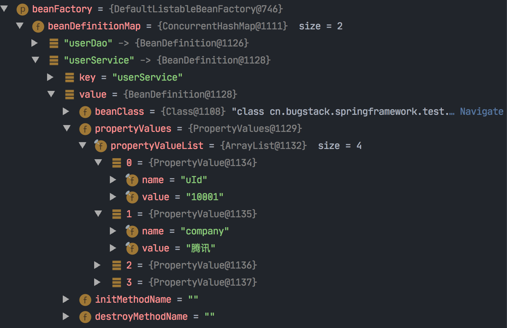
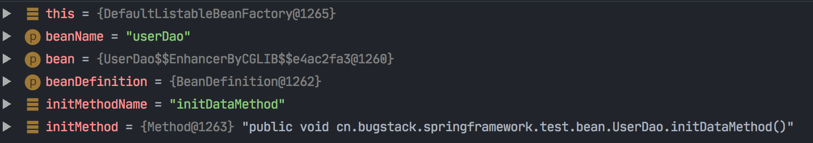

### [一、小试牛刀，实现一个简单的Bean容器](https://github.com/fuzhengwei/small-spring/commit/bd1898fb5e6b9bf05bf1b11b2861d4973f27df97)

一个简单的Spring Bean容器实现，还需要Bean的定义、注册、获取三个基本步骤。

- 定义

  BeanDefinition（中文翻译就是Bean定义）。

  - 什么叫做Bean定义呢？类比对一个人的定义，就是一个人的名字、身高、体重、国籍、身份证号等，这些属性就可以描述一个具体的人。

- 注册

  这个过程就相当于我们把数据存放到HashMap中，只不过现在HashMap存放的是定义了的BeanDefinition对象。

- 获取
  最后就是获取对象，Bean的名字就是key，Spring容器初始化好 Bean 以后，就可以直接获取了。

  

接下来，我们可以按照这个设计，做一个简单的Spring Bean容器代码实现。详细代码见：/Users/lyf/Workspace/www/small-spring/small-spring-step-01。

### [二、初显身手，运用设计模式，实现 Bean 的定义、注册、获取](https://github.com/fuzhengwei/small-spring/commit/b1a0536c71bc29ff828136de0eaca8e4997cd582)

Spring Bean容器类关系图：


总结：

1、定义一个BeanFactory 这样一个 Bean工厂，提供Bean的获取方法（getBean），具体的实现由抽象类**AbstractBeanFactory**实现；=》 `模板模式` 的设计方式。

2、**AbstractBeanFactory**同时也继承了DefaultSingletonBeanRegistry（它实现了SingletonBeanRegistry接口，获取单例的方法）。现在**AbstractBeanFactory**就是一个非常完整且强大的抽象类了，也能非常好的体现出它对模板模式的抽象定义。

3、AbstractAutowireCapableBeanFactory继承**AbstractBeanFactory**，实现createBean方法：

- 利用newInstance（反射）创建bean实例；
- 调用addSingleton()方法将bean实例添加到单例对象的缓存中去。

4、**DefaultListableBeanFactory** 是核心实现类：

- 实现了注册bean的方法 - 接口类中定义的方法；
- 实现了获取bean的方法 - 抽象类中定义的方法。


### [三、崭露头角，基于Cglib实现含构造函数的类实例化策略](https://github.com/fuzhengwei/small-spring/commit/d54cebf1e3bcca7434082e6f5c437e348a330e9b)

```java
/**
 * 验证有参构造函数的类实例化
 *
 * @author Liuyongfei
 * @date 2022/1/17 22:54
 */
public class Api2Test {

    @Test
    public void testConstruct() throws Exception {
        // 1、得到 Class对象
        Class<UserService> beanClass = UserService.class;

        // 2、获取该对象的所有的构造函数
        Constructor<?>[] declaredConstructors = beanClass.getDeclaredConstructors();

        // 3、获取第二个构造函数
        Constructor<?> constructor = declaredConstructors[1];
        UserService userService2 = (UserService) constructor.newInstance("张三");
        System.out.println(userService2);

        // 或者下面这种
        // 3、获取第二个构造函数
        Constructor<UserService> declaredConstructor = beanClass.getDeclaredConstructor(constructor.getParameterTypes());
        UserService userService = declaredConstructor.newInstance("小傅哥");
        System.out.println(userService);

    }
}
```

### [四、一鸣惊人，为Bean对象注入属性和依赖Bean的功能实现](https://github.com/fuzhengwei/small-spring/commit/0c0e36107d3ca1fafe70b33ab3ad5b5622b1352a)

前几章完成了什么？

实现一个容器、Bean的定义、注册Bean、实例化Bean，按照是否包含构造函数实现不同的实例化策略。

> 那么，在创建对象的时候，我们还缺少什么？

其实还缺少一个关于类中是否有属性的问题，如果类中包含属性，那么在实例化的时候就需要把属性信息填充上，这样才是一个完整的对象创建。

#### 新增PropertyValue和PropertyValues两个类

这两个类的作用就是创建出一个用于传递类中属性信息的类，因为属性可能有很多，所以还需要定义一个集合包装一下。

#### BeanReference类

填充属性信息还包括了 Bean的对象类型，也就是需要再定义一个BeanReference，里面其实就是一个简单的Bean名称，在具体的实例化操作时进行递归创建和填充。

`这段还没有太明白。`

```java
/**
 * 测试-为Bean对象注入属性和依赖Bean的功能实现
 *
 * @author Liuyongfei
 * @date 2022/1/18 10:49
 */
public class Api2Test {

    @Test
    public void test() {
        // 1、初始化 BeanFactory
        DefaultListableBeanFactory beanFactory = new DefaultListableBeanFactory();

        // 2、UserDao注册
        beanFactory.registerBeanDefinition("userDao", new BeanDefinition(UserDao.class));

        // 3、为UserService设置属性值[uId、userDao]
        PropertyValues propertyValues = new PropertyValues();
        propertyValues.addPropertyValue(new PropertyValue("uId", "10001"));
        propertyValues.addPropertyValue(new PropertyValue("userDao", new BeanReference("userDao")));

        // 4、注册UserService
        BeanDefinition beanDefinition = new BeanDefinition(UserService.class, propertyValues);
        beanFactory.registerBeanDefinition("userService", beanDefinition);

        // 5、UserService获取bean
        UserService userService = (UserService) beanFactory.getBean("userService");
        userService.queryUserInfo();
    }
}
```

### [五、气吞山河，设计与实现资源加载器，从Spring.xml解析和注册Bean对象](https://github.com/fuzhengwei/small-spring/commit/e740d5fd9ae50c5be884452c28eeccb5c8311750)

- `我们需要将上面的2、3、4 步骤的操作放在配置文件中进行处理，通过Spring配置文件的方式将Bean对象实例化`；

- `接下来我们就需要在现有的Spring框架中，添加能解决Spring配置的读取、解析、注册Bean的操作`；
- 依照本章节的需求，我们需要在现有的 Spring 框架雏形中添加一个资源解析器，也就是能够读取classpath、本地文件、云文件的配置内容；
- 这些配置内容就像使用Spring时配置的 Spring.xml 一样，里面会包含Bean对象的描述信息和属性信息。
- 在读取配置文件信息后，接下来就是对配置文件中的Bean描述信息解析后进行注册操作，把Bean 对象注册到Spring容器中。


主要核心步骤：

XmlBeanDefinitionReader类：

```
@Override
    public void loadBeanDefinitions(String location) throws BeansException {
        ResourceLoader resourceLoader = getResourceLoader();
        Resource resource = resourceLoader.getResource(location);
        loadBeanDefinitions(resource);
    }
```


1、使用当前线程所运行的类加载器：Thread.currentThread().getContextClassLoader()


2、将xml文件和程序之间铺设管道，获取io流：

```java
@Override
    public InputStream getInputStream() throws IOException {
        InputStream is = classLoader.getResourceAsStream(path);
        if (is == null) {
            throw new FileNotFoundException(
                    this.path + " cannot be opened because it does not exist");
        }
        return is;
    }
```

3、开始读取xml文件里的元素

借助hutool jar包里的XmlUtil.readXML方法:

```xml
 protected void doLoadBeanDefinitions(InputStream inputStream) throws ClassNotFoundException {
        Document doc = XmlUtil.readXML(inputStream);
        Element root = doc.getDocumentElement();
        NodeList childNodes = root.getChildNodes();
......

}
```

从该方法中，可以得到某个定义的bean的name和BeanDefinition（相关属性值，比如：value，ref......）

4、注册BeanDefinition

```java
getRegistry().registerBeanDefinition(beanName, beanDefinition);
```

5、DefaultListableBeanFactory类中：

```java
private Map<String, BeanDefinition> beanDefinitionMap = new HashMap<>();

@Override
public void registerBeanDefinition(String beanName, BeanDefinition beanDefinition) {
  beanDefinitionMap.put(beanName, beanDefinition);
}
```

可以发现，会将BeanDefinition放入一个Map当中。

最终第3步骤循环多次读取xml文件完毕后，beanFactory里的beanDefinitionMap为：


6、获取bean对象并调用方法

```java
// 3. 获取Bean对象调用方法
UserService userService = beanFactory.getBean("userService", UserService.class);
String result = userService.queryUserInfo();
```

调用getBean方法，

```java
@Override
public <T> T getBean(String name, Class<T> requiredType) throws BeansException {
    return (T) getBean(name);
}

@Override
public Object getBean(String name) throws BeansException {
  return doGetBean(name, null);
}

protected <T> T doGetBean(final String name, final Object[] args) {
  Object bean = getSingleton(name);
  if (bean != null) {
    return (T) bean;
  }

  BeanDefinition beanDefinition = getBeanDefinition(name);
  return (T) createBean(name, beanDefinition, args);
}
```

7、创建bean，AbstractAutowireCapableBeanFactory类：

```java
@Override
protected Object createBean(String beanName, BeanDefinition beanDefinition, Object[] args) throws BeansException {
  Object bean = null;
  try {
    bean = createBeanInstance(beanDefinition, beanName, args);
    // 给 Bean 填充属性 =》如果有类中包含属性那么在实例化的时候就需要把属性信息填充上，这样才是 一个完整的对象创建。
    applyPropertyValues(beanName, bean, beanDefinition);
  } catch (Exception e) {
    throw new BeansException("Instantiation of bean failed", e);
  }

  addSingleton(beanName, bean);
  return bean;
}

protected Object createBeanInstance(BeanDefinition beanDefinition, String beanName, Object[] args) {
  Constructor constructorToUse = null;
  Class<?> beanClass = beanDefinition.getBeanClass();
  // 获取该Class所有的构造函数
  Constructor<?>[] declaredConstructors = beanClass.getDeclaredConstructors();
  for (Constructor ctor : declaredConstructors) {
    if (null != args && ctor.getParameterTypes().length == args.length) {
      constructorToUse = ctor;
      break;
    }
  }
  return getInstantiationStrategy().instantiate(beanDefinition, beanName, constructorToUse, args);
}
```

8、使用Cglib 来动态创建 Bean 对象：

```java
public class CglibSubclassingInstantiationStrategy implements InstantiationStrategy {

    @Override
    public Object instantiate(BeanDefinition beanDefinition, String beanName, Constructor ctor, Object[] args) throws BeansException {
        Enhancer enhancer = new Enhancer();
        enhancer.setSuperclass(beanDefinition.getBeanClass());
        enhancer.setCallback(new NoOp() {
            @Override
            public int hashCode() {
                return super.hashCode();
            }
        });
        if (null == ctor) return enhancer.create();
        return enhancer.create(ctor.getParameterTypes(), args);
    }

}
```

Cglib是一个强大的、高性能的字节码生成库，它用于在运行时扩展Java类和实现接口；

利用ASM开源包，对代理对象的class文件加载进来，通过修改其字节码生成子类来处理；

本质上它是通过动态的生成一个子类去覆盖所要代理的类（非final修改的类和方法）。

#### 充电

动态代理机制：https://zhuanlan.zhihu.com/p/126503023

代码见：blog-demo/test-demo/dynamicproxy。

包括静态代理、JDK动态代理、Cglib动态代理。

`动态代理类与静态代理类最主要的不同是：代理类的字节码不是在程序运行前生成的，而是在程序运行时在虚拟机中生成的。`

##### JDK动态代理

将动态代理生成的字节码文件保存在本地：

-Dsun.misc.ProxyGenerator.saveGeneratedFiles=true


会在项目的根目录下对应的包中生成：


可以看见：

- 代理类继承了Proxy类，主要是为了传递InvocationHandler；

- 该代理类实现了Animal接口，这也是为什么代理类可以直接强转成接口的原因。

##### CGLIB动态代理

CGLIB动态代理的实现机制是生成目标类的子类，通过调用目标类（父类）的方法实现，在调用父类方法时在代理中增强。


可以看见：

- 代理类继承了Cat类。

注意：CGLIB动态代理不能代理final修饰的类和方法。

##### 总结

通过反编译生成的JDK代理类和CGLIB 代理类，我们可以看到两种不同机制的实现：

- JDK动态代理是通过实现目标类的接口，然后将目标类在构造动态代理类时做为参数传入，使代理对象持有目标对象，再通过代理对象的InvocationHandler实现动态代理的操作；
- CGLIB动态代理是通过配置目标类信息，然后利用ASM字节码框架进行生成目标类的子类。当调用代理方法时，通过拦截器的方式实现代理的操作。
- 总的来说，JDK动态代理利用接口实现代理，CGLIB动态代理利用继承的方式实现代理。

### [六、所向披靡，实现应用上下文，自动识别、资源加载、扩展机制](https://github.com/fuzhengwei/small-spring/commit/7d1152443a2a226211e318376bfaee7762df2a96)

#### 新增了两个重要接口：

- BeanFactoryPostProcessor

- BeanPostProcessor

以后再做一些关于Spring中间件的开发时，如果需要用到Bean对象的获取以及修改一些属性信息，那么就可以使用这两个接口了。

同时BeanPostProcessor也是实现AOP切面技术的关键所在。

#### 关于应用上下文的实现：XML文件应用上下文

同时还添加了关于应用上下文的实现，ApplicationContext接口的定义是继承 BeanFactory 外新增加功能的接口，它可以满足于自动识别、资源加载、容器事件、监听器等功能。

**个人理解**

<u>上下文，个人理解就是封装了我做业务所需要的一些参数，然后暴露一些简单的api方法，让调用者不用关心其内部实现。</u>

#### XML文件应用上下文的具体实现

ClassPathXmlApplicationContext的具体实现，详细看**AbstractApplicationContext#refresh**：

总共干了几件事儿：

##### 1、创建 BeanFactory，并加载BeanDefinition

refreshBeanFactory() =》 创建 BeanFactory（使用DefaultListableBeanFactory），并加载 BeanDefinition（通过XmlBeanDefinitionReader#loadBeanDefinitions从xml中读取配置）：

```java
@Override
protected void loadBeanDefinitions(DefaultListableBeanFactory beanFactory) {
    // 这里new XmlBeanDefinitionReader()的第一个参数是DefaultListableBeanFactory beanFactory
    XmlBeanDefinitionReader beanDefinitionReader = new XmlBeanDefinitionReader(beanFactory, this);
    String[] configLocations = getConfigLocations();
    if (null != configLocations){
        beanDefinitionReader.loadBeanDefinitions(configLocations);
    }
}
```

注意：

`由于这里实例化XmlBeanDefinitionReader时，第一个参数是DefaultListableBeanFactory，因此AbstractBeanDefinitionReader的registry成员变量就是DefaultListableBeanFactory beanFactory`

**因此执行**：

XmlBeanDefinitionReader#doLoadBeanDefinitions 时：

```java
// 注册 BeanDefinition
getRegistry().registerBeanDefinition(beanName, beanDefinition);
```

会将从xml配置文件中读取的bean注册到`DefaultListableBeanFactory的beanDefinitionMap`里去：

```java
private Map<String, BeanDefinition> beanDefinitionMap = new ConcurrentHashMap<>();
```

因此，执行完上面的loadBeanDefinitions()方法后，beanFactory就已经更新为包含了所有bean的beanFactory，如下图：




##### 2、获取 BeanFactory

getBeanFactory()，获取第1步生成的BeanFactory。

配置文件大概如下内容：

```xml
<?xml version="1.0" encoding="UTF-8"?>
<beans>

    <bean id="userDao" class="cn.bugstack.springframework.test.bean.UserDao" init-method="initDataMethod" destroy-method="destroyDataMethod"/>

    <bean id="userService" class="cn.bugstack.springframework.test.bean.UserService">
        <property name="uId" value="10001"/>
        <property name="company" value="腾讯"/>
        <property name="location" value="深圳"/>
        <property name="userDao" ref="userDao"/>
    </bean>

    <bean class="cn.bugstack.springframework.test.common.My2BeanPostProcessor"/>
    <bean class="cn.bugstack.springframework.test.common.My2BeanFactoryPostProcessor"/>
</beans>
```


##### 3、修改bean的属性

1. 在Bean实例化之前，执行 BeanFactoryPostProcessor；

   - 通过beanFactory.getBeansOfType(BeanFactoryPostProcessor.class)获取到属于BeanFactoryPostProcessor类型的所有bean；

   - 遍历这些bean，并执行beanFactoryPostProcessor.postProcessBeanFactory(beanFactory);

   - postProcessBeanFactory的代码为：

     ```java
     @Override
         public void postProcessBeanFactory(ConfigurableListableBeanFactory beanFactory) throws BeansException {
     
             BeanDefinition beanDefinition = beanFactory.getBeanDefinition("userService");
             PropertyValues propertyValues = beanDefinition.getPropertyValues();
     
             propertyValues.addPropertyValue(new PropertyValue("company", "改为：字节跳动"));
         }
     ```

     去修改bean的属性。

##### 4、注册BeanPostProcessor 

需要提前于其他 Bean 对象实例化之前执行注册操作；=》registerBeanPostProcessors(beanFactory);

- registerBeanPostProcessors的代码为：

  ```java
  private void registerBeanPostProcessors(ConfigurableListableBeanFactory beanFactory) {
          Map<String, BeanPostProcessor> beanPostProcessorMap = beanFactory.getBeansOfType(BeanPostProcessor.class);
          for (BeanPostProcessor beanPostProcessor : beanPostProcessorMap.values()) {
              beanFactory.addBeanPostProcessor(beanPostProcessor);
          }
      }
  ```

  执行注册操作。

##### 5、提前实例化单例Bean对象

 beanFactory.preInstantiateSingletons();

```java
@Override
public void preInstantiateSingletons() throws BeansException {
	beanDefinitionMap.keySet().forEach(this::getBean);
}
```

可以看到，这里对beanDefinitionMap进行循环调用getBean方法：


创建Bean对象的主要流程

AbstractBeanFactory#getBean =》 

      ```java
protected <T> T doGetBean(final String name, final Object[] args) {
        Object bean = getSingleton(name);
        if (bean != null) {
            return (T) bean;
        }

        BeanDefinition beanDefinition = getBeanDefinition(name);
        return (T) createBean(name, beanDefinition, args);
    }
      ```

AbstractAutowireCapableBeanFactory：

```java
@Override
    protected Object createBean(String beanName, BeanDefinition beanDefinition, Object[] args) throws BeansException {
        Object bean = null;
        try {
            // 使用CGLIB动态代理创建bean
            bean = createBeanInstance(beanDefinition, beanName, args);
            // 给 Bean 填充属性
            applyPropertyValues(beanName, bean, beanDefinition);
            // 执行 Bean 的初始化方法和 BeanPostProcessor 的前置和后置处理方法
            bean = initializeBean(beanName, bean, beanDefinition);
        } catch (Exception e) {
            throw new BeansException("Instantiation of bean failed", e);
        }

        addSingleton(beanName, bean);
        return bean;
    }
```


AbstractAutowireCapableBeanFactory#applyBeanPostProcessorsBeforeInitialization：

```java
@Override
public Object applyBeanPostProcessorsBeforeInitialization(Object existingBean, String beanName) throws BeansException {
    Object result = existingBean;
    for (BeanPostProcessor processor : getBeanPostProcessors()) {
        // 会执行自定义的BeanPostProcessors的postProcessBeforeInitialization方法
        Object current = processor.postProcessBeforeInitialization(result, beanName);
        if (null == current) return result;
        result = current;
    }
    return result;
}
```


MyBeanPostProcessor：

```java
public class MyBeanPostProcessor implements BeanPostProcessor {

    @Override
    public Object postProcessBeforeInitialization(Object bean, String beanName) throws BeansException {
        if ("userService".equals(beanName)) {
            UserService userService = (UserService) bean;
            userService.setLocation("改为：北京");
        }
        return bean;
    }

    @Override
    public Object postProcessAfterInitialization(Object bean, String beanName) throws BeansException {
        return bean;
    }

}
```

从而去修改Bean的属性。

至此，一个XML文件应用上下文创建完成。

##### 充电：Spring的BeanFactoryPostProcessor和BeanPostProcessor

这两个接口，都是Spring初始化bean时对外暴露的扩展点。两个接口的名称看起来相似，但作用及使用场景却不同。

###### BeanFactoryPostProcessor

- 实现BeanFactoryPostProcessor接口，可以在spring的bean创建之前，修改bean的定义属性；
- BeanFactoryPostProcessor是在spring容器加载了bean的定义文件之后，在bean实例化之前执行的。接口方法的入参是 ConfigurableListableBeanFactory，使用该参数，可以获取到相关bean的定义信息。例子：见上文。

###### BeanPostProcessor

- 可以在spring容器实例化bean之后，在执行bean的初始化方法前后，添加一些自己的处理逻辑。

- 这里说的初始化方法，指的是下面两种：
  - bean实现了initializingBean接口，对应的方法为 afterPropertiesSet；
  - 在bean定义的时候，通过init-method设置的方法。

- 注意：BeanPostProcessor是在spring容器加载了bean的定义文件并且实例化bean之后执行的。BeanPostProcessor的执行顺序是在BeanFactoryPostProcessor之后。

### [七、龙行有风，向虚拟机注册钩子，实现Bean对象的初始化和销毁方法](https://github.com/fuzhengwei/small-spring/commit/4b454a911107dd32b3abeec83023974f40d08864)


只不过一个是接口方法的直接调用，另外一个是在配置文件中读取到方法反射调用。

#### 注册

```java
// 1.初始化 BeanFactory
ClassPathXmlApplicationContext applicationContext = new ClassPathXmlApplicationContext("classpath:spring.xml");
```

##### 第一步

创建XML文件应用上下文：AbstractApplicationContext#refresh中的第5步：提前实例化单例Bean对象。

##### 第二步

AbstractBeanFactory#getBean  =》AbstractBeanFactory#doGetBean =》 AbstractAutowireCapableBeanFactory#createBean：

```java
 @Override
    protected Object createBean(String beanName, BeanDefinition beanDefinition, Object[] args) throws BeansException {
        Object bean = null;
        try {
            bean = createBeanInstance(beanDefinition, beanName, args);
            // 给 Bean 填充属性
            applyPropertyValues(beanName, bean, beanDefinition);
            // 执行 Bean 的初始化方法和 BeanPostProcessor 的前置和后置处理方法
            bean = initializeBean(beanName, bean, beanDefinition);
        } catch (Exception e) {
            throw new BeansException("Instantiation of bean failed", e);
        }

        // 注册实现了 DisposableBean 接口的 Bean 对象
        registerDisposableBeanIfNecessary(beanName, bean, beanDefinition);

        addSingleton(beanName, bean);
        return bean;
    }
```

##### 第三步

```java
private Object initializeBean(String beanName, Object bean, BeanDefinition beanDefinition) {
        // 1. 执行 BeanPostProcessor Before 处理
        Object wrappedBean = applyBeanPostProcessorsBeforeInitialization(bean, beanName);

        // 执行 Bean 对象的初始化方法
        try {
            invokeInitMethods(beanName, wrappedBean, beanDefinition);
        } catch (Exception e) {
            throw new BeansException("Invocation of init method of bean[" + beanName + "] failed", e);
        }

        // 2. 执行 BeanPostProcessor After 处理
        wrappedBean = applyBeanPostProcessorsAfterInitialization(wrappedBean, beanName);
        return wrappedBean;
    }
```

##### 第四步

```java
private void invokeInitMethods(String beanName, Object bean, BeanDefinition beanDefinition) throws Exception {
        // 1. 实现接口 InitializingBean
        // 判断该bean是否实现了InitializingBean接口
        if (bean instanceof InitializingBean) {
             // 直接调用afterPropertiesSet()方法
            ((InitializingBean) bean).afterPropertiesSet();
        }

        // 2. 注解配置 init-method {判断是为了避免二次执行销毁}
        String initMethodName = beanDefinition.getInitMethodName();
        // 判断是否配置了init-method方法
        if (StrUtil.isNotEmpty(initMethodName)) {
            Method initMethod = beanDefinition.getBeanClass().getMethod(initMethodName);
            if (null == initMethod) {
                throw new BeansException("Could not find an init method named '" + initMethodName + "' on bean with name '" + beanName + "'");
            }
          	// 关键的一步
            initMethod.invoke(bean);
        }
    }
```

1》实现接口 InitializingBean

((InitializingBean) bean).afterPropertiesSet()会执行bean的afterPropertiesSet方法：

```java
@Override
public void afterPropertiesSet() throws Exception {
  System.out.println("执行：UserService.afterPropertiesSet");
}
```





##### 第五步

initMethod.invoke(bean);

就会去执行userDao#initDataMethod：

```java
public void initDataMethod(){
        System.out.println("执行：init-method");
        hashMap.put("10001", "小傅哥");
        hashMap.put("10002", "八杯水");
        hashMap.put("10003", "阿毛");
    }
```


```java
applicationContext.registerShutdownHook();
```

#### 销毁

```java
applicationContext.registerShutdownHook();
```

##### 第一步：

```java
@Override
    public void registerShutdownHook() {
        Runtime.getRuntime().addShutdownHook(new Thread(this::close));
    }
```

##### 第二步：

```java
@Override
    public void close() {
        getBeanFactory().destroySingletons();
    }
```

##### 第三步：

DefaultSingletonBeanRegistry#destroySingletons：

```java
public void destroySingletons() {
        Set<String> keySet = this.disposableBeans.keySet();
        Object[] disposableBeanNames = keySet.toArray();
        
        for (int i = disposableBeanNames.length - 1; i >= 0; i--) {
            Object beanName = disposableBeanNames[i];
            DisposableBean disposableBean = disposableBeans.remove(beanName);
            try {
                disposableBean.destroy();
            } catch (Exception e) {
                throw new BeansException("Destroy method on bean with name '" + beanName + "' threw an exception", e);
            }
        }
    }
```

##### 第四步：

DisposableBeanAdapter#destroy：

```java
@Override
    public void destroy() throws Exception {
        // 1. 实现接口 DisposableBean
        if (bean instanceof DisposableBean) {
            ((DisposableBean) bean).destroy();
        }

        // 2. 注解配置 destroy-method {判断是为了避免二次执行销毁}
        if (StrUtil.isNotEmpty(destroyMethodName) && !(bean instanceof DisposableBean && "destroy".equals(this.destroyMethodName))) {
            Method destroyMethod = bean.getClass().getMethod(destroyMethodName);
            if (null == destroyMethod) {
                throw new BeansException("Couldn't find a destroy method named '" + destroyMethodName + "' on bean with name '" + beanName + "'");
            }
            // 关键的一步
            destroyMethod.invoke(bean);
        }
        
    }
```


##### 第五步：

destroyMethod.invoke(bean) 会执行 UserDao#destroyDataMethod：

```java
public void destroyDataMethod(){
    System.out.println("执行：destroy-method");
    hashMap.clear();
}
```

##### 执行结果：

```bash
执行：init-method
执行：UserService.afterPropertiesSet
测试结果：小傅哥,腾讯,深圳
执行：UserService.destroy
执行：destroy-method
```

#### 充电

##### spring中InitializingBean接口使用理解

- InitializingBean接口为bean提供了初始化的方式，它只包括afterPropertiesSet方法；

- 凡是继承该接口的类，在初始化bean的时候会自动执行afterPropertiesSet方法。

##### 问题

实现InitializingBean接口，与在配置文件中指定init-method方法有什么不同？

1、配置文件

```xml
<bean id="testInitializingBean" class="com.TestInitializingBean" init-method="testInit"></bean>
```

在配置文件中加入init-method="testInit"。

2、TestInitializingBean：

```java
import org.springframework.beans.factory.InitializingBean;
public class TestInitializingBean implements InitializingBean{
    @Override
    public void afterPropertiesSet() throws Exception {
        System.out.println("ceshi InitializingBean");        
    }
    public void testInit(){
        System.out.println("ceshi init-method");        
    }
}
```

3、Main程序：

```java
public class Main {
    public static void main(String[] args){
        ApplicationContext context = new FileSystemXmlApplicationContext("/src/main/java/com/beans.xml");
    }
}
```

4、运行结果：

```bash
ceshi InitializingBean
ceshi init-method
```

这说明：

- 在spring初始化bean的时候，如果bean实现了InitializingBean接口，会自动调用afterPropertiesSet方法;
- 先调用afterPropertiesSet方法，然后在调用init-method中指定的方法。

##### 总结

spring为bean提供了两种初始化bean的方式，实现InitializingBean接口，实现afterPropertiesSet方法；或者在配置文件中通过init-method指定，两种方式可以同时使用。

### [八、虎行有雨，定义标记类型Aware接口，实现感知容器对象](https://github.com/fuzhengwei/small-spring/commit/74704fef6884167be6cfadf5bcf41e5961068896)

本章节希望在Spring容器中提供一种能感知容器操作的接口，如果谁实现了这样的一个接口，就可以获取接口入参中的各种能力。

所以，在 AbstractApplicationContext 的具体实现中会用 到向 beanFactory 添加 BeanPostProcessor 内容的 ApplicationContextAwareProcessor 操作，最后由 AbstractAutowireCapableBeanFactory 创建 createBean 时处理相应的调用操作。 

1、AbstractAutowireCapableBeanFactory#initializeBean方法中新增：

```java
// invokeAwareMethods
if (bean instanceof Aware) {
  if (bean instanceof BeanFactoryAware) {
    ((BeanFactoryAware) bean).setBeanFactory(this);
  }
  if (bean instanceof BeanClassLoaderAware){
    ((BeanClassLoaderAware) bean).setBeanClassLoader(getBeanClassLoader());
  }
  if (bean instanceof BeanNameAware) {
    ((BeanNameAware) bean).setBeanName(beanName);
  }
}
```

2、AbstractApplicationContext#refresh方法中添加 ApplicationContextAwareProcessor

让继承自 ApplicationContextAware 的 Bean 对象都能感知所属的 ApplicationContext：

```java
// 注意：这里的 this 就是 ClassPathXmlApplicationContext
beanFactory.addBeanPostProcessor(new ApplicationContextAwareProcessor(this));
```

解释：

- **这里的 this 就是 ClassPathXmlApplicationContext**

- ApplicationContextAwareProcessor 又实现了BeanPostProcessor接口；

- addBeanPostProcessor()方法将当前的这个BeanPostProcessor添加到List当中去：

  ```java
  private final List<BeanPostProcessor> beanPostProcessors = new ArrayList<BeanPostProcessor>();
  ```


执行结果：

```bash
执行：init-method 
ClassLoader：sun.misc.Launcher$AppClassLoader@18b4aac2
Bean Name is：userService
测试结果：小傅哥,腾讯,深圳
ApplicationContextAware：cn.bugstack.springframework.context.support.ClassPathXmlApplicationContext@143640d5
BeanFactoryAware：cn.bugstack.springframework.beans.factory.support.DefaultListableBeanFactory@6295d394
执行：destroy-method
```

其中执行结果对应代码：

第一行对应：   =》AbstractAutowireCapableBeanFactory#initializeBean -》invokeInitMethods()

第二行对应：   =》AbstractAutowireCapableBeanFactory#initializeBean -》((BeanClassLoaderAware) bean).setBeanClassLoader(getBeanClassLoader());

第三行对应：=》((BeanNameAware) bean).setBeanName(beanName);

第四行对应：=》测试类里正常调用：String result = userService.queryUserInfo();

第五行对应：

AbstractAutowireCapableBeanFactory#initializeBean：

- 当 beanName = "userService"时，执行：

  1.

  ```java
  ((BeanFactoryAware) bean).setBeanFactory(this);
  @Override
  public void setBeanFactory(BeanFactory beanFactory) throws BeansException {
    this.beanFactory = beanFactory;
  }
  ```

  2.

  ```java
  ((BeanClassLoaderAware) bean).setBeanClassLoader(getBeanClassLoader());
  @Override
  public void setBeanClassLoader(ClassLoader classLoader) {
    System.out.println("ClassLoader：" + classLoader);
  }
  ```

  会输出：ClassLoader：sun.misc.Launcher$AppClassLoader@18b4aac2

  3.

  ```java
  ((BeanNameAware) bean).setBeanName(beanName);
  @Override
  public void setBeanName(String name) {
    System.out.println("Bean Name is：" + name);
  }
  ```

​       会输出：Bean Name is：userService

​         4.AbstractAutowireCapableBeanFactory#initializeBean

      ```java
 // 执行 BeanPostProcessor Before 处理
 Object wrappedBean = applyBeanPostProcessorsBeforeInitialization(bean, beanName);

 @Override
 public Object applyBeanPostProcessorsBeforeInitialization(Object existingBean, String beanName) throws BeansException {
        Object result = existingBean;
        // 从beanPostProcessors这个list里取BeanPostProcessor
        for (BeanPostProcessor processor : getBeanPostProcessors()) {
            Object current = processor.postProcessBeforeInitialization(result, beanName);
            if (null == current) return result;
            result = current;
        }
        return result;
    }
      ```

​      5.ApplicationContextAwareProcessor

```java
@Override
    public Object postProcessBeforeInitialization(Object bean, String beanName) throws BeansException {
        if (bean instanceof ApplicationContextAware){
            ((ApplicationContextAware) bean).setApplicationContext(applicationContext);
        }
        return bean;
    }
```

会设置ApplicationContext，这里的applicationContext就是在：

```java
// 添加 ApplicationContextAwareProcessor，让继承自 ApplicationContextAware 的 Bean 对象都能感知所属的 ApplicationContext
// new ApplicationContextAwareProcessor(this) 就是个 BeanPostProcessor
// 然后它的 applicationContext 变量就被赋值为 ClassPathXmlApplicationContext =》 下边给ApplicationContextAware类型的bean setApplicationContext的时候会使用到。
beanFactory.addBeanPostProcessor(new ApplicationContextAwareProcessor(this));
```

这里设置的ClassPathXmlApplicationContext：


然后它的 applicationContext 变量就被赋值为 ClassPathXmlApplicationContext （ 下边给`ApplicationContextAware`类型的bean setApplicationContext的时候会使用到。）

```java
// 执行 BeanPostProcessor Before 处理
Object wrappedBean = applyBeanPostProcessorsBeforeInitialization(bean, beanName);

@Override
    public Object applyBeanPostProcessorsBeforeInitialization(Object existingBean, String beanName) throws BeansException {
        Object result = existingBean;
        for (BeanPostProcessor processor : getBeanPostProcessors()) {
            Object current = processor.postProcessBeforeInitialization(result, beanName);
            if (null == current) return result;
            result = current;
        }
        return result;
    }
```


#### RunTime.getRunTime().addShutdownHook用法

这个方法的意思就是在jvm中增加一个关闭的钩子。

- 当jvm关闭的时候，会执行系统中已经设置的所有通过addShutdownHook添加的钩子，当系统执行完这些钩子后，jvm才会关闭。
- 所以这些钩子可以在jvm关闭的时候进行内存清理、对象销毁等操作。

```java
/**
 * 测试 Runtime.getRuntime().addShutdownHook 钩子函数
 *
 * @author Liuyongfei
 * @date 2022/1/31 18:29
 */
public class RunTimeTest {

    public static void main(String[] args) {
        Thread threada = new Thread(() -> {
            System.out.println("thread a ....");
        },"a");

        Thread threadb = new Thread(() -> {
            System.out.println("thread b ....");
        },"b");

        Thread threadShutdown = new Thread(() -> {
            System.out.println("shutdown thread ....");
        },"c");

        Runtime.getRuntime().addShutdownHook(threadShutdown);

        threada.start();
        threadb.start();
    }
}
```

```bash
thread a ....
thread b ....
shutdown thread ....
```

结论：

无论是先打印 thread a,，还是thread b，shutdown thread 都是最后打印的（因为这个线程是在jvm执行关闭前才会执行）


​    