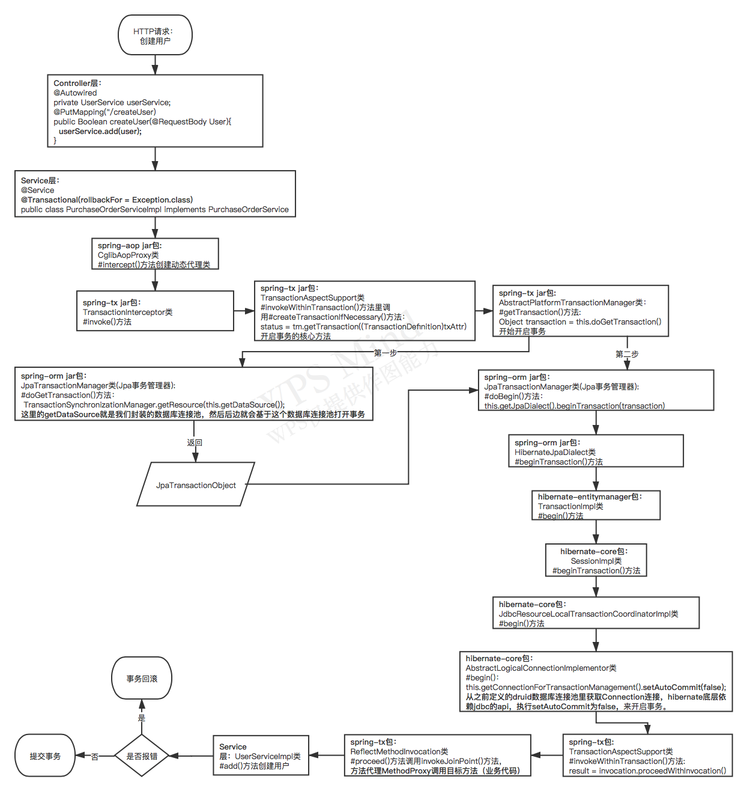

## Spring为什么加了@Transactional注解就支持事务了呢

Spring 注解类（包含Transactional）都是基于Spring AOP机制实现的。

### 概述

1. 如果Spring在Bean上检测到`@Transactional` 注解，它将创建Bean的动态代理类；
2. 代理类会访问事务管理器，事务管理器会打开/关闭事务连接；
3. 事务管理器本身其实就是执行你之前手动做的事：调用JDBC的api，去管理一个JDBC连接。

### Spring源码@Transactional的调用链

备注：

该调用链对应源码Spring 4.3.13版本。

### 总结

- 当我们的应用系统在调用那些声明了@Transactional的目标类/方法时，Spring会使用AOP代理，在代码运行时生成一个代理对象；
- @Transactional的目标类/方法会被`TransactionInterceptor` 事务拦截器进行拦截；
- 在目标方法开始执行之前加入事务；
- 执行目标方法的业务逻辑；
- 根据执行情况是否出现异常，利用事务管理器AbstractPlatformTransactionManager来操作数据源DataSource，进行事务提交或事务回滚。

#### 涉及jar包

通过上图可以清晰的看到一个详细的源码调用链，一共涉及到了以下几个核心jar包：

1. spring-aop；
2. spring-tx；
3. spring-orm；
4. hibernate-entitymanager；
5. hibernate-core。

#### 涉及概念

涉及到的核心概念如下：

1. 动态代理；
2. AOP；
3. 事务管理器；
4. 事务传播级别；
5. 事务隔离级别；
6. hibernate orm；
7. JDBC。

### 使用@Transactional时遇到的坑

https://blog.csdn.net/fy_java1995/article/details/107990499

### 调用链

PurchaseOrderController.approve() 

->

@Service
@Transactional(rollbackFor = Exception.class)
public class PurchaseOrderServiceImpl implements PurchaseOrderService 

