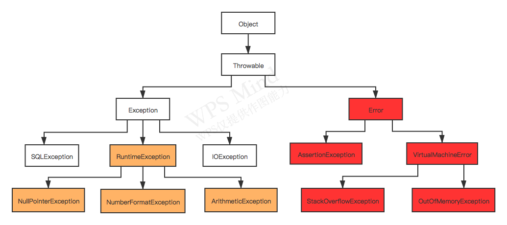

## Spring为什么加了@Transactional注解就支持事务了呢

### 编程式事务

之前我们自己调用JDBC的api去管理事务时，经常是要写类似这样的代码：

```java
import java.sql.Connection;

Connection connection = dataSource.getConnection(); 

try (connection) {
    // 开启事务
    connection.setAutoCommit(false); 
    // 执行sql语句
    // ......
    // 提交事务
    connection.commit(); 

} catch (SQLException e) {
    // 发送异常，则回滚事务
    connection.rollback(); 
}
```

这种编程式事务往往将事务管理和业务逻辑掺杂到了一块儿，因此在实际开发中，声明式事务用的比较多。

### 声明式事务

声明式事务有两种方式，一种是在配置文件（xml）中做相关的事务规则声明，另一种就是通过`@Transactional`注解的方式。

Spring 注解类（包含`@Transactional`）都是基于Spring AOP机制实现的。

### 概述

1. 如果Spring在Bean上检测到`@Transactional` 注解，它将创建Bean的动态代理类；
2. 代理类会访问事务管理器，事务管理器会打开/关闭事务连接；
3. 事务管理器本身其实就是执行你之前手动做的事：调用JDBC的api，去管理一个JDBC连接。

### Spring源码@Transactional的调用链


备注：

1. 该调用链对应源码Spring 4.3.13版本；
2. 关键点已在图中加粗标注。

### 总结

- 当我们的应用系统在调用那些声明了`@Transactional`的目标类/方法时，Spring会使用AOP代理，在代码运行时生成一个代理对象；
- @Transactional的目标类/方法会被`TransactionInterceptor` 事务拦截器进行拦截；
- 在目标方法开始执行之前加入事务；
- 执行目标方法的业务逻辑；
- 根据执行情况是否出现异常，利用事务管理器`AbstractPlatformTransactionManager`来操作数据源DataSource，进行事务提交或事务回滚。

#### 涉及jar包

通过上图可以清晰的看到一个详细的源码调用链，一共涉及到了以下几个核心jar包：

1. spring-aop；
2. spring-tx；
3. spring-orm；
4. hibernate-entitymanager；
5. hibernate-core。

#### 涉及概念

涉及到的核心概念如下：

1. 动态代理；
2. AOP；
3. 编程式事务和声明式事务；
4. 事务管理器；
5. 事务传播级别；
6. 事务隔离级别；
7. hibernate orm；
8. JDBC。

### 为@Transactional设置rollbackFor属性有什么用

#### 常见的throwable异常和错误

我们先来看一下常见的throwable异常和错误：




#### Spring的@Transaction默认情况下的事务回滚

默认情况下，Spring只有在发生RuntimeException异常和Error异常时，才会进行事务回滚。

可以通过spring-tx jar包查看源码来验证这一点，打开`DefaultTransactionAttribute`类查看`rollbackOn`方法：

```java
public boolean rollbackOn(Throwable ex) {
    return ex instanceof RuntimeException || ex instanceof Error;
}
```

可以看到，只有在遇到 `RuntimeException`或`Error`异常时才会进行事务回滚。

因此我们经常在实际开发中，通过配置rollBackFor属性，让事务在遇到非运行时异常时也进行回滚：

```java
@Transactional(rollbackFor=Exception.class)
```

### @Transactional为什么只能应用到public修饰的方法上

Spring默认通过动态代理的方式实现AOP，