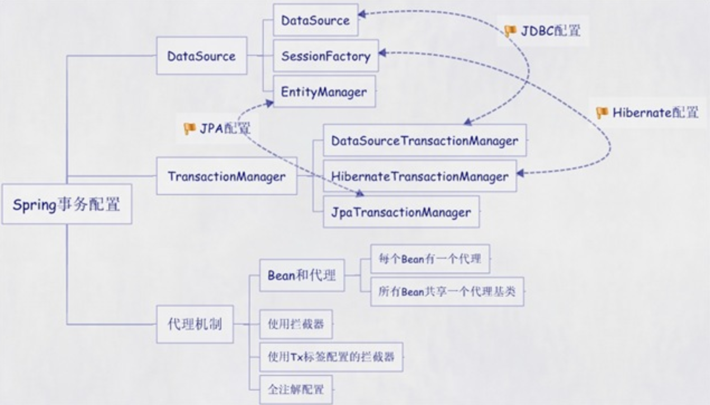

### Spring配置事务的几种方式

spring配置文件中关于事务配置总是由3个组成部分：DataSource，TransactionManager，代理机制这三个部分。

无论哪种配置方式，一般变化的只是代理机制这部分。



根据代理机制的不同，总结了五种spring事务的配置方式：

#### 第五种方式：使用注解

1. 定义数据源；
2. 定义会话工厂，使用定义的数据源；
3. 定义事务管理器，使用定义的会话工厂；
4. 定义服务层的bean，使用会话工厂。

首先我创建了两个类，一个接口一个实现：

```java
package com.dao;  
public interface UserDao {  
    public void getUser();    
} 
```

```java
package com.dao.impl;  
import org.springframework.orm.hibernate3.support.HibernateDaoSupport;  
import com.dao.UserDao;  
public class UserDaoImpl extends HibernateDaoSupport implements UserDao {  
    public void getUser(){        
    }     
}  
```

类似这样：

```xml
<?xml version="1.0" encoding="UTF-8"?>  
<beans xmlns="http://www.springframework.org/schema/beans"  
    xmlns:xsi="http://www.w3.org/2001/XMLSchema-instance"  
    xmlns:context="http://www.springframework.org/schema/context"  
    xmlns:aop="http://www.springframework.org/schema/aop"  
    xmlns:tx="http://www.springframework.org/schema/tx"  
    xsi:schemaLocation="http://www.springframework.org/schema/beans   
           http://www.springframework.org/schema/beans/spring-beans-2.5.xsd  
           http://www.springframework.org/schema/context  
           http://www.springframework.org/schema/context/spring-context-2.5.xsd  
           http://www.springframework.org/schema/aop http://www.springframework.org/schema/aop/spring-aop-2.5.xsd  
           http://www.springframework.org/schema/tx http://www.springframework.org/schema/tx/spring-tx-2.5.xsd">  
    <!-- 数据源 -->  
    <bean id="dataSource"  
        class="org.apache.commons.dbcp.BasicDataSource"  
        destroy-method="close">  
        <property name="driverClassName" value="com.mysql.jdbc.Driver" />  
        <property name="url"  
            value="jdbc:mysql://192.168.0.244:3306/test?useUnicode=true&amp;characterEncoding=UTF-8" />  
        <property name="username" value="root" />  
        <property name="password" value="root" />  
        <!-- 连接池启动时的初始值 -->  
        <property name="initialSize" value="10" />  
        <!-- 连接池的最大值 -->  
        <property name="maxActive" value="10" />  
        <!-- 最大空闲值.当经过一个高峰时间后，连接池可以慢慢将已经用不到的连接慢慢释放一部分，一直减少到maxIdle为止 -->  
        <property name="maxIdle" value="20" />  
        <!--  最小空闲值.当空闲的连接数少于阀值时，连接池就会预申请去一些连接，以免洪峰来时来不及申请 -->  
        <property name="minIdle" value="10" />  
        <property name="defaultAutoCommit" value="true" />  
    </bean>  
    <!-- 会话工厂 -->  
    <bean id="sessionFactory"  
        class="org.springframework.orm.hibernate3.LocalSessionFactoryBean">  
        <property name="dataSource" ref="dataSource" />  
        <property name="mappingLocations">  
            <list>  
                <value>classpath:/com/nms/entity/**/*.hbm.xml</value>  
            </list>  
        </property>  
        <property name="hibernateProperties">  
            <props>  
                <prop key="hibernate.dialect">  
                    org.hibernate.dialect.MySQL5Dialect  
                </prop>  
                <prop key="hibernate.show_sql">true</prop>  
                <prop key="hibernate.format_sql">true</prop>  
            </props>  
        </property>  
    </bean>  
    <context:annotation-config />  
    <!-- 使用注解的包路径 -->  
    <context:component-scan base-package="com.dao" />  
    <!-- 支持  @Transactional 标记 -->  
    <tx:annotation-driven transaction-manager="transactionManager"/>  
    <!-- 定义事务管理器 -->    
    <bean id="transactionManager"  
        class="org.springframework.orm.hibernate3.HibernateTransactionManager">  
        <property name="sessionFactory" ref="sessionFactory" />  
    </bean>  
</beans>   
```

如果使用了注解，那么实现类应该这样写：

```java
package com.dao.impl;  
import org.springframework.orm.hibernate3.support.HibernateDaoSupport;  
import org.springframework.stereotype.Component;  
import org.springframework.transaction.annotation.Transactional;  
import com.dao.UserDao;  
@Transactional  
@Component("userDaoAgency")  
@Transactional
@Component("userDao")
public class UserDaoImpl extends HibernateDaoSupport implements UserDao {

    public List<User> listUsers() {
        return this.getSession().createQuery("from User").list();
    }
   
    
}
```

