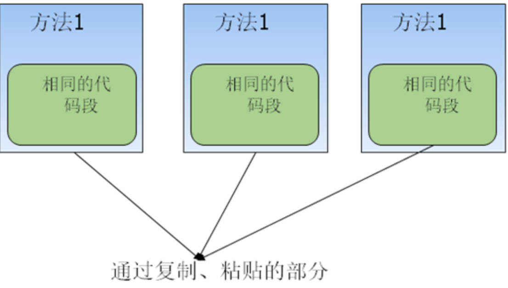

## Spring静态代理

### 抛出使用场景

比如用户的增删改查4个方法，如果要对用户操作后进行日志记录，可能有人会说直接在用户增删改查后做日志记录就行。

一旦我想在用户操作之前加一个权限验证方法，那每个调用方法之前还得再加一个权限验证方法，这样的工作量是巨大的。



可能读者已经发现了这种做法的不足之处，如果有一天，蓝色背景的代码需要修改，

那是不是要同时修改三个地方?如果不仅仅是这三个地方包含这段代码，而是100个

，甚至是1000个地方，那会是什么后果?

### 弊端

- 混淆了业务方法本身的职责；
- 维护工作量巨大

### 解决方案

- 静态代理，

## SpringBoot动态代理

在程序运行过程中生成代理对象，由该代理对象去完成自己要去做的事情。


### 解决方案

将对象增删改查方法交给代理去执行，代理在执行方法前后可以做权限校验和日志记录。

### 总结

代理：本来应该自己做的事，由别人去做。

动态代理：在程序运行过程中生成代理对象，由代理对象去完成自己要去做的事情。

spring 的动态代理就是AOP的实现原理。

### SpringBoot动态代理有哪些

SpringBoot动态代理分为两种，JDK的动态代理和cglib的动态代理。

SpringBoot默认使用JDK的动态代理，当类没有实现接口时才使用cglib的动态代理。

#### jdk的动态代理

这种代理适用于实现了接口的类。

假设现在有一个接口UserService：

```java
public interface UserService {
	void query(String name);
}
```

有一个类UserServiceImpl，实现了接口：

```java
// 被代理的类
public class UserService implements UserService {
	@Override
	public void query(String name) {
		System.out.println("query name = " + name);
	}
}
```

那么怎么代理上面这个UserServiceImpl类呢？

JDK动态代理的思想是：

生成一个类，让它和被代理的对象（UserServiceImpl）实现同样的接口，并重写接口的方法。

如下所示（注意：下面这个类是JDK自动生成的）：

```java
public class LogUserProxy implements UserService {
  // 被代理的对象做为自动生成的这个类的一个属性
  private UserService userService;
  // 构造方法将被代理对象注入进去
  public LogUserProxy(UserService userService) {
    this.userService = userService;
  }
  
  // 重写接口方法，实现代理原方法的功能
  @Override
  public void query(String name) {
    // todo 增强逻辑
    System.out.println("增强逻辑");
    userService.query(name);
    //todo 增强逻辑
    System.out.println("增强逻辑");
  }
}
```

上面有两个类，UserImpl（被代理的类）和LogUserProxy（自动生成的类）

面相接口编程中常常使用如下形式调用UserImpl（SpringBoot中会自动注入）

```java
UserService service = new UserImpl();
service.query("aaa");
```

如果这个时候，我们将上述代码改为如下形式即可完成代理：

```java
UserService service = new LogUserProxy();
service.query("aaa");
```

#### cglib动态代理

jdk的动态代理只能代理实现了接口的类，但是有些类没有实现接口，那这种类如何被代理呢？

```java
//被代理类
public class Test {

    public void cal() {
        System.out.println("被代理方法");
    }
}
```

代理方式，自定义拦截器实现MethodInterceptor接口：

```java
public class AIntercepter implements MethodInterceptor {
    @Override
    public Object intercept(Object o, Method method, Object[] objects, MethodProxy methodProxy) throws Throwable {
        //增强逻辑
        System.out.println("代理前，增强逻辑");
        methodProxy.invokeSuper(o, objects);
        //增强逻辑
        System.out.println("代理后，增强逻辑");
        return null;
    }
}
```

测试：

```java
public class Main1 {

    public static void main(String[] args) {
        //代理类class文件存入本地磁盘，方便查看中间生成的临时文件
        System.setProperty(DebuggingClassWriter.DEBUG_LOCATION_PROPERTY, "D:\\code");
        //------------------开始代理--------------------
        Enhancer enhancer = new Enhancer();
        //指定被代理类，生成的类将会继承此类
        enhancer.setSuperclass(Test.class);
        //指定拦截器
        enhancer.setCallback(new AIntercepter());
        //生成代理类
        Test t = (Test)enhancer.create();
        //完成代理
        t.cal();
        //------------------完成代理--------------------
    }
}
```

enhancer.create()方法会生成代理类，而System.setProperty()会将其保存到D:\code目录下。查看目录，会发现D:\code下生成了三个文件：

```java
Test$$EnhancerByCGLIB$$7ce11e59$$FastClassByCGLIB$$fe330774.class
Test$$EnhancerByCGLIB$$7ce11e59.class
Test$$FastClassByCGLIB$$3b8fb982.class
```

其中第二个文件是代理类，将其反编译，其中重要的方法展示如下：

```kotlin
//拦截其中的methodProxy.invokeSuper(o, objects);会调用此方法
final void CGLIB$cal$0() {
     super.cal();
}
//测试代码中的t.cal()会调用此方法
public final void cal() {
//获取自定义拦截器
 MethodInterceptor var10000 = this.CGLIB$CALLBACK_0;
 if (this.CGLIB$CALLBACK_0 == null) {
     CGLIB$BIND_CALLBACKS(this);
     var10000 = this.CGLIB$CALLBACK_0;
 }

 if (var10000 != null) {
       //调用自定义拦截器的intercept方法
     var10000.intercept(this, CGLIB$cal$0$Method, CGLIB$emptyArgs, CGLIB$cal$0$Proxy);
 } else {
     super.cal();
 }
}
```

整个过程的方法调用逻辑是：

Main1中的t.cal()   ------>  TestEnhancerByCGLIB7ce11e59.class中的 cal()   ------> 自定义拦截器AIntercepter中的intercept()   ------> 被代理类Test中的cal()方法。

