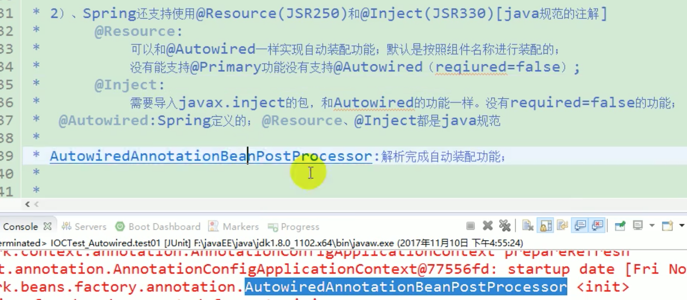
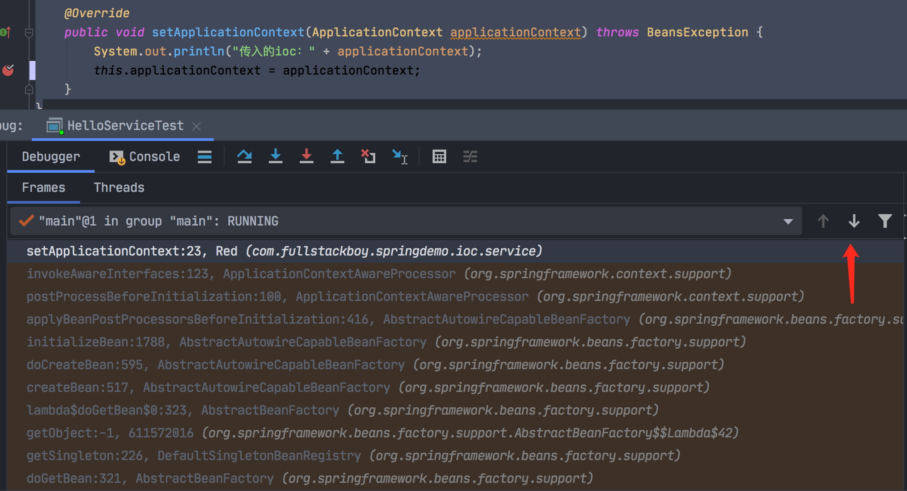
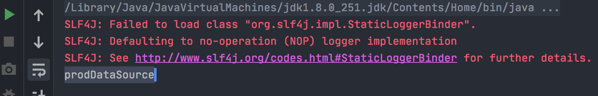

#### 懒加载

- 是专门针对单实例说的；

- 单实例bean：容器在启动的时候创建对象；
- 懒加载（通过使用@Lazy注解）：容器启动不创建对象。第一次使用（获取）bean时会创建对象，并初始化。

#### @Conditional

如果该注解放在类上，则如果满足当前条件，这个类里配置的所有bean才会生效。

#### @Import

快速导入组件，id默认是组件的全类名。

#### 给容器中注册组件

1. 包扫描 + 组件标注注解（@Controller/@Service/@Repository/@Component）；
2. @Bean导入第三方包里面的组件；
3. @Import 快速给容器中导入一个组件
   - @Import(要导入到容器中的组件)：容器中就会自动注册这个组件，id默认是全类名；
   - @ImportSelector：返回需要导入的组件的全类名数组；
   - @ImportBeanDefinitionRegistrar：手动注册bean到容器中。
4. 使用spring提供的FactoryBean（工厂bean）

​       在spring与其他框架整合的时候，用FactoryBean比较多。


#### bean的生命周期

bean的创建、初始化、销毁的过程。

我们可以自定义初始化、销毁的过程。

##### 第一种方式

通过@Bean指定init-method和destory-method方法。

##### 第二种方式

通过让Bean实现InitializingBean（定义初始化逻辑），实现DisposableBean（定义销毁逻辑）。

##### 第三种方式

通过使用JSR250规范里边定义的两个注解。

@PostConstruct

这个注解的作用就是会在bean都装配完成、对象创建、属性赋值完成以后，执行一些初始化方法。

@PreDestory

在容器销毁bean之前，通知我们进行清理工作。

##### 第四种方式

BeanPostProcessor，是个接口，bean的后置处理器。包含两个方法：

postProcessBeforeInitialization：在初始化之前工作

postProcessAfterInitialization：在初始化之后工作

#### BeanPostProcessor 

BeanPostProcessor在spring底层的使用，有bean赋值、@Autowired、生命周期注解功能、@Async等。

#### @PropertySource

使用@PropertySource读取外部配置文件中的k/v保存到运行的环境变量中；加载外部的配置文件以后可使用${}取出配置文件的值，比如：

persion.properties：

```
info.nickname="lisi"
```

然后：

```java
public class Person {

  @Value("${info.nickname}")
	private String nickName;
}
```

#### @Autowired

MyAppConfig：

```java
@Configuration
public class MyAppConfig{
	@Bean("bookDao2")  // 一处
	public BookDao bookDao2() {
		return new BookDao();
	}
}

@Controller
public class BookController {
  @Autowired
  private BookService;
}

@Service
public class BookService {
	@Autowired // 二处
  private BookDao bookDao;
}

@Repository
public class BookDao {
	
}
```

这样在IOC容器里会有同一个类型BookDao的两个bean。


1. 默认会先按照类型去容器中查找对应的组件 =》 applicationContext.getBean(BookDao.class);

2. 如果找到了多个相同类型的组件，再将属性的名称做为组件的id去容器中查找 =》applicationContext.getBean("bookDao");

3. 如果确实就是想使用 bookDao2，这时可以使用 =》@Qualifier("bookDao2")，指定需要装配的组件id，而不是使用类的属性名。

4. 自动装配默认一定要将属性赋值好，否则会报错。比如这里如果将一处和二处的注解去掉，则启动容器的时候就会报错。解决办法：可以将二处的@Autowired注解改为：

   ```java
   @Autowired(required=false)
   ```

   即可。如果没有，则就为null，不会报错了。

5. @Primary：让spring自动装配的时候，默认使用首选的bean。同时也可以继续使用@Qualifier指定要装配的bean的名字。

#### spring还支持使用@Resource（JSR250规范）和@Inject（JSR330规范）

这两个是java规范里的注解。

@Resoure可以和@Autowired一样，实现自动装配的功能。默认是按照组件名称进行装配的（比如在BookService里定义的BookDao的属性名称是bookDao，那么就会将bookDao做为组件名称进行装配）。也可以指定name来装配：

```java
@Resource("bookDao2")
 private BookDao bookDao;
```

则就会查找名称为bookDao2的组件来进行装配。



#### ApplicationContextAwareProcessor

自定义组件想要使用spring容器底层的一些组件（ApplicationContext、BeanFactory等），可以将自定义组件实现***Aware接口，在创建对象的时候，会调用接口规定的方法注入相关组件，把spring底层一些组件注入到自定义的bean中。

***Aware   =》 功能使用 ***Processor，比如：ApplicationContextAware =》 ApplicationContextAwareProcessor。

```java
/**
 * 实现ApplicationContextAware
 * 
 * @author Liuyongfei
 * @date 2022/1/13 09:46
 */
@Component
public class Red implements ApplicationContextAware {


    private ApplicationContext applicationContext;

    @Override
    public void setApplicationContext(ApplicationContext applicationContext) throws BeansException {
        System.out.println("传入的ioc：" + applicationContext);
        this.applicationContext = applicationContext;
    }
}
```

看一些ApplicationContextAware是怎么将ApplicationContext注入到Red组件里。



#### @Profile

根据环境注册bean。

```java
/**
 * 数据源配置类
 *
 * Profile 指定组件在哪个环境的情况下才能被注册到容器中。没有指定@Profile时，则表明任何环境下都能注册这个bean。
 *
 * 加了环境标识的bean，只有这个环境被激活的时候才能注册到容器中
 * @author Liuyongfei
 * @date 2022/1/13 13:24
 */
@PropertySource("classpath:/datasource.properties")
@Configuration
public class DataSourceConfig {

    @Value("${druid.url}")
    private String url;

    @Value("${druid.driver}")
    private String driver;

    @Value("${druid.username}")
    private String username;

    @Value("${druid.password}")
    private String password;

    @Profile("dev")
    @Bean("devDataSource")
    public DataSource dataSource() {
        DruidDataSource dataSource = new DruidDataSource();
        dataSource.setUrl(url);
        dataSource.setDriverClassName(driver);
        dataSource.setUsername(username);
        dataSource.setPassword(password);
        return dataSource;
    }

    @Profile("test")
    @Bean("testDataSource")
    public DataSource dataSource2() {
        DruidDataSource dataSource = new DruidDataSource();
        dataSource.setUrl(url);
        dataSource.setDriverClassName(driver);
        dataSource.setUsername(username);
        dataSource.setPassword(password);
        return dataSource;
    }

    @Profile("prod")
    @Bean("prodDataSource")
    public DataSource dataSource3() {
        DruidDataSource dataSource = new DruidDataSource();
        dataSource.setUrl(url);
        dataSource.setDriverClassName(driver);
        dataSource.setUsername(username);
        dataSource.setPassword(password);
        return dataSource;
    }
}
```

datasource.properties：

```
datasource.properties
```

```java
/**
 * 数据源分环境切换-测试
 *
 * @author Liuyongfei
 * @date 2022/1/13 14:05
 */
public class DataSourceTest {

    public static void main(String[] args) {
        // *********************************************第一种方式：使用命令行动态参数 *******************************
        // VM options:-Dspring.profiles.active=prod
//        AnnotationConfigApplicationContext  context = new AnnotationConfigApplicationContext(DataSourceConfig.class);
        // *********************************************第一种方式 end*******************************


        // *********************************************第二种方式*******************************
        // 1、创建一个AnnotationConfigApplicationContext
        AnnotationConfigApplicationContext  context = new AnnotationConfigApplicationContext();
        // 2、设置需要激活的环境
        context.getEnvironment().setActiveProfiles("test");
        // 3、注册配置类
        context.register(DataSourceConfig.class);
        // 4、启动刷新容器
        context.refresh();
        // *********************************************第二种方式 end*******************************

        String[] beanNamesForType = context.getBeanNamesForType(DataSource.class);
        for (String bean : beanNamesForType) {
            System.out.println(bean);
        }
    }
}
```

输出结果：




