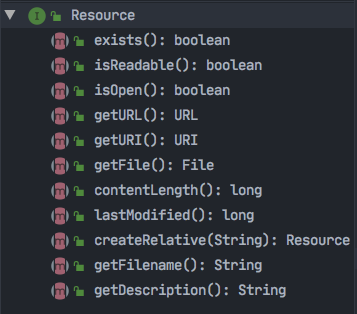
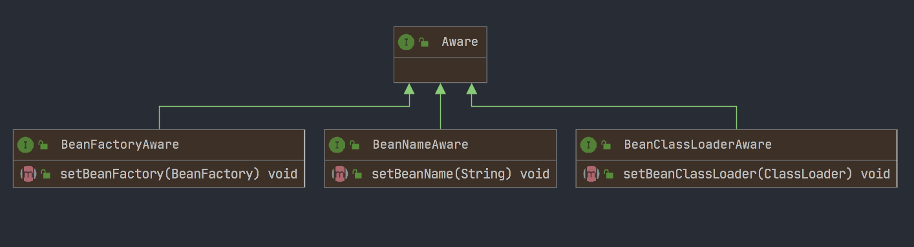
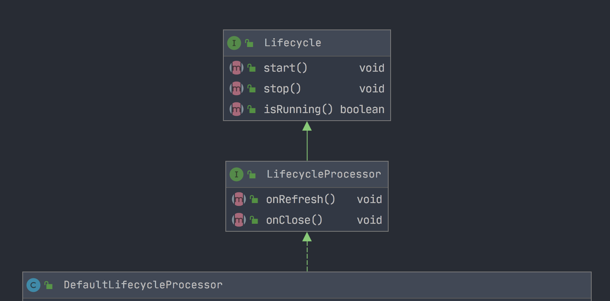
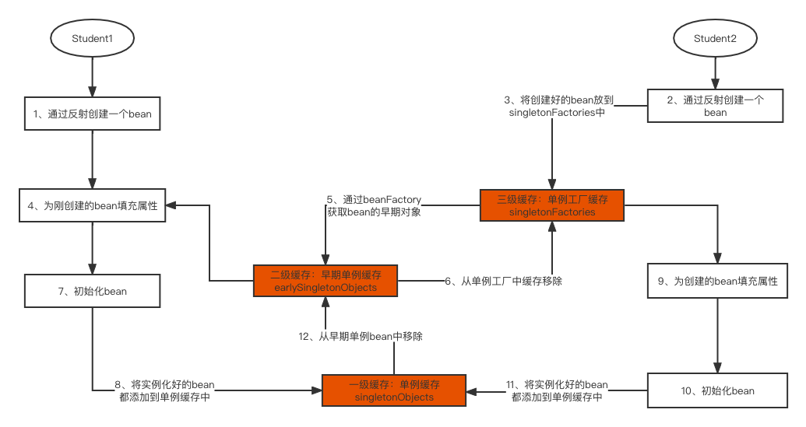

# 手把手带你吃透Spring框架核心源码

## 备注

主要笔记来自 儒猿技术窝：https://apppukyptrl1086.pc.xiaoe-tech.com/detail/p_620dbc7de4b04d7e2fcca5a0/6

在学习的时候可以结合 <<手撸Spring>>. 小傅哥.pdf 及学习笔记一块学习。https://github.com/fuzhengwei/small-spring

## 03-Resource 到底是个什么玩意儿

### 初始ClassPathResource

从 ClassPathResource 加载 applicationContext.xml 开始，了解下 ClassPathResource 是什么。

ClassPathResource 其实就是一个实现了 Resource 接口的实现类而已。和 ClassPathResource 类似的还有 UrlResource、FileSystemResource 和 InputStreamResource，它们都实现了 Resource 接口，而 Resource 接口又实现了 InputStreamSource 接口。

### Resource和InputStreamSource

首先，我们来回答第一个问题：什么是 Resource 接口？ =》`Spring 统一把所有使用到的资源都抽象成了 Resource，不同来源的资源对应着不同的 Resource 实现类。`

我们可以来看一下 Resource 接口中，都有哪些方法：



再来看看 InputStreamSource 接口是什么呢？


可以看到 InputStreamSource 接口中只有一个方法 getInputStream，而且方法返回的就是要给输入流 InputStream。

这也就意味着所有资源只要封装成了Resource，就可以通过调用 InputStreamResource 中的 getInputStream方法，获取资源对应的输入流 InputStream 了。

### 各种Resource是如何加载资源的呢？

ClassPathResource：

```java
public class ClassPathResource implements Resource {

    private final String path;

    private ClassLoader classLoader;

    public ClassPathResource(String path) {
        this(path, (ClassLoader) null);
    }

    public ClassPathResource(String path, ClassLoader classLoader) {
        Assert.notNull(path, "Path must not be null");
        this.path = path;
        this.classLoader = (classLoader != null ? classLoader : ClassUtils.getDefaultClassLoader());
    }

    @Override
    public InputStream getInputStream() throws IOException {
        InputStream is = classLoader.getResourceAsStream(path);
        if (is == null) {
            throw new FileNotFoundException(
                    this.path + " cannot be opened because it does not exist");
        }
        return is;
    }
}
```

就是通过 classLoader 的底层方法来加载的，没什么特别的地方。

FileSystemResource：

```java
public class FileSystemResource implements Resource {

    private final File file;

    private final String path;

    public FileSystemResource(File file) {
        this.file = file;
        this.path = file.getPath();
    }

    public FileSystemResource(String path) {
        this.file = new File(path);
        this.path = path;
    }

    @Override
    public InputStream getInputStream() throws IOException {
        return new FileInputStream(this.file);
    }

    public final String getPath() {
        return this.path;
    }

}
```

更简单，无非是通过 JDK 底层方法，根据文件的路径去加载资源的 InputStrean。

UrlResource：

```java
public class UrlResource implements Resource{

    private final URL url;

    public UrlResource(URL url) {
        Assert.notNull(url,"URL must not be null");
        this.url = url;
    }

    @Override
    public InputStream getInputStream() throws IOException {
        URLConnection con = this.url.openConnection();
        try {
            return con.getInputStream();
        }
        catch (IOException ex){
            if (con instanceof HttpURLConnection){
                ((HttpURLConnection) con).disconnect();
            }
            throw ex;
        }
    }

}
```

通过对应 URL 连接去获取 InputStream。

## 04-Spring初级容器初始化：忽略指定接口自动装配功能

单元测试代码：

```java
XmlBeanFactory beanFactory= new XmlBeanFactory(new ClassPathResource("applicationContext.xml"));
Bean1 bean1 = (Bean1) beanFactory.getBean("bean1");
System.out.println(bean1);
```

### 初探ignoreDependencyInterface方法

1、XmlBeanFactory构造函数：

```java
/**
	 * Create a new XmlBeanFactory with the given resource,
	 * which must be parsable using DOM.
	 * @param resource the XML resource to load bean definitions from
	 * @throws BeansException in case of loading or parsing errors
	 */
	public XmlBeanFactory(Resource resource) throws BeansException {
		this(resource, null);
	}

	/**
	 * Create a new XmlBeanFactory with the given input stream,
	 * which must be parsable using DOM.
	 * @param resource the XML resource to load bean definitions from
	 * @param parentBeanFactory parent bean factory
	 * @throws BeansException in case of loading or parsing errors
	 */
	public XmlBeanFactory(Resource resource, BeanFactory parentBeanFactory) throws BeansException {
		super(parentBeanFactory);
		this.reader.loadBeanDefinitions(resource);
	}
```

2、先来看父类构造函数干了些什么：

```java
/**
	 * Create a new AbstractAutowireCapableBeanFactory.
	 */
	public AbstractAutowireCapableBeanFactory() {
		super();
		ignoreDependencyInterface(BeanNameAware.class);
		ignoreDependencyInterface(BeanFactoryAware.class);
		ignoreDependencyInterface(BeanClassLoaderAware.class);
	}
```

### ignoreDependencyInterface方法是干什么的呢

```java
public void ignoreDependencyInterface(Class<?> ifc) {
  this.ignoredDependencyInterfaces.add(ifc);
}
```

ignoredDependencyInterfaces 就是个 Set 集合，也就是将这三个 Aware 放入 Set 集合。

搜了一下代码，ignoredDependencyInterfaces 只在 isExcludedFromDependencyCheck的方法中用到了：

```java
/**
	 * Determine whether the given bean property is excluded from dependency checks.
	 * <p>This implementation excludes properties defined by CGLIB and
	 * properties whose type matches an ignored dependency type or which
	 * are defined by an ignored dependency interface.
	 * @param pd the PropertyDescriptor of the bean property
	 * @return whether the bean property is excluded
	 * @see #ignoreDependencyType(Class)
	 * @see #ignoreDependencyInterface(Class)
	 */
	protected boolean isExcludedFromDependencyCheck(PropertyDescriptor pd) {
		return (AutowireUtils.isExcludedFromDependencyCheck(pd) ||
				this.ignoredDependencyTypes.contains(pd.getPropertyType()) ||
				AutowireUtils.isSetterDefinedInInterface(pd, this.ignoredDependencyInterfaces));
}
```

根据这个方法的注释可以知道，这个方法的作用就是明确一个bean的属性是否要从依赖检查中排除掉。

```java
/**
 * Return whether the setter method of the given bean property is defined
 * in any of the given interfaces.
 * @param pd the PropertyDescriptor of the bean property
 * @param interfaces the Set of interfaces (Class objects)
 * @return whether the setter method is defined by an interface
 */
public static boolean isSetterDefinedInInterface(PropertyDescriptor pd, Set<Class<?>> interfaces) {
   Method setter = pd.getWriteMethod();
   if (setter != null) {
      Class<?> targetClass = setter.getDeclaringClass();
      for (Class<?> ifc : interfaces) {
         // 判断属性所在的类，是否实现了这些Aware接口
         // 并且在这些感知接口中，是否也存在相同的setter方法
         if (ifc.isAssignableFrom(targetClass) && ClassUtils.hasMethod(ifc, setter)) {
            return true;
         }
      }
   }
   return false;
}
```

这个方法主要判断两点：

- 一是bean的属性对应的类，是否实现了 BeanNameAware、BeanClassLoaderAware、BeanFactoryAware的某个接口；
- 二是这个bean属性对应的setter方法，在这三个感知接口中是否也存在相同的方法。

如果同时满足这两点，方法 isSetterDefinedInInterface 就会返回true，Spring 在自动装配时也就是在创建这个bean时，就不会给该属性注入值了。

来看这个demo，可能会更容易理解：

src/test/java/com/fullstackboy/springdemo/bean/AwareTest.java

我们从输出结果中可以看出：

就算在 xml 中为属性设置了值，最终也不能注入到 bean 的属性 beanName 中。

而这个结果，其实就是 Spring 内部调用了 BeanNameAware 接口的 setBeanName 方法，为 User2 设置了 beanName 属性的值。

`分析到这里其实已经真相大白了，也就是说如果一个 bean 实现了BeanNameAware、BeanClassLoaderAware、BeanFactoryAware的某个接口的话，那个 bean 中的属性值如果想要通过 Spring 进行自动装配赋值的话，这个属性对应的 setter 方法，就不能和 感知接口中的方法相同。`

如果相同的话，Spring 就不会为给属性自动装配赋值，而是让 Spring 内部自动调用这些感知接口的方法，来为这些属性赋值。

- 这也是这些感知接口存在的意义了，毕竟，bean 都实现了这些感知接口了，而感知接口恰好已经通过方法 ignoreDependencyInterface 添加到忽略感知接口的集合中了，这就相当于这些属性的赋值权利交给 Spring 内部来决定了。

- Spring 这样设计其实也有一定的合理性了，比如你实现了 BeanNameAware 接口，对应的 beanName 属性的值，当然是这个 bean 在 Spring 容器中的名称啊。

- 此时，如果你从外部的 xml 或注解中注入了一个其它的名称，Spring 理所应当就会忽略掉这个外来值的自动装配了，确保 bean 名称的唯一性。

### Spring中的感知接口又是什么呢



`当bean实现了这些感知接口时，Spring 在实例化这些 bean 的时候，就会调用感知接口中的方法，注入相应的数据。`

我们用一个例子来演示一下，这个感知接口有什么用？

src/test/java/com/fullstackboy/springdemo/bean/AopTest.java

## 05-Spring初级容器初始化：基础数据的准备

1、再回到 XmlBeanFactory 的构造函数中：

```java
/**
	 * Create a new XmlBeanFactory with the given input stream,
	 * which must be parsable using DOM.
	 * @param resource the XML resource to load bean definitions from
	 * @param parentBeanFactory parent bean factory
	 * @throws BeansException in case of loading or parsing errors
	 */
	public XmlBeanFactory(Resource resource, BeanFactory parentBeanFactory) throws BeansException {
		super(parentBeanFactory);
		this.reader.loadBeanDefinitions(resource);
	}
```

### EncodedResource是什么呢

2、XmlBeanDefinitionReader#loadBeanDefinitions

```java
@Override
	public int loadBeanDefinitions(Resource resource) throws BeanDefinitionStoreException {
		return loadBeanDefinitions(new EncodedResource(resource));
	}
```

3、EncodedResource

```java
public EncodedResource(Resource resource) {
  this(resource, null, null);
}

private EncodedResource(Resource resource, @Nullable String encoding, @Nullable Charset charset) {
  super();
  Assert.notNull(resource, "Resource must not be null");
  this.resource = resource;
  this.encoding = encoding;
  this.charset = charset;
}
```

在 EncodedResource 类中，使用到 encoding 和 charset 的地方也就一个地方，getReader 方法：

```java
public Reader getReader() throws IOException {
  if (this.charset != null) {
    return new InputStreamReader(this.resource.getInputStream(), this.charset);
  }
  else if (this.encoding != null) {
    return new InputStreamReader(this.resource.getInputStream(), this.encoding);
  }
  else {
    return new InputStreamReader(this.resource.getInputStream());
  }
}
```

可以看到在getReader中：

- 首先会通过getInputStream 方法获取 resource 的输入流，同时会执行字符集或编码，但是现在我们传入的charset和encoding都为null，所以创建的就是一个没有指定字符集和编码的 InputStreamReader；
- InputStreamReader 大家多少都会了解一点，就是 Java SE IO 流中将字节输入流转换为字符输入流的 API，很明显接下来 Spring 将以字符输入流，读取我们的资源Resource。
  - 字符输入流：FileReader 和 BufferedReader；
  - 字符输出流：FileWriter 和 BufferedWriter；
  - FileReader 类仅仅是 InputStreamReader 类的衍生类并未扩展任何功能；
  - `FileReader 类读取数据实质就是 InputStreamReader 类在读取`，而 InputStreamReader 读取实际是 StreamDecoder 类读取。

### 基础数据的准备工作

了解了 EncodedResource 之后，我们再继续回到刚才的位置，查看 XmlBeanDefinitionReader#loadBeanDefinitions方法：

```java
@Override
public int loadBeanDefinitions(Resource resource) throws BeanDefinitionStoreException {
  return loadBeanDefinitions(new EncodedResource(resource));
}

public int loadBeanDefinitions(EncodedResource encodedResource) throws BeanDefinitionStoreException {
  Assert.notNull(encodedResource, "EncodedResource must not be null");
  if (logger.isTraceEnabled()) {
    logger.trace("Loading XML bean definitions from " + encodedResource);
  }

  Set<EncodedResource> currentResources = this.resourcesCurrentlyBeingLoaded.get();

  if (!currentResources.add(encodedResource)) {
    throw new BeanDefinitionStoreException(
      "Detected cyclic loading of " + encodedResource + " - check your import definitions!");
  }
	
  // 获取 encodedResource的输入流
  try (InputStream inputStream = encodedResource.getResource().getInputStream()) {
    // 通过输入流来构建InputResource，并设置响应的编码
    InputSource inputSource = new InputSource(inputStream);
    if (encodedResource.getEncoding() != null) {
      inputSource.setEncoding(encodedResource.getEncoding());
    }
    // 正式开始加载资源
    return doLoadBeanDefinitions(inputSource, encodedResource.getResource());
  }
  catch (IOException ex) {
    throw new BeanDefinitionStoreException(
      "IOException parsing XML document from " + encodedResource.getResource(), ex);
  }
  finally {
    currentResources.remove(encodedResource);
    if (currentResources.isEmpty()) {
      this.resourcesCurrentlyBeingLoaded.remove();
    }
  }
}
```

到这一步，数据准备的工作才算完成，从 doLoadBeanDefinitions 开始就要正式解析 Xml 配置文件了。

## 06-Spring初级容器初始化：加载XML的Document

### Spring是如何解析XML的

XmlBeanDefinitionReader：

```java
protected int doLoadBeanDefinitions(InputSource inputSource, Resource resource)
			throws BeanDefinitionStoreException {

		try {
      // 根据输入流和 resource，创建xml文件对应的Documnet
			Document doc = doLoadDocument(inputSource, resource);
      // 解析Document，并注册bean到Spring容器中
			int count = registerBeanDefinitions(doc, resource);
			if (logger.isDebugEnabled()) {
				logger.debug("Loaded " + count + " bean definitions from " + resource);
			}
			return count;
		}
		catch (BeanDefinitionStoreException ex) {
			throw ex;
		}
		catch (SAXParseException ex) {
			throw new XmlBeanDefinitionStoreException(resource.getDescription(),
					"Line " + ex.getLineNumber() + " in XML document from " + resource + " is invalid", ex);
		}
		catch (SAXException ex) {
			throw new XmlBeanDefinitionStoreException(resource.getDescription(),
					"XML document from " + resource + " is invalid", ex);
		}
		catch (ParserConfigurationException ex) {
			throw new BeanDefinitionStoreException(resource.getDescription(),
					"Parser configuration exception parsing XML from " + resource, ex);
		}
		catch (IOException ex) {
			throw new BeanDefinitionStoreException(resource.getDescription(),
					"IOException parsing XML document from " + resource, ex);
		}
		catch (Throwable ex) {
			throw new BeanDefinitionStoreException(resource.getDescription(),
					"Unexpected exception parsing XML document from " + resource, ex);
		}
	}
```

doLoadDocument -》loadDocument

DefaultDocumentLoader#loadDocument

```java
/**
	 * Load the {@link Document} at the supplied {@link InputSource} using the standard JAXP-configured
	 * XML parser.
	 */
	@Override
	public Document loadDocument(InputSource inputSource, EntityResolver entityResolver,
			ErrorHandler errorHandler, int validationMode, boolean namespaceAware) throws Exception {

		DocumentBuilderFactory factory = createDocumentBuilderFactory(validationMode, namespaceAware);
		if (logger.isTraceEnabled()) {
			logger.trace("Using JAXP provider [" + factory.getClass().getName() + "]");
		}
		DocumentBuilder builder = createDocumentBuilder(factory, entityResolver, errorHandler);
		return builder.parse(inputSource);
	}
```

看到这里几乎就真相大白了，Spring其实是通过 DOM 来解析XML文件的。

### XML解析的示例：DOM解析

详细见：/Users/lyf/Workspace/www/blog-demo/test-demo/src/main/java/com/fullstackboy/dmoparsexml/Test.java

### Spring是如何加载Resource的

```java
@Override
	public Document loadDocument(InputSource inputSource, EntityResolver entityResolver,
			ErrorHandler errorHandler, int validationMode, boolean namespaceAware) throws Exception {

		DocumentBuilderFactory factory = createDocumentBuilderFactory(validationMode, namespaceAware);
		if (logger.isTraceEnabled()) {
			logger.trace("Using JAXP provider [" + factory.getClass().getName() + "]");
		}
		DocumentBuilder builder = createDocumentBuilder(factory, entityResolver, errorHandler);
		return builder.parse(inputSource);
	}
```

可以看到，Spring加载Resource的方式几乎与案例中是一样的。

最后还有一个疑问，这个entityResolver参数是什么? =》 它是Spring对XML文件的校验。

## 07-Spring初级容器初始化：XML文件的校验模式

https://apppukyptrl1086.pc.xiaoe-tech.com/detail/i_620dc453e4b054255d9ebd3e/1?from=p_620dbc7de4b04d7e2fcca5a0&type=6&parent_pro_id=


## 13-Spring初级容器初始化：BeanDefinition是如何注册到Spring容器

这一节，我们找到了 BeanDefinition 注册的入口，发现了 Spring 容器其实就是一个Map，将 bean 注册到 Spring 容器的过程也很简单，就是将 bean name 当做key，以 bean 对应的 BeanDefinition 为 value 注册到这个Map 中去。

另外考虑到线程安全的问题，Spring 容器对应的 Map 也就是 beanDefinitionMap，其实是多线程安全类型的 ConcurrentHashMap。

## 14-Spring高级容器初始化：初探容器ApplicationContext初始化

ApplicationContext 在初级容器（XmlBeanFactory）的基础之上，扩展了非常多的高级特性，同时也给我们提供了非常多的功能扩展点，通过这些功能扩展点，我们可以将 Spring 这个框架的功能改造的更加满足于我们实际业务的场景。

### 初始化容器上下文环境

### 初始化容器BeanFactory

### 加载XML中的BeanDefinition

## 16-Spring高级容器初始化：初步添加扩展功能点

### 添加SPEL语言的支持

在 Spring 创建 bean 的时候，发现 bean 的某个属性值存在表达式 "#{}"（SPEL表达式），就会利用 StandardBeanExpressionResolver 来解析。 

AbstractApplicationContext#prepareBeanFactory

```java
beanFactory.setBeanExpressionResolver(new StandardBeanExpressionResolver(beanFactory.getBeanClassLoader()));
```

为 beanFactory 设置#{...}表达式的解析器。

### 添加属性编辑器的注册器

AbstractApplicationContext#prepareBeanFactory：

```java
beanFactory.addPropertyEditorRegistrar(new ResourceEditorRegistrar(this, getEnvironment()));
```

为 beanFactory 添加属性编辑器 PropertyEditor 的注册器。

```java
public void registerCustomEditors(PropertyEditorRegistry registry) {
		ResourceEditor baseEditor = new ResourceEditor(this.resourceLoader, this.propertyResolver);
		doRegisterEditor(registry, Resource.class, baseEditor);
		doRegisterEditor(registry, ContextResource.class, baseEditor);
		doRegisterEditor(registry, InputStream.class, new InputStreamEditor(baseEditor));
		doRegisterEditor(registry, InputSource.class, new InputSourceEditor(baseEditor));
		doRegisterEditor(registry, File.class, new FileEditor(baseEditor));
		doRegisterEditor(registry, Path.class, new PathEditor(baseEditor));
		doRegisterEditor(registry, Reader.class, new ReaderEditor(baseEditor));
		doRegisterEditor(registry, URL.class, new URLEditor(baseEditor));

		ClassLoader classLoader = this.resourceLoader.getClassLoader();
		doRegisterEditor(registry, URI.class, new URIEditor(classLoader));
		doRegisterEditor(registry, Class.class, new ClassEditor(classLoader));
		doRegisterEditor(registry, Class[].class, new ClassArrayEditor(classLoader));

		if (this.resourceLoader instanceof ResourcePatternResolver) {
			doRegisterEditor(registry, Resource[].class,
					new ResourceArrayPropertyEditor((ResourcePatternResolver) this.resourceLoader, this.propertyResolver));
		}
	}
```

我们来看一个InputStreamEditor：

InputStreamEditor#setAsText：

```java
public void setAsText(String text) throws IllegalArgumentException {
		this.resourceEditor.setAsText(text);
		Resource resource = (Resource) this.resourceEditor.getValue();
		try {
			setValue(resource != null ? resource.getInputStream() : null);
		}
		catch (IOException ex) {
			throw new IllegalArgumentException("Failed to retrieve InputStream for " + resource, ex);
		}
	}
```

看到这里大家应该明白了吧，首先会通过InputStreamEditor中的setAsText方法传进来一个 String 类型的参数text，然后通过各种解析得到了 InputStream。

同理，我们可以推断出FileEditor、URLEditor 等其它编辑器Editor 是用来将 Spring 解析为相应对象的。

**那为什么我们需要这些属性编辑器，来将字符串 String 转化为各种对象呢？这其实跟 XML 配置文件的局限性有关。**

**Spring 容器会在初始化的时候就会注册各种各样的属性编辑器，当在 bean 实例化需要设置相应的属性值时，这些属性编辑器就会根据相应字符串String解析并转换为相应对象了，并为bean的这些属性赋值，完成bean的实例化。**

### 添加ApplicationContextAwareProcessor

AbstractApplicationContext#prepareBeanFactory：

```java
// 添加执行各种感知接口方法的后处理器
beanFactory.addBeanPostProcessor(new ApplicationContextAwareProcessor(this));
```

可以看到，会初始化一个 ApplicationContextAwareProcessor 类型的对象，并添加到 beanFactory 中。

我们能够隐约的感觉到 ApplicationContextAwareProcessor 与我们之前了解的 Aware 接口有关联。

可以看到 ApplicationContextAwareProcessor 一进来，就看到一个很明显的方法：postProcessBeforeInitialization：

```java
public Object postProcessBeforeInitialization(Object bean, String beanName) throws BeansException {
		if (!(bean instanceof EnvironmentAware || bean instanceof EmbeddedValueResolverAware ||
				bean instanceof ResourceLoaderAware || bean instanceof ApplicationEventPublisherAware ||
				bean instanceof MessageSourceAware || bean instanceof ApplicationContextAware)){
			return bean;
		}

		AccessControlContext acc = null;

		if (System.getSecurityManager() != null) {
			acc = this.applicationContext.getBeanFactory().getAccessControlContext();
		}

		if (acc != null) {
			AccessController.doPrivileged((PrivilegedAction<Object>) () -> {
				invokeAwareInterfaces(bean);
				return null;
			}, acc);
		}
		else {
			invokeAwareInterfaces(bean);
		}

		return bean;
	}

	private void invokeAwareInterfaces(Object bean) {
		if (bean instanceof EnvironmentAware) {
			((EnvironmentAware) bean).setEnvironment(this.applicationContext.getEnvironment());
		}
		if (bean instanceof EmbeddedValueResolverAware) {
			((EmbeddedValueResolverAware) bean).setEmbeddedValueResolver(this.embeddedValueResolver);
		}
		if (bean instanceof ResourceLoaderAware) {
			((ResourceLoaderAware) bean).setResourceLoader(this.applicationContext);
		}
		if (bean instanceof ApplicationEventPublisherAware) {
			((ApplicationEventPublisherAware) bean).setApplicationEventPublisher(this.applicationContext);
		}
		if (bean instanceof MessageSourceAware) {
			((MessageSourceAware) bean).setMessageSource(this.applicationContext);
		}
		if (bean instanceof ApplicationContextAware) {
			((ApplicationContextAware) bean).setApplicationContext(this.applicationContext);
		}
	}
```

很明显，postProcessBeforeInitialization 是专门处理这 6个接口的实现类的。

**之前已经讲过，如果一个 bean 实现了感知接口，Spring 容器在实例化 bean 的时候就会调用感知的方法，将 Spring 容器内部的对象注入到感知接口方法中，这样的话，实现了感知接口的bean就可以拿到 Spring的内部对象，就可以对 Spring 容器做自定义改造了。**

`比如说，我们经常要在很多地方用到 Spring 容器，通过容器获取一些 bean。我们就可以让 bean 预先实现 ApplicationContextAware 接口。`

`Spring 在实例化 bean 的时候，就会通过调用 setApplicationContext 方法，将 ApplicationContext 注入到bean中了，这个 bean 获取到 ApplicationContext 之后，容器中所有的 bean 就都可以获取了。`

Spring容器在初始化 bean之前会统一执行所有后置处理器（BeanPostProcessor）的前置（postProcessBeforeInitialization）处理方法。

### 添加需要忽略的感知接口

AbstractApplicationContext#prepareBeanFactory：

```java
// 为 beanFactory 添加需要忽略的感知接口
beanFactory.addBeanPostProcessor(new ApplicationContextAwareProcessor(this));
beanFactory.ignoreDependencyInterface(EnvironmentAware.class);
beanFactory.ignoreDependencyInterface(EmbeddedValueResolverAware.class);
beanFactory.ignoreDependencyInterface(ResourceLoaderAware.class);
beanFactory.ignoreDependencyInterface(ApplicationEventPublisherAware.class);
beanFactory.ignoreDependencyInterface(MessageSourceAware.class);
beanFactory.ignoreDependencyInterface(ApplicationContextAware.class);
```

简单来说说，如果一个bean实现了传入ignoreDependencyInterface方法的这些感知接口，Spring 是不允许注入任何的依赖到 bean 中的，只允许 Spring 内部调用感知接口来注入相应的依赖。

### 添加指定接口的依赖

```java
// 为 beanFactory 注册指定接口的依赖实现类
beanFactory.registerResolvableDependency(BeanFactory.class, beanFactory);
beanFactory.registerResolvableDependency(ResourceLoader.class, this);
beanFactory.registerResolvableDependency(ApplicationEventPublisher.class, this);
beanFactory.registerResolvableDependency(ApplicationContext.class, this);
```

#### 为什么要为这些接口指定依赖呢？

目的也很简单，如果要从 Spring 容器中获取一个 bean，如果这个 bean实现的接口是 BeanFactory、ResourceLoader、ApplicationEventPublisher、ApplicationContext 中的任何一个，就直接返回方法 registerResolvableDependency 中设置进去的 beanFactory 给你。

`比如：你要从 Spring 容器中获取一个 bean，恰好这个 bean 实现了接口 ApplicationContext，此时就算你自己写了一个实现ApplicationContext接口的类注入到 Spring容器中，Spring 最终也会忽略掉你写的那个 bean，而使用方法registerResolvableDependency中设置进去的 beanFactory 给你。`

**这样的话，Spring 就可以保证 Spring 中一些关键的接口，它们实现类只能是 Spring 内部指定的一些对象了。**

## 17-Spring高级容器初始化：BeanFactoryPostProcessor是什么呢

### 空实现的工厂后处理方法

AbstractApplicationContext#refresh：

```java
// 空实现，留给子类去拓展实现
// 用于注册特殊的后处理器来加载特殊的一些bean
postProcessBeanFactory(beanFactory);
```

```java
/**
 * 在ApplicationContext 初始化完成后，可以通过该方法来修改 ApplicationContext的beanFactory
 * 因为这个时候，所有bean的BeanDefinition，已经加载到了 beanFactory容器中了，但是这些bean都还没有实例
 * 化，可以通过该方法注册一些后处理器来修改bean的信息
 */
protected void postProcessBeanFactory(ConfigurableListableBeanFactory beanFactory) {
}
```

可以看到 postProcessBeanFactory 是一个空实现，是由 protected 关键字修饰的，毫无疑问，该方法也是 Spring 提供给我们的一个扩展点。

bean 的实例化说白了就是创建一个bean对象，触发实例化最常见的一个场景就是我们直接调用容器的getBean方法，这个时候，Spring就会获取容器中的BeanDefinition，利用BeanDefinition中的各种属性值去创建一个bean出来，这个过程就是bean的实例化。

### 自定义空实现工厂后处理方法

见 /Users/lyf/Workspace/www/blog-demo/spring-demo/src/test/java/com/fullstackboy/springdemo/bean/AwareTest.java

### BeanFactoryPostProcessor是什么呢

```java
// 执行 beanFactory，即Spring容器级别的后处理器
invokeBeanFactoryPostProcessors(beanFactory);
```

```java
@FunctionalInterface
public interface BeanFactoryPostProcessor {

	/**
	 * 在ApplicationContext初始化完成后，可以通过该方法来修改ApplicationContext内部的beanFactory
	 * 因为这个时候所有的beanDefinition，已经加载到了beanFactory中，但这些bean都还没有实例化。
	 * 允许我们覆盖该方法，修改beanDefinition。
	 * @param beanFactory the bean factory used by the application context
	 * @throws org.springframework.beans.BeansException in case of errors
	 */
	void postProcessBeanFactory(ConfigurableListableBeanFactory beanFactory) throws BeansException;

}
```

可以看到，BeanFactoryPostProcessor#postProcessBeanFactory 和我们之前看的AbstractApplicationContext#postProcessBeanFactory 一样，都是空实现，也就是给了我们一次机会，允许我们通过beanFactory去获取相应的BeanDefinition并修改相应的信息。

### 自定义BeanFactoryPostProcessor

但是和刚才实现的postProcessBeanFactory方法稍微有些不同的，就是需要额外实现 BeanFactoryPostProcessor 接口。

详见 /Users/lyf/Workspace/www/blog-demo/spring-demo/src/test/java/com/fullstackboy/springdemo/MyBeanFactoryPostProcessorDemo.java

看到这里，大家心里可能会有一个疑惑：

既然我们在refresh方法中就可以通过继承 空实现方法postProcessBeanFactory来修改beanFactory容器级别的信息，Spring 为什么还要给我们提供 BeanFactoryPostProcessor 呢？

个人觉得，如果我们要修改 beanFactory 中的很多种信息，而且每种修改操作的逻辑都非常的复杂，这些逻辑势必会耦合在一个方法中，这样也不太好。

现在有了 BeanFactoryPostProcessor 接口之后，我们可以为每种修改操作分别创建一个类实现接口 BeanFactoryPostProcessor，这样的话至少在代码上是解耦的。

## 18-Spring高级容器初始化：BeanFactoryPostProcessor如何执行

基本上是源码层面，太细化：https://apppukyptrl1086.pc.xiaoe-tech.com/detail/i_620dcd5de4b054255d9ec084/1?from=p_620dbc7de4b04d7e2fcca5a0&type=6&parent_pro_id=

## 19-Spring高级容器初始化：BeanPostProcessor是如何注册的呢？

## 初始 BeanPostProcessor

AbstractApplicationContext#refresh：

```java
// 在 Spring 容器中，注册 bean 的后处理器
registerBeanPostProcessors(beanFactory);	
```


在Spring框架中，BeanPostProcessor的postProcessBeforeInitialization、postProcessAfterInitialization的执行调用链如下：

```bash
AbstractAutowireCapableBeanFactory#doCreateBean：
会先实例化bean：
instanceWrapper = createBeanInstance(beanName, mbd, args);
然后后边再执行初始化bean：
exposedObject = initializeBean(beanName, exposedObject, mbd);


AbstractAutowireCapableBeanFactory#initializeBean
  -> applyBeanPostProcessorsBeforeInitialization()
  -> postProcessBeforeInitialization()
执行完：invokeInitMethods(beanName, wrappedBean, mbd)后，再执行：
applyBeanPostProcessorsAfterInitialization()
   -> postProcessAfterInitialization()  
```

会在 bean 实例化和依赖注入完毕后，分别在 bean实例化前、bean实例化后执行 postProcessBeforeInitialization、postProcessAfterInitialization。我们可以在这里加上自己的逻辑，比如去修改beanDefinition的属性信息。

关于 BeanPostProcessor 的demo见：

/Users/lyf/Workspace/www/blog-demo/spring-demo/src/test/java/com/fullstackboy/springdemo/UserPostProcessorDemo.java

## BeanPostProcessor的注册

## 20-Spring高级容器初始化：Spring是如何基于事件驱动的呢？

### 初始化消息源MessageSource

AbstractApplicationContext#refresh：

```java
// 在Spring容器中，初始化消息源MessageSource
initMessageSource();
```

Spring的MessageSource是用来处理国际化的，那什么是国际化呢？

比如一段文字，在不同的国家肯定使用不同的语言来显示的。

对于我们系统而言，就需要根据当前系统选择的国家地区，用相应的文字来显示。

但是，在日常开发中，对于使用Spring的MessageSource来支持国际化的场景已经是很少了，所以这里暂时不再过多的探讨。

### 初始化广播器ApplicationEventMulticaster

```java
// 初始化广播器
initApplicationEventMulticaster();
```

**如果容器中存在 "applicationEventMulticaster" 这个bean，则直接取出来，赋给applicationEventMulticaster；**

**如果容器中不存在 "applicationEventMulticaster" 这个bean，则直接创建一个SimpleApplicationEventMulticaster类型的对象，并设置到Spring容器beanFactory中。**

ApplicationEventMulticaster 是事件广播器，与它息息相关的是 ApplicationListener。

在Spring中，广播器 ApplicationEventMulticaster 可以注册多个事件监听器 ApplicationListener，当特定的事件 ApplicationListener 发生时，就会触发广播器 ApplicationEventMulticaster 来遍历各个 ApplicationListener 中的方法，看下到底是哪个负责监听的事件发生了，让指定的监听器来处理。

接下来，我们通过一个案例来看下在Spring中，是如何通过广播器和监听器来完成功能的。

### 如何基于Spring内部广播器发布事件

demo 见 /Users/lyf/Workspace/www/blog-demo/spring-demo/src/test/java/EventDemo.java

可以看到当 ClassPathXmlApplicationContext 初始化完成后，可以通过调用ClassPathXmlApplicationContext#publishEvent方法，触发我们定义好的事件。

### Spring中事件是如何发布的呢？

调用链：

```java
AbstractApplicationContext#publishEvent
->
SimpleApplicationEventMulticaster#multicastEvent
->
SimpleApplicationEventMulticaster#invokeListener
  -> doInvokeListener()

  ->  
private void doInvokeListener(ApplicationListener listener, ApplicationEvent event) {
        try {
            listener.onApplicationEvent(event);
        } catch (ClassCastException var6) {
            String msg = var6.getMessage();
            if (msg != null && !this.matchesClassCastMessage(msg, event.getClass())) {
                throw var6;
            }

            Log logger = LogFactory.getLog(this.getClass());
            if (logger.isTraceEnabled()) {
                logger.trace("Non-matching event type for listener: " + listener, var6);
            }
        }

    }  
```

看到这里大家就会明白了，最终会调用监听器里的 onApplicationEvent 方法执行监听器中的逻辑。

`因为目前只要我们自定义的监听器MyListener 会处理自定义事件 MyEvent，所以就算其它的监听器执行了onApplicationEvent 方法，也会选择无视这个事件。`

Spring 的这套基于事件驱动的机制，主要就是通过广播器ApplicationEventMulticaster 和监听器 ApplicationListener 来实现的，大家也可以理解为发布-订阅模式。

- ApplicationEventMulticaster 用来发布事件；
- ApplicationListener 监听订阅事件，每种监听器负责处理一个或多个事件。

而且如果大家冷静的分析一下，Spring的这套发布订阅的模式，采用的就是设计模式中的**观察者模式**。

- ApplicationEventMulticaster 做为广播事件的subject，属于被观察者；
- ApplicationListener 做为Observer 观察者，最终用来处理相应事件的，属于观察者 Observer。

## 21-Spring高级容器初始化：初始化非延迟加载单例bean

### 初始化非延迟加载的单例

AbstractApplicationContext#refresh：

```java
// 预先实例化那些非延迟加载的单例bean
finishBeanFactoryInitialization(beanFactory);
->
beanFactory.preInstantiateSingletons();  
```

DefaultListableBeanFactory#preInstantiateSingletons：

```java
public void preInstantiateSingletons()  throws BeansException {
  ......
	if (!bd.isAbstract() && bd.isSingleton() && !bd.isLazyInit()) 
  ......  
}
```

这个方法会遍历所有的beanDefinition，如果beanDefinition的scope值为 singleton 也就是单例的，且属性layzInit为false，说明该beanDefinition对应的bean是不允许懒加载的单例。

既然bean不允许懒加载，那就是立马去加载它了。就会直接调用 getBean(beanName)方法区实例化bean了。

又因为bean的scope属性为signleton，所以spring会把实例好的bean放一份到缓存中去。

这样当Spring下一次用到bean的实例时，就可以直接从缓存中获取bena的实例了。默认情况下配置的bean都是不会在Spring初始化的时候加载的。

### 开启Spring的生命周期

AbstractApplicationContext#refresh：

```java
// 初始化生命周期处理器，并发出相应事件进行通知
finishRefresh();

protected void finishRefresh() {
		// Clear context-level resource caches (such as ASM metadata from scanning).
		clearResourceCaches();

		// Initialize lifecycle processor for this context.
		initLifecycleProcessor();

		// 从Spring容器中获取所有实现了LifeCycle接口的bean，调用start方法开启它们的生命周期，也就是开启Spring的生命周期
		getLifecycleProcessor().onRefresh();

		// 发布上下文已经刷新完成的事件，广播器会把事件广播给相应的监听器去处理，这个事件相当于告诉Spring整个容器已经刷新了，也就是说Spring容器ApplicationContext已经初始化完毕了。
		publishEvent(new ContextRefreshedEvent(this));

		// Participate in LiveBeansView MBean, if active.
		LiveBeansView.registerApplicationContext(this);
	}

protected void initLifecycleProcessor() {
		ConfigurableListableBeanFactory beanFactory = getBeanFactory();
    // 判断Spring容器中，是否存在名称为lifecycleProcessor的bean
		if (beanFactory.containsLocalBean(LIFECYCLE_PROCESSOR_BEAN_NAME)) {
			this.lifecycleProcessor =
					beanFactory.getBean(LIFECYCLE_PROCESSOR_BEAN_NAME, LifecycleProcessor.class);
			if (logger.isTraceEnabled()) {
				logger.trace("Using LifecycleProcessor [" + this.lifecycleProcessor + "]");
			}
		}
		else {
      // 如果不存在，则创建一个DefaultLifecycleProcessor类型的bean
			DefaultLifecycleProcessor defaultProcessor = new DefaultLifecycleProcessor();
			defaultProcessor.setBeanFactory(beanFactory);
      // 设置给成员变量lifecycleProcessor
			this.lifecycleProcessor = defaultProcessor;
      // 并注册到Spring容器中
			beanFactory.registerSingleton(LIFECYCLE_PROCESSOR_BEAN_NAME, this.lifecycleProcessor);
			if (logger.isTraceEnabled()) {
				logger.trace("No '" + LIFECYCLE_PROCESSOR_BEAN_NAME + "' bean, using " +
						"[" + this.lifecycleProcessor.getClass().getSimpleName() + "]");
			}
		}
	}
```

那DefaultLifecycleProcessor又是什么呢？




在Spring中如果bean实现了接口Lifecycle，Spring会保证在容器启动时，就会调用这些bean中的start方法开启它们的生命周期，当然，在Spring关闭的时候也会调用stop方法来结束它们的生命周期。

## 22-bean的加载：转换并获取bean的名称

## 23-bean的加载：如何通过三级缓存来解决循环依赖（上）

### 认识一下setter注入循环依赖

demo见：/Users/lyf/Workspace/www/blog-demo/spring-demo/src/test/java/com/fullstackboy/springdemo/ApplicationContextDemo.java

### 认识一下构造方法注入循环依赖

demo见：/Users/lyf/Workspace/www/blog-demo/spring-demo/src/test/java/com/fullstackboy/springdemo/ApplicationContextDemo.java

## 24-bean的加载：如何通过三级缓存来解决循环依赖（下）

### Spring中的三级缓存机制

来详细看一下这个DefaultSingletonBeanRegistry#getSingleBean方法：

```java
public Object getSingleton(String beanName) {
		return getSingleton(beanName, true);
	}

protected Object getSingleton(String beanName, boolean allowEarlyReference) {
		// Quick check for existing instance without full singleton lock
    // 1、从单例缓存获取单例
		Object singletonObject = this.singletonObjects.get(beanName);
    // 2、如果bean还没有实例化，并且beanName对应的单例正在实例化
		if (singletonObject == null && isSingletonCurrentlyInCreation(beanName)) {
      // 3、从早期单例缓存中，获取初步实例化好的单例bean
			singletonObject = this.earlySingletonObjects.get(beanName);
      // 4、如果早期单例bean还没有创建好，并且允许早期引用
			if (singletonObject == null && allowEarlyReference) {
				synchronized (this.singletonObjects) {
					// Consistent creation of early reference within full singleton lock
					singletonObject = this.singletonObjects.get(beanName);
					if (singletonObject == null) {
						singletonObject = this.earlySingletonObjects.get(beanName);
						if (singletonObject == null) {
              // 5、从单例工厂中获取创建早期单例的工厂对象
							ObjectFactory<?> singletonFactory = this.singletonFactories.get(beanName);
							if (singletonFactory != null) {
                // 6、从工厂对象里获取早期的单例bean
								singletonObject = singletonFactory.getObject();
                // 7、将这个半成品的单例对象放入早期单例缓存中
								this.earlySingletonObjects.put(beanName, singletonObject);
                // 8、因为早期单例已经创建好了，就可以将该beanName从工厂缓存中移除了
								this.singletonFactories.remove(beanName);
							}
						}
					}
				}
			}
		}
		return singletonObject;
	}
```

**先从一级缓存拿，一级缓存里没有，再从二级缓存里拿，二级缓存没有，则从singletonFactories里取。**

对象工厂singletonFactory，我们可以理解为是封装了早期单例bean实例化的方法，通过调用singletonFactory.getObject()，可以获取到早期单例bean，也就是初始化到一半的bean。

可以看到，接下来Spring会将创建好的早期单例bean，再放到早期单例缓存 earlySingletonObjects 中，因为早期单例缓存已经获取到了，这个时候 ObjectFactory 就没存在的意义了，就会从 singletonFactories 删除掉，最后将得到单例bean直接返回了。

**这时我们会发现能够拿到 bean 实例（属性未填充），然后从三级缓存移除，放到二级缓存 earlySingletonObjects，而此时 B 注入的是一个半成品的实例 A 对象，不过随着 B 初始化完成后，A会继续进行后续的初始化，最终 B 会注入的是一个完整的 A 实例，因为在内存中它们是同一个对象。**

### Spring是如何解决循环依赖的

有没有一种可能，既能让Student1在实例化时获取到Student2的实例，同时Student2 又还没有开始为它的属性赋值，只要Student2 还没有开始为它的属性赋值，就不会出现循环依赖的问题了，Student1不就可以拿着Student2的早期实例bean，先完成实例化。

当Student2回过神来为自己的属性赋值时，发现自己需要Student1的实例，这个时候Student1已经实例化完了，这个时候，Student2就可以顺利拿到Student1的实例完成属性的设置，循环依赖的问题不就解决了吗。

我们继续看下面的流程，Spring处理循环的思路和上面大致差不多：



需要注意的是，以上只是Spring解决setter注入循环依赖的方式。而构造方法循环依赖的问题Spring是没法解决的，原因也很简答：

1、因为Spring废了很大的劲，才设计了这套三级缓存，通过提前暴露bean的早期单例bean，来解决setter注入循环依赖；

2、但是构造方法循环依赖问题，是在反射创建bean时就会发生的，此时Spring是没有办法获取到早期单例bean的，因为早期的单例bean都是需要通过反射才能获取得到；

3、所以对于构造方法循环依赖，Spring自然是爱莫能助了。

### Spring中三级缓存存在的意义

DefaultSingletonBeanRegistry#getSingleton

- 第一级 singletonObjects：就是用来存放 Spring 容器中全局唯一的单例 Bean；

- 第二级缓存 earlySingletonObjects：早期单例缓存，就是在 bean 还没有实例化完成时，临时用来存放早期单例的 bean； 

  - 作用：
    - 当大量的 bean 实例化都需要依赖另外一个 bean 实例时，早期单例缓存 earlySingletonObjects 就可以为其它的 bean 的实例化提供依赖的 bean 实例了；
    - 同时有了 earlySingletonObjects，对应的早期单例 bean 只需要从工厂缓存 singletonFactories 中，获取一次对象工厂 ObjectFactory 并创建一次即可，否则的话，你每次用到早期的单例 bean，都需要从 singletonFactories 获取相应的 ObjectFactory 来创建。前后这样对比的话，缓存 earlySingletonObjects 对性能还是有一定提升的。

- 第三级缓存 singletonFactories：用来创建早期单例 bean 的工厂缓存。 它的作用主要是提供了一个懒加载的选择，毕竟你通过 ObjectFactory 的 getObject 方法获取早期单例 bean 时，中间还是会有一些方法逻辑的，也就是会产生一些性能的损耗。所以 ObjectFactory 存放在缓存 singletonFactories 中的一个好处是，可以让你在用到早期单例缓存时，才来调用 ObjectFactory 的方法来获取 bean。

**补充**

singletonFactory.getObject 方法的主要逻辑是：

如果 bean 被 AOP 切面代理，则返回的是 beanProxy 对象，如果未被代理则返回的是 bean 实例。

## 25_bean的加载：如何通过FactoryBean来实例化bean？

### 判断单例是否为工厂引用

截止到目前为止，我们已经看到了Spring是如何从缓存中获取单例bean了，那么Spring从缓存中获取到单例bean之后，直接就返回了吗？

AbstractBeanFactory#doGetBean：

```java
protected <T> T doGetBean(
			String name, @Nullable Class<T> requiredType, @Nullable Object[] args, boolean typeCheckOnly)
			throws BeansException {

		String beanName = transformedBeanName(name);
		Object bean;

		// Eagerly check singleton cache for manually registered singletons.
		Object sharedInstance = getSingleton(beanName);
		if (sharedInstance != null && args == null) {
			if (logger.isTraceEnabled()) {
				if (isSingletonCurrentlyInCreation(beanName)) {
					logger.trace("Returning eagerly cached instance of singleton bean '" + beanName +
							"' that is not fully initialized yet - a consequence of a circular reference");
				}
				else {
					logger.trace("Returning cached instance of singleton bean '" + beanName + "'");
				}
			}
			bean = getObjectForBeanInstance(sharedInstance, name, beanName, null);
		}
    ......
```

AbstractBeanFactory#getObjectForBeanInstance
->
BeanFactoryUtils.isFactoryDereference(name)：

```java
/**
	 * 返回名称是否是工厂的一个引用
	 * (beginning with the factory dereference prefix).
	 * @param name the name of the bean
	 * @return whether the given name is a factory dereference
	 * @see BeanFactory#FACTORY_BEAN_PREFIX
	 */
	public static boolean isFactoryDereference(@Nullable String name) {
		return (name != null && name.startsWith(BeanFactory.FACTORY_BEAN_PREFIX));
	}
```

通过isFactoryDereference方法中的注释，我们可以初步判定，getBean方法传入的name如果以符号"&"为前缀，目的是要获取一个工厂bean，那么什么是工厂bean呢？

### FactoryBean是什么呢？

Spring 中比较重要的一个接口 FactoryBean，我们可以通过实现 FactoryBean 接口中的 getObject 方法，在 getObject 方法中定义如何创建一个对象，而实现了 FactoryBean 接口的实现类，就是这里的工厂 bean。

FactoryBean 可以说是全盘操办了 Bean 的实例化了。

那么，如何通过FactoryBean 来实例化一个 bean 呢？

案例见：/Users/lyf/Workspace/www/blog-demo/spring-demo/src/test/java/com/fullstackboy/springdemo/MyFactoryBeanDemo.java

### 通过FactoryBean来实例化Bean

调用链：

```bash
getObjectForBeanInstance()
 -> getObjectFromFactoryBean()
 -> doGetObjectFromFactoryBean()
 
```

FactoryBeanRegistrySupport#doGetObjectFromFactoryBean：

```java
private Object doGetObjectFromFactoryBean(FactoryBean<?> factory, String beanName) throws BeanCreationException {
   Object object;
   try {
      if (System.getSecurityManager() != null) {
         AccessControlContext acc = getAccessControlContext();
         try {
            object = AccessController.doPrivileged((PrivilegedExceptionAction<Object>) factory::getObject, acc);
         }
         catch (PrivilegedActionException pae) {
            throw pae.getException();
         }
      }
      else {
         // 调用 getObject方法来创建实例
         object = factory.getObject();
      }
   }
```

### 总结

首先，通过 Spring 默认实例化bean的方式创建了单例bean之后，如果单例bean不是 FactoryBean的实现类，就会直接返回这个单例bean；

但是如果这个bean实现了FactoryBean接口，这个时候又会有两种情况，如果你是以符号"&"为前缀的名称来获取bean的，那直接会将FactoryBean接口的实现类返回回去。

如果你通过不含有符号"&"为前缀的名称来获取bean时，且你配置的bean就是FactoryBean接口的实现类，此时就会通过FactoryBean的getObject方法来创建一个bean。

## 26-bean的加载：寻找实例化bean的入口

上一节，我们了解了Spring的另外一种实例化bean的方式，也就是通过实现FactoryBean接口中的getObject方法，来自定义实例化bean的逻辑。当然这种方式除非是有特殊场景的有这方面的需求，我们才通过这样的方式来实例化bean。

否则，Spring默认实例化bean的方式基本上就能满足绝大部分场景的需要了。

## 27_bean的加载：Spring默认是如何实例化bean的？

## 28_bean的加载：通过反射来实例化bean

### 检查Class是否符合条件

```bash
AbstractAutowireCapableBeanFactory#doCreateBean
   -> createBeanInstance

-> AbstractFactory#resolveBeanClass   
```

AbstractFactory#resolveBeanClass 

```java
protected BeanWrapper createBeanInstance(String beanName, RootBeanDefinition mbd, @Nullable Object[] args) {
		// 这里再次解析BeanDefinition中的class，确保现在bean的Class已经被解析好了(也就是xml配置文件中，定义bean的时候写的那个class="......"，大概率解析的时候类似于 Class.forName(....)这种方式)
		Class<?> beanClass = resolveBeanClass(mbd, beanName);
		
  	// 如果bean的类不是public修饰的，并且没有通过反射设置允许访问的权限
    // 此时当然就不能通过反射创建bean了，此时就会提前爆出异常
		if (beanClass != null && !Modifier.isPublic(beanClass.getModifiers()) && !mbd.isNonPublicAccessAllowed()) {
			throw new BeanCreationException(mbd.getResourceDescription(), beanName,
					"Bean class isn't public, and non-public access not allowed: " + beanClass.getName());
		}
```

### 通过工厂方法来实例化bean

AbstractAutowireCapableBeanFactory#createBeanInstance：

```java
protected BeanWrapper createBeanInstance(String beanName, RootBeanDefinition mbd, @Nullable Object[] args) {
  ......
  if (mbd.getFactoryMethodName() != null) {
    return instantiateUsingFactoryMethod(beanName, mbd, args);
  }
  ......
}    
```

Spring是如何通过静态工厂方法来实例化bean的呢，demo如下：

/Users/lyf/Workspace/www/blog-demo/spring-demo/src/test/java/com/fullstackboy/springdemo/FactoryMethodDemo.java

Spring是如何通过实例工厂方法来实例化bean的呢，demo如下：

/Users/lyf/Workspace/www/blog-demo/spring-demo/src/test/java/com/fullstackboy/springdemo/FactoryMethodDemo.java

通过上面两个小案例，我们可以意识到Spring既可以通过静态工厂来实例化bean，也可以通过实例工厂方法来实例化bean。Spring果然妥妥的是一个创建bean的大工厂。

**这时，我们再来回过头看 createBeanInstance 方法，getFactoryMethodName方法获取的，就是bean标签中factory-method属性配置的工厂名称，如果getFactoryMethodName返回值不为null，那么就用工厂方法来实例化bean了，就不会走Spring默认的实例化bean的逻辑了。**

### 通过反射实例化bean

AbstractAutowireCapableBeanFactory#createBeanInstance：

```java
-> instantiateBean()
```


通过instantiateBean方法上的注释，我们可以大概知道，instantiateBean方法是用来专门处理无参构造方法的bean，正好符合我们当前的状况：

```java
protected BeanWrapper instantiateBean(String beanName, RootBeanDefinition mbd) {
  try {
    Object beanInstance;
    if (System.getSecurityManager() != null) {
      beanInstance = AccessController.doPrivileged(
        (PrivilegedAction<Object>) () -> getInstantiationStrategy().instantiate(mbd, beanName, this),
        getAccessControlContext());
    }
    else {
      beanInstance = getInstantiationStrategy().instantiate(mbd, beanName, this);
    }
    BeanWrapper bw = new BeanWrapperImpl(beanInstance);
    initBeanWrapper(bw);
    return bw;
  }
  catch (Throwable ex) {
    throw new BeanCreationException(
      mbd.getResourceDescription(), beanName, "Instantiation of bean failed", ex);
  }
}
```

调用链：

```txt
AbstractAutowireCapableBeanFactory#instantiateBean -> SimpleInstantiationStrategy#instantiate
```

SimpleInstantiationStrategy#instantiate：

```java
@Override
public Object instantiate(RootBeanDefinition bd, @Nullable String beanName, BeanFactory owner) {
   // 如果当前bean的标签属性中没有配置属性lookup-method 或 relpace-method，则if分支成立
   if (!bd.hasMethodOverrides()) {
      Constructor<?> constructorToUse;
      synchronized (bd.constructorArgumentLock) {
         constructorToUse = (Constructor<?>) bd.resolvedConstructorOrFactoryMethod;
         if (constructorToUse == null) {
            final Class<?> clazz = bd.getBeanClass();
            if (clazz.isInterface()) {
               throw new BeanInstantiationException(clazz, "Specified class is an interface");
            }
            try {
               if (System.getSecurityManager() != null) {
                  constructorToUse = AccessController.doPrivileged(
                        (PrivilegedExceptionAction<Constructor<?>>) clazz::getDeclaredConstructor);
               }
               else {
                  constructorToUse = clazz.getDeclaredConstructor();
               }
               bd.resolvedConstructorOrFactoryMethod = constructorToUse;
            }
            catch (Throwable ex) {
               throw new BeanInstantiationException(clazz, "No default constructor found", ex);
            }
         }
      }
      return BeanUtils.instantiateClass(constructorToUse);
   }
   else {
      // 如果当前bean的标签属性中配置了属性lookup-method 或 relpace-method
      return instantiateWithMethodInjection(bd, beanName, owner);
   }
}
```


```java
@Override
protected Object instantiateWithMethodInjection(RootBeanDefinition bd, @Nullable String beanName, BeanFactory owner) {
   return instantiateWithMethodInjection(bd, beanName, owner, null);
}

@Override
protected Object instantiateWithMethodInjection(RootBeanDefinition bd, @Nullable String beanName, BeanFactory owner,
      @Nullable Constructor<?> ctor, Object... args) {

   // Must generate CGLIB subclass...
   return new CglibSubclassCreator(bd, owner).instantiate(ctor, args);
}
```

**结论**

可以看到，Spring底层对于需要覆写方法的bean的实例化，其实就是通过cglib 这套API来玩的。

了解了这个，我们再回到主线上来，因为当前探索的bean是不需要覆写方法的，所以 if 分支成立，执行：

```java
return BeanUtils.instantiateClass(constructorToUse);
```

而 instantiateClass 方法里可以看到一行：

```java
return ctor.newInstance(argsWithDefaultValues);
```

通过反射来实例化一个bean。

**结论**

果然，Spring默认就是通过反射来实例化一个bean的。

## 29_bean的加载：为刚刚实例化的bean填充属性（上）

### 通过缓存提前曝光早期单例bean

AbstractAutowireCapableBeanFactory#doCreateBean：

```java
// 如果当前实例的bean为单例，且允许循环应用，并且当前的bean正在处于创建中
// 此时允许暴露早期单例bean(这里也是之前可以在对象工厂缓存中，获取到ObjectFactory的关键，ObjectFactory就是在这里添加的)
boolean earlySingletonExposure = (mbd.isSingleton() && this.allowCircularReferences &&
				isSingletonCurrentlyInCreation(beanName));
if (earlySingletonExposure) {
  if (logger.isTraceEnabled()) {
    logger.trace("Eagerly caching bean '" + beanName +
                 "' to allow for resolving potential circular references");
  }
  addSingletonFactory(beanName, () -> getEarlyBeanReference(beanName, mbd, bean));
}
```

DefaultSingletonBeanRegistry#addSingletonFactory：

```java
protected void addSingletonFactory(String beanName, ObjectFactory<?> singletonFactory) {
   Assert.notNull(singletonFactory, "Singleton factory must not be null");
   synchronized (this.singletonObjects) {
      if (!this.singletonObjects.containsKey(beanName)) {
         this.singletonFactories.put(beanName, singletonFactory);
         this.earlySingletonObjects.remove(beanName);
         this.registeredSingletons.add(beanName);
      }
   }
}
```

**果然，Spring就是在这里将封装了早期单例bean的singletonFactory，添加到了三级缓存，也就是单例工厂缓存singletonFactories 中。**

又因为singletonFactories里的数据才刚添加，所以需要将earlySingletonObjects中关于beanName的信息都清除掉，因为早期单例缓存earlySingletonObjects里的数据都是来自于三级缓存singletonFactories。

`看到这里，前面解决bean循环依赖的最后一个盲点也解决了`。**正是因为bean在实例化时，提前将还未实例化好的早期单例bean通过缓存向外界曝光，这样的话，当其它bean在实例化时才能有机会尽早获取到早期单例，进而解决循环依赖问题。**

## 30_bean的加载：为刚刚实例化的bean填充属性（下）

### Spring中有哪些装配模式

AbstractBeanDefinition：

```java
public abstract class AbstractBeanDefinition extends BeanMetadataAttributeAccessor
      implements BeanDefinition, Cloneable {

   /**
    * Constant for the default scope name: {@code ""}, equivalent to singleton
    * status unless overridden from a parent bean definition (if applicable).
    */
   public static final String SCOPE_DEFAULT = "";

   /**
    * Constant that indicates no external autowiring at all.
    * @see #setAutowireMode
    */
   public static final int AUTOWIRE_NO = AutowireCapableBeanFactory.AUTOWIRE_NO;

   /**
    * Constant that indicates autowiring bean properties by name.
    * @see #setAutowireMode
    */
   public static final int AUTOWIRE_BY_NAME = AutowireCapableBeanFactory.AUTOWIRE_BY_NAME;

   /**
    * Constant that indicates autowiring bean properties by type.
    * @see #setAutowireMode
    */
   public static final int AUTOWIRE_BY_TYPE = AutowireCapableBeanFactory.AUTOWIRE_BY_TYPE;

   /**
    * Constant that indicates autowiring a constructor.
    * @see #setAutowireMode
    */
   public static final int AUTOWIRE_CONSTRUCTOR = AutowireCapableBeanFactory.AUTOWIRE_CONSTRUCTOR;

   /**
    * Constant that indicates determining an appropriate autowire strategy
    * through introspection of the bean class.
    * @see #setAutowireMode
    * @deprecated as of Spring 3.0: If you are using mixed autowiring strategies,
    * use annotation-based autowiring for clearer demarcation of autowiring needs.
    */
   @Deprecated
   public static final int AUTOWIRE_AUTODETECT = AutowireCapableBeanFactory.AUTOWIRE_AUTODETECT;
```

Spring中一共有5种装配模式，其中第5种已经不推荐使用。

案例见：https://apppukyptrl1086.pc.xiaoe-tech.com/detail/i_62295bcfe4b0beaee4324239/1?from=p_620dbc7de4b04d7e2fcca5a0&type=6&parent_pro_id=

## 32_面试题：IOC和DI之间到底是什么关系？

### 什么是依赖关系

通过一个案例来解释：https://apppukyptrl1086.pc.xiaoe-tech.com/detail/i_622c1bd3e4b0beaee43351f5/1?from=p_620dbc7de4b04d7e2fcca5a0&type=6&parent_pro_id=

### 依赖关系会带来什么问题

深度耦合


### IOC思想的落地，使用DI来完成解耦

### Spring是如何支持依赖注入的？


