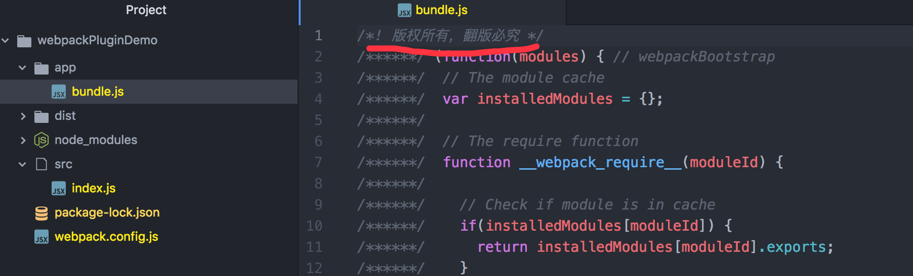

# webpack系列之plugin及简单的使用

## 一.plugin有什么用

> `plugin`是`webpack`核心功能，通过`plugin（插件）webpack`可以实现`loader`所不能完成的复杂功能，使用`plugin`丰富的自定义`API`，可以控制`webpack`编译流程的每个环节，**实现对`webpack`的自定义功能扩展。**

### 举例

我们`移山web`项目中就使用了`HtmlWebpackPlugin`插件，它帮助我们做了下面几件事儿：

1. 在工程打包成功后会自动生成一个`html`模板文件
2. 同时所依赖的`CSS/JS`也都会被自动引入到这个`html`模板文件中
3. 设置生成`hash`添加在引入文件地址的末尾，类似于我们常用的时间戳，来解决可能会遇到的缓存问题。

`移山web`项目打包后生成的模板文件如下：

```html
<!DOCTYPE html>
<html>
<head>
  <meta charset=utf-8>
  <title>移山</title>
  <link rel=icon href=/static/assets/favicon.ico type=image/x-icon>
  <link href=/static/css/app.37f937e3e08602bbb89778796e294cf1.css rel=stylesheet>
</head>
<body>
<div id=app>
</div>
<script type=text/javascript src=/static/js/manifest.2ae2e69a05c33dfc65f8.js></script>
<script type=text/javascript src=/static/js/vendor.d903c30c8b95cb48653b.js></script>
<script type=text/javascript src=/static/js/app.0c675ae0a3c300e0af57.js></script>
</body>
</html>
```

## 二.什么是plugin

> `plugin`是一个具有 `apply`方法的 `js`对象。 `apply`方法会被 `webpack`的 `compiler`（编译器）对象调用，并且 `compiler` 对象可在整个 `compilation`（编译）生命周期内访问。

一个`plugin`看起来大概是这个样子：

```javascript
function CustomPlugin(options){
  // options是配置文件，你可以在这里进行一些与options相关的工作
}

// 每个plugin都必须定义一个apply方法，webpack会自动调用这个方法
CustomPlugin.prototype.apply = function(compiler){
    ......
    });
}

module.exports = CustomPlugin;
```

如果对自定义插件感兴趣，想了解的更多的，可以看[这里](https://github.com/webpack/docs/wiki/how-to-write-a-plugin)。

## 三.使用plugin

在 `webpack` 配置文件（`webpack.config.js`）中，向 `plugins` 属性传入 `new` 实例即可。比如：

```javascript
const HtmlWebpackPlugin = require('html-webpack-plugin');
const webpack = require('webpack');
module.exports = {

  module: {
    loaders: [
      {
        test: /\.(js|jsx)$/,
        loader: 'babel-loader'
      }
    ]
  },
  plugins: [
    new webpack.optimize.UglifyJsPlugin(), //访问内置的插件
    new HtmlWebpackPlugin({template: './src/index.html'}) //访问第三方插件
  ]
};
```

#### 注意

- `webpack`中的插件分为内置插件和第三方插件

- 内置插件不需要额外安装依赖，如上面的例子中：[UglifyJsPlugin插件](https://www.npmjs.com/package/uglifyjs-webpack-plugin)

- 如果是第三方插件，如上面的例子中[HtmlWebpackPlugin插件](https://www.npmjs.com/package/html-webpack-plugin)，则使用之前需要进行安装：

  ```bash
  npm install html-webpack-plugin --save-dev
  ```

## 四.案例

在对`plugin`有了一个基本认识后，来做一个小案例：

> “我想对所有的文件打包后添加一个版权声明”

### 目录结构

`webpackPluginDemo`的目录结构如下： 

```bash
├── app 
├── package-lock.json 
├── package.json 
├── src 
│ └── index.js 
└── webpack.config.js
```

### 1. 安装webpack

在`webpackPluginDemo`根目录下安装`webpack:`

```bash
npm install --save-dev webpack
```

### 2.入口文件

index.js：

```bash
document.write('webpack系列之plugin的基本使用！');
```

### 3.webpack配置文件

webpack.config.js主要配置如下：

```bash
const webpack = require('webpack') 
module.exports = {
    entry:  __dirname + "/src/index.js",  //入口文件
    output: {
        path: __dirname + "/app",  //打包后的文件存放的地方
        filename: "bundle.js" //打包后输出文件的文件名
    },
    plugins: [
        new webpack.BannerPlugin('版权所有，翻版必究')
    ],
}
```

**注意**：`BannerPlugin`为内置插件，如果是其它的外置插件，则需在使用前要先安装。

### 4.执行打包命令

```bash
➜  webpackPluginDemo webpack
Hash: 16453f43abe665633286
Version: webpack 2.4.1
Time: 70ms
    Asset     Size  Chunks             Chunk Names
bundle.js  2.86 kB       0  [emitted]  main
   [0] ./src/index.js 210 bytes {0} [built]
```

### 5.查看结果

打包成功，可以看到`app`目录下面已经生成了`bundle.js`，打开`bundle.js`会发现版权信息已经加上了：



## 五.常用插件

### 插件列表

1. [BannerPlugin](https://doc.webpack-china.org/plugins/banner-plugin/)：对所有的文件打包后添加一个版权声明
2. [uglifyjs-webpack-plugin](https://www.npmjs.com/package/uglifyjs-webpack-plugin)： 对JS进行压缩混淆
3. [HtmlWebpackPlugin](https://www.npmjs.com/package/html-webpack-plugin)：可以根据模板自动生成html代码，并自动引用css和js文件
4. [Hot Module Replacement](https://doc.webpack-china.org/plugins/hot-module-replacement-plugin/)：在每次修改代码保存后，浏览器会自动刷新，实时预览修改后的效果
5. [copy-webpack-plugin](https://www.npmjs.com/package/copy-webpack-plugin)：通过Webpack来拷贝文件
6. [extract-text-webpack-plugin](https://www.npmjs.com/package/extract-text-webpack-plugin)：将js文件和css文件分别单独打包，不混在一个文件中
7. [DefinePlugin](http://www.css88.com/doc/webpack2/plugins/define-plugin/) 编译时配置全局变量，这对开发模式和发布模式的构建允许不同的变量时非常有用
8. [optimize-css-assets-webpack-plugin](http://npm.taobao.org/package/optimize-css-assets-webpack-plugin) 不同组件中重复的css可以快速去重
9. 更多可点击这里 [查看](https://doc.webpack-china.org/plugins/banner-plugin/)。