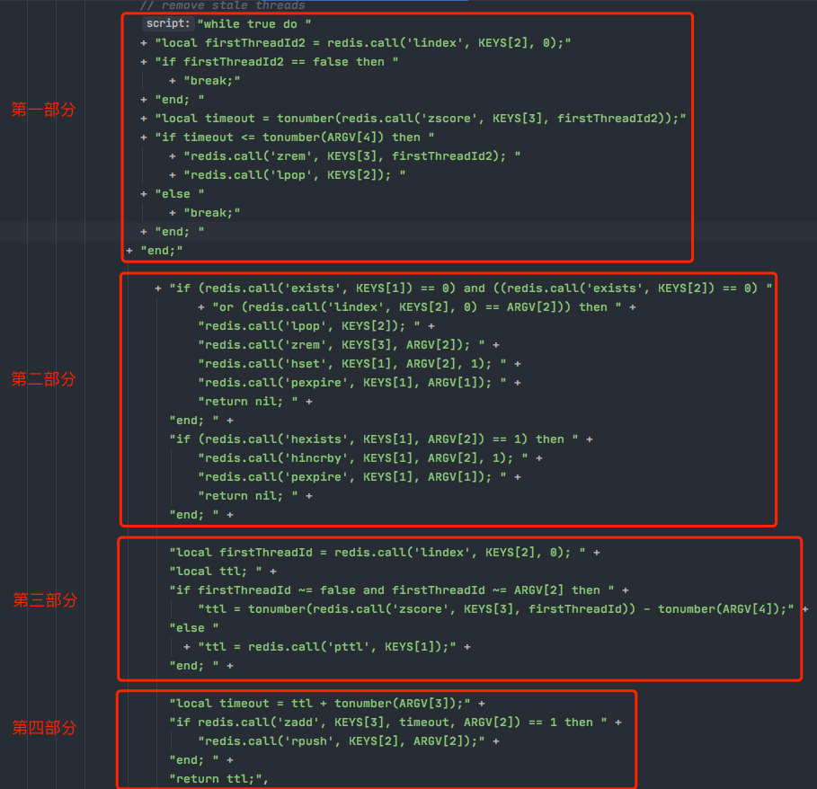

## redisson的公平锁源码学习之排队加锁

### 可重入非公平锁

前面讲到的是非公平可重入锁。所谓的非公平可重入锁是什么意思呢？多个胡乱的争抢，根本没有任何公平性和顺序性而言。

### 可重入公平锁

使用公平锁，可以保证说：客户端获取锁的顺序就跟他们请求获取锁的顺序是一致的。

会把各个客户端对加锁的请求进行排队处理，保证说先申请加锁的，就可以先得到这把锁，实现所谓的公平性。

可重入非公平锁、公平锁，他们在整体的技术实现上都是一样的，只不过唯一不同的点就是在加锁逻辑那。

### 源码学习

RedissonFairLock是RedissonLock的子类，整体锁的技术框架实现都是跟之前讲解的RedissonLock是一样的，无非就是重载了一些方法，加锁和释放锁的lua脚本逻辑比之前复杂了。

直接看RedissonFairLock类的tryLockInnerAsync方法的这段lua脚本：

```
    <T> RFuture<T> tryLockInnerAsync(long leaseTime, TimeUnit unit, long threadId, RedisStrictCommand<T> command) {
    // ......
    
}
```



#### lua脚本所需参数

```java
Arrays.<Object>asList(getName(), threadsQueueName, timeoutSetName), 
            internalLockLeaseTime, getLockName(threadId), currentTime + threadWaitTime, currentTime);
```

对应lua脚本中：

- KEYS[1]：getName()，就是锁的名字，比如：testLock；
- KEYS[2]：threadsQueueName（在redissonFairLock类构造函数中定义的），比如：redisson_lock_queue:{testLock}；
- KEYS[3]：timeoutSetName（在redissonFairLock类构造函数中定义的），比如：redisson_lock_timeout:{testLock}；
- ARGV[1]：internalLockLeaseTime（在redissonLock类构造函数中定义的），值为 30000毫秒；
- ARGV[2]：getLockName(threadId)，查看代码可以知道值为：UUID:threaId；
- ARGV[3]：currentTime + threadWaitTime，查看代码可以知道值为：当前时间+5000毫秒。

