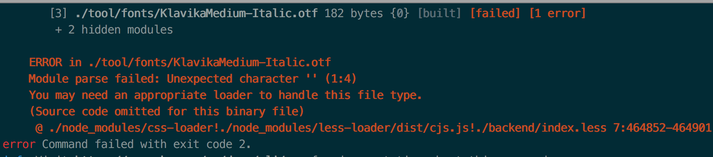

# webpack项目如何正确打包引入的自定义字体？

## 一. 如何在Vue或React项目中使用自定义字体

>  在开发前端项目时，经常会遇到UI同事希望在项目中使用一个炫酷字体的需求。那么怎么在项目中使用自定义字体呢？
>
>  其实实现起来并不复杂，可以借用CSS3 @font-face 来实现。
>
>  本文着重介绍一下 webpack 项目如何正确打包引入的自定义字体。


### @font-face有什么用

总结一下就是：用户借助该规则，可以为引入的字体包命一个名字，并指定在哪里可以找到它（指定字体包的存储路径）后，就可以像使用通用字体那样去使用它了。

### 具体实现步骤

例如现在的需求是：需要在项目中使用 **KlavikaMedium-Italic** 字体。

则只需以下三个步骤即可。

#### 1. 将字体包放入项目目录下

这里放到根目录下的 tool/fonts 文件夹里。

#### 2. 在index.css文件中定义

```css
@font-face {
  font-family: 'myFont';
  src: url(tool/fonts/KlavikaMedium-Italic.otf);
}
```

#### 3. 使用自定义字体

新建一个index.vue文件，引入样式：

```vue
import './index.css'
<template>
<h1>使用自定义字体</h1>
<style>
  h1 {
    font-family: 'myFont'
  }
</style>
</template>

```

效果如下：


## 二. webpack项目如何正确打包自定义的字体

### 1. 打包时报错

既然在本地开发环境实现了效果，于是就使用 webpack 打包准备上线，却发现 webpack 在打包过程中报错：



### 2. 打包时为什么会报错

我们在定义自定义字体时使用URL指定了字体包的路径，由于 webpack 默认是无法处理 css 中的 url 地址的，因此这里会报错。

### 3. 解决报错

#### 3.1 认识file-loader

这时就需要借助 loader 来大显身手了，解决这个问题需要使用 **file-loader**，它主要干了两件事儿：

- 根据配置修改打包后图片、字体包的存放路径；
- 再根据配置修改我们引用的路径，使之对应引入。

#### 3.2 安装file-loader

```
yarn add file-loader
```

####  3.3 配置file-loader

在 webpack.config.js 中，配置file-loader：

```js
module.exports = {
  module: {
    rules: [
      {
        // 命中字体包
        test: /\.(woff2?|eot|ttf|otf)(\?.*)?$/,
        // 只命中指定 目录下的文件，加快Webpack 搜索速度
        include: [paths.toolSrc],
        // 排除 node_modules 目录下的文件
        exclude: /(node_modules)/,
        loader: 'file-loader',
      },
    ]
  }
}
```

再次执行打包命令，不再报错。

### 4. 自定义字体为什么不生效

于是将打包出来的 dist 目录重新部署到服务器上后访问页面，却发现由于找不到字体导致没有生效：


从图中可以看出，http请求字体包的路径为：**根目录下(打包出来的静态文件index.html所在目录)的 css/620db1b997cd78cd373003282ee4453f.otf**。

#### 4.1 字体不生效的原因

看了一下打包命令生成的 dist 目录结构：

```bash
├── 620db1b997cd78cd373003282ee4453f.otf
├── css
│   ├── backend.66a35.css
│   └── backend.66a35.css.map
├── favicon.ico
├── images
│   ├── bg.5825f.svg
│   ├── data-baseTexture.c2963.jpg
│   ├── data-heightTexture.6f50d.jpg
│   └── logo.7227a.png
├── index.html
└── js
    ├── backend.66a35.js
```

却发现，字体包和 index.html 是在同一级。因此字体无法生效的原因就很明朗了：

- 由于http请求的字体包路径与实际的存放路径一致，就导致了404；
- 找不到字体包的实际路径，因此使用的字体无法生效。

#### 4.2 字体不生效的解决办法

可以通过修改字体包打包后的实际存储路径去解决这个问题，在 webpack.config.js 中，借助 options 参数可以继续给 file-loader 设置更多的配置项：

```js
module.exports = {
  module: {
    rules: [
      {
        // 命中字体包
        test: /\.(woff2?|eot|ttf|otf)(\?.*)?$/,
        // 只命中指定 目录下的文件，加快Webpack 搜索速度
        include: [paths.toolSrc],
        // 排除 node_modules 目录下的文件
        exclude: /(node_modules)/,
        loader: 'file-loader',
        // 新增options配置参数：关于file-loader的配置项
        options: {
          limit: 10000,
          // 定义打包完成后最终导出的文件路径
          outputPath: 'css/fonts/',
          // 文件的最终名称
          name: '[name].[hash:7].[ext]'
        }
      },
    ]
  }
}
```

再次打包，生成的 dist 目录结构如下：

```bash

├── css
│   ├── backend.66a35.css
│   ├── backend.66a35.css.map
│   └── fonts
│       └── KlavikaMedium-Italic.620db1b.otf
├── favicon.ico
├── images
│   ├── bg.5825f.svg
│   ├── data-baseTexture.c2963.jpg
│   ├── data-heightTexture.6f50d.jpg
│   └── logo.7227a.png
├── index.html
└── js
    ├── backend.66a35.js
```

可以看到字体包正如配置时预期的那样存储在 **css/fonts **目录下面。

重新部署项目，再次查看：


这一次 http 请求的字体包路径与实际的存放路径一致，因此自定义字体生效。

可以通过下面这个梳理流程图看的更清楚一些：


## 三. 总结

为什么本地开发的时候可以看到字体，部署到服务器后却看不到了呢？

- 由于 webpack 项目在本地开发中使用的是 webpack-dev-server，实时编译后的文件都保存到了内存当中，引用字体包的时候使用的是绝对路径，因此在本地开发中使用的自定义字体能够生效；
- 使用webpack打包后的 dist 目录，字体包的实际存储路径与 http 请求字体包的路径不一致，因此导致找不到字体包；
- 借助 file-loader 解决 webpack 打包报错，通过使用 options 参数去设置字体包在打包后的实际存储路径，从而解决问题。


