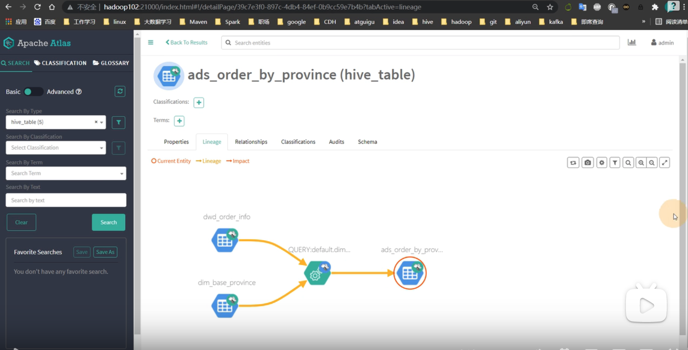

元数据管理

数据字典/数据资产目录

数据质量监控/数据治理


### Atlas架构原理


Solr 是给用户提供的查询元数据的一个查询引擎，类似ES。

### Atlas使用

atlas在安装之初，需要手动执行一次元数据的全量导入，后续altas便会利用HiveHook 增量同步Hive的元数据。

### Hive元数据初次导入

进入到altas的安装目录下，cd hook-bin，会有一个 import-hive.sh。

直接执行：

```bash
sh  import-hive.sh
```

就会进行元数据的初次导入。

执行完毕后，刷新altas的 ui 界面。

### Hive元数据增量同步

增量同步的，无需人为干预，只要 hive 中的元数据发生变化（执行DDL语句），HiveHook 就会将元数据的变动通知 Altas。

除此之外，altas 还会根据 DML 语句获取数据之间的血缘关系。

### 血缘关系

还是在 atlas 的ui界面上，点击某个表之后，点击 Lineage 标签页，可以查看血缘关系。

比如这样的一个需求：

根据订单事实表和地区维度表，求出每个省份的订单次数和订单金额。

大概的sql语句：


关联：


查看ads_order_by_province 表的血缘关系：



还可以支持字段级的血缘查看：

比如我现在要看这个表下面的order_amount字段是怎么算的：


### Altas的内存配置

如果计划存储万个元数据对象，建议调整参数值获得最佳的 JVM GC 性能。详细可见：

https://www.bilibili.com/video/BV1jA411F76d?p=19&spm_id_from=pageDriver


--------------------------------------------------------------------------------------

不是尚硅谷的。

### 超全的大数据治理体系 数据如何治理

https://www.bilibili.com/video/BV1tf4y167Dz?spm_id_from=333.337.search-card.all.click


# 大数据治理体系全流程基础讲解

https://www.bilibili.com/video/BV1mF41177yK?spm_id_from=333.337.search-card.all.click

理论篇。

### 数仓基础之数据架构


### 数据治理之数据接入

- 数据探查
- 数据定义
- 数据获取
- 数据对账


####  数据对账实现方式


### 数据治理之数据处理

- 数据提取；
  - 
  - 
- 数据清洗；
  - 
  - 
  - 
  - 
- 数据关联
  - 

### 数据治理之数据质量、运维监控


其中第三部分，第四部分 政务中多用。

- 质量管理


- 运维管理

  这一块是大数据运维工程师来做的。

  - 
  - 
  - 

- 资源编目
  
- 分级分类

需要把我们处理完的数据，做成一个目录，然后做成可视化。

### 数据治理之数据组织

这一块就是偏向应用了。

- 第一部分：主题层

  - 
  - 

- 第二部分：专题层

  从主题层直接拿数据出来，可以作为应用的。
  - 
  - 
  - 

