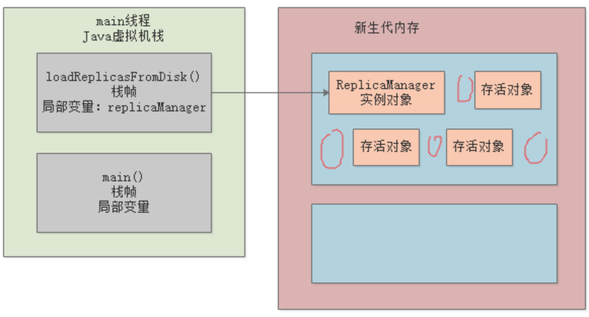
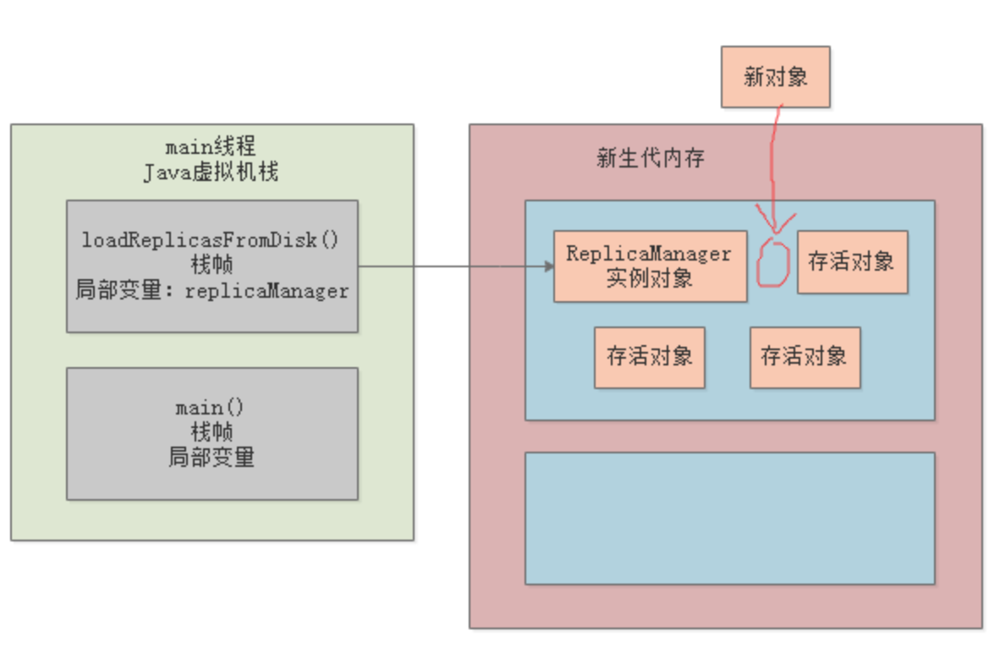
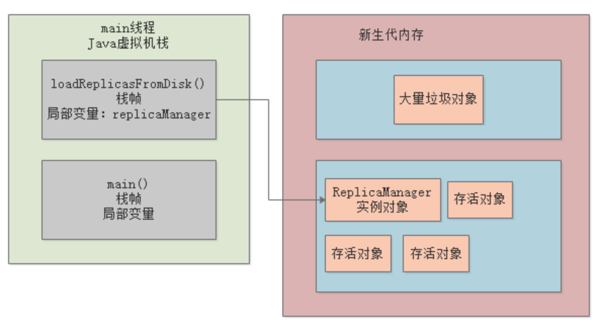
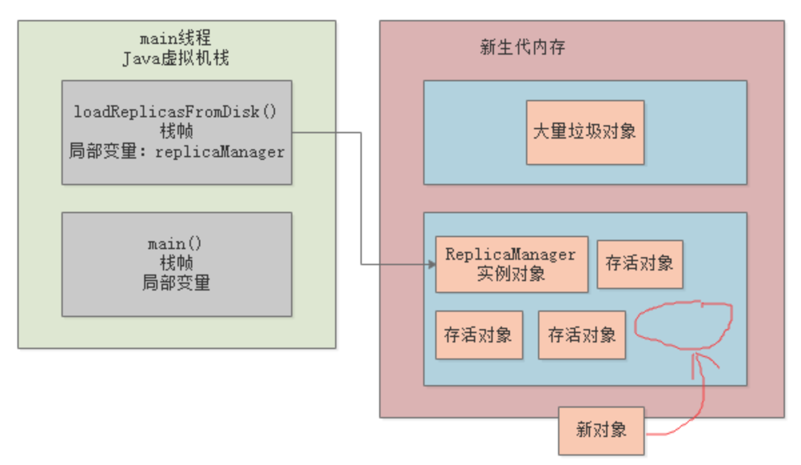
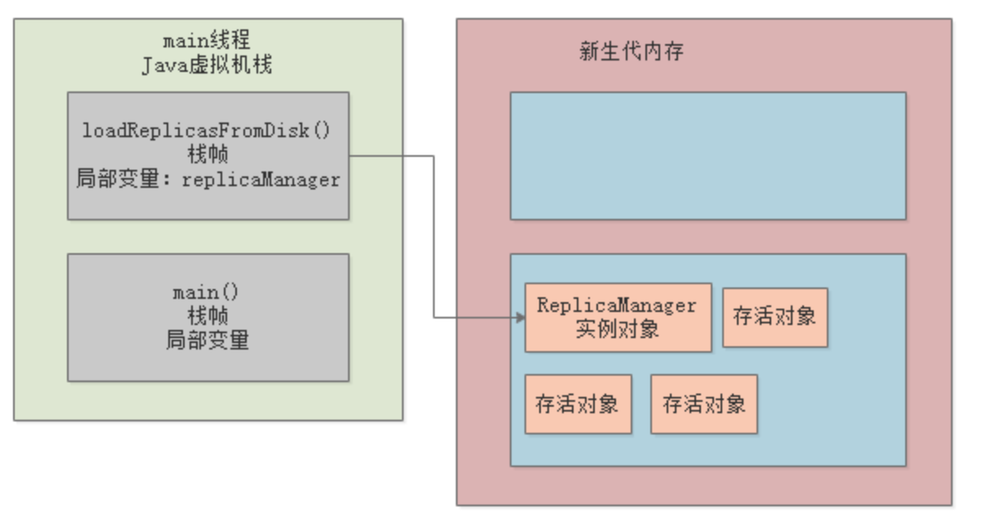
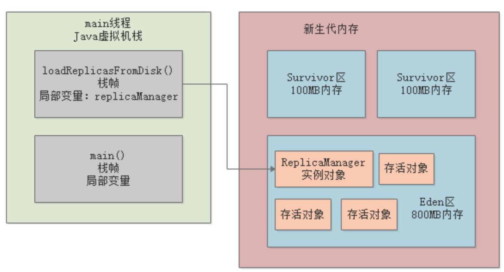
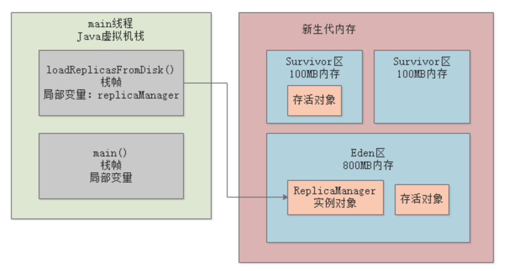
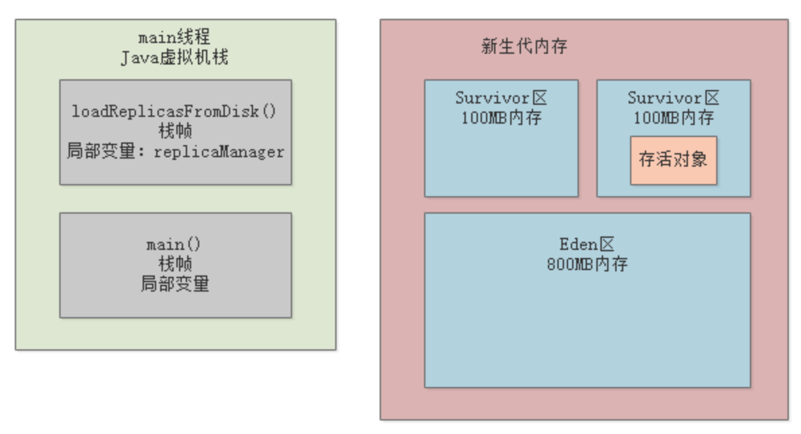

这篇文章，我们就来看看，在对新生算法进行垃圾回收的时候，到底是**采取一种什么样的算法进行的呢？**

## 复制算法的背景引入

针对新生代的垃圾回收算法，叫做复制算法。

## 一种不太好的垃圾回收思路

假如现在采用的垃圾回收思路是 标出哪些对象是可以被垃圾回收的，然后直接对那块内存区域中的对象进行垃圾回收，把内存空出来。

存活对象在内存区域里东一个，西一个，非常的凌乱，而且会造成了大量的内存碎片。

那么，什么是内存碎片呢？

我们再看下面的图，我用红线标记出来的区域，那些就是所谓的内存碎片。

看到了吗，在各种凌乱的存活对象的中间，出现了大量的红圈圈出来的内存碎片。这些内存碎片大小不一样，有可能很大，有的可能很小。

那么内存碎片太多会造成什么问题呢？

### 内存浪费

比如，现在打算分配一个新的对象，尝试在上图那块被使用的内存区域里去分配。

此时如下图所示，可能因为内存碎片太多的缘故，虽然所有内存碎片加起来其实有很大的一块内存，但是因为这些内存都是碎片式分散的，所以导致没有一块完整的足够的内存空间来分配新的对象。

所以这种直接对一块内存空间回收掉垃圾对象，保留存活对象的方法，绝对是不可取的。

因为内存碎片太多，就是他最大的问题，会造成大量的内存浪费，很多内存碎片压根儿是没法使用的。

## 一个合理的垃圾回收思路

那么可不可以用一种合理的思路来进行垃圾回收呢?

可以！这个时候上图中一直没派上用场的另外一块空白的内存区域就出场了。

对那块在使用的内存空间里标出里面哪些对象是不能进行垃圾回收的，就是要存活的对象，

然后把那些存活的对象转移到另外一块空白的内存中，如下图：

不知道大家发现这里边的玄机没有？

没错，通过把存活对象先转移到另一块空白内存区域，我们可以把这些对象都紧密的排在内存里。

这样就可以让被转移的那块内存区域几乎没有什么内存碎片，对象都是按照顺序排列在这块内存里的。

然后那块被转移的内存区域，是不是多出来一大块连续可用的内存空间？

此时就可以将新对象分配在那块连续的内存空间里了，如下图：

这个时候，再一次性的把原来使用的那块内存区域中的垃圾对象全部一扫而空，全部给回收掉，空出来一块内存区域，如下图：

这就是所谓的**复制算法：**

1. 把新生代内存划分为两块内存区域，然后只使用其中一块内存。
2. 待那块内存满的时候，就把里面的存活对象一次性转移到另外一块内存区域，保证没有内存碎片。
3. 接着一次性回收原来的那块内存区域的垃圾对象，再次空出来一块内存区域。
4. 两块内存区域就这么重复着循环使用。

## 复制算法有什么缺点

复制算法的缺点其实非常明显，如果按照上述的思路，大家会发现，假设我们给新生代1G的内存空间，那么只有512MB的内存空间是可以用的。

另外512MB的内存空间是一直要放在那里空着的，然后512MB内存空间满了，就把存活对象转移到另外一块512MB的内存空间去。

**从始至终，就只有一半的内存空间可以使用，这样的算法显然对内存的使用效率太低了。**

## 复制算法的优化

### Eden区和Survivor区

我们之前分析过，绝大多数的对象都是存活周期非常短的对象，可能被创建出来1毫秒之后就没人引用了，他就是垃圾对象了。

所以大家可以想象一下，可能一次新生代垃圾回收以后，99%的对象其实都被垃圾回收了，就1%的对象存活了下来，可能就是一些长期存活的对象，或者还没使用完的对象。

所以实际真正的复制算法会做出如下优化，将新生代内存区域划分为三块：

1个Eden区和2个Survivor区，其中Eden区占80%内存空间，每一块Survivor区占10%内存空间。比如说Eden区有800MB内存，每一块Survivor区就有100MB内存，如下图：

平时可以使用的，就是Eden区和一块Survivor区，那么相当于就是有900MB内存是可以使用的，如下图所示：

1. 刚开始对象都是分配在Eden区内的；
2. 如果Eden区块满了，此时就会触发垃圾回收，此时就会把Eden区中存活的对象都一次性转移到一块空着的Survivor区；
3. 接着Eden区就会被清空，然后再次分配新对象到Eden区里。
4. 如果下次再次Eden区满，那么再次触发Minor GC，就会把Eden区和放着上一次Minor GC后存活对象的Survivor区内的存活对象，转移到另外一块Survivor区去。

所以大家可能体会到了，为啥是这么分配内存空间了。

因为之前分析过了，每次垃圾回收后可能存活的对象就1%，所以在设计的时候就留了一块100MB的内存空间用来存放**垃圾回收后转移过来的存活对象**。

比如：

1. Eden区和一块Survivor区有900MB的内存空间都占满了；
2. 垃圾回收过后，可能就10MB对象是存活的；
3. 此时就把10MB 存活对象转移到另外一块Survivor区域就可以了；
4. 然后再一次性把Eden区和之前使用的Survivor区里的垃圾对象全部回收掉。

如下图：

接着新对象继续分配在Eden区和另外那块开始被使用的Survivor区，然后一直保持一块Survivor区是空着的，就这样一直循环使用者三块内存区域。

`这么做的最大好处就是，只有10% 的内存空间是被闲置的，90% 内存都被使用上了。`

无论是`垃圾回收的性能，内存碎片的控制，还是说内存使用的效率`，都非常的好。

