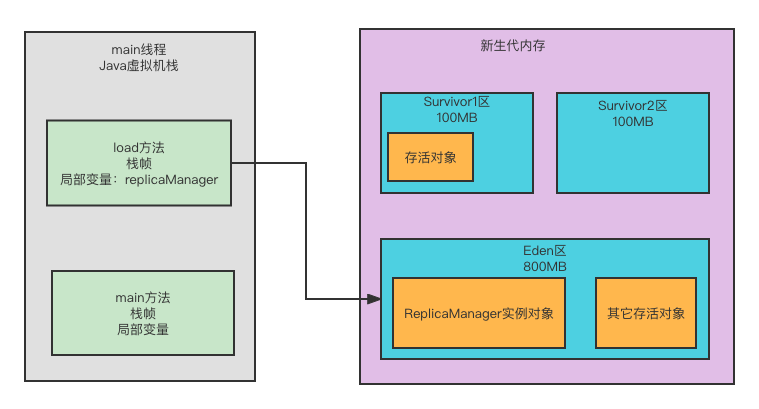

### 新生代垃圾算法

`复制算法`

`复制算法的优化：Eden区和Survivor区`

### 6、老年代空间分配担保规则

**假如Yong GC之前，发现老年代可用的内存空间已经小于新生代全部对象大小了**，就会看一个 "-XX:HandlepromotionFailure"参数是否设置。

如果有这个参数，那就会尝试进行下一步判断。

`就是看看老年代内存大小，是否大于之前每次Yong GC后进入老年代的对象的平均大小。`

举个例子，比如之前每次 Yong GC 后，平均都有 10MB左右的对象进入老年代，且此时老年代可用内存大于10MB。这就表明，此次老年代的空间是够的。

假如`上面的判断失败了，或者 "-XX:HandlepromotionFailure"参数没有设置，此时就会直接触发一次 Full GC。就是对老年代进行垃圾回收，尽量腾出来一些内存空间，然后再执行Yong GC。`

如果上面两个步骤都成功了（**设置了 "-XX:HandlepromotionFailure"参数 和 可用老年代内存大小 大于之前每次 Yong GC 后进入老年代的对象的平均大小**），那么就是说可以冒点风险尝试一下 Yong GC。此时进行Yong GC有几种可能：

1. 第一种可能，Yong GC 过后，剩余存活对象的大小是小于 Survivor 区的大小的，那么此时存活对象进入 Survivor区域即可；

2. 第二种可能，Yong GC过后，剩余存活对象的大小大于 Survivor区，但是小于老年代可用内存大小，此时就可以直接进入老年代；

3. 第三种可能，Yong GC过后，剩余存活对象的大小大于 Survivor区，也大于老年代可用内存大小。此时老年代都放不下这些对象了，就会发生"Handle Promotion Failure"，这个时候就会触发一次 Full GC。
   Full GC 就是对老年代进行垃圾回收，同时也一般会对新生代进行垃圾回收。

   如果 Full GC 过后，老年代还是没有足够的内存空间存放 Yong GC 过后的剩余存活对象，**那么此时就会导致所谓的"OOM内存溢出了"。**因为内存实在不够了，你还是要不停的往里边存放对象，当然就崩溃了。

   

### 7、老年代垃圾回收算法

对老年代触发垃圾回收的时机，一般是两个：

1. 要不然是在Yong GC之前，发现老年代可用内存空间大小 小于此前每次Yong GC后进入老年代对象的平均大小，此时会触发Full GC，然后再带着Yong GC；
2. 要不然是在Yong GC之后，发现剩余存活对象放入老年代也放不下了。

#### 那么对老年代进行垃圾回收采取的是什么算法？

`标记整理算法`：

1. 首先标记出来，老年代当前存活的对象；
2. 接着让这些存活的对象在内存里进行移动，把存活对象尽量都挪到一起，让对象都紧凑的靠在一起，避免垃圾回收过后出现过多的碎片。
3. 再一次性的把垃圾都回收掉。

由于老年代的垃圾回收算法比新生代的垃圾回收算法要慢，因此系统频繁出现老年代的Full GC 垃圾回收，会导致系统性能被严重影响，出现频繁卡顿的情况。

