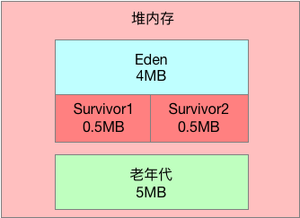

## 1、前文回顾

从本周开始，我们将全面进入实操环节，也就是说之前几周都是在分析JVM的运行原理、GC原理以及优化原理，但是本周开始，我们将要通过各种代码模拟出来JVM的各种场景，同时结合GC日志去分析到底JVM是怎么运行的。

今天的文章，我们将会给大家通过代码演示年轻代的Yong GC是如何发生的，同时告诉大家如何在JVM参数中去配置打印对应的GC日志，然后我们通过GC日志来慢慢的分析JVM的GC到底是如何运行的。

## 2、程序的JVM参数示范

我们平时系统运行时创建的对象，除非是那种大对象，否则通常来说都是优先分配在新生代中的Eden区域的。

而且新生代还有另外两块Survivor区域，默认Eden区域占据新生代的80%，每块Survivor区域占据新生代的10%。

比如我们用以下参数来运行代码：

```BASH
-XX:NewSize=5242880 -XX:MaxNewSize=5242880 -XX:InitialHeapSize=10485760 -XX:MaxHeapSize=10485760 -XX:SurvivorRatio=8 -XX:PretenureSizeThreshold=10485760 -XX:+UseParNewGC -XX:+UseConcMarkSweepGC
```

上述参数都是基于JDK 1.8版本来设置的，不同的JDK版本对应的参数名称是不太一样的，但是基本意思是类似的。

- 上面"-XX:InitialHeapSize"和"-XX:MaxHeapSize" 即：初始堆大小和最大堆大小，为 10MB；

- -XX:NewSize 和 -XX:MaxNewSize是初始新生代大小和最大新生代大小；
- -XX:PretenureSizeThreshold 指定了大对象阈值是 10MB。

相当于：

- 给堆内存分配 10MB 内存空间，其中新生代是 5MB 内存空间，其中 Eden区占 4MB，每个Survivor区占 0.5MB；

- 大对象必须超过 10MB 才会直接进入老年代 ；

- 年轻代使用PartNew垃圾回收器，老年代使用CMS垃圾回收器。

  



## 3、如何打出 JVM GC日志

接着我们需要在系统的JVM参数中加入GC日志的打印类型，如下所示：

1. -XX:+PrintGCDetails：打印详细的gc日志；
2. -XX:+PrintGCTimeStamps：这个参数可以打印出来每次GC发生的时间；
3. -Xloggc:log/gc.log：这个参数可以设置gc日志写入一个磁盘文件

加入这个参数之后，jvm参数如下所示：

```
-XX:InitialHeapSize=10485760 -XX:MaxHeapSize=10485760 -XX:NewSize=5242880 -XX:MaxNewSize=5242880  -XX:SurvivorRatio=8 -XX:PretenureSizeThreshold=10485760 -XX:+UseParNewGC -XX:+UseConcMarkSweepGC -XX:+PrintGCDetails -XX:+PrintGCTimeStamps -Xloggc:gc.log
```

## 4、示例程序代码

接着，我们给大家看一段示例程序代码：

```java
public class Demo1 {
	public static void main(String[] args) {
        byte[] array1 = new byte[1024 * 1024];
        array1 = new byte[1024 * 1024];
        array1 = new byte[1024 * 1024];
        array1 = null;
        byte[] array2 = new byte[2 * 1024 * 1024];
    }
}
```

## 5、对象是如何分配在Eden区内的

那么在 JVM 中上述代码是如何运行的呢？

首先我们来看第一行代码：

```java
 byte[] array1 = new byte[1024 * 1024];
```

这行代码一旦运行：

- 就会在 JVM 的 Eden区域内放入一个 1MB 的对象;
- 同时再 main线程的虚拟机栈中会压入一个 main() 方法的栈帧
- 在main()方法的栈帧内部，会有一个"array1"变量，这个变量指向堆内存Eden区域的那个1MB 的数组，如下图：
  

接着我们来看第二行代码：

```java
array1 = new byte[1024 * 1024];
```

此时会在堆内存的Eden区域中创建第二个数组，并且让局部变量指向第二个数组，然后第一个数组就没人引用了，此时，第一个数组就成了没人引用的"垃圾对象"了。如下图所示：


然后第三行代码：

```java
array1 = new byte[1024 * 1024];
```

这时代码在堆内存的Eden区内创建了第三个数组，同时让array1变量指向了第三个数组，此时前面两个数组都没有人引用了，就都成了垃圾对象，如下图所示：


接着我们来看第四行代码：

```java
array1 = null;
```

这行代码一执行，就让array1这个变量什么都不指向了，此时会导致之前建的3个数组全部变成垃圾对象，如下图：


最后看第5行代码：

```java
byte[] array2 = new byte[2 * 1024 * 1024];
```

此时会分配一个2MB大小的数组，尝试放入Eden区中，大家觉得这个时候Eden区能放的下吗？

**明显是不行的，**因为Eden区总共就4MB大小，而且里面已经放入了3个1MB的数组了，所以剩余空间只有1MB了，此时你放一个2MB的数组是放不下的。

所以这个时候就会触发年轻代的Yong GC。

## 6、采用指定JVM参数运行程序

