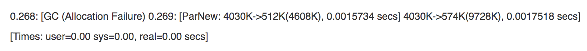
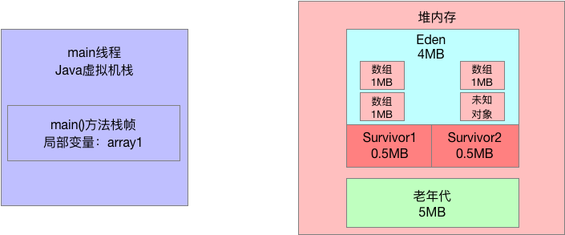
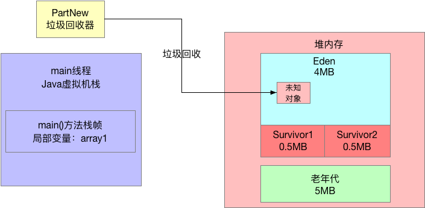
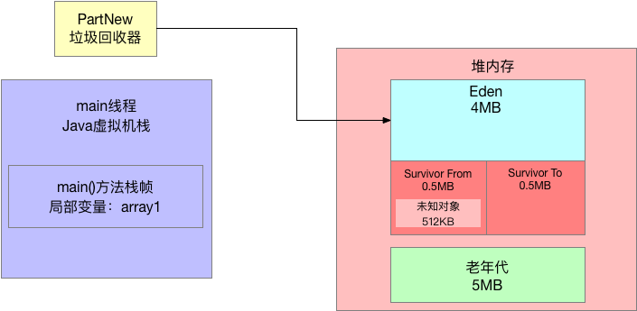
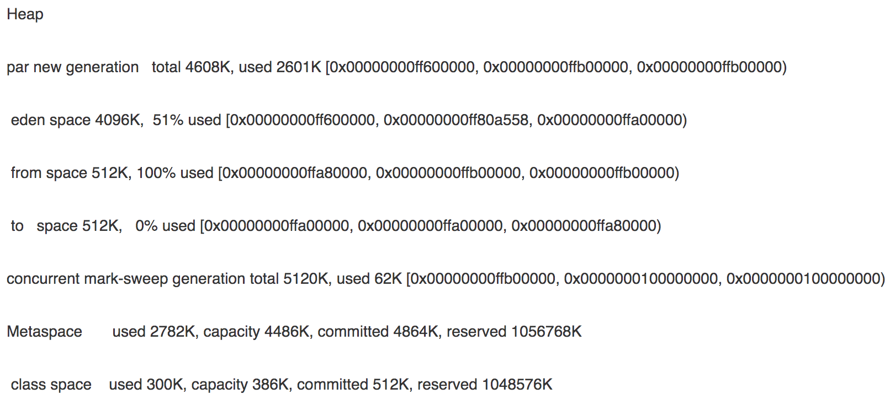
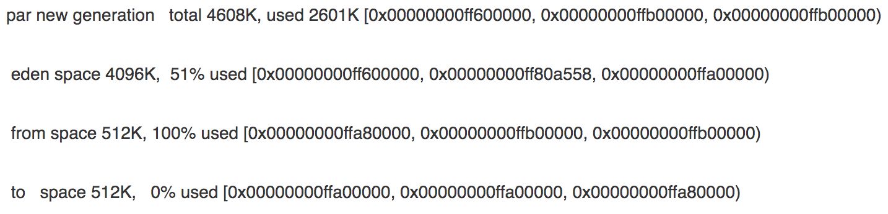
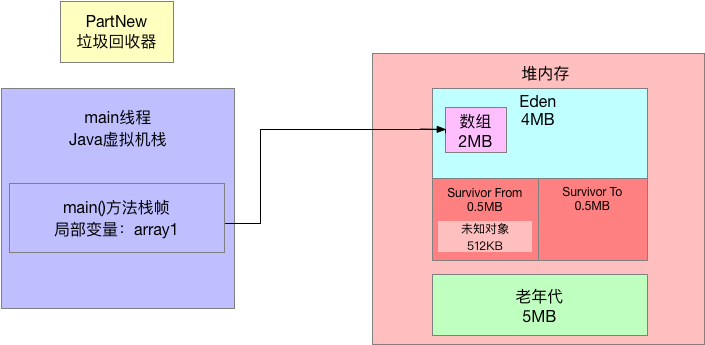
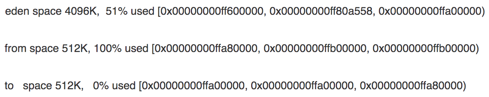
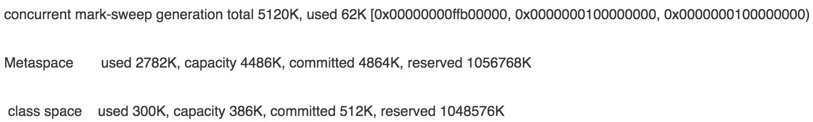

# 044：高级工程师的硬核技能：JVM的Young GC日志应该怎么看

## 1、前文回顾

今天的文章我们通过一步一图的方式，接着昨天的内容继续来仔细分析GC日志，同时配合画图告诉大家一次Yong GC的实际执行过程。

## 2、程序运行采用的默认JVM参数如何查看

在GC日志中，可以看到如下内容：

```bash
CommandLine flags:-XX:InitialHeapSize=10485760 -XX:MaxHeapSize=10485760......	
```

这其实就是告诉你这次运行程序采取的JVM参数是什么，基本都是我们设置的。

告诉大家这个，是因为很多人问我，如果没设置JVM参数的话，怎么看系统用的默认JVM参数？

很简单，给你的JVM启动时加上一段打印gc日志的参数，就可以在这里看到他默认会给你的JVM进程分配多大的内存空间了。默认给的内存是很小的。

## 3、一次GC的概要说明

接着我们看 GC 日志中的如下一行：



这个就是概要说明了本次 GC 的执行情况，给大家讲一遍，大家就知道怎么回事儿了。

**GC (Allocation Failure)** ，这个看字面意思就知道，为啥会发生一次GC呢？

很简单，因为看上图，要分配一个 2MB 的数组，结果 Eden区不够了，所以就出现了 "Allocation Failure"，也就是分配对象失败。

所以此时要触发一次 Yong GC。

那么这次 GC 是什么时候发生的呢？

很简单，看一个数字：`"0.268"，这个意思就是你的系统运行以后过了多少秒发生了本次 GC`，比如这里就是大概系统运行之后过了大概 200多 毫秒，发生了本次 GC。

这个"**PartNew**"的意思，大家很明确了吧，我们触发的是年轻代的 Young GC，所以是用我们指定的 PartNew 垃圾回收器来执行的 GC。

**4030K->512K(4608K)** ，这个代表的意思是年轻代可用空间是4608K，也就是4.5MB，为啥是4.5MB 呢？

大家看上图，Eden区是4MB，两个Survivor区只有一个是可以放存活对象的，另外一个必须是一直保持空闲的，所以考虑年轻代的可用空间就是Eden + 1个Survivor区大小：4MB + 0.5MB = 4.5MB。

然后 **4030K->512K**，意思就是对年轻代执行了一次GC，GC之前都使用了4030KB，但是GC之后只有512KB 的对象是存活下来了。

**0.0015734 secs**，这个就是本次 GC 耗费时间，看这里来说大概是耗费了1.5ms，仅仅是回收 3MB 的对象而已。

`4030K->574K(9728K)，0.0017518 secs 这段话指的是整个Java 堆内存的情况`。

意思是整个Java堆内存是9728KB(9.5MB)，其中年轻代是 4.5MB + 老年代5MB，然后 GC 前整个堆内存使用了4030KB，GC 之后堆内存使用了574KB。

**[Times: user=0.00 sys=0.00 real=0.00 sesc]** 这个意思是本次 GC 耗费的时间，大家可以看 ，这里最小单位是小数点之后两位，但是这里全部是0.00 secs，也就是说本次gc耗费了几毫秒，所以以秒为单位来看，几乎是0。

接下来，通过图解看一下这个 GC 发生的过程。

## 4、图解GC执行过程

第一个问题，看这行日志：**PartNew:4030K->512K(4608K), 0.0015734 secs**

大家很奇怪，我们在 GC 之前，明明在 Eden 区里就放了3个 1MB 的数组，一共是 3MB，也就是 3072KB 的对象，那么 GC 之前年轻代应该是使用了 3072KB 的内存啊，为啥是使用了 4030KB 的内存呢？

其实这个问题，大家不用纠结，你只要明白两点：

- 其实你创建的数组本身虽然是 1MB，但是为了存储这个数组， JVM 内置还会附带一些其他信息，所以每个数组实际占用的内存是大于 1MB的。
- 除了你自己创建的对象以外，可能还有一些你看不见的对象在Eden区里，至于这些看不见的对象是什么，后面我们有专门的工具可以分析堆内存快照，以后会带你看到这些对象是什么。

所以，如下图所示，GC 之前，三个数组和其他一些未知对象加起来，就是占据了 4030KB 的内存。



接着你想要在Eden区分配一个 2MB 的数组，此时肯定触发了"Allocation Failure"，对象分配失败，就触发了 Yong GC。

然后 PartNew 执行垃圾回收，回收掉之前我们创建的三个数组，此时因为他们都没人引用了，一定是垃圾对象，如下图所示：



然后我们继续看GC日志，**PartNew:4030K->512K(4608K), 0.0015734 secs**

gc 回收之后，从 4030KB 内存使用降低到了 512KB 的内存使用。也就是说这次 gc 日志有 512KB 的对象存活了下来，从Eden区转移到了Survivor1区，其实我们可以把称呼改改，叫做 Survivor From区，另外一个叫做 Survivor To区，如下图：



其实结合 GC 日志就能看出来，这就是本次 GC 的全过程。

## 5、GC过后的堆内存使用情况

接着我们看下面的GC日志：



这段日志是在JVM退出的时候打印出来的当前堆内存的使用情况，其实也很简单，一点点看一下，先看下面这段。



"**par new generation total 4608K, used 2601K**"  这就是说"PartNew"垃圾回收器负责的年轻代总共有4608KB(4.5MB)可用内存，目前是使用了2601KB(2.5MB)。

那么大家思考一下，此时在JVM退出之前，为什么年轻代占用了2.5MB的内存？

很简单，在gc之后，我们不是又通过如下代码又分配了一个2MB的数组吗：

```java
byte[] array2 = new byte[2 * 1024 * 1024];
```

所以此时在Eden区中一定会有一个2MB的数组，也就是2048KB，然后上次gc之后在Suvivor From区中存活了一个512KB的对象，大家也不知道是啥，先不用管他。

但是此时你疑惑了，2048KB + 512KB = 2560KB。

那为什么说年轻代使用了2601KB呢？

因为之前说过了每个数组他会额外占据一些内存来存放一些自己这个对象的元数据，所以你可以认为多出来的51KB可以是对象额外使用的内存空间。

如下图所示：



接着我们继续看GC日志：



通过GC日志就能验证我们的推测是完全正确的，这里说的很清晰了，Eden区此时4MB的内存被使用了51%，就是因为有一个2MB的数组在里面。

然后From Survivor区，512KB是 100%的使用率，此时被之前gc后存活下来的512KB的未知对象给占据了。

接着看GC日志：



concurrent mark-sweep generation total 512K,used 62K，这个很简单，就是说Concurrent Mark-Sweep垃圾回收器，也就是CMS垃圾回收器，管理的老年代内存空间一共是5MB，此时使用了62KB的空间，这个是啥你也先不用管了，可以忽略不计，以后我们有内存分析工具了，你都能看到。

后边两行的日志也很简单，意思就是MetaSpace元数据空间和Class元数据空间，存放一些类信息、常量池之类的东西，此时他们的总容量，使用内存等。