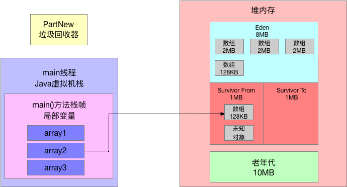
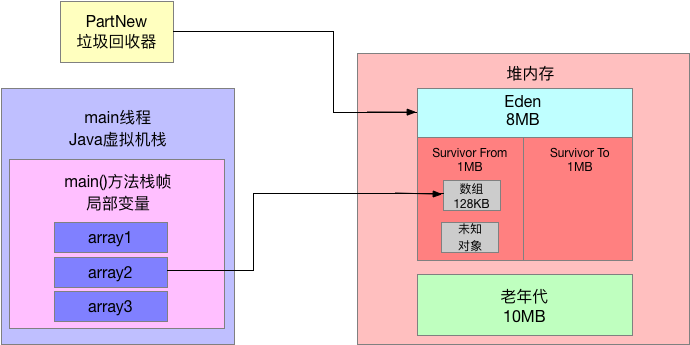

# 动手实验：自己动手模拟出对象进入老年代的场景体验一下（上）

## 1、前文回顾

这篇文章我们接着之前的案例继续来做实验，动手体验一下对象是如何从新生代进入老年代的。

## 2、动态年龄判定规则

之前我们给大家总结过对象进入老年代的四个时机：

- 躲过15次gc，达到15次高龄之后进入老年代；
- 动态年龄判定规则，如果Survivor区域内年龄1+年龄2+年龄3+年龄n的对象总和大于Survivor区的50%，此时年龄n以上的对象会进入老年代，不一定要达到15岁；
- 如果一次Yong GC后存活对象太多无法放入Survivor区，此时直接进入老年代；
- 大对象直接进入老年代。

本篇我们通过代码给大家模拟**如果Survivor区域内年龄1+年龄2+年龄3+年龄n的对象总和大于Survivor区的50%，此时年龄n以上的对象会进入老年代，不一定要达到15岁**，也就是所有的动态年龄判定规则。

先来看看我们这次示例程序的JVM参数：

```java
-XX:NewSize=10485760 -XX:MaxNewSize=10485760 -XX:InitialHeapSize=20971520 -XX:MaxHeapSize=20971520 -XX:SurvivorRatio=8 -XX:MaxTenuringThreshold=15 -XX:PretenureSizeThreshold=10485760 -XX:+UseParNewGC -XX:+UseConcMarkSweepGC -XX:+PrintGCDetails -XX:+PrintGCTimeStamps -Xloggc:gc.log
```

在这些参数里，我们注意几点：

- 新生代我们通过"-XX:NewSize"设置为10MB了；
- 然后其中Eden区是8MB，每个Survivor区是1MB；
- Java堆内存总大小是20MB，老年代是10MB；
- 大对象必须超过10MB才会进入老年代；
- 但是我们通过"-XX:MaxTenuringThreshold=15"设置了，只要对象年龄达到15岁才会直接进入老年代。

一切准备就绪，我们来看当前的内存分配情况：




## 3、动态年龄判定规则的部分示例代码

```java
public class Demo1 {
    public static void main(String[] args) {
        byte[] array1 = new byte[2 * 1024 * 1024];
        array1 = new byte[2 * 1024 * 1024];
        array1 = new byte[2 * 1024 * 1024];
        array1 = null;

        byte[] array2 = new byte[128 * 1024];
        byte[] array3 = new byte[2 * 1024 * 1024];
    }
}
```

4、部分示例代码运行后产生的gc日志

```bash
CommandLine flags: -XX:InitialHeapSize=20971520 -XX:MaxHeapSize=20971520 -XX:MaxNewSize=10485760 -XX:MaxTenuringThreshold=15 -XX:NewSize=10485760 -XX:OldPLABSize=16 -XX:PretenureSizeThreshold=10485760 -XX:+PrintGC -XX:+PrintGCDetails -XX:+PrintGCTimeStamps -XX:SurvivorRatio=8 -XX:+UseCompressedClassPointers -XX:+UseCompressedOops -XX:+UseConcMarkSweepGC -XX:+UseParNewGC 
0.302: [GC (Allocation Failure) 0.302: [ParNew: 8157K->507K(9216K), 0.0020116 secs] 8157K->507K(19456K), 0.0021167 secs] [Times: user=0.01 sys=0.00, real=0.01 secs] 
Heap
 par new generation   total 9216K, used 2923K [0x00000007bec00000, 0x00000007bf600000, 0x00000007bf600000)
  eden space 8192K,  29% used [0x00000007bec00000, 0x00000007bee5be00, 0x00000007bf400000)
  from space 1024K,  49% used [0x00000007bf500000, 0x00000007bf57eee0, 0x00000007bf600000)
  to   space 1024K,   0% used [0x00000007bf400000, 0x00000007bf400000, 0x00000007bf500000)
 concurrent mark-sweep generation total 10240K, used 0K [0x00000007bf600000, 0x00000007c0000000, 0x00000007c0000000)
 Metaspace       used 3097K, capacity 4496K, committed 4864K, reserved 1056768K
  class space    used 339K, capacity 388K, committed 512K, reserved 1048576K
```

因此此时Eden区里已经有3个2MB的数组和1个128KB的数组，大小都超过了6MB，Eden总共才8MB，此时是不可能让你创建2MB的数组的。

因此此时一定会触发一次Young GC，接着我们开始看GC日志。

```
[ParNew: 8157K->507K(9216K), 0.0020116 secs]
```

这里表明一次Yong GC过后，剩余的存活对象大概是507KB。之前就说过除了我们自己的128KB的数组，剩下的一部分是未知对象。

那么大家思考一个问题，现在Survivor From区里的那507KB的对象，是几岁呢？

答案是：1岁。

经历一次 gc，年龄就会增长1岁。而且此时Survivor区域大小是1MB，此时Survivor区域中的存活对象已经有507KB了，绝对超过了50%。

## 6、完善示例代码

```java
public class Demo1 {
    public static void main(String[] args) {
        byte[] array1 = new byte[2 * 1024 * 1024];
        array1 = new byte[2 * 1024 * 1024];
        array1 = new byte[2 * 1024 * 1024];
        array1 = null;

        byte[] array2 = new byte[128 * 1024];
        byte[] array3 = new byte[2 * 1024 * 1024];

        array3 = new byte[2 * 1024 * 1024];
        array3 = new byte[2 * 1024 * 1024];
        array3 = new byte[128 * 1024];
        array3 = null;

        byte[] array4 = new byte[2 * 1024 * 1024];
    }
}
```

接着我们把示例代码给完善一下，变成上述的样子，我们要触发第二次Yong GC，然后看看Survivor区域内的动态年龄判定规则能够生效。

这个时候，大家会发现，Eden区如果要再次放一个2MB数组，是放不下的了，所以此时必然会触发一次Yong GC。

大家使用上述的JVM参数运行这段程序会看到如下的GC日志：

```bash
CommandLine flags: -XX:InitialHeapSize=20971520 -XX:MaxHeapSize=20971520 -XX:MaxNewSize=10485760 -XX:MaxTenuringThreshold=15 -XX:NewSize=10485760 -XX:OldPLABSize=16 -XX:PretenureSizeThreshold=10485760 -XX:+PrintGC -XX:+PrintGCDetails -XX:+PrintGCTimeStamps -XX:SurvivorRatio=8 -XX:+UseCompressedClassPointers -XX:+UseCompressedOops -XX:+UseConcMarkSweepGC -XX:+UseParNewGC 
0.379: [GC (Allocation Failure) 0.379: [ParNew: 8121K->641K(9216K), 0.0115629 secs] 8121K->641K(19456K), 0.0116973 secs] [Times: user=0.00 sys=0.00, real=0.01 secs] 
0.392: [GC (Allocation Failure) 0.392: [ParNew: 6944K->0K(9216K), 0.0032399 secs] 6944K->581K(19456K), 0.0033186 secs] [Times: user=0.00 sys=0.01, real=0.00 secs] 
Heap
 par new generation   total 9216K, used 2212K [0x00000007bec00000, 0x00000007bf600000, 0x00000007bf600000)
  eden space 8192K,  27% used [0x00000007bec00000, 0x00000007bee290e0, 0x00000007bf400000)
  from space 1024K,   0% used [0x00000007bf400000, 0x00000007bf400000, 0x00000007bf500000)
  to   space 1024K,   0% used [0x00000007bf500000, 0x00000007bf500000, 0x00000007bf600000)
 concurrent mark-sweep generation total 10240K, used 581K [0x00000007bf600000, 0x00000007c0000000, 0x00000007c0000000)
 Metaspace       used 3094K, capacity 4496K, committed 4864K, reserved 1056768K
  class space    used 339K, capacity 388K, committed 512K, reserved 1048576K
```

## 7、分析最终版的GC日志

首先第一场的GC日志如下：

```bash
0.379: [GC (Allocation Failure) 0.379: [ParNew: 8121K->641K(9216K), 0.0115629 secs] 8121K->641K(19456K), 0.0116973 secs] [Times: user=0.00 sys=0.00, real=0.01 secs] 
```

这个过程我们刚才分析过了。

接着第二次GC的日志如下：

```bash
0.392: [GC (Allocation Failure) 0.392: [ParNew: 6944K->0K(9216K), 0.0032399 secs] 6944K->581K(19456K), 0.0033186 secs] [Times: user=0.00 sys=0.01, real=0.00 secs] 
```

第二次触发Yong GC，就是我们上述代码执行的时候，此时大家发现：

**ParNew: 6944K->0K(9216K)**

这行日志表明，这次GC过后，年轻代直接没有对象了，也就是说没有任何存活对象了，**你觉得可能吗？**

要是这么简单的想，绝对是侮辱自己的智商了，大家还记得array2这个变量一直引用着一个128KB的数组，他绝对是存活对象，还有那一部分未知对象，此时都去哪里了呢？

首先我们先看上面的图，在Eden区里有3个2MB的数组和1个128KB的数组，这绝对是会被回收掉的，如下图所示：



接着其实此时会发现Survivor区域中的对象都是存活的，而且总大小超过50%了，而且年龄都是1岁

此时根据动态年龄判定规则：年龄1+年龄2+年龄3+年龄n的对象总和大于Survivor区的50%，此时年龄n以上的对象会进入老年代。

当然这里的对象都是年龄1的，所以直接全部进入老年代了，如下图：


大家可以看下面的日志确认这一点：

```bash
concurrent mark-sweep generation total 10240K, used 581K [0x00000007bf600000, 0x00000007c0000000, 0x00000007c0000000)
```

CMS管理的老年代，此时使用空间刚好是 581KB，证明此时Survivor里的对象触发了动态年龄判定规则，虽然没有达到15岁，但是全部进入了老年代。

包括我们自己的那个array2变量一直引用的128KB的数组。

然后array4变量引用的那个2MB的数组，此时就会分配到Eden区域中。此时可以看下面的日志：

```bash
eden space 8192K,  27% used [0x00000007bec00000, 0x00000007bee290e0, 0x00000007bf400000)
```

这里就说明Eden区当前就是有一个2MB的数组。

然后再看下面的日志：

```bash
from space 1024K,   0% used [0x00000007bf400000, 0x00000007bf400000, 0x00000007bf500000)
  to   space 1024K,   0% used [0x00000007bf500000, 0x00000007bf500000, 0x00000007bf600000)
```

两个Survivor区域都是空的，因为之前存活的581KB的对象都进入老年代了，所以当然现在Survivor里都是空的了。