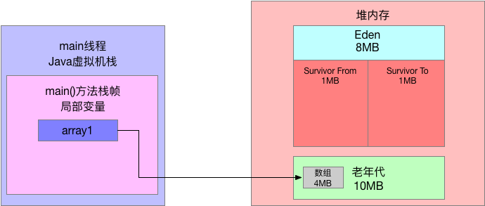
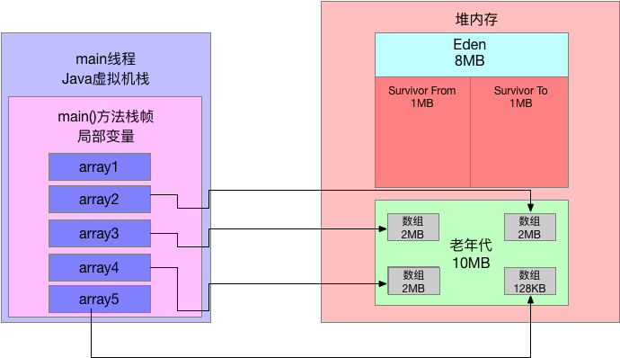
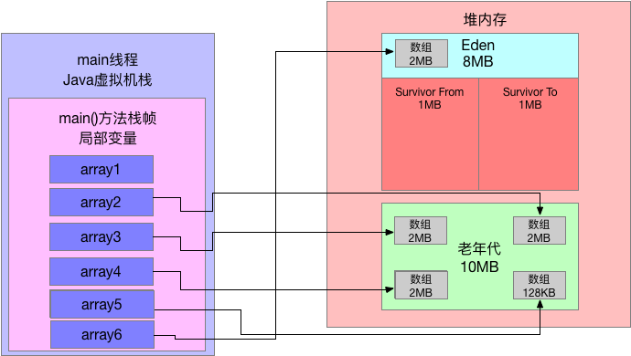

# 047、高级工程师的硬核技能：JVM的Full GC日志应该怎么看？

## 1、前文回顾

本篇给大家演示一下，老年代的GC是如何触发的。

## 2、示例代码

```java
public class Demo2 {
    public static void main(String[] args) {
        byte[] array1 = new byte[4 * 1024 * 1024];
        array1 = null;

        byte[] array2 = new byte[2 * 1024 * 1024];
        byte[] array3 = new byte[2 * 1024 * 1024];
        byte[] array4 = new byte[2 * 1024 * 1024];
        byte[] array5 = new byte[128 * 1024];

        byte[] array6 = new byte[2 * 1024 * 1024];

    }
}
```

## 3、GC日志

我们需要采用如下参数来运行上述程序：

```bash
-XX:NewSize=10485760 -XX:MaxNewSize=10485760 -XX:InitialHeapSize=20971520 -XX:MaxHeapSize=20971520 -XX:SurvivorRatio=8 -XX:MaxTenuringThreshold=15 -XX:PretenureSizeThreshold=3145728 -XX:+UseParNewGC -XX:+UseConcMarkSweepGC -XX:+PrintGCDetails -XX:+PrintGCTimeStamps -Xloggc:gc.log
```

这里最关键的一个参数就是："-XX:PretenureSizeThreshold=3145728"

这个参数要设置大对象阈值为3MB，也就是超过3MB，就直接进入老年代。

运行之后，会得到如下日志：

```bash
0.200: [GC (Allocation Failure) 0.200: [ParNew (promotion failed): 8157K->8641K(9216K), 0.0051661 secs]0.205: [CMS: 8194K->6613K(10240K), 0.0042272 secs] 12253K->6613K(19456K), [Metaspace: 3072K->3072K(1056768K)], 0.0095025 secs] [Times: user=0.02 sys=0.00, real=0.01 secs] 
Heap
 par new generation   total 9216K, used 2422K [0x00000007bec00000, 0x00000007bf600000, 0x00000007bf600000)
  eden space 8192K,  29% used [0x00000007bec00000, 0x00000007bee5d898, 0x00000007bf400000)
  from space 1024K,   0% used [0x00000007bf500000, 0x00000007bf500000, 0x00000007bf600000)
  to   space 1024K,   0% used [0x00000007bf400000, 0x00000007bf400000, 0x00000007bf500000)
 concurrent mark-sweep generation total 10240K, used 6613K [0x00000007bf600000, 0x00000007c0000000, 0x00000007c0000000)
 Metaspace       used 3079K, capacity 4496K, committed 4864K, reserved 1056768K
  class space    used 336K, capacity 388K, committed 512K, reserved 1048576K
```

## 4、一步一图分析日志

### 首先我们看如下代码：

```java
byte[] array1 = new byte[4 * 1024 * 1024];
array1 = null;
```

这行代码直接分配了一个 4MB的大对象，此时这个大对象会直接进入老年代，接着array1不再引用这个对象。

此时如下图所示：



### 接着看下面的代码

```java
 byte[] array2 = new byte[2 * 1024 * 1024];
 byte[] array3 = new byte[2 * 1024 * 1024];
 byte[] array4 = new byte[2 * 1024 * 1024];
 byte[] array5 = new byte[128 * 1024];
```

连续分配了4个数组，其中3个是2MB的数组，1个是128KB的数组，如下图所示，全部会进入Eden区域中。

### 接着会执行如下代码

```java
 byte[] array6 = new byte[2 * 1024 * 1024];
```

此时还能放得下2MB的对象吗？不可能了，因为Eden区已经放不下了。因此此时会直接触发一次Yong GC。

```bash
ParNew (promotion failed): 8157K->8641K(9216K), 0.0051661 secs
```

这行日志显示了，Eden区原来是有8000多KB的对象，但是回收之后发现一个都回收不掉，因为上述几个数组都被变量引用了。

所以此时大家都知道，一定会直接把这些对象放入到老年代里去，但是此时老年代里已经有一个4MB的数组了，还能放的下3个2MB的数组和1个128KB的数组吗？

明显是不行的，此时一定会超过老年代的10MB的大小。

所以此时我们看GC日志：

```bash
[CMS: 8194K->6613K(10240K), 0.0042272 secs] 12253K->6613K(19456K), [Metaspace: 3072K->3072K(1056768K)], 0.0095025 secs]		
```

大家可以清晰的看到，此时执行了CMS垃圾回收器的Full GC，我们之前讲过Full GC其实就是会对老年代进行Old GC，同时一般会跟一次Yong GC关联，还会触发一次元数据区（永久代）的GC。

在CMS Full GC之前，就已经触发过Yong GC了，此时大家可以看到此时Yong GC就已经有了，接着就是执行针对老年代的Old GC，也就是如下日志：

```bash
CMS: 8194K->6613K(10240K), 0.0042272 secs
```

这里看到老年代从8MB左右的对象占用，变成了6MB左右的对象引用，这是怎么个过程呢？

很简单，一定是在Yong GC之后，先把2个2MB的数组放入了老年代：

此时要继续放1个2MB的数组和1个128KB的数组到老年代，一定会放不下，所以此时就会触发CMS的Full GC。

然后此时就会回收掉其中一个4MB的数组，因为他已经没人引用了

接着放入进去1个2MB的数组和1个128KB的数组，如下图所示：



所以大家再看CMS的垃圾回收日志：

```BASH
CMS: 8194K->6613K(10240K), 0.0042272 secs	
```

他是从回收前的8MB变成了6MB，就是上图所示。

最后在CMS Full GC执行完毕之后，其实年轻代的对象都进入了老年代，此时最后一行代码要在年轻代分配2MB的数组就可以成功了，如下图：



## 5、本文总结

本文又给大家讲解了一个触发老年代GC的案例，就是年轻代存活的对象太多放不下老年代了，此时就会触发CMS的Full GC，大家可以清晰的看到全过程。