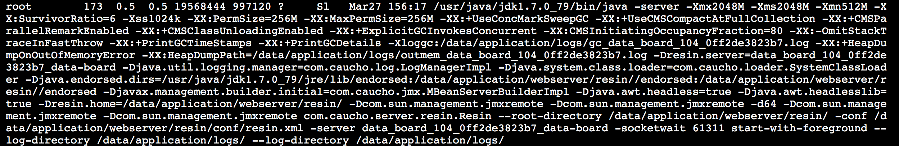
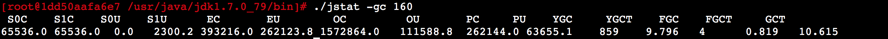

# 050、动手实验：使用 jstat 摸清线上系统的JVM运行状况

## 1、前文回顾

上周我们已经通过带着大家分析GC日志的方式，给大家重新回顾了一遍JVM的整体运行原理，包括对象优先在Eden区分配，Young GC的触发时机和执行过程，对象进入老年代的时机，Full GC的触发时机和执行过程，相信大家通过GC日志可以把JVM整体运行原理理解的更加的深入而且透彻。

本周问通过使用一个工具来分析运行中的系统，他的：

1. 对象增长率，
2. Yong GC的触发频率，
3. Yong GC的耗时，
4. 每次Yong GC后有多少对象是存活下来的，
5. 每次Yong GC后有多少对象进入了老年代，
6. 老年代对象增长的频率，
7. Full GC的触发频率，
8. Full GC的耗时。

## 2、功能强大的jstat

平时我们对运行中的系统，如果要检查他的JVM的整体运行情况，比较实用的工具之一，就是jstat。

3、jstat -gc PID

首先第一个命令，就是在生产机器linux上（比如，看一下data-board的），找出Java进程的PID，用jps命令就可以看到：

```bash
[root@1dd50aafa6e7 /usr/java/jdk1.7.0_79/bin]# ./jps                                                                                     
24776 Jps
160 Resin
91 WatchdogManager
30 resin.jar
```

使用 ps aux | grep java



-Xmx：堆内存的最大大小 2048MB

-Xms：堆内存初始大小 2048MB

-Xmn：新生代内存大小 512MB

-XX:SurvivorRatio：新生代中 Eden区与两个Survivor区的比值，为6，则表 Eden：Survivor = 6：2。也就是**Eden区大小为 512 * 6/8 = 384MB，1个Survivor区大小为：512 * 1/8 = 64MB**。可以计算出老年代大小：堆内存大小 - 新生代大小 = 2048MB - 512MB = 1536MB。（**XX:NewRatio** 设置年轻代与老年代比例，默认为1:2）

-Xss: 栈内存大小 1MB

-XX:PermSize 永久代大小256MB

-XX:MaxPermSize 永久代最大大小 256MB

**备注：永久代**

永久存储区存储的是一个常驻内存区域，用于存放JDK自身所携带的Class，Interface的元数据（说白点就是rt.jar包），也就是说它存储的是运行环境必须的类信息，被装载进此区域的数据是不会被垃圾回收掉的，关于JVM才会释放此区域所占用的内存。

移除永久代的工作从JDK1.7就开始了。JDK1.7中，存储在永久代的部分数据就已经转移到了Java Heap或Native Heap。但永久代仍存在于JDK1.7中，并没完全移除。

**注意**：永久代的移除并不代表自定义的类加载器泄露问题就解决了。因此，你还必须监控你的[内存](https://so.csdn.net/so/search?q=内存&spm=1001.2101.3001.7020)消耗情况，因为一旦发生泄漏，会占用你的大量本地内存，并且还可能导致交换区交换更加糟糕。

## 元空间(metaspace)

JDK 8的HotSpot JVM现在使用的是本地内存来表示类的元数据，这个区域就叫做元空间。
`元空间这个东西，是在JDK8以后才存在的，JDK7及以前，只有永久代`
元空间的存储位置是在计算机的内存当中，而永久的存储们置是在JVM的地堆中。

JVM用元空间代替永久代的原因：
1随着操作系统的发展，计算机支持的内存从32位的最大2^32字节，变为64位的最大
2^48字节。

2随着Java 在Web领域的发展，java程序变的得越来越大，需要加载的内容也越来越多，如果
使用永久代实现方法区，那么需要手动扩大堆的大小，而使用元空间之后，就可以直接存
储在内存当中，不用手动云修改堆的大小。

主要原因:

- 字符串存在永久代中，容易出现性能问题和内存溢出, 由于永久代内存经常不够用或发生内存泄露，爆出异常                                    java.lang.OutOfMemoryError: PermGen
- 类及方法的信息等比较难确定其大小，因此对于永久代的大小指定比较困难，太小容易出现永久代溢出，太大则容易导致老年代溢出。
- 永久代会为 GC 带来不必要的复杂度，并且回收效率偏低。
- Oracle 可能会将HotSpot 与 JRockit 合二为一。
- `永久代空间大小很难确定，太小容易GC/OOM异常，太大占用内存（元空间并不在虚拟机中、而是使用本地内存，大小仅受本地内存限制）`
- 永久代调优困难
- 垃圾回收频率低
  ————————————————
  版权声明：本文为CSDN博主「shumeigang」的原创文章，遵循CC 4.0 BY-SA版权协议，转载请附上原文出处链接及本声明。
  原文链接：https://blog.csdn.net/shumeigang/article/details/108170021

-----------------------------

接着就针对我们的Java进程执行：jstat -gc PID

这就可以看到这个Java进程（其本质就是一个JVM）的内存和GC情况了。

运行这个命令之后就会看到如下列：

```bash
[root@b2a2d78cee83 ~]# /usr/java/default/bin/jstat -gc 160                                                                           
```



解释一下参数：

1. S0C：这是From Survivor区的大小；=》 64MB
2. S1C：这是To Survivor区的大小；=》 64MB
3. S0U：这是From Survivor区当前使用内存的大小；
4. S1U：这是To Survivor区当前使用内存的大小；=》2.25MB
5. `EC：这是Eden区的大小`；=》 384MB
6. EU：这是Eden区当前使用内存的大小；=》 256MB
7. OC：这是老年代的大小；=》1536MB
8. OU：这是老年代当前使用的内存大小；=》108.9MB
9. MC：这是方法区（永久代、元数据区）的大小；
10. MU：这是方法区（永久代、元数据区）的当前使用的内存大小；
11. YGC：这是系统运行迄今为止的Yong GC次数；=》859
12. YGCT：这是所有Yong GC的耗时； 9.796 / 859 = 0.011s
13. FGC：这是系统运行迄今为止的Full GC次数； =》 4
14. FGCT：这是Full GC的耗时；
15. GCT：这是所有GC的耗时。


#### 1>新生代对象增长的速率

说明：后来又补充的，使用的是 data-board 的线程容器。

jvm的参数信息如下：

```java
Xmx2048M -Xms2048M -Xmn512M -XX:SurvivorRatio=6 -Xss1024k -XX:PermSize=256M -XX:MaxPermSize=256M -XX:+UseConcMarkSweepGC -XX:+UseCMSCompactAtFullCollection -XX:+CMSParallelRemarkEnabled -XX:+CMSClassUnloadingEnabled -XX:+ExplicitGCInvokesConcurrent -XX:CMSInitiatingOccupancyFraction=80 -XX:-OmitStackTraceInFastThrow -XX:+PrintGCTimeStamps -XX:+PrintGCDetails 
```

- 初始化堆内存是2048M；
- 可分配的最大堆内存大小是2048M；
- 初始化的年轻代大小是 512M；
- Eden区和Survivor区的比例是 6：2，则Eden区大小是 512 * 6/8 = 384M，两个survivor区的大小都是 512 * 1/8 = 64M；

每隔1秒钟更新出来最新的一行jstat统计信息，一共执行10次 jstat 统计：


可以通过查看 EU 那一列，看出每次的新增。

比如可以适当的去修改 查看间隔 1 秒为 10分钟，或者在高峰期的时候来使用这个命令查看。

#### 2>Yong GC的触发频率和每次耗时

比如你的Eden区有 800MB 内存，那么发现高峰期每秒新增 5MB 对象，大概高峰期就是 每隔 3分钟会触发一次 Yong GC。

日常期每秒新增 0.5MB 对象，那么日常大概需要半个小时才会触发一次 Yong GC。

**那么每次 Yong GC 的耗时呢？**

通过 jstat 会告诉你迄今为止，系统已经发生了多少次 Yong GC，以及这些 Yong GC 的总耗时。

比如系统运行24小时后，总共发生了260次 Yong GC，总耗时 20s。那么平均下来每次 Yong GC 大概就耗时 几十毫秒的时间。

你大概就知道，每次 Yong GC 的时候会导致系统卡顿 几十毫秒。

#### 3>每次Yong GC后有多少对象是存活和进入老年代

可观察老年代的对象增长频率。

#### 4>Full GC的触发时机和耗时

只要知道了老年代对象的增长频率，那么Full GC 的触发时机就很清晰了。

比如老年代有 800MB 内存，每隔 3分钟新增 50 MB对象，那么大概 每小时就会触发1次 Full GC。

然后可以通过 jstat 打印出来的系统运行到迄今为止的 Full GC 以及总耗时，就能算出来每次 Full GC 的耗时。


