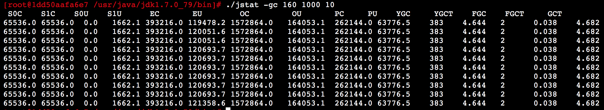

# 050、动手实验：使用 jstat 摸清线上系统的JVM运行状况

## 1、前文回顾

上周我们已经通过带着大家分析GC日志的方式，给大家重新回顾了一遍JVM的整体运行原理，包括对象优先在Eden区分配，Young GC的触发时机和执行过程，对象进入老年代的时机，Full GC的触发时机和执行过程，相信大家通过GC日志可以把JVM整体运行原理理解的更加的深入而且透彻。

本周问通过使用一个工具来分析运行中的系统，他的：

1. 对象增长率，
2. Yong GC的触发频率，
3. Yong GC的耗时，
4. 每次Yong GC后有多少对象是存活下来的，
5. 每次Yong GC后有多少对象进入了老年代，
6. 老年代对象增长的频率，
7. Full GC的触发频率，
8. Full GC的耗时。

## 2、功能强大的jstat

平时我们对运行中的系统，如果要检查他的JVM的整体运行情况，比较实用的工具之一，就是jstat。

3、jstat -gc PID

首先第一个命令，就是在生产机器linux上（比如，看一下data-board的），找出Java进程的PID，用jps命令就可以看到：

```bash
[root@b2a2d78cee83 ~]# /usr/java/default/bin/jps 
35 resin.jar
168 Resin
96 WatchdogManager
85183 Jps
```

接着就针对我们的Java进程执行：jstat -gc PID

这就可以看到这个Java进程（其本质就是一个JVM）的内存和GC情况了。

运行这个命令之后就会看到如下列：

```bash
[root@b2a2d78cee83 ~]# /usr/java/default/bin/jstat -gc 35                                                                            
 S0C    S1C    S0U    S1U      EC       EU        OC         OU       PC     PU    YGC     YGCT    FGC    FGCT     GCT   
87040.0 87040.0  0.0   17175.3 525312.0 56734.3  1397760.0     8.0     21504.0 13246.4      1    0.241   0      0.000    0.241
```

解释一下参数：

1. S0C：这是From Survivor区的大小；
2. S1C：这是To Survivor区的大小；
3. S0U：这是From Survivor区当前使用内存的大小；
4. S1U：这是To Survivor区当前使用内存的大小；
5. EC：这是Eden区的大小；
6. EU：这是Eden区当前使用内存的大小；
7. OC：这是老年代的大小；
8. OU：这是老年代当前使用的内存大小；
9. MC：这是方法区（永久代、元数据区）的大小；
10. MU：这是方法区（永久代、元数据区）的当前使用的内存大小；
11. YGC：这是系统运行迄今为止的Yong GC次数；
12. YGCT：这是Yong GC的耗时；
13. FGG：这是系统运行迄今为止的Full GC次数；
14. FGCT：这是Full GC的耗时；
15. GCT：这是所有GC的耗时。


#### 1>新生代对象增长的速率

说明：后来又补充的，使用的是 data-board 的线程容器。

jvm的参数信息如下：

```java
Xmx2048M -Xms2048M -Xmn512M -XX:SurvivorRatio=6 -Xss1024k -XX:PermSize=256M -XX:MaxPermSize=256M -XX:+UseConcMarkSweepGC -XX:+UseCMSCompactAtFullCollection -XX:+CMSParallelRemarkEnabled -XX:+CMSClassUnloadingEnabled -XX:+ExplicitGCInvokesConcurrent -XX:CMSInitiatingOccupancyFraction=80 -XX:-OmitStackTraceInFastThrow -XX:+PrintGCTimeStamps -XX:+PrintGCDetails 
```

- 初始化堆内存是2048M；
- 可分配的最大堆内存大小是2048M；
- 初始化的年轻代大小是 512M；
- Eden区和Survivor区的比例是 6：2，则Eden区大小是 512 * 6/8 = 384M，两个survivor区的大小都是 512 * 1/8 = 64M；

每隔1秒钟更新出来最新的一行jstat统计信息，一共执行10次 jstat 统计：



可以通过查看 EU 那一列，看出每次的新增。

比如可以适当的去修改 查看间隔 1 秒为 10分钟，或者在高峰期的时候来使用这个命令查看。

#### 2>Yong GC的触发频率和每次耗时

比如你的Eden区有 800MB 内存，那么发现高峰期每秒新增 5MB 对象，大概高峰期就是 每隔 3分钟会触发一次 Yong GC。

日常期每秒新增 0.5MB 对象，那么日常大概需要半个小时才会触发一次 Yong GC。

**那么每次 Yong GC 的耗时呢？**

通过 jstat 会告诉你迄今为止，系统已经发生了多少次 Yong GC，以及这些 Yong GC 的总耗时。

比如系统运行24小时后，总共发生了260次 Yong GC，总耗时 20s。那么平均下来每次 Yong GC 大概就耗时 几十毫秒的时间。

你大概就知道，每次 Yong GC 的时候会导致系统卡顿 几十毫秒。

#### 3>每次Yong GC后有多少对象是存活和进入老年代

可观察老年代的对象增长频率。

#### 4>Full GC的触发时机和耗时

只要知道了老年代对象的增长频率，那么Full GC 的触发时机就很清晰了。

比如老年代有 800MB 内存，每隔 3分钟新增 50 MB对象，那么大概 每小时就会触发1次 Full GC。

然后可以通过 jstat 打印出来的系统运行到迄今为止的 Full GC 以及总耗时，就能算出来每次 Full GC 的耗时。


