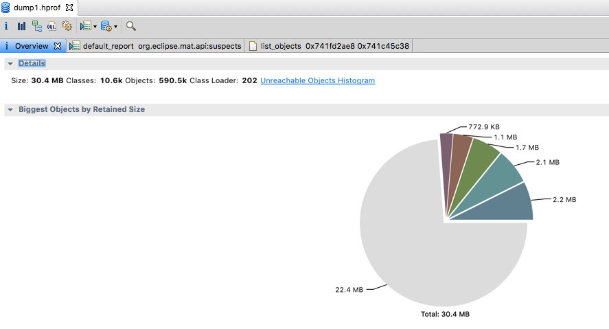

### 1、jmap和jhat

这两个工具可以帮助我们观察线上jvm中的对象分布，了解到你的系统平时运行过程中，到底哪些对象占据了主角位置，他们占据了多少内存空间。

### 2、使用jmap了解系统运行时的内存区域

比如有的时候，我们发现JVM新增对象的速度很快，然后就想要去看看，到底什么对象占据了那么多内存。

#### 第一个命令：jmap -heap pid

这个命令打出来的一系列信息，跟 jstat -gc pid 差不多，还没有jstat的全。

### 3、使用jmap了解系统运行时的对象分布

```bash
jmap -histo pid

或者

jmap -histo 74469 | more 
```

### 4、使用jmp生成堆内存快照

```bash
./jmap -dump:live,format=b,file=dump.hprof 160 
```

这个命令会在当前目录下生成一个 dump.hprof 文件，这是一个二进制文件，不能直接打开的。他把这一刻 JVM 堆内存里所有的对象 的快照放到文件里去了，供你后续分析。

### 5、使用jhat在浏览器中分析出堆转储快照

接着就可以使用jhat去分析堆快照了，jhat内置了web服务器，他会支持你通过浏览器以图像化的方式分析堆转储快照。

可以使用如下命令启动 jhat 服务器，还可以指定自己想要的端口号，默认是 7000 。

```bash
jhat -port 7000 dump.hprof
```


#### Mat

Memory Analyzer tool，是一种快速的，功能丰富的 Java 堆分析工具，能帮你找到内存泄露和减少内存消耗。

也可以使用 Mat 工具 （需要自己安装）：

启动 Mat，打开 dump.hprof。



##### Histogram

列出每个类所对应的对象个数，以及所占用的内存大小。

##### Dominator Tree

`以占用总内存的百分比的方式来列举出所有的实例对象，可以用来发现大内存对象`。

##### Leak Superset

通过 MAT 自动分析当前内存泄露的主要原因：


具体参考：https://www.cnblogs.com/zh94/p/14051852.html

