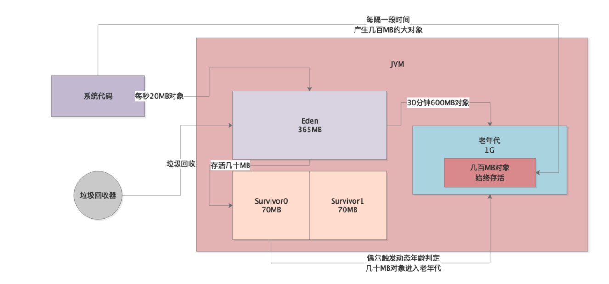
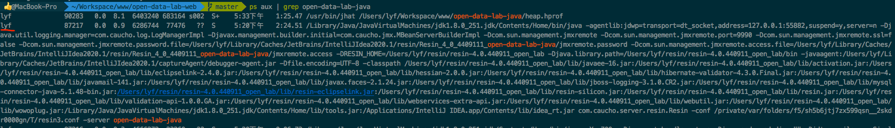
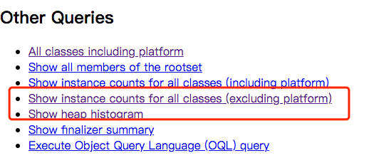
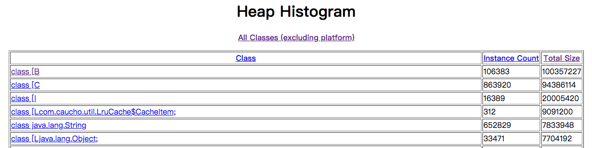

正是因为系统运行的时候，不知道为什么突然有有几百MB对象进入老年代中，所以才导致Young GC偶尔一次让几十MB对象升入老年代，平均30分钟左右就会触发一次Full GC！！！


那么我们就很奇怪了，为什么系统运行着会突然有几百MB的对象进入老年代？


答案已经呼之欲出了，**大对象！**


一定是系统运行的时候，每隔一段时间就会突然产生几百MB的大对象，直接进入老年代，不会走年轻代的Eden区域。


然后再配合上年轻代还偶尔会有Young GC后几十MB对象进入老年代，所以才会30分钟触发一次Full GC！




本地使用

```bash
jps -l
87217 com.caucho.server.resin.Resin
87216 org.jetbrains.jps.cmdline.Launcher
68803 org.jetbrains.idea.maven.server.RemoteMavenServer36
87618 sun.tools.jps.Jps
69253 org.jetbrains.kotlin.daemon.KotlinCompileDaemon
68692
```

### 查看进程是哪个用户执行的

```bash
ps aux | grep open-data-lab-java
```



### 生成堆快照文件

使用jmap手动为PID为 87217的进程生成堆快照文件：

```bash
sudo -u lyf jmap -dump:format=b,file=/Users/lyf/Workspace/www/open-data-lab-java/heap.hprof 87217

Dumping heap to /Users/lyf/Workspace/www/open-data-lab-java/heap.hprof ...
Heap dump file created
```

执行结果：


### 打开堆快照文件

使用jhat命令打开堆快照文件：

```bash
jhat /Users/lyf/Workspace/www/open-data-lab-java/heap.hprof
```

执行结果：

```bash
Reading from /Users/lyf/Workspace/www/open-data-lab-java/heap.hprof...
Dump file created Fri May 28 17:28:42 CST 2021
Snapshot read, resolving...
Resolving 3448795 objects...
Chasing references, expect 689 dots.................................................................................................................................................................................................................................................................................................................................................................................................................................................................................................................................................................................................................................................................................................................
Eliminating duplicate references.................................................................................................................................................................................................................................................................................................................................................................................................................................................................................................................................................................................................................................................................................................................
Snapshot resolved.
Started HTTP server on port 7000
Server is ready.
```

### 查看堆内存快照

直接浏览器访问：http://localhost:7000/

将页面拖到最底部：



需要重点关注这两个。


#### Show heap histogram

点开后是这个样子的：



我们可以通过计算total size的大小，这里的单位是字节，换算成G，看到底是哪些对象占用的内存过大。


比如这里，B对象占用了100357227 byte，换算成 MB，就是 95MB。

1G = 1024MB

1MB = 1024KB

1KB = 1024 Byte（字节）

1Byte = 8bit（比特）