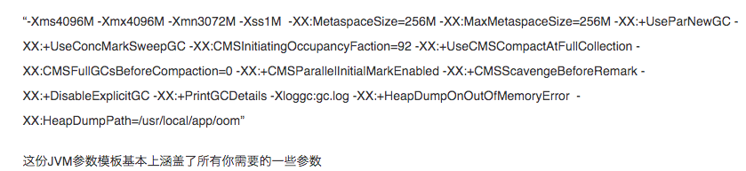

## **082、一个关键问题：如何在JVM内存溢出的时候自动dump内存快照？**

### 3、在OOM的时候自动dump内存快照

我们可以通过参数设置让jvm在OOM时，dump一份内存快照，事后我们只要分析这个内存快照，一下就可以知道是哪些可恶的对象占用了所有的内存，并且还无法释放。

此时你就需要在JVM的启动参数中加入如下的一些参数：

```bash
-XX:+HeapDumpOnOutOfMemoryError
-XX:HeapDumpPath=/usr/local/app/oom
```

### 4、迄今为止我们可以得到的一份JVM参数模板



首先是各个内存区域的大小分配，这个是需要你精心调优的。

其次是两种垃圾回收器的指定

接着是一些常规性的CMS垃圾回收的参数，可以帮助优化偶尔发生的Full GC性能

最重要的，就是平时要打印出来GC日志，GC日志可以配合你用jstat工具分析GC频率和性能的时候用。

还有就是在OOM的时候需要自动dump内存快照。


`引申：`

思考一下 data-board 的高峰时期，JVM的 YGC、Old GC 频率，以及JVM参数怎么设置的。。。。。。


