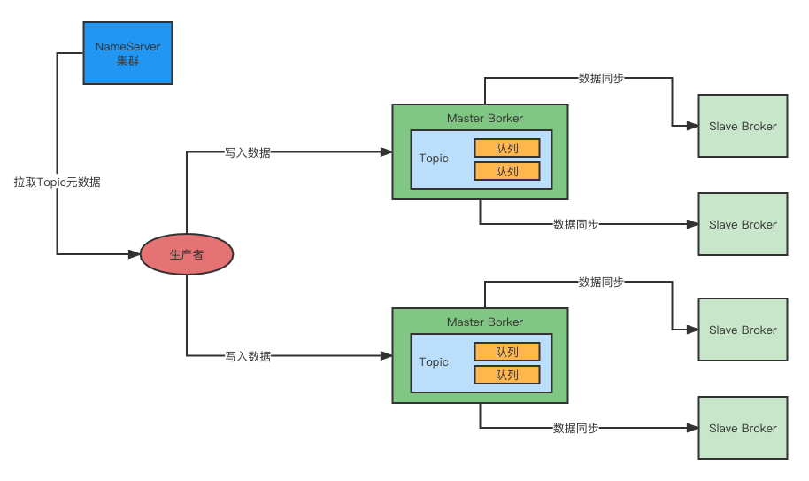
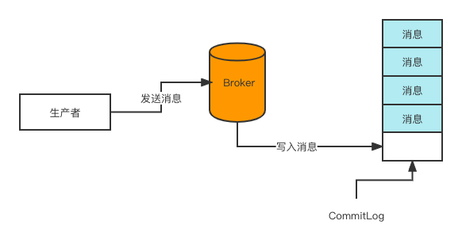
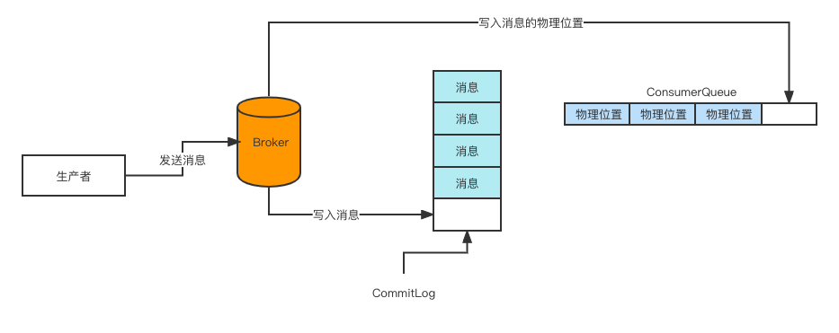
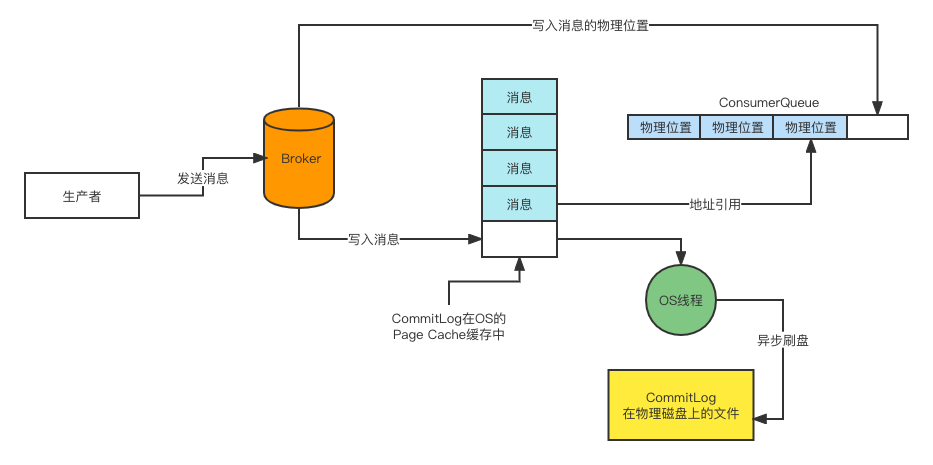

## 从0开始带你成为消息中间件实战高手

别人分享的关于RocketMQ的笔记：

https://note.youdao.com/ynoteshare/index.html?id=37e70c4305f64e15fb4f95536de586a9&type=notebook&_time=1642755363814

### 009_系统面临的现实问题：大数据团队需要订单数据，该怎么办？

#### 大数据到底是干嘛的？

做为公司的老板，他可能每天到公司来的第一件事儿就是要看看昨天的销售额是多少，卖了多少件商品。可能还想要知道一共有多少个用户在我们这里购买了商品？一共有多少个订单？每个商品分别卖了多少？哪个商品是卖的最火爆的？我们的APP昨天有多少人打开了？打开APP里的人有多少人下订单购物了？

老板拿到这些数据后，才能继续去考虑公司的运用策略。

比如老板拿到这份数据后，觉得用户量还是太少了，要抓紧投放广告，多拉一些人来购物。

因此，听明白了上面这段描述，你一定就能理解什么是大数据，以及大数据团队是干什么的了。

很简单，上面说的老板每天上班的第一件事儿要了解的那些数据，其实就是大数据。

所以如果每天有100万用户来访问你的APP，积累下来的一些浏览行为、访问行为、交易行为等各种数据，这个数据量很大，所以你可以称之为"大数据"。

**大数据团队每天要负责的事情，说白了就是去尽可能的搜集每天100万用户在你APP上的各种行为数据。**

### 015_解决订单系统诸多问题的核心技术：消息中间件到底是什么？

所谓消息中间件其实就是一种系统，它自己也是独立部署的，然后我们的两个系统之间通过发消息和收消息，来进行异步的调用，而不是仅仅局限于同步调用。

MQ进行流量削峰的效果：系统A发送过来的每秒1万请求是一个流量洪峰，然后MQ直接扛下来了，都存储在自己本地磁盘里，这个过程就是流量削峰的过程，瞬间把一个洪峰给削下来了，让系统B后续慢慢获取消息来处理。

### 021_设计生产架构之前的功课：消息中间件路由中心的架构是什么？

RocketMQ 的核心其实包含了四个部分：

1. 第一块就是他的 NameServer，这个东西很重要，他负责管理集群所有的Broker信息，让使用MQ的系统通过他可以感知到集群里有哪些Broker；
2. 第二块就是Broker集群本身了，必须得在多台机器上部署这么一个集群，而且还得用主从架构实现数据多副本存储和高可用。
3. 第三块就是像MQ发送消息的那些系统了，这些系统一般称之为生产者，这里也有很多细节是值得深究的，因为这些生产者到底是如何从NameServer拉取路由信息的？如何选择Broker机器简历连接以及发送消息的？
4. 第四块就是从MQ获取消息的那些系统，这些系统称之为消费者。仔细想想消费者这块其实也隐藏了很多技术细节，比如到底是Broker主动推送消息给消费者，还是消费者自己从Broker里拉取消息？这些也都很值得深究。

#### 关于NameServer

##### 1、Broker是把自己的信息注册到哪个NameServer上？

答案：每个 broker 启动都得向所有的NameServer进行注册。

##### 2、系统如何从NameServer获取Broker信息？

每个系统（生产者或消费者）自己每隔一段时间，定时发送请求到NameServer去拉取最新的集群Broker信息。

##### 3、如果Broker挂了，NameServer是怎么感知到的？

要解决这个问题，靠的是 Broker 和 NameServer 之间的心跳机制，Broker 会每隔 30秒 给说有的 NameServer 发送心跳，告知每个 NameServer 自己目前还活着。

每次NameServer 收到一个 Broker 的心跳，就可以更新一下他的最近一次心跳的时间。

然后NameServer 会每隔10s 运行一个任务，去检查一下各个Broker的最近一次心跳时间，如果某个Broker 超过120s 都没发送心跳了，那么就认为这个Broker已经挂掉了。

##### 4、Broker 挂了，系统是怎么感知的

这里先说一下思路，等后边分析生产者原理的时候会说具体的细节。

大家想一下，可以有两种解决办法：

- 首先，你可以考虑不发送消息给那台 Broker，改成发给其它 Broker；
- 其次，假设你必须发送消息给那台 Broker，那么他挂了，他的 Slave 机器是一个备份，可以继续使用，你是不是可以考虑等一会儿去跟他的 Slave 进行通信？
- 总之，这些都是死路，但是现在我们知道，对于生产者而言，他是有一些容错机制的，即使一下子没感知到某个 Broker 挂了，他可以有别的方案去应对；
- 而且，过一会儿，系统又会重新从 NameServer 拉取最新的路由信息了，此时就会知道有一个 Broker 已经宕机了。

### 021_设计生产架构之前的功课：Broker的主从架构原理是什么？

#### 2、Master Broker是如何将消息同步给 Slave Broker的？

RocketMQ 的Master-Slave 模式采取的是 Slave Broker 不停的发送请求到 Master Broker去拉取消息。

#### 3、RocketMQ 实现读写分离了吗？

下一个问题，既然 master broker 主要是接收系统的消息写入，然后会同步给 broker，那么其实本质上 slave broker 也应该有一分一样的数据。

所以这里提出一个疑问，做为消费者的系统在获取消息的时候，是从 master broker 获取的？还是从 slave broker 获取的？

其实都不是，答案是：有可能从 master broker 获取，也有可能从 slaver broker 获取。

做为消费者的系统在获取消息的时候会发送请求到 master broker 上，请求获取一批消息，此时 master broker是会返回一批消息给消费者系统的。

然后 master broker 在返回消息给消费者系统的时候，**会根据当时 master broker 的负载情况和slave broker 的同步情况**，**向消费者建议下一次拉取消息的时候**是从 master broker拉取还是从 slave broker 拉取。

举个例子，要是这个时候 master broker 负载很慢，本身要扛10万写并发了，你还要从他这里拉取消息，给他加重负担，那肯定是不合适的。

所以，此时master broker 就会建议你从 slave broker去拉取消息。

#### 4、如果Slave Broker挂掉了有什么影响？

有一点影响，但影响不大。

如果 Slave Broker 挂掉了，那么此时无论消息写入还是消息拉取，还是可以继续从 master broker 去走，对整体运行不影响。只不过少了 slave broker，会导致所有读写压力都集中在 master broker上。

#### 5、如果Master Broker挂掉了该怎么办？

现在假设出现了一个故障，master broker突然挂了，这样会怎么样？

这时候就对消息写入和获取都有一定影响了。但是其实本质上而言，slave broker 和master broker 一样都有一份数据再的，只不过slave broker上的数据可能有部分没来得及从master broker同步。

但是此时 RocketMQ 可以实现直接自动将Slave Broker切换为 Master Borker吗？

答案是：不能。

在RocketMQ 4.5版本之前，都是用 Slave Broker同步数据，尽量保证数据不丢失，但是一旦 Master故障了，Slave是没法自动切换成Master的。

所以在这种情况下，如果Master broker宕机了，这时就得手动做一些运维工作，把 slave broker重新修改一下配置，重启机器给调整为master broker，这是有点麻烦，而且会导致中间件一段时间不可用。

所以这种 Master-Slave 模式不是彻底的高可用模式，他没法实现自动把Slave切换为Master。

#### 6、基于Dledger实现RocketMQ高可用自动切换

在RocketMQ 4.5之后，这种情况得到了改变，因为RocketMQ支持了一种新的机制，叫做Dledger。

原理有点复杂。

简单来说，把 Dledger 融入 RocketMQ 之后，就可以让一个 master broker 对应多个 slave broker，也就是说一个数据可以有多份副本。

此时一旦master broker 宕机了，就可以在多个slave之间，通过Dledger技术和Raft协议算法进行leader选举，直接将一个slave broker选举为新的master broker，然后这个新的master broker就可以对外提供服务了。

整个过程也许只要10秒钟或者几十秒钟就可以完成。

Dledger所以，索道这里，我们在设计 RocketMQ 生产部署的时候，完全可以采用基于Dledger的部署方式，这样就可以让  RocketMQ 做到自动故障切换了。

### 025_落地第一步：设计一套高可用的消息中间件生产部署架构

#### 2、NameServer 集群化部署，保证高可用性

让 NameServer 集群化部署，部署在三台机器上。

#### 3、基于Dledger的Broker主从架构部署

选择 RocketMQ 4.5 之后基于 Dledger 的主备自动切换的功能来进行生产架构的部署。

而且 Dledger 技术是要求至少得是一个 master 带两个 slave，这样有三个 broker 组成一个 group，也就是做为一个分组来运行。一旦master 宕机，他就可以从剩余的两个 slave 中选举出来一个新的 master 对外提供服务。

#### 4、Broker 是如何跟 NameServer 进行通信的

##### 首先，broker跟nameServer之间的通信是基于什么协议来进行的？

在 rocketmq的实现中，采用的是TCP长连接进行通信。

也就是说，broker 会跟每个 nameserver 都建立一个长连接，然后定时通过tcp长连接发送心跳请求过去。

#### 5、使用MQ的系统都要多机器集群部署

对于这些系统的部署本身不应该在MQ的考虑范围内，但是我们还是应该给出一个建议，就是无论生产者还是消费者的系统，都应该多机器集群化部署，保证他自己本身做为生产者或消费者的高可用性。

因为一个系统如果部署在一个机器上，然后做为生产者向MQ发送消息，那么一旦哪天机器上的生产者系统挂了，整个流程就断开了，不能保证高可用性。

但是如果在多台机器上部署生产系统，任何一台机器上的生产者挂了，其他机器的生产系统可以继续运行。

#### 6、MQ的核心数据模型：Topic到底是什么？

Topic其实就是一个数据集合的意思，不同类型的数据你得放不同的topic里去。

#### 7、Topic 做为一种数据集合是怎么在 Broker集群里存储的？

这里就体现出来一个**分布式存储**的概念了。

我们可以在创建Topic的时候指定让他里面的数据分散存储在多态Broker机器上，比如一个Topic里有1000万条数据，此时有2台broker，那么就可以让每台broker上都放500万条数据。

这样就可以把一个Topic代表的数据集合分布式存储在多台机器上了。

而且另外很重要的一件事儿是，每个broker在进行定时的心跳汇报给nameserver的时候，都会告诉nameserver自己当前的数据情况，比如有哪些topic的哪些数据在自己这里，这些信息都是属于路由信息的一部分。

#### 8、生产者系统是如何将消息发送给broker的？

1. 首先我们之前说过，在发送消息之前，得先有一个topic；

2. 然后在发送消息的时候你得指定你要发送到哪个topic里去；
3. 生产者会跟nameserver建立一个TCP长链接，然后定时从他那里拉取到最新的路由信息，包括集群里有哪些broker，集群里有哪些topic，每个topic都存储在哪些broker上。
4. 然后生产者系统自然就可以通过路由信息找到自己要投递消息的topic分布在哪几台broker上，此时就可以根据负载均衡算法，从里面选择一台broker机器出来，比如 round robine 轮询算法，或者是 hash算法，都可以。这个具体的选择broker的算法，后面在讲RocketMQ技术落地到项目的时候再来细说就可以。
5. broker收到消息之后就会存储在自己的本地磁盘里去。
6. 这里唯一要注意的一点，就是生产者一定是投递消息到master broker的，然后master broker会同步数据给他的salve broker，实现一份数据多分副本，保证master故障的时候数据不会丢失，而且可以自动把slave切换为master提供服务。

#### 9、消费者是如何从broker上拉取消息的？

消费者系统其实跟生产者系统原理是类似的，他们也会跟nameserver建立长连接，然后拉取路由信息，接着找到自己要获取消息的topic在哪几台broker上，就可以跟broker建立长连接，从里面拉取消息了。

这里唯一要注意的一点是：消费者系统可能从master broker拉取消息，也可能从slave broker 拉取消息，都有可能，一切看具体情况。

#### 10、整体架构：高可用、高并发、海量消息、可伸缩

总结下来，这套整体架构是：高可用、高并发、海量消息、可伸缩。

### 27_部署一个小规模的RocketMQ集群，为压测做好准备

### 029_生产运维：如何对RocketMQ集群进行可视化的监控和管理？

TPS（QPS）：通俗的定义就是"系统"的吞吐量，专业一点的解释就是"系统一秒钟处理了多少个请求"。

### 031_RocketMQ生产集群准备：进行OS内核参数和JVM参数的调整

#### 2、OS内核参数调整

#### 3、对JVM参数进行调整

#### 4、对RocketMQ核心参数进行调整


### 033_对小规模RocketMQ集群进行压测，同时为生产集群进行规划

#### 什么叫最合适的最高负载呢？

CPU负载、IO负载、内存、网卡流量是否打满。

意思就是在RocketMQ的TPS和机器的资源使用率和负载之间取得一个平衡。

#### 总结

1. 到底应该如何压测；
2. 实际压测过程；
3. 生产集群规划；

这一节里有详细的压测使用命令，可以参考。

### 037_基于MQ实现订单系统的核心流程异步化改造，性能优化完成

#### 2、从哪里开始入手改造订单系统

#### 3、通过引入MQ实现订单核心流程的异步化改造

现在每次支付订单完成以后，都需要执行一些列的动作，包括：

- 更新订单状态；
- 扣减库存；
- 增加积分；
- 发优惠券；
- 通知发货；
- 发送短信；

这会导致一次核心链路的执行时间过长，可能长达好几秒钟。

所以实际上我们需要的一个效果是：在用户支付完毕以后，只需要更新核心的订单状态和扣减库存就可以了，保证速度足够快。

然后诸如增加积分、发优惠券、通知发货、发送短信 这些都可以通过MQ 实现异步化执行。

#### 4、在订单系统中如何发送消息到RocketMQ？

1.在pom.xml中添加rocketmq-client 依赖；

2.自己封装一个RocketMQProducer

#### 5、订单消息会进入哪个Broker里去呢？

那么大家肯定会疑惑了，按照我们部署的MQ集群而言，Master Broker 有两台，那么此时消息会进入哪个Master Broker里去呢？

实际上我们之前说过，Topic是一个逻辑的概念，实际上他的数据是分布式存储在多个 Mater Broker 中的。当你发送一个订单消息过去的时候，会根据一定的负载均衡算法和容错算法把消息发送到每一个 Broker 中去。

后边专栏会有更多关于RocketMQ底层机制的分析。

#### 6、其它系统改造为从RocketMQ中获取订单消息

自定义 RocketMQConsumer 类，指定group，订阅相关topic，添加业务处理逻辑。

#### 7、订单核心流程改造的流程梳理

通过上述改造，可以将订单核心流程的性能从1秒~几秒的情况，优化到100ms+，可以实现10倍性能提升的效果。

### 039_基于MQ实现订单系统的第三方系统异步对接改造

#### 4、什么叫做同步发送消息到RocketMQ？

所谓同步，意思就是你通过这行代码发送消息到MQ去：

```java
SendResult sendResult = producer.send(msg);
```

然后你会卡在这里，代码不能往下走了。

你要一直等待MQ返回一个结果给你，你拿到了sendResult之后，接着你的代码才会继续往下走。

这个就是所谓的同步发送模式。

#### 5、什么叫做异步发送消息到RocketMQ？

在构造 Producer 的时候，先加入下面代码：

```java
// 设置异步发送失败的时候重试次数为0
producer.setRetryTimesWhenSendaSyncFailed(0);
```

接着把发送消息的代码改为如下：

```java
// 2.2 异步发送消息
producer.send(message, new SendCallback() {
//rabbitmq急速入门的实战: 可靠性消息投递
@Override
public void onSuccess(SendResult sendResult) {
	System.err.println("msgId: " + sendResult.getMsgId() + ", status: " + 		      sendResult.getSendStatus());
}
@Override
public void onException(Throwable e) {
  e.printStackTrace();
  System.err.println("------发送失败");
}
```

#### 6、什么叫做单向发送消息到RocketMQ？

还有一种发送消息的方法，叫做单向发送消息：

```java
producer.sendOneWay(msg);
```

这个sendOneWay的意思是，你发送一个消息到MQ，然后代码就往下走了，根本不会关注MQ有没有返回结果给你，你也不需要MQ的返回结果，无论发送的消息是成功还是失败，都不管你的事。

#### 7、这几种发送消息的方式到底该用哪一种

根据具体的场景。

#### 8、什么叫做Push消费模式

类名 DefaultMQPushConsumer ，当前我们使用的消息消费实际上是Push模式。

其实很简单，就是Broker会主动把消息发送给你的消费者，你的消费者是被动的接收Broker推送过来的消息，然后进行处理。

#### 9、什么叫做Pull消费模式

类目 DefaultMQPullConsumer，使用的是Pull消费模式，也就是说Broker不会主动推送消息给Consumer，而是消费者主动发送请求到Broker去拉取消息过来。

### 041_基于MQ实现订单数据同步给大数据团队，应该如何设计？

完美的解决方案：

用 Canal 这样的Mysql Binlog 系统，监听订单数据库的binlog 发送到RocketMQ里。

然后大数据团队的数据同步系统里获取订单数据的增删改binlog日志，还原到自己的数据存储中去，可以是自己的数据库，或者是Hadoop之类的大数据生态技术。

### 043_秒杀系统的技术难点以及秒杀商品详情页系统的架构设计

#### 5、商品团队的秒杀架构优化：页面数据静态化

需要将这个秒杀活动的商品详情页里的数据做成静态化的，也就是说提前从数据库里把这个页面需要的数据都提取出来，组装成一份静态的数据放在别的地方，避免每次访问这个页面都需要访问后端数据库。

#### 6、商品团队的秒杀架构优化：多级缓存

使用 CDN + Nginx + Redis 的多级缓存架构。

将用于秒杀活动的商品详情页数据进行静态化，然后把静态化后的一串商品数据（比如可能是一个大的JSON字符串）放到 CDN、Nginx、Redis 组成的多级缓存中去，这样大量的用户同时访问秒杀活动商品详情页的时候对我们的商品系统本身就没有什么压力了。

分布在全国各地的用户的大量请求都是分散发送给各个地方的CDN的，所以CDN就分摊了大量的请求。

#### 045_基于MQ实现秒杀订单系统的异步化架构以及精确扣减库存的技术方案

#### 3、为秒杀系统独立出来一套订单系统

#### 4、基于Redis实现下单时精确扣减库存

通常在秒杀场景下，一般会将每个秒杀商品的库存提前写入Redis中，每当请求到来之后，就直接对Reids中的库存进行扣减。

Redis可以轻轻松松单机扛每秒几万的并发，因为这里就可以扛下高并发的库存扣减。

#### 5、抢购完毕之后提前过滤无效请求

比如一旦商品抢购完毕，可以在zooKeeper中写入一个秒杀完毕的标志位，然后ZK会反向通知Nginx中我们自己写的lua脚本，通过lua脚本后续在请求过来的时候直接过滤掉，不要向后转发了。

这样可以大幅削减对后端秒杀系统的请求压力。

#### 6、瞬时高并发下单请求进入RocketMQ进行削峰

接着我们来考虑下，哪怕是有1万件商品同时被1万人秒杀成功了，那么可能瞬间会有1万请求涌入正常的订单系统进行后续的处理，此时可能还会有瞬间上万请求访问到订单数据库中创建订单。

所以这个时候，完全可以引入RocketMQ进行削峰处理。

也就是说对于秒杀系统而言，如果判断发现redis完成了库存扣减，此时库存还大于0，就说明秒杀成功了需要生成订单，此时就直接发送一个消息到RocketMQ即可。

然后让普通订单系统从RocketMQ中消费秒杀成功的消息进行常规性的流程处理即可，比如创建订单等。

这样的话，瞬间上万的并发压力就被RocketMQ轻松扛下来了。然后普通的订单系统可以根据自己的工作负载慢慢的从RocketMQ中拉取秒杀成功的消息，然后进行后续操作就可以了，不会对订单数据库造成过大的压力。

### 049_精益求精：深入研究一下生产者到底如何发送消息的？

分析RocketMQ生产者工作原理的过程。

#### 3、创建Topic的时候为何要指定MessageQueue数量

在RocketMQ可视化工作台里去创建Topic的时候，需要指定一个很关键的参数，就是MessageQueue。

那么这个MessageQueue是用来干嘛的？

#### 4、Topic、MessageQueue以及Broker之间到底是什么关系？

所以其实MessageQueue就是RocketMQ中非常关键的一个数据分片机制，他通过MessageQueue将一个Topic的数据拆分了很多个数据分片，然后在每个Broker机器上存储一些MessageQueue。

#### 5、生产者发送消息的时候写入哪个MessageQueue？

要解决这个问题，大家首先就要记得之前我们讲解过的一个重要的点，生产者会跟NameServer进行通信获取Topic的路由数据。所以生产者从NameServer中就会知道，一个Topic有几个MessageQueue，那些MessageQueue在哪台Broker机器上。



然后呢，现在我们暂时先认为生产者会均匀的把消息写入各个MessageQueue，就是比如这个生产者发送了20条数据，那么4个MessageQueue就是每个都会写入5条数据。

至于其他的写入MessageQueue的策略，我们后续会结合其他的高阶功能和业务场景来讲解。

通过这个方式，是不是就可以让生产者把写入请求分散给多个Broker，是不是就可以让每个Broker都分摊到一定的写入请求压力？

这样假设单个Broker可以扛住每秒7万并发，那么两个Broker就可以扛住每秒14万并发！这样就可以实现RocketMQ集群扛下每秒10万+超高并发的场景了！

另外通过这个方法，是不是可以让一个Topic中的数据分散在多个MessageQueue中，进而分散在各个Broker机器上，这样就可以实现**RocketMQ集群分布式存储海量的消息数据**了。

#### 6、如果某个Broker出现故障怎么办

对于这个问题，通常来说建议大家在Producer中开启一个开关，就是 sendLatencyFaultEnable。

一旦打开这个开关，那么他就会有一个自动容错机制。

比如如果某个访问一个Broker发现网络延迟有500ms，然后还无法访问，那么就会自动回避访问这个Broker一段时间，比如接下来的300ms内，就不会再访问这个Broker了。

### 051_精益求精：深入研究一下Broker是如何持久化存储消息的？

Broker的数据存储机制是MQ最核心的环节，它决定了生产者消息写入的吞吐量，决定了消息不能丢失，决定了消费者消费消息的吞吐量。

#### 2、CommitLog消息顺序写入机制

首先我们来思考一下，当生产者的消息发送到一个Broker上的时候，他接收到了一条消息，接着他会对这个消息做什么事情？

首先第一步，他会把这个消息直接写入磁盘上的一个日志文件，叫CommitLog，直接顺序写入这个文件：



这个CommitLog是很多磁盘文件，每个文件限定最多1GB，Broker收到消息之后就直接追加写入这个文件的末尾，就跟上面图里一样。如果一个CommitLog写满了1GB，就会创建一个新的CommitLog文件。

#### 3、MessageQueue在数据存储中是体现在哪里呢？

接着我们会发现一个问题，如果写入这个Broker中的消息是存储在CommitLog中，那么上次我们提到的MessageQueue是体现在哪里的？

其实在Broker中，**对Topic下的每个MessageQueue都会有一系列的ConsumerQueue文件**。

假设Queue的名字叫做：TopicOrderPaySuccess，且这个topic下的MessageQueue0和MessageQueue1就放在这个Broker机器上，那么此时在Broker磁盘上应该有如下两个路径的文件：

$HOME/store/consumerQueue/TopicOrderPaySuccess/MessageQueue0/ConsumerQueue0磁盘文件

$HOME/store/consumerQueue/TopicOrderPaySuccess/MessageQueue0/ConsumerQueue1磁盘文件

然后呢，当你的Broker收到一条消息写入了CommitLog之后，其实他同时会将这条消息在CommitLog中的物理位置，也就是一个文件偏移量，写入到这条消息所属的MessageQueue对应的ConsumerQueue文件中去。



实际上在ConsumerQueue中存储的每条数据不只是消息在CommitLog中的offset偏移量，还包含了消息的长度，以及tag hashcode，**一条数据是20个字节，每个ConsumerQueue文件保存30万条数据，大概每个文件是5.72MB**。

#### 4、如何让消息写入CommitLog文件近乎内存写性能的？

对于生产者把消息写入到磁盘上的CommitLog文件，那么Broker是如何提升整个过程的性能的呢？

在这里，Broker是基于 **OS 操作系统的PageCache**和**顺序写**两个机制，来提升写入CommitLog文件的性能的。



所以在这样的优化之下，采用磁盘文件顺序写+OS PageCache写入+OS异步刷盘的策略，基本上可以让消息写入CommitLog的性能跟你直接写入能存里是差不多的，所以正是如此，才可以让Broker高吞吐的处理每秒大量的消息写入。

#### 5、同步刷盘与异步刷盘

异步刷盘的策略下，可以让消息写入吞吐量非常高，但是可能会有数据丢失的风险，这个是大家需要清楚的。

##### 同步刷盘

另外一种模式叫同步刷盘，如果你使用同步刷盘模式的话，那么生产者发送一条消息出去，broker收到了消息，必须强制把消息刷入到底层的磁盘文件中，然后才会返回ack给producer，此时你才知道消息写入成功了。

只要是消息写入了磁盘，那么除非是你的物理机磁盘坏了导致数据丢失，否则正常来说，数据是不会丢失了。

如果broker还没有来得及把数据同步刷入磁盘，然后他自己就挂了，那么此时对producer来说就会感知消息发送失败了，然后你只要不停的重试发送就可以了，直到有slave broker切换成master broker重新让你可以写入消息，此时可以保证数据是不会丢的。

但是如果你强制每次消息都直接进入磁盘中，必然导致每条消息写入性能急剧下降，导致消息写入吞吐量急剧下降，但是可以保证数据不会丢失。

