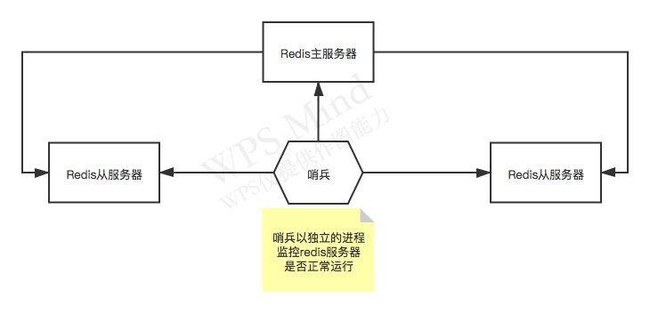

```
tryAcquire
```

在分布式系统开发当中，分布式锁的使用场景还是很常见的。

### Redis哨兵模式



#### Redis哨兵的作用

- 通过发送命令，让Redis服务器返回其监控的运行状态，包括主服务器和从服务器；
- 当哨兵监测到master宕机，会自动将slave切换为master；
- 然后通过发布订阅模式通知其它的从服务器，修改配置文件，让它们切换主机。

### Redis分布式锁

#### 什么是分布式锁

在分布式系统里面，如果多个机器上的服务要同时对一个共享资源进行操作，比如修改数据库里的一份数据，此时的话，某台机器就需要先获取一个针对那个资源（比如数据库里的某一条数据）的分布式锁。

获取到了分布式锁之后，就可以任由你去查询那条数据，修改那条数据，或者做其它的什么操作。在这个期间，没有任何其它的客户端可以来修改这条数据。

获取了一个分布式操作之后，就对某个共享的数据获取了一定时间范围内的独享操作。

#### 可重入锁

如果是在一个客户端的一个线程内，先对一个Lock进行了加锁，然后后面又加了一次锁，这样就形成了一个叫做可重入锁的概念。

就是同一个线程对一个lock可以反复的重复加锁多次，每次加锁和一次释放锁必须是配对的。

#### Redisson：可重入锁源码剖析之等待获取锁超时与超时锁自动释放

```java
RLock lock = redisson.getLock("testLock1");

// 100: 等待获取锁最大时间为100秒
// 10: 获取到锁后，超过10秒就自动释放锁
lock.tryLock(100,10, TimeUnit.SECONDS);
```

##### 尝试获取锁超时

会有一个死循环，不停的去尝试获取锁，每次time（传入的参数，比如100秒）都会减去本次尝试获取锁的耗时，

如果始终无法获取到锁，那么就会在time指定的最大时间后，返回false。

##### 超时锁自动释放

直接执行lua脚本后，不会触发Feture的监听器，不会执行那个延迟存活时间的定时调度任务。

### 可重入锁源码剖析之总结

1. 加锁；
2. 维持加锁；
3. 可重入锁；
4. 锁互斥；
5. 手动释放锁；
6. 宕机自动释放锁；
7. 尝试加锁超时；
8. 持有锁超时释放锁。

这8个机制组合在一起，才是构成了一个企业级的基于redis的分布式锁的方案。

#### redisson分布式锁的隐患

1. redis加锁，本质上就是在redis集群中挑选一个master实例来加锁；

2. 每一个master都挂载了一个slave实例，实现搞可用的机制，如果master宕机，slave就会自动切换为master。

但是还是会有一个老生常谈的问题：

假设客户端刚刚在master写入一个锁，此时发生了master的宕机，但是master还没来得及将那个锁key异步同步了slave，slave就切换为新的master。

此时别的客户端在新的master上也尝试获取同一个锁，成功获取到锁。

这时就会出现两个客户端，都会获取同一把分布式锁，可能有的时候就会导致一些数据的问题。

redisson的分布式锁，隐患主要就在这里。

### MultiLock锁

redisson分布式锁这块是支持MultiLock这个机制的。可以将多个锁合并为一个大锁，对一个大锁进行统一的申请，以及释放锁。

#### 使用场景

在项目里，有很多时候需要一次性锁定多个资源，比如锁掉一个库存，锁掉一个订单，锁掉一个积分，一次性锁掉多个资源，这多个资源不允许别人进行修改，然后你再一次性更新多个资源，最后释放资源。

#### 总结

MultiLock锁的源码，就是包裹了多个RedissonLock，底层就是尝试依次对每个锁都要成功加锁，如果所有锁都成功加锁了之后，那么就认为MultiLock加锁成功了。

释放锁时，依次对每个锁进行释放就可以了。