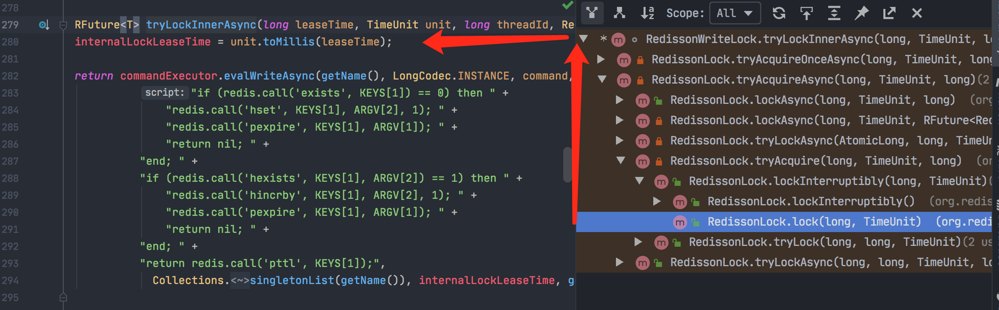

## redis分布式锁：可重入锁源码学习

我们通过学习开源的redis客户端框架redisson的源码，来学习它是如何实现redis分布式锁的。

```java
Config config = new Config();

// 3主3从的一个redis集群
config.useClusterServers().addNodeAddress("redis://192.168.10.111:6379")
		    .addNodeAddress("redis://192.168.10.111:6380")
		    .addNodeAddress("redis://192.168.10.111:6381")
		    .addNodeAddress("redis://192.168.10.112:6379")
		    .addNodeAddress("redis://192.168.10.112:6380")
		    .addNodeAddress("redis://192.168.10.112:6381");

RedissonClient redisson = Redisson.create(config);

RLock lock = redisson.getLock("anyLock");
lock.lock();
```

##### getLock()

1. 这里getLock方法获取到的是RedissonLock对象，它里面封装了一个commandExecutor，可以执行一些redis的底层命令，比如set，get的一些操作；
2. 还有一个internalLockLeaseTime，是跟watch dog有关的，默认是30秒。

##### lock()

lock()方法源码调用树如下：



我们可以看到，redisson的lock()方法，底层是执行了一段针对redis的lua脚本（redis本身是支持执行lua脚本的）。

大概解释一下这段lua脚本：

**第一部分**

```lua
if (redis.call('exists', KEYS[1]) == 0) then 
  redis.call('hset', KEYS[1], ARGV[2], 1); 
  redis.call('pexpire', KEYS[1], ARGV[1]); 
  return nil; 
```

1. 用redis的 exists 命令判断一下，我们要加锁的那个锁名字比如叫"anyLock"是否存在，如果不存在，那么就进行加锁；

2. 使用redis的hset指令进行加锁，会在redis里存储一个map结构的数据：

   比如：锁的名字叫testLock，其中一个字段叫 age，年龄为30：

   ```bash
    127.0.0.1:6379> hset testLock age 30
    (integer) 1
   ```

   就会在redis中生成 "testLock"的一个map：

   ```json
   {
      "age": 30
   }
   ```

3. 给我们加的锁 "testLock"设置过期时间。

**第二部分**

```lua
if (redis.call('hexists', KEYS[1], ARGV[2]) == 1) then 
  redis.call('hincrby', KEYS[1], ARGV[2], 1); 
  redis.call('pexpire', KEYS[1], ARGV[1]); 
  return redis.call('pttl', KEYS[1])
```

1. 如果存在针对"testLock" 的这个map里，存在"age"这个key：

2. 则使用redis的hincrby指令，将"age"的值累加1；

3. 再次使用pexpire指令，设置过期时间。

   也就相当于这个过程：

   ```bash
   127.0.0.1:6379> hset testLock age 30
   (integer) 1
   127.0.0.1:6379> hexists testLock age
   (integer) 1
   127.0.0.1:6379> hincrby testLock age 1
   (integer) 31
   127.0.0.1:6379> pexpire testLock 30000
   (integer) 1
   ```

4. 其实就是执行pttl指令，得到当前key的存活周期，并返回。

##### commandExecutor.evalWriteAsync

看完这段lua脚本后，我们再来看这个evalWriteAsync()方法：

```java
@Override
public <T, R> RFuture<R> evalWriteAsync(String key, Codec codec, RedisCommand<T> evalCommandType, String script, List<Object> keys, Object... params) {
    // 获取Master实例，lua脚本将会在这个实例上执行(下面会详细介绍)
    NodeSource source = getNodeSource(key);
    return evalAsync(source, false, codec, evalCommandType, script, keys, params);
}

private NodeSource getNodeSource(String key) {
        int slot = connectionManager.calcSlot(key);
        MasterSlaveEntry entry = connectionManager.getEntry(slot);
        return new NodeSource(entry);
    }
```

getNodeSource方法会根据我们的redis加锁key去从我们的redis集群中获取其中1个实例做为NodeSource。

##### redis的slot

无论你创建一个多大的redis集群，redis都会将存储空间划分为16384 个slot，可以从MasterSlaveConnectionManager类里看到：

```java
public static final int MAX_SLOT = 16384;
```

它们会平均的分配在各个master实例上。

##### 由redis key计算出slot

接着看calcSlot方法：

```java
@Override
    public int calcSlot(String key) {
        if (key == null) {
            return 0;
        }

        int start = key.indexOf('{');
        if (start != -1) {
            int end = key.indexOf('}');
            key = key.substring(start+1, end);
        }

        int result = CRC16.crc16(key.getBytes()) % MAX_SLOT;
        log.debug("slot {} for {}", result, key);
        return result;
    }
```

根据传进来的key，会计算出来一个hash值，然后将这个hash值对 16384 取模，然后就可以得到当前的key对应的是哪个slot，比如计算出来的slot为 12343。

##### 由slot获取所属的master实例

```java
MasterSlaveEntry entry = connectionManager.getEntry(slot);
```

由计算出来的slot得到该slot是属于哪个master实例。

比如编号为12343的slot所在的master是：redis://192.168.10.111:6381。

此时，我们就知道了，上面分析的那段lua脚本，是放在 **redis://192.168.10.111:6381** 这个master实例上执行的，完成加锁操作。


#### 可重入锁

如果是在一个客户端的一个线程内，先对一个Lock进行了加锁，然后后面又加了一次锁，这样就形成了一个叫做可重入锁的概念。

就是同一个线程对一个lock可以反复的重复加锁多次，每次加锁和一次释放锁必须是配对的。

