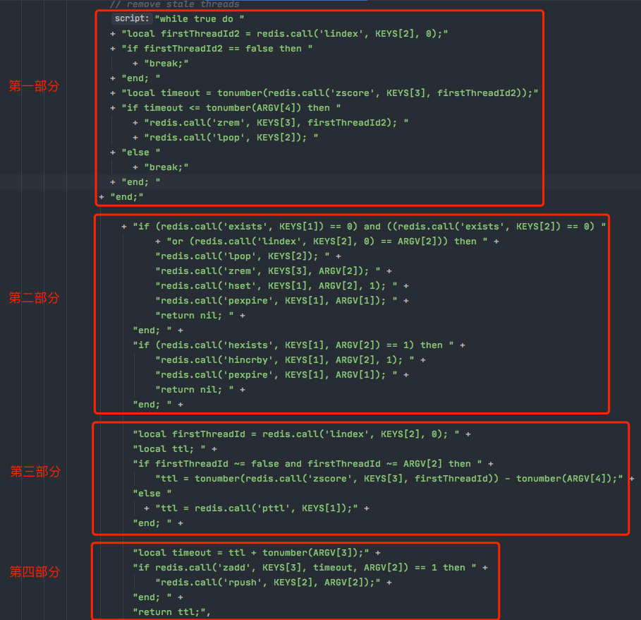

## redisson的公平锁源码学习之排队加锁

### 可重入非公平锁

前面讲到的是非公平可重入锁。所谓的非公平可重入锁是什么意思呢？多个胡乱的争抢，根本没有任何公平性和顺序性而言。

### 可重入公平锁

使用公平锁，可以保证说：客户端获取锁的顺序就跟他们请求获取锁的顺序是一致的。

会把各个客户端对加锁的请求进行排队处理，保证说先申请加锁的，就可以先得到这把锁，实现所谓的公平性。

可重入非公平锁、公平锁，他们在整体的技术实现上都是一样的，只不过唯一不同的点就是在加锁逻辑那。

### 首次加锁

RedissonFairLock是RedissonLock的子类，整体锁的技术框架实现都是跟之前讲解的RedissonLock是一样的，无非就是重载了一些方法，加锁和释放锁的lua脚本逻辑比之前复杂了。

直接看RedissonFairLock类的tryLockInnerAsync方法的这段lua脚本：

```
    <T> RFuture<T> tryLockInnerAsync(long leaseTime, TimeUnit unit, long threadId, RedisStrictCommand<T> command) {
    // ......
    
}
```



#### lua脚本所需参数

```java
Arrays.<Object>asList(getName(), threadsQueueName, timeoutSetName), 
            internalLockLeaseTime, getLockName(threadId), currentTime + threadWaitTime, currentTime);
```

对应lua脚本中：

- KEYS[1]：getName()，就是锁的名字，比如：testLock；
- KEYS[2]：threadsQueueName（在redissonFairLock类构造函数中定义的），它是基于redis的数据结构实现的一个队列。比如：redisson_lock_queue:{testLock}；
- KEYS[3]：timeoutSetName（在redissonFairLock类构造函数中定义的），它是基于redis的数据结构实现的一个有序的Set数据集合。比如：redisson_lock_timeout:{testLock}；
- ARGV[1]：internalLockLeaseTime（在redissonLock类构造函数中定义的），值为 30000毫秒；
- ARGV[2]：getLockName(threadId)，查看代码可以知道值为：UUID:threaId；
- ARGV[3]：currentTime + threadWaitTime，查看代码可以知道值为：当前时间+5000毫秒。

在搞清楚脚本所需的每个参数代表什么意义后，**我们以客户端的当前线程在10点整使用"testLock"这个key首次尝试加锁为例**，来分析这段lua脚本。

#### 第一部分

首先是一个while true的死循环，执行：

```bash
lindex redisson_lock_queue:{testLock} 0
```

从redisson_lock_queue:{testLock} 这个队列中弹出第一个元素，由于是首次加锁，队列是空的，所以这里什么都获取不到，firstThreadId2等于false，直接退出死循环。

#### 第二部分

这个大判断条件包含三个小的判断条件：

```lua
if (redis.call('exists', KEYS[1]) == 0) and ((redis.call('exists', KEYS[2]) == 0) 
    or (redis.call('lindex', KEYS[2], 0) == ARGV[2])) then
```

第一个小条件必须成立，然后第二个和第三个小条件只要其中一个成立，则这个大判断条件就成立了。

执行：

```
exists testLock
exists redisson_lock_queue:{testLock}
lindex redisson_lock_queue:{testLock} 0
```

- 由于是第一次加锁，肯定不存在testLock 这个key，因此第一个小判断条件成立。
- 由于是第一次加锁，队列还不存在，所以这个条件肯定也是成立的；
- 或者说队列存在，且弹出的第一个元素等于当前的UUID:threaId，也就是说队列中的第一个排队的就是当前线程。

因此这个大判断条件成立，则执行：

```bash
lpop redisson_lock_queue:{testLock}
```

由于此时队列还是空的，所以这一步什么也不会干。

```bash
zrem redisson_lock_timeout:{testLock} UUID:threaId
```

从set集合中删除 UUID:threaId，此时因为这个set集合是空的，所以什么都不会干。

```bash
hset testLock UUID:threaId 1
```

执行加锁，则会生成这一个hash数据：

```json
testLock: {

  "UUID:threaId" : 1,

} 
```

执行：

```
pexpire testLock 30000
```

将这个锁的存活时间设置为30秒。

然后返回一个nil，外层代码就会认为加锁成功了，此时就会开启一个watchdog定时调度的程序，每隔10秒判断一下，当前这个线程是否还持有这个锁，如果是，则刷新这个锁key对应的生存时间为30秒。

此时，客户端A首次加锁成功。那么如果这时有其它的客户端来尝试加锁，如何进行排队呢？

### 客户端B来尝试加锁，如何排队

继续看lua脚本。

#### 第一部分

进入 while true死循环，执行：

```bash
lindex redisson_lock_queue:{testLock} 0
```

获取队列的第一元素，由于此时队列仍是空，所以这里什么也获取不到，返回false，退出死循环。

#### 第二部分

执行:

```ba&#39;h
exists testLock
```

由于客户端A已经使用该key进行加锁了，因此这个条件肯定就不成立了。然后接着看第二部分的第二个if判断：

```bash
hexists testLock UUID:threaId
```

当前客户端当前线程由于不在testLock这个map中，所以这个条件也不成立。接着看第三部分。

#### 第三部分

这部分是等待加锁客户端排队的主要逻辑。

```bash
lindex redisson_lock_queue:{testLock} 0
```

从这个队列中取出第一个元素，由于此时队列是空的，因此会返回 false。

执行：

```bash
pttl testLock
```

获取 testLock 剩余的生存时间。

设置一个timeout变量：

```
local timeout = ttl + tonumber(ARGV[3]);
```

timeout等于 ttl + currentTime + threadWaitTime，假设 ttl 为20毫秒，则timeout等于：

20 毫秒 + 10:00:00 + 5 毫秒 = 10:00:25。

执行：

```
zadd redisson_lock_timeout:{testLock} 10:00:25 UUID_02:threaId_02
```

会在 redisson_lock_timeout:{testLock}这个set集合中插入一个元素（UUID_02:threaId_02），这个元素对应的分钟数是：10:00:25（实际存储时是存储的long类型的一个时间戳）。

set集合是一个有序集合，会自动根据你插入的元素的分钟数自动从小到大排序。

然后执行：

```bash
rpush redisson_lock_queue:{testLock} UUID_02:threaId_02
```

会把 UUID_02:threaId_02 插入到队列。

最后返回 ttl，也就是testLock这把锁的剩余生存时间。如果返回的ttl是一个数值的话，那么此时客户端B就会进入一个while true的死循环，每隔一段时间就去尝试加锁，重新执行这段lua脚本。

### 客户端C也来尝试加锁，如何排队

假设客户端C来尝试加锁的时间为10:00:05。

#### 第一部分

while true循环，执行：

```bash
lindex redisson_lock_queue:{testLock} 0
```

获取队列redisson_lock_queue:{testLock}中的第一个元素UUID_02:thread_02（也就是刚刚在排队的客户端B）。

执行：

```bash
zscore redisson_lock_timeout:{testLock} UUID_02:thread_02
```

从 set集合redisson_lock_timeout:{testLock}中取出UUID_02:thread_02的分钟数10:00:25，并将值赋给timeout。

接下来看这个if条件：

```lua
if timeout <= tonumber(ARGV[4]) then 
```

由于10:00:25 不小于等于 10:00:05（客户端C尝试加锁的时间），因此这个if条件不成立。接下来看第二部分的代码。

#### 第二部分

```bash
if (redis.call('exists', KEYS[1]) == 0) and ((redis.call('exists', KEYS[2]) == 0) "
      + "or (redis.call('lindex', KEYS[2], 0) == ARGV[2])) then" 
```

由于存在 testLock锁，因此第一个小判断条件不成立；

且当前队列的第一个元素是 UUID_:thread，肯定不等于当前的UUID_02:thread_02，因此这个大判断条件肯定不成立。

```lua
if (redis.call('hexists', KEYS[1], ARGV[2]) == 1) then 
```

执行：

```bash
hexists testLock UUID_02:thread_02
```

由于客户端C是首次来尝试加锁，所以这里肯定返回 0，这个条件也不成立。进入第三部分。

#### 第三部分

```lua
local firstThreadId = redis.call('lindex', KEYS[2], 0); 
```

从队列当中获取第一个元素：UUID_02:thread_02。

```lua
if firstThreadId ~= false and firstThreadId ~= ARGV[2] then 
  ttl = tonumber(redis.call('zscore', KEYS[3], firstThreadId)) - tonumber(ARGV[4]);
```

如果 firstThreadId 不等于false，且排在当前队列的第一个并不是当前尝试加锁的客户端，则：

执行：

```bash
zscore redisson_lock_timeout:{testLock} UUID_02:thread_02
```

则 ttl = 取出对应的分钟数10:00:25 - 减去 10:00:05 = 20 毫秒。

```
local timeout = ttl + tonumber(ARGV[3]);
```

timeout = 20 毫秒 + currentTime + threadWaitTime = 20 毫秒 + 10:00:05 + 5 毫秒 = 10:00:30。

执行：

```
zadd redisson_lock_timeout:{testLock} 10:00:30 UUID_03:thread_03
```

会在set集合redisson_lock_timeout中插入一个元素UUID_03:thread_03，对应的分钟数为10:00:30。set集合会按照分钟数大小有序排列。

执行：

```
rpush redisson_lock_queue:{testLock} UUID_03:thread_03
```

会把 UUID_03:thread_03 插入队列 redisson_lock_queue:{testLock} 的尾部。

