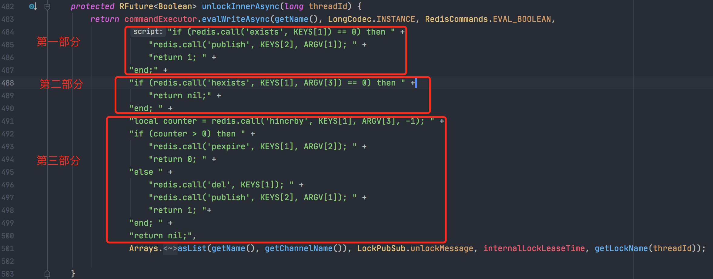

## redisson的可重入锁源码学习之释放锁

在上一篇学习了redisson的watchdog实现机制后，本篇继续学习redisson是怎么释放锁的。

### unlock()

```java
@Override
    public void unlock() {
        try {
            get(unlockAsync(Thread.currentThread().getId()));
        } catch (RedisException e) {
            if (e.getCause() instanceof IllegalMonitorStateException) {
                throw (IllegalMonitorStateException)e.getCause();
            } else {
                throw e;
            }
        }
    }
```

在unlockAsync()方法里，会调用unlockInnerAsync()方法，该方法会执行lua脚本进行解锁：



### lua脚本的解锁主要逻辑

#### 第一部分

使用：

```bahs
exists testLock
```

指令判断是否存在"testLock"，如果不存在，则向指定channel发送一条消息，channel的名字为：

```java
String getChannelName() {
    return prefixName("redisson_lock__channel", getName());
}
```

消息为：

```java
public static final Long unlockMessage = 0L;
```

也就是会向 redisson_lock__channel:{testLock} 这个channel里发送消息，消息内容为 0：

```bash
publish redisson_lock__channel:{testLock} 0
```

然后返回 1。

#### 第二部分

执行：

```bash
hexists testLock jk6b27a7-5346-483a-b9b5-0957c690c27f:1
```

判断这个锁key（testLock）对应的hash数据结构中，是否存在当前这个线程加的锁。如果不存在，则返回nil。

#### 第三部分：

执行：

```bash
local counter = redis.call('hincrby', KEYS[1], ARGV[3], -1); 
```

为哈希表中的字段值加上指定增量值（增量也可以为负数，相当于对指定字段进行减法操作），并将结果赋给 counter 变量。

比如，如果此线程加过2次锁，则执行hincrby操作后，counter的值就等于1了。

如果 counter > 0 ，执行：

          ```
pexpire testLock 30000
          ```

重新为 testLock 更新存活时间为 30 秒。

如果count = 0，执行：

```bash
del testLock
```

删除这个锁key，释放掉这个锁。