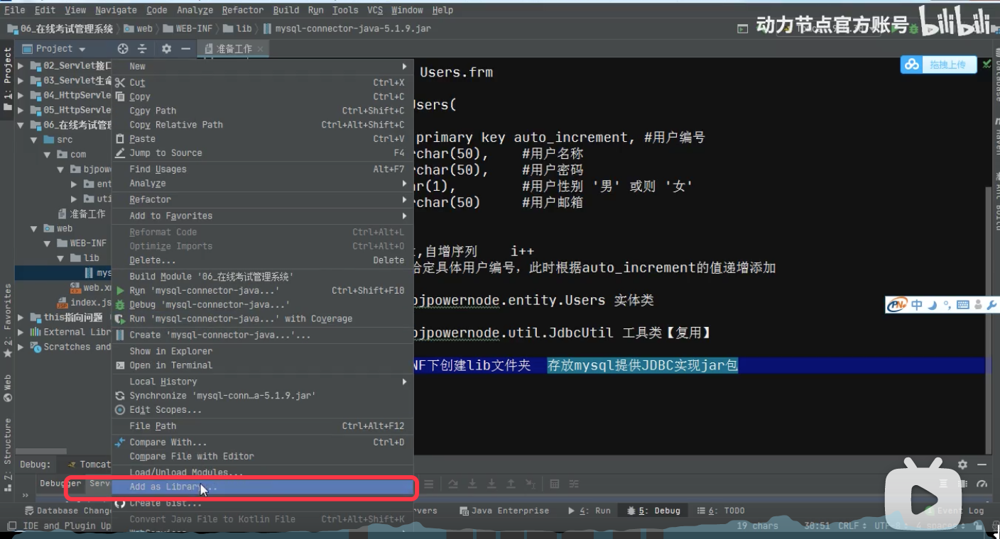
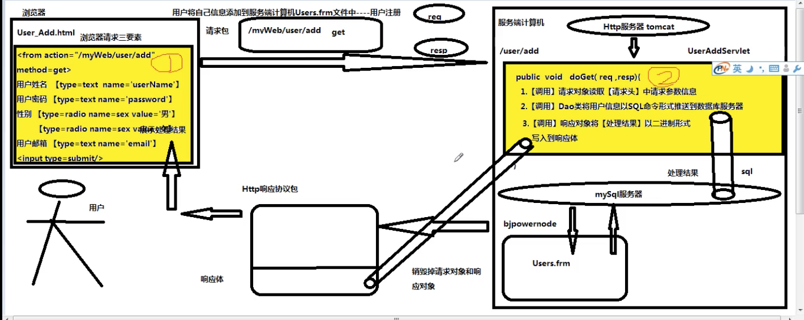
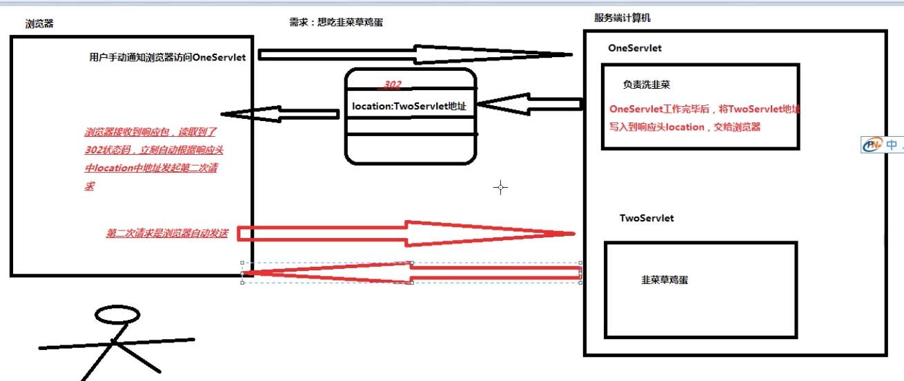
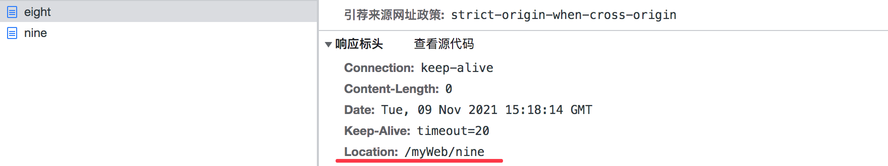

@@ -1,249 +1,46 @@
### 环境搭建
同一个网站（myWeb）下，给同一用户提供服务，OneServlet将数据传给TwoServlet。


**在web工程中，jar包必须放在WEB-INF/lib目录（需要自己建lib目录）下面。这是一个固定位置，新加的jar包都需要放在这个目录下面。**



**设置 jar包，Add as Library**


### 用户信息注册流程图




Servlet：

1. 调用请求对象，从请求头中，获取请求参数，得到用户的信息；
2. 调用DAO类，将用户信息填充到insert语句，借助JDBC协议，将数据插入到mysql服务器；
3. 调用响应对象，将处理结果以二进制形式写入到响应体中；
4. Tomcat服务器销毁请求对象和响应对象；
5. Tomcat服务器将Http响应协议包推送给发送请求的浏览器；
6. 浏览器根据响应头content-type指定编译器，对响应体二进制内容进行编辑；
7. 浏览器将处理结果展示给用户。 =》 过程结束。

其中第4步-第7步 是Tomcat服务器和浏览器自动完成的，不用我们手动干预处理。


### 用户添加开发

user_add.html 是网站中的一个静态资源文件，所以只能写在web目录下面，不能写在WEB-INF下面。

https://www.bilibili.com/video/BV1y5411p7kb?p=12&spm_id_from=pageDriver

#### Http状态码

https://www.bilibili.com/video/BV1y5411p7kb?p=17

### 多个Servlet之间的调用规则

为了提高用户使用感受规则：

无论本次涉及到多少个servlet，用户只需要【手动】通知浏览器发起一次请求即可。

浏览器一次只能访问一个资源文件。

多个servlet之间调用规则：

- 重定向解决方案；
- 请求转发解决方案。

#### 重定向解决方案

原理图：




##### 1.原理

- 用户第一次通过【手动方式】通知浏览器访问OneServlet；
- OneServlet工作完毕后，会将TwoServlet的地址写入到响应头中的location属性中，导致Tomcat将302状态码协议到状态行中；
- 在浏览器接收到响应之后，会读取到302状态。此时浏览器自动根据响应头中location属性地址发起第二次请求，访问TwoServlet去完成请求中剩余任务。

##### 2.实现命令

```
response.sendRedirect("请求地址");


```

将地址写入到响应包中的响应头中的location属性：



##### 3.特征

- 请求地址：既可以把当前网站内的资源文件地址发送给浏览器（/网站名/资源文件名），也可以把其它网站资源文件地址发送给浏览器（http://ip地址:端口号/网站名/资源文件名）；
- 请求次数：浏览器至少发送两次请求，但是只有第一次是用户手动发送，后续请求都是浏览器自动发送的；
- 请求方式：是通过地址栏通知浏览器发送下一次请求，因此调用的资源文件接收的请求方式一定是【GET】。

##### 4.缺点

需要在服务器和浏览器之间多次往返，大量的时间消耗在往返次数。

#### 请求转发解决方案

##### 1.原理

用户第一次通过手动方式要求浏览器访问oneServlet。oneServlet工作完毕后，通过当前请求对象代替浏览器向Tomcat服务器发起请求，申请调用TwoServlet。

Tomcat在接收到这个请求之后，自动调用TwoServlet来完成剩余任务。

##### 2.实现命令

请求对象代替浏览器向tomcat发送请求。

```txt
// 1.通过当前请求对象生成资源文件申请报告对象
RequestDispatcher report = request.getRequestDispatcher("/资源文件"); // 一定要以"开头"
// 2.将报告对象发送给Tomcat
report.forward(当前请求对象,当前响应对象);

```
OneServlet：

```java
public class TenServlet extends HttpServlet {
    protected void doPost(HttpServletRequest request, HttpServletResponse response) throws ServletException, IOException {

    }

    protected void doGet(HttpServletRequest request, HttpServletResponse response) throws ServletException, IOException {
        System.out.println("洗韭菜......");

        // 1.通过当前请求对象生成资源文件申请报告对象
        RequestDispatcher report = request.getRequestDispatcher("/eleven");

        // 2.将报告对象发送给Tomcat
        report.forward(request, response);
    }
}
public class ElevenServlet extends HttpServlet {
    protected void doPost(HttpServletRequest request, HttpServletResponse response) throws ServletException, IOException {

    }

    protected void doGet(HttpServletRequest request, HttpServletResponse response) throws ServletException, IOException {
        System.out.println("韭菜炒鸡蛋......");
    }
// 从请求头获取参数信息
doGet(HttpServletRequest request, HttpServletResponse response) {
	 HttpSession session = request.getSession();
  
  session.setAttribute("key1","共享数据");
}
```


##### 3.优点

- 无论本次请求涉及到多少个Servlet，用户只需要手动通过浏览器发送一次请求；
- Servlet之间调用发生在服务端计算机上，节省了服务端与浏览器之间发生往返的次数，增加处理服务速度。

##### 4.特征

- 在请求发送过程中浏览器只发送了一次请求，因此只发送了一个Http协议包；
- 参与本次请求的所有Servlet共享同一个的请求协议包；
- 因此，这些Servlet接收请求的方式与发送的请求方式保持一致。


### 九、多个Servlet之间数据共享实现方案

https://www.bilibili.com/video/BV1y5411p7kb?p=21

#### 数据共享

OneServlet工作完毕后，将产生的数据交给TwoServlet来使用。

#### 在Servlet中提供四种数据共享方案

##### 1、ServletContext接口

- 来自于Servlet规范中的一个接口，存在于Tomcat的servlet-api.jar；
- 如果两个Servlet来自于同一个网站，彼此之间通过网站的ServletContext实例对象实现数据共享；
- 开发人员习惯将ServletContext实例对象称作为【全局作用域对象】。

##### 1.1 工作原理

- 每个网站都存在一个全局作用域；
- 相当于是一个Map。

##### 1.2 全局作用域对象生命周期

- 在Http服务t启动过程中，自动为当前网站在内存中创建一个全局作用域对象；
- 在Http服务器运行期间，一个网站只有一个全局作用域对象；
- 在Http服务器运行期间，全局作用域对象一直存活；
- 在Http服务器准备关闭时，负责将当前网站中的全局作用域对象进行销毁处理。

##### 命令实现
TwoServlet：

```java
// 1.获取全局作用域对象；
ServletContext application = request.getServletContext();

// 2.取出数据
Object data = application.get("key1");
// 从请求头获取参数信息
doGet(HttpServletRequest request, HttpServletResponse response) {
	 HttpSession session = request.getSession();
  
   Object data = session.getAttribute("key1");
}
```

##### 2、Cookie类

Cookie类来自于Servlet规范中的一个工具类，存在于Servlet-api.jar。

##### 2.1 工作原理

- 用户通过浏览器第一次向myWeb网站发送请求申请OneServlet。

- OneServlet在运行期间创建一个Cookie存储当前用户相关数据。
HttpSession与用户关联的原理：

- OneServlet工作完毕后，将Cookie写入到响应头中，交还给当前浏览器。
- 浏览器收到响应包之后，会将cookie数据存储在浏览器的缓存；
- 用户通过【同一个浏览器】再次向myWeb网站发送请求申请TwoServlet时 ，【浏览器需要无条件的将myWeb网站之前推送过来的cooke写入到请求头中】发送过去；
- 此时TwoServlet就可以通过读取请求头中cookie的信息，来拿到OneServlet的数据。
- 用户第一次访问浏览器；

##### 2.2 命令实现
- Tomcat在创建一个HttpSession时，会自动为这个HttpSession对象生成一个唯一编号（这个编号只会存在浏览器缓存，不会存在浏览器所在客户端磁盘上）；

https://www.bilibili.com/video/BV1y5411p7kb?p=24&spm_id_from=pageDriver
- Tomcat将编号保存到Cookie对象，推送到当前浏览器缓存。Cookie：JSESSIONID= *********

```java
// 从请求头获取参数信息
doGet(HttpServletRequest request, HttpServletResponse response) {
	String username,money;
	// 1.调用请求对象获取[请求头]参数信息
	userName = request.getParameter("userName");
	money = request.getParameter("money");
	
	// 2.开卡
	Cookie card1 = new Cookie("userName", userName);
	Cookie card2 = new Cookie("money", money);
	
	// 3.发卡，将cookie写入到响应头交给浏览器
	response.addCookie(card1);
	response.addCookie(card2);
	
	// 4.通知浏览器将【点餐页面】内容写入到响应体交给浏览器
}
```
- 用户第二次访问浏览器时，会在请求头把这个Cookie带过去；

- Tomcat根据请求头JSESSIONID确认用户是否有HttpSession对象以及哪一个HttpSession对象是当前用户。

  

##### 3、HttpSession接口

3.1介绍

- HtppSession来自于Servlet规范中的一个接口，存在于servlet-api.jar，实现类也存在于servlet-api.jar中；
- 如果两个servlet来自同一个网站，并且为同一个浏览器/用户提供服务，那么可以借助HttpSession对象进行数据共享；
- 开发人员习惯于将HttpSession接口修改对象称为【会话作用域对象】。
https://www.bilibili.com/video/BV1y5411p7kb?p=28

3.2**HttpSession**与Cookie的区别（面试题）

- 存储位置不同：
- 数据类型不同：Cookie对象存储共享数据数据类型只能是String，
- 数据数量：一个Cookie对象只能存放一个共享数据，HttpSession使用map集合存储共享数据，所以可以存储任意数量的共享数据；
- 参照物：Cookie相当于客户在服务端的【会员卡】，HttpSession相当于客户在服务端【私人保险柜】。

**3.3命令的相关实现**

同一个网站（myWeb）下，给同一用户提供服务，OneServlet将数据传给TwoServlet。

OneServlet：

```java
// 从请求头获取参数信息
doGet(HttpServletRequest request, HttpServletResponse response) {
	 HttpSession session = request.getSession();
  
  session.setAttribute("key1","共享数据");
}
```

TwoServlet：

```java
// 从请求头获取参数信息
doGet(HttpServletRequest request, HttpServletResponse response) {
	 HttpSession session = request.getSession();
  
   Object data = session.getAttribute("key1");
}
```

##### 3.4 HttpSession与用户关联的原理

- 用户第一次访问浏览器；

- Tomcat在创建一个HttpSession时，会自动为这个HttpSession对象生成一个唯一编号；

- Tomcat将编号保存到Cookie对象，推送到当前浏览器缓存。Cookie：JSESSIONID= *********

- 用户第二次访问浏览器时，会在请求头把这个Cookie带过去；

- Tomcat根据请求头JSESSIONID确认用户是否有HttpSession对象以及哪一个HttpSession对象是当前用户。

跟去洗浴中心洗澡时，储物柜的那个手牌 是一样的作用。


##### 3.5 HttpSession销毁时机

- 用户与HttpSession关联时使用的这个Cookie，只会存在浏览器缓存，不会存在浏览器所在客户端磁盘上；
- 在浏览器被关闭时，意味着用户与他的HttpSession关系被切断；
- 由于Tomcat无法检测浏览器何时关闭，因此在此时关闭浏览器并不会导致Tomcat将浏览器关联的HttpSession销毁；
- 为了解决这个问题，Tomcat会为每个HttpSession对象设置一个【空闲时间】，这个空闲时间默认是30分钟。如果当前的HttpSession对象空闲时间超过30分钟，就会被Tomcat销毁掉。

##### 3.6HttpSession空闲时间手动设置

在当前网站web/WEB-INF/web.xml：

```xml
<session-config>
  <!--设置当前网站中每一个HttpSession的空闲时间为5分钟-->
	<session-timeout>5</session-timeout>
</session-config>
```


##### 4、HttpServletRequest接口

4.1 介绍

- 在同一个网站中，如果两个Servlet是通过【请求转发】的方式进行调用，彼此之间共享一个请求协议包；

- 而一个请求协议包只对应一个请求对象，因此Servlet之间可以共享同一个请求对象，因此可以利用这个请求对象来实现多个Servlet之前的数据共享；

4.2 命令实现

OneServlet：

```java
public void doGet(HttpServletRequest request,HttpServletResponse response) {
	// 1.将数据添加到[请求作用域对象]中的attribute对象
	request.setAttribute("key1", "数据");
	// 2.向Tomcat申请调用TwoServlet
	request.getRequestDispatcher("/two").forward(request, response);
	
}
```

TwoServlet：

```java
public void doGet(HttpServletRequest request,HttpServletResponse response) {
	// 1.取出OneServlet中传过来的数据
	Object data = request.getAttribute("key1");
	// 2.后续处理...
	
	
}
```

